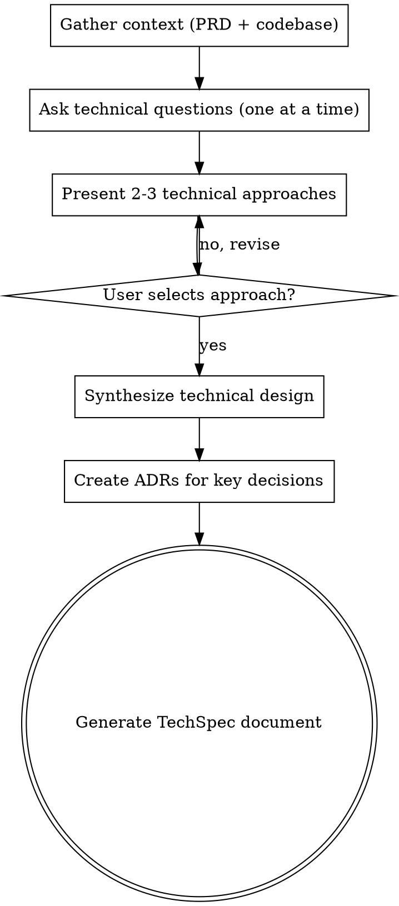

# Create TechSpec

Translate business requirements into a detailed technical specification.

<HARD-GATE>
Do NOT generate the TechSpec document, write any file, or take any implementation action until technical clarification is complete and the user has selected a technical approach. The approved approach is the final mandatory approval gate. Do NOT require section-by-section approval of the final TechSpec before writing it.
</HARD-GATE>

## Asking Questions

When this skill instructs you to ask the user a question, you MUST use your runtime's dedicated interactive question tool — the tool or function that presents a question to the user and **pauses execution until the user responds**. Do not output questions as plain assistant text and continue generating; always use the mechanism that blocks until the user has answered.

If your runtime does not provide such a tool, present the question as your complete message and stop generating. Do not answer your own question or proceed without user input.

## Anti-Pattern: "This Is Too Simple To Need Technical Design Review"

Every TechSpec goes through the full design review process. A single endpoint, a minor refactor, a configuration change — all of them. "Simple" technical changes are where unexamined assumptions about existing architecture cause the most integration failures. The design review can be brief for genuinely simple changes, but you MUST ask technical clarification questions and get approval on the technical approach before writing the artifact.

## Anti-Pattern: End-Of-Flow Bureaucracy

Once the user has answered the technical clarification questions and approved an approach, do not force them through a second approval loop for System Architecture, Data Models, API Design, or other final document sections. Synthesize the approved direction into the TechSpec directly. The user can review and request edits in the generated file afterward.

## Required Inputs

- Feature name identifying the `.compozy/tasks/<name>/` directory.
- Optional: existing `_prd.md` as primary input.
- Optional: existing `_techspec.md` for update mode.

## Workflow

1. Gather context.
   - Check for `_prd.md` in `.compozy/tasks/<name>/`. If it exists, read it as the primary input.
   - If no PRD exists, ask the user for a description of what needs technical specification.
   - Read existing ADRs from `.compozy/tasks/<name>/adrs/` to understand decisions already made during PRD creation.
   - Create `.compozy/tasks/<name>/adrs/` directory if it does not exist.
   - Spawn an Agent tool call to explore the codebase for architecture patterns, existing components, dependencies, and technology stack.
   - If `_techspec.md` already exists, read it and operate in update mode.

2. Ask technical clarification questions.
   - Focus on HOW to implement, WHERE components live, and WHICH technologies to use.
   - Cover architecture approach and component boundaries.
   - Cover data models and storage choices.
   - Cover API design and integration points.
   - Cover testing strategy and performance requirements.
   - Ask only one question per message. If a topic needs more exploration, break it into a sequence of individual questions.
   - Prefer multiple-choice questions when the options can be predetermined.

3. Present technical approaches.
   - Offer 2-3 technical approaches with trade-offs for each.
   - Lead with the recommended approach and explain why it is preferred in the context of the existing codebase and constraints.
   - Wait for the user to select an approach before continuing.

4. Synthesize the technical design after approach approval.
   - After the user selects an approach, synthesize the final technical design internally instead of presenting each TechSpec section for separate approval.
   - Cover these sections in the generated document: System Architecture, Core Interfaces, Data Models, API Design, Integration Points, Testing Approach, Development Sequencing.
   - The Development Sequencing section MUST include a numbered Build Order where every step after the first explicitly states which previous steps it depends on (e.g., "depends on step 1" or "depends on steps 1-2"). The first step should state "no dependencies".
   - Apply YAGNI ruthlessly: remove any component, interface, or abstraction that is not strictly necessary. Do NOT propose new packages or directories when the feature can be implemented by adding a single file to an existing package. Do NOT introduce abstraction layers (factory patterns, strategy patterns, adapter layers) unless the design genuinely requires multiple implementations.
   - Only pause before writing if a blocking ambiguity remains that would force guessing; otherwise proceed directly to document generation.
   - After approach approval, create an ADR for each significant technical decision (architecture pattern chosen, technology selected, data model approach, etc.):
     - Read `references/adr-template.md`.
     - Determine the next ADR number by listing existing files in `.compozy/tasks/<name>/adrs/`.
     - Fill the template: the chosen design as "Decision", rejected alternatives as "Alternatives Considered", and trade-offs as "Consequences". Set Status to "Accepted" and Date to today.
     - Write each ADR to `.compozy/tasks/<name>/adrs/adr-NNN.md` (zero-padded 3-digit sequential number).

5. Generate the TechSpec document directly.
   - Read `references/techspec-template.md` and fill every applicable section.
   - **MANDATORY — Architecture Decision Records section:** The generated TechSpec MUST end with an "Architecture Decision Records" section listing every ADR created during this process. Each entry must include the ADR number (e.g., ADR-001), title, and a one-line summary formatted as a link to the `adrs/` directory. Even simple features require at least one ADR documenting the primary technical approach chosen and alternatives rejected. If no ADRs were created in step 4, go back and create at least one before generating the document.
   - Write the completed document to `.compozy/tasks/<name>/_techspec.md`.
   - Every PRD goal and user story should map to a technical component.
   - Reference PRD sections by name but do not duplicate business context.
   - Include code examples only for core interfaces, limited to 20 lines each. The Core Interfaces section must contain at least one Go interface or struct definition as a code block, even for simple features — show the primary type that other components will depend on.

## Process Flow

## Error Handling

- If the PRD is missing, proceed with user-provided context and note the absence in the Executive Summary.
- If codebase exploration reveals conflicting architectural patterns, document both and recommend one with rationale.
- If the user rejects the design proposal, incorporate all feedback and present a revised proposal.
- If the target directory does not exist, create it.
- If operating in update mode, preserve sections the user has not asked to change.

## Key Principles

- **One question at a time** — Do not overwhelm with multiple questions in a single message
- **Multiple choice preferred** — Easier for users to answer than open-ended when possible
- **YAGNI ruthlessly** — Remove unnecessary components, abstractions, and interfaces from all designs
- **Approach-first validation** — Get approval on the technical approach, then synthesize and write the artifact directly
- **Technical focus only** — Never ask business questions; that belongs in the PRD
- **Trade-offs are mandatory** — Every Executive Summary must state the primary technical trade-off of the chosen approach
