# Skeeper Reference Guide

Comprehensive reference for the `skeeper` CLI: a Go binary that mirrors spec artifacts into a sidecar Git repository with a tracked lockfile, so a main repository's PR diffs stay focused on code and every commit can prove which spec state shipped with it.

## What Is Skeeper

- **Lockfile-backed reliability.** `skeeper.lock` is committed to the main repo and pins each main commit to exact sidecar commits per namespace, with content digests, file counts, and byte counts.
- **Strict managed hooks.** `pre-commit` and `pre-merge-commit` mirror staged content, push the sidecar, write `skeeper.lock`, and stage it before Git creates the main commit. `pre-push` checks the lock before the main repo is pushed.
- **Namespaces in shared sidecars.** Many projects can share one sidecar Git remote without colliding because each project owns a namespace prefix and uses branch-aware refs of the form `<namespace>/__branches__/<source-branch>`.
- **Git-like convergence.** `pull` brings remote docs in, `push` publishes local docs without pruning remote-only files, and `sync` runs pull then push.
- **Safe by default.** Local absence does not delete remote-only sidecar docs unless the user passes the explicit destructive `--prune` flag.
- **One recovery door.** `status --check` reports unhealthy states, and `repair` owns safe automatic repairs plus rescue reporting.
- **Single-binary, local-first.** Skeeper shells out to `git` (and `gh` only when `skeeper init` creates a brand-new sidecar repo). Every operation is debuggable with Git.

## Mental Model: Four Invariants

1. **`skeeper.lock` is the pinned state.** It records sidecar URL, source branch, namespace branch, sidecar commit SHA, content digest, file count, and byte count. Never edit SHAs by hand.
2. **Sync happens before the main commit, not after.** Failure fails the commit. There is no async retry queue.
3. **Failure fails closed unless you opt out.** `SKEEPER_SKIP=1` allows a single bypass that is recorded to `.git/skeeper/bypass.json` and surfaced in `status`, `repair`, and `pre-push` until cleared by `skeeper sync` or `skeeper repair`. `git commit --no-verify` is unsupported because Git skips all hook code.
4. **`pre-push` checks before the remote sees the commit.** A bypassed or stale lock blocks the push.

```mermaid
flowchart LR
    A[git commit] --> B[existing user hook content]
    B --> C[skeeper internal pre-commit]
    C --> D[collect owned staged specs]
    D --> E[fetch and rebase sidecar branch]
    E --> F[mirror namespace files into .skeeper/]
    F --> G[commit and push sidecar]
    G --> H[write and stage skeeper.lock]
    H --> I[main commit proceeds]
    I --> J[git push]
    J --> K[skeeper internal pre-push]
```



## Quick Start

```bash
# Inside any Git repository
skeeper init
$EDITOR src/auth/SPEC.md
git add src/auth/service.go src/auth/SPEC.md
git commit -m "auth: design OAuth provider flow"
# the hook syncs the sidecar and stages skeeper.lock; commit it normally
git push
```

If the working tree already contains specs that should be sidecar-managed, pass `--track` during setup or run `skeeper track <glob> --sync` after `init`.

## Command Map

| Command                             | Purpose                                                                                   | Read-only? |
| ----------------------------------- | ----------------------------------------------------------------------------------------- | ---------- |
| `skeeper init`                      | Interactively bootstrap `.skeeper.yml`, the sidecar repo, hooks, and managed `.gitignore` | no         |
| `skeeper status`                    | Show sync health, path drift on demand, hook health, bypass state, and next action        | yes        |
| `skeeper status --check`            | CI-friendly health check; exits non-zero when action is required                          | yes        |
| `skeeper pull`                      | Fetch sidecar refs and materialize remote docs while preserving local docs                | no         |
| `skeeper push`                      | Publish local specs to the sidecar and stage `skeeper.lock`                               | no         |
| `skeeper sync`                      | Pull remote specs, push local specs, and stage `skeeper.lock`                             | no         |
| `skeeper restore <path...>`         | Restore selected files from the sidecar commits recorded in `skeeper.lock`                | no         |
| `skeeper restore --all`             | Restore every locked managed file into a fresh clone or checkout                          | no         |
| `skeeper track <glob>`              | Add a managed glob to `.skeeper.yml` and `.gitignore`; optionally sync existing matches   | no         |
| `skeeper untrack <path-or-glob>...` | Stop tracking specs in the main repo after sidecar sync                                   | no         |
| `skeeper repair`                    | Diagnose and safely repair local Skeeper state                                            | no         |
| `skeeper repair --check`            | Read-only repair diagnosis                                                                | yes        |
| `skeeper log <path>`                | Show sidecar history for a single spec file                                               | yes        |
| `skeeper version`                   | Print build metadata                                                                      | yes        |

`--json` produces deterministic machine-readable output where listed in the CLI reference. `--dry-run` is supported on mutating commands that can preview a plan. `--force` overrides broad-plan guardrails declared under `settings.guardrails`.

Hidden `skeeper internal ...` commands are Git hook and merge-driver plumbing. Do not recommend them to users or call them by hand unless you are testing Skeeper itself.

## Freshness Contract

Treat this directory as the official Skeeper skill shipped with the repository. When the CLI surface changes, update this file and `references/cli-reference.md` in the same change. Audit against `skeeper --help` plus each public subcommand's `--help`; do not infer commands from older docs, old ledgers, or implementation helpers.

Historical commands such as `hydrate`, `update`, `diff`, `reconcile`, `resolve`, `rescue`, `verify`, `fsck`, `hooks`, `merge-driver`, `adopt`, and `pattern` are not public workflow guidance. If a user mentions one, translate the intent to the current public command model: `status`, `pull`, `push`, `sync`, `restore`, `track`, `untrack`, or `repair`.

For full per-flag detail, read `references/cli-reference.md`.

## Configuration Cheatsheet

`.skeeper.yml` lives at the repository root and is committed. The minimum required shape:

```yaml
sidecar: git@github.com:user/myproject-specs.git

namespaces:
  - name: project
    patterns:
      - "**/SPEC.md"
      - "docs/specs/**"
      - ".claude/plans/**"
      - "**/*.spec.md"
    exclude:
      - "docs/specs/private/**"
```

Optional operational defaults:

```yaml
settings:
  guardrails:
    max_files: 100 # default 100
    max_bytes: 10485760 # default 10 MiB
  hooks:
    pre_push_timeout: 30s # default 30s
    allow_skip_env: SKEEPER_SKIP # default SKEEPER_SKIP
```

Four rules to know:

1. **Unknown keys are rejected.** Decode is strict.
2. **`exclude` is the only public exclusion mechanism.** Negative globs (`!docs/private/**`) inside `patterns` are rejected.
3. **Ownership must be unique.** If two namespaces match the same file, the plan fails with a request to add an `exclude`.
4. **`__branches__` is reserved.** It is the segment that separates a namespace from its branch-aware refs.

For the full schema with every field and default, read `references/config-reference.md`.

## Common Workflows

### Bootstrap a new repository

```bash
skeeper init \
  --sidecar-name myproject-specs \
  --visibility private \
  --namespace project \
  --track "**/SPEC.md" \
  --track "docs/specs/**"
git add .skeeper.yml .gitignore
git commit -m "chore: bootstrap skeeper"
```

### Join a repo with an existing sidecar

```bash
skeeper init --sidecar git@github.com:user/shared-specs.git \
  --namespace project \
  --track "**/SPEC.md"
skeeper restore --all
skeeper repair
```

`init` installs or refreshes hooks and merge-driver wiring. `restore --all` materializes the files pinned by the current `skeeper.lock`; `repair` is safe to run after clone setup and refreshes local hook state if needed.

### Track files already in the working tree

```bash
skeeper track "docs/adrs/**" --sync
git add .skeeper.yml .gitignore skeeper.lock
git commit -m "chore: track ADRs in skeeper"
```

Use `track` without `--sync` when you only want to update coverage and will publish matching files in a later `skeeper sync`.

### Merge docs from two clones

```bash
# clone A
skeeper sync
git commit -m "skeeper: sync docs"
git push

# clone B
git pull
skeeper sync
git commit -m "skeeper: sync docs"
git push
```

`sync` preserves both sides by default. It fetches sidecar state, restores remote-only docs locally, publishes local-only docs, and updates `skeeper.lock`.

### Recover after a failed push or bypass

```bash
skeeper status --paths
skeeper repair --check
# fix network/auth/contention if reported, then:
skeeper repair
skeeper sync
skeeper status --check
```

`repair --check` is read-only. `repair` fixes safe local issues such as hook drift, interrupted transactions that can resume safely, stale bypass records after a healthy sync, and missing local sidecar objects. It stops on ambiguous overwrite/delete decisions.

### Restore files from the lock

```bash
skeeper restore docs/specs/auth.md
skeeper restore --all
```

`restore` uses the locked sidecar commits by default. Use `pull` when you want the latest sidecar remote state instead of the current lock.

### Resolve a `skeeper.lock` merge conflict

```bash
git merge feature/auth-redesign
# if the automatic merge driver was not wired locally:
skeeper repair
skeeper sync
git add skeeper.lock
git commit
```

Manual editing of scalar sidecar SHAs is unsupported. Regenerate the lock through Skeeper.

## CI Integration

Same-repository GitHub Action wraps the released binary:

```yaml
name: skeeper

on:
  pull_request:
  push:
    branches: [main]

jobs:
  check:
    runs-on: ubuntu-latest
    steps:
      - uses: actions/checkout@v4
        with:
          fetch-depth: 0
      - uses: compozy/skeeper@v0.2.1
        with:
          args: |
            status
            --check
            --json
          ssh-private-key: ${{ secrets.SKEEPER_SSH_PRIVATE_KEY }}
```

Credential precedence:

1. `ssh-private-key` writes a temp key and sets `GIT_SSH_COMMAND`. The key is wiped on cleanup.
2. `token` configures HTTPS GitHub credentials in a per-job `GIT_CONFIG_GLOBAL`.
3. The runner's existing Git/SSH config is used when neither input is provided.

Secrets are always masked through `::add-mask::` before configuration.

## When NOT To Use Skeeper

- **Repos that already version specs in the main tree** and want them to appear in PR diffs alongside code. Skeeper exists to keep specs out of those diffs.
- **Teams that need PR review on the spec content itself before merge.** Skeeper mirrors after the main commit succeeds, so spec review must happen against the sidecar repo or against the main-tree working copy before commit.
- **Repos without a stable sidecar host.** Skeeper requires a Git remote that the working tree can reach during commit; an unreachable remote means every commit fails closed unless someone uses `SKEEPER_SKIP=1`.
- **Storing build artifacts, generated code, or large binaries.** Skeeper is for spec-shaped text artifacts. Guardrails default to 100 files and 10 MiB per plan precisely to keep it that way.

## Anti-Patterns for Agents

1. **Never use `git commit --no-verify` on a skeeper-enabled repo.** Use `SKEEPER_SKIP=1` instead so the bypass is audited.
2. **Never edit SHAs in `skeeper.lock` by hand.** Use `skeeper sync` to regenerate the lock.
3. **Never reuse a sidecar remote across projects without unique namespaces.** Skeeper requires unambiguous routing; ownership must be unique per file.
4. **Never bypass with `SKEEPER_SKIP=1` and forget to run `skeeper sync` afterward.** The bypass keeps surfacing in `status`, `repair`, and `pre-push` until cleared.
5. **Never put negative globs in `patterns`.** Use `exclude` instead; the loader rejects negative globs explicitly.
6. **Never delete `skeeper.lock` to fix a merge conflict.** Resolve it with `skeeper repair`/`skeeper sync`.
7. **Never assume `skeeper restore` chases the latest tip.** It restores from the locked commits; use `skeeper pull` for latest remote docs.
8. **Never prune remote-only sidecar files accidentally.** Use `skeeper push --prune` only when the local set is intentionally authoritative.
9. **Never call `skeeper internal` commands in user workflow guidance.** They are hook and merge-driver plumbing.

## References

- `references/cli-reference.md` — every public command and flag.
- `references/config-reference.md` — full `.skeeper.yml` schema, defaults, and validation rules.
