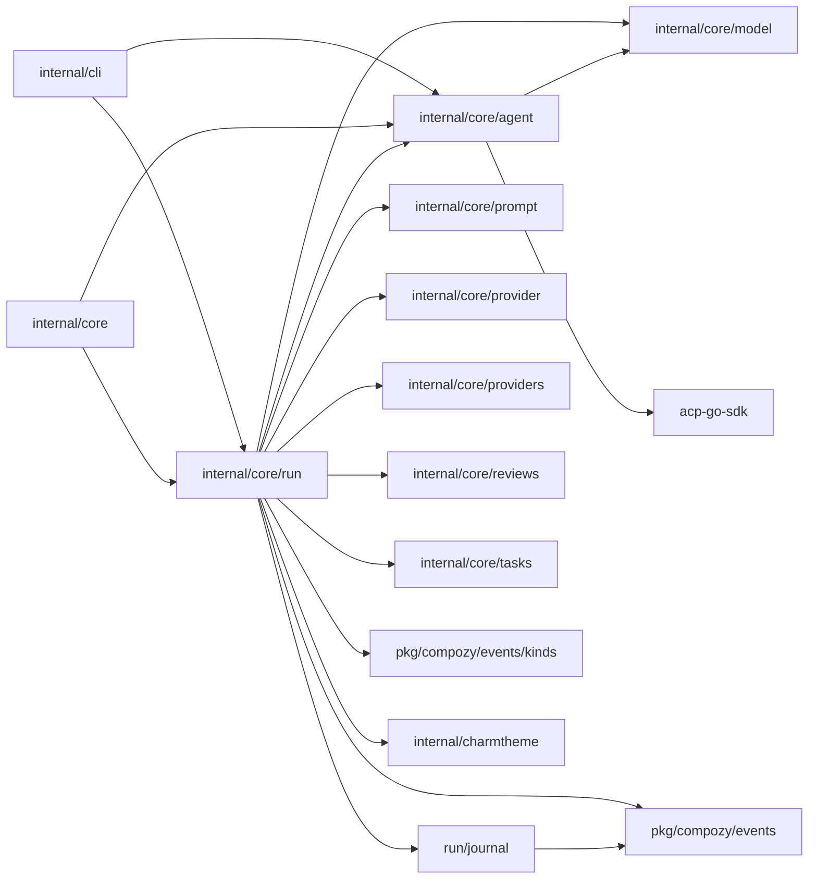

# Refactoring Analysis: Agent & Run Packages (Group 3)

> **Date**: 2026-04-06
> **Scope**: `internal/core/agent`, `internal/core/run`, `internal/core/run/journal`
> **Analyzed by**: AI-assisted refactoring analysis (Martin Fowler's catalog)
> **Language/Stack**: Go 1.23+, Bubble Tea TUI, ACP SDK
> **Test Coverage**: Present (table-driven, parallel subtests); integration tests exist for exec flow and ACP

---

## Executive Summary

The `run` package is the single largest maintenance risk in the codebase at **17 production files and ~8,700+ lines**. Two files alone -- `execution.go` (1,900 lines) and `exec_flow.go` (1,176 lines) -- mix job lifecycle, retry logic, shutdown orchestration, provider integration, exec-mode persistence, and event emission into monolithic units that change for at least five unrelated reasons. The `agent` package is cleaner but has a 733-line `tool_call_format.go` that handles normalization for every ACP runtime, and `session.go` bundles ACP protocol conversion alongside session lifecycle. Addressing the God Package smell in `run` and the Long Function / Divergent Change smells in both packages would dramatically reduce change cost and make the system safer to evolve.

| Severity | Count |
|----------|-------|
| P0 -- Critical | 4 |
| P1 -- High | 7 |
| P2 -- Medium | 8 |
| P3 -- Low | 6 |
| **Total** | **25** |

### Top Opportunities (Quick Wins + High Impact)

| # | Finding | Location | Effort | Impact |
|---|---------|----------|--------|--------|
| 1 | Split `run` package into sub-packages (execution, ui, exec) | `internal/core/run/` | significant | Eliminates God Package; reduces coupling, change cost, and cognitive load |
| 2 | Extract `execution.go` into lifecycle/shutdown/session modules | `execution.go:1-1900` | significant | 1,900-line file with 5+ responsibilities; every change is high-risk |
| 3 | Extract `exec_flow.go` exec-mode state machine into own package | `exec_flow.go:1-1176` | moderate | Isolates exec persistence from batch execution |
| 4 | Duplicate content-block conversion (model <-> kinds) | `events.go` / `ui_model.go` | moderate | Eliminates ~200 lines of mirrored conversion code |
| 5 | Extract `tool_call_format.go` normalization into own package | `agent/tool_call_format.go:1-733` | moderate | Decouples tool normalization from ACP session lifecycle |

---

## Package Summaries

### `internal/core/agent` (~2,750 lines production, ~590 lines test)

Manages ACP agent subprocess lifecycle: client creation, session management, ACP protocol conversion, runtime registry and validation, tool-call normalization, and OS-specific process management. Well-structured with clear interfaces (`Client`, `Session`, `RuntimeRegistry`). Main concerns: `session.go` mixes ACP-to-model conversion (270+ lines) with session publish/finish logic; `tool_call_format.go` at 733 lines is a normalization mega-function; `registry.go` contains both the registry data and multi-step validation logic.

### `internal/core/run` (~8,700+ lines production, ~1,200+ lines test)

The execution engine for Compozy. Handles batch job execution with retries, graceful shutdown orchestration, ACP session streaming, Bubble Tea TUI, exec-mode persistence with multi-turn resume, event journal integration, result serialization, preflight validation forms, tool-use summary rendering, and logging infrastructure. This is a **God Package** -- it has 17 production files touching at least 7 distinct domains that change independently.

### `internal/core/run/journal` (~567 lines production, ~250+ lines test)

Durable append-before-publish event journal. Well-focused with clear boundaries. The `Owner` type adds lifecycle management. Minor concerns: the `writeState` struct and recovery logic could benefit from extraction, but the package is already cohesive.

---

## Findings

### P0 -- Critical

#### F1: God Package -- `internal/core/run` has 17 production files with 7+ distinct responsibilities

- **Smell**: Large Module / Divergent Change
- **Category**: Bloater / Change Preventer
- **Location**: `internal/core/run/` (entire package)
- **Severity**: P0 -- Critical
- **Impact**: Any change to the TUI, exec mode, batch execution, shutdown logic, logging, or event emission requires understanding the entire 8,700+ line package. High merge-conflict risk. Impossible to reason about one concern without loading all others into memory.

**Current structure** (simplified):
```
run/
  execution.go      -- batch job execution + shutdown orchestration + provider integration
  exec_flow.go      -- exec-mode state machine + persistence + resume
  ui_model.go       -- Bubble Tea model + controller + event adapter
  ui_update.go      -- Bubble Tea Update handler
  ui_view.go        -- Bubble Tea View renderer (1,034 lines)
  ui_layout.go      -- layout computation
  ui_styles.go      -- color/style definitions
  session_view_model.go -- transcript model
  logging.go        -- session update handler + content block rendering
  runtime_logger.go -- logger factory
  command_io.go     -- session execution setup + ACP client creation
  events.go         -- model <-> kinds conversion
  types.go          -- config, job, UI types, msg types (380 lines)
  result.go         -- result building + emission
  preflight.go      -- preflight validation
  validation_form.go -- Bubble Tea validation form
  tool_use_summary.go -- tool display title rendering
```

**Recommended Refactoring**: **(B) Package-level split**

**After** (proposed package structure):
```
run/
  run.go              -- public Execute() entry point, thin facade
  config.go           -- config + job types
  types.go            -- shared runtime types (failInfo, phases, etc.)
  result.go           -- result building
  events.go           -- event conversion helpers

run/executor/
  executor.go         -- jobExecutionContext, launchWorkers, awaitCompletion
  lifecycle.go        -- jobLifecycle, jobRunner
  shutdown.go         -- executorController, shutdownState
  session.go          -- setupSessionExecution, streamSessionUpdates
  retry.go            -- retry logic, timeout handling
  logging.go          -- sessionUpdateHandler

run/exec/
  exec.go             -- ExecuteExec entry point
  state.go            -- execRunState, persistence
  events.go           -- execEventEmitter, execEventWriter
  types.go            -- PersistedExecRun, execTurnPaths

run/ui/
  model.go            -- uiModel, uiController
  update.go           -- Update handler
  view.go             -- View renderer
  layout.go           -- layout computation
  styles.go           -- color/style palette
  adapter.go          -- event translator
  sidebar.go          -- sidebar rendering
  timeline.go         -- timeline rendering
  summary.go          -- summary view
  form.go             -- validation form

run/transcript/
  model.go            -- sessionViewModel
  entries.go          -- TranscriptEntry, SessionViewSnapshot
  render.go           -- content block rendering, tool summaries
```

**Rationale**: The `run` package violates SRP at the package level. Fowler's Divergent Change smell: "one module is modified for multiple unrelated reasons." Here we count at least 7: (1) batch execution logic, (2) exec-mode persistence, (3) TUI rendering, (4) shutdown orchestration, (5) provider integration, (6) event emission, (7) transcript/session view model. Each of these domains should be an independent package.

---

#### F2: `execution.go` at 1,900 lines -- Divergent Change + Long Functions

- **Smell**: Large Module, Divergent Change, Long Function
- **Category**: Bloater / Change Preventer
- **Location**: `internal/core/run/execution.go:1-1900`
- **Severity**: P0 -- Critical
- **Impact**: This single file handles job execution context setup, worker launching, graceful shutdown state machine (`executorController.awaitCompletion` ~50 lines of select loop), job lifecycle tracking (`jobLifecycle` with 9 methods), job runner with retry loop, ACP session timeout management, provider-backed review issue resolution, task metadata refresh, event emission, failure recording, and usage reporting. Changes to any of these concerns risk breaking the others.

**Key sub-components that should be separate modules:**

1. **Shutdown orchestration** (`executorController`, `awaitCompletion`, `beginDrain`, `beginForce`): lines 152-335 -- ~180 lines
2. **Job lifecycle** (`jobLifecycle`, all mark* methods, config accessors): lines 337-577 -- ~240 lines  
3. **Job runner** (`jobRunner`, `run`, `handleResult`, retry loop): lines 579-721 -- ~140 lines
4. **Activity watchdog** (`startACPActivityWatchdog`, `activityTimeoutError`): lines 1350-1400 -- ~50 lines
5. **Session execution and resolution** (`executeJobWithTimeout`, `executeSessionAndResolve`, `streamSessionUpdates`): lines 1290-1495 -- ~200 lines
6. **Post-success hooks** (`afterJobSuccess`, `afterTaskJobSuccess`, `afterReviewJobSuccess`, `resolveProviderBackedIssues`): lines 967-1260 -- ~290 lines
7. **Review issue collection** (`collectNewlyResolvedIssues`, `filterResolvedIssuesWithProviderRefs`): lines 1853-1900 -- ~50 lines

**Recommended Refactoring**: **(A) File-level split** into 5-6 focused files, then **(B) Package-level split** per F1.

**Rationale**: Fowler: "When you look at a module and feel the need to keep a mental table of contents, it's too big." This file requires understanding at least 7 distinct domains to modify any one of them safely.

---

#### F3: `exec_flow.go` at 1,176 lines -- separate execution mode mixed into batch package

- **Smell**: Divergent Change, Large Module
- **Category**: Bloater / Change Preventer
- **Location**: `internal/core/run/exec_flow.go:1-1176`
- **Severity**: P0 -- Critical
- **Impact**: The exec-mode flow (single-turn headless execution with persistence and resume) is fundamentally different from the batch execution in `execution.go`, yet they share the same package, same `config` and `job` types, and same UI setup code. Exec-mode has its own state machine (`execRunState`), its own persistence contract (`PersistedExecRun`, `persistedExecTurn`), its own event emitter (`execEventEmitter`), and its own retry logic (`shouldRetryExecAttempt`). Changes to exec persistence never need to touch batch execution, and vice versa.

**Recommended Refactoring**: **(B) Package-level split** -- extract into `internal/core/run/exec/`

**Rationale**: Exec mode is a distinct bounded context with its own lifecycle, persistence, and event contract. It shares some infrastructure (ACP client creation, session setup) but these can be accessed through a shared internal package.

---

#### F4: Duplicated content-block conversion between `model` and `kinds`

- **Smell**: Duplicated Code
- **Category**: Dispensable / DRY Violation
- **Location**: `internal/core/run/events.go:48-187` and `internal/core/run/ui_model.go:557-670`
- **Severity**: P0 -- Critical
- **Impact**: `publicContentBlock()` converts `model.ContentBlock` to `kinds.ContentBlock`. `internalContentBlock()` converts `kinds.ContentBlock` back to `model.ContentBlock`. Both functions are ~80-line switch statements with identical case arms (text, tool_use, tool_result, diff, terminal_output, image). Similarly, `publicSessionUpdate()` and `internalSessionUpdate()` mirror each other for session updates, plan entries, and available commands. Any new block type requires updating BOTH functions. This is a textbook Shotgun Surgery smell -- a new content block type forces edits in 2+ locations.

**Current Code** (simplified):
```go
// events.go - model -> kinds
func publicContentBlock(block model.ContentBlock) (kinds.ContentBlock, error) {
    switch block.Type {
    case model.BlockText:
        value, _ := block.AsText()
        return kinds.NewContentBlock(kinds.TextBlock{Text: value.Text})
    // ... 6 more cases
    }
}

// ui_model.go - kinds -> model  
func internalContentBlock(block kinds.ContentBlock) (model.ContentBlock, error) {
    switch item := value.(type) {
    case kinds.TextBlock:
        return model.NewContentBlock(model.TextBlock{Text: item.Text})
    // ... 6 more cases
    }
}
```

**Recommended Refactoring**: **(C) Extraction** -- create `internal/core/run/blockconv/` (or add to `model` package) with bidirectional converters. Alternatively, define a `ContentBlockConverter` interface that both directions implement.

**Rationale**: DRY violation with high change cost. Every new block type is a guaranteed Shotgun Surgery across 2 files. Extract once, use everywhere.

---

### P1 -- High

#### F5: `session.go` mixes ACP protocol conversion with session lifecycle

- **Smell**: Divergent Change
- **Category**: Change Preventer
- **Location**: `internal/core/agent/session.go:270-728`
- **Severity**: P1 -- High
- **Impact**: Lines 1-269 handle session lifecycle (publish/finish/wait). Lines 270-728 (~460 lines) handle ACP-to-model conversion (`convertACPUpdate`, `convertACPMessageUpdate`, `convertACPToolLifecycleUpdate`, `convertToolCallContent`, etc.). These change for different reasons: session lifecycle changes for backpressure tuning; ACP conversion changes when the ACP protocol evolves or new block types are added.

**Recommended Refactoring**: **(A) File-level split** -- extract `acp_convert.go` from `session.go`.

---

#### F6: `tool_call_format.go` at 733 lines -- monolithic normalization engine

- **Smell**: Large Module, Long Function chains
- **Category**: Bloater
- **Location**: `internal/core/agent/tool_call_format.go:1-733`
- **Severity**: P1 -- High
- **Impact**: This file handles tool name normalization (`normalizeACPToolName`), tool input normalization (`normalizeACPToolInput`), and per-tool-type input extraction (`normalizeBashToolInput`, `normalizeGrepToolInput`, `normalizeGlobToolInput`, etc.) for all ACP runtimes. The `normalizeToolInputByName` function at line 275 is a 30-case switch that grows with every new tool type. Adding a new tool type requires modifying this file even though the normalization logic is independent of the ACP session.

**Recommended Refactoring**: **(B) Package-level split** -- extract into `internal/core/agent/toolformat/` with a strategy-per-tool-type pattern, or at minimum **(A) file-level split** into `tool_call_name.go` (name resolution) and `tool_call_input.go` (input normalization).

---

#### F7: `types.go` is a "junk drawer" mixing UI types, runtime types, and config

- **Smell**: Data Clumps, Divergent Change
- **Category**: Bloater / Change Preventer
- **Location**: `internal/core/run/types.go:1-380`
- **Severity**: P1 -- High
- **Impact**: This file contains: exit code constants, `failInfo`, job phases, attempt status, `jobAttemptResult`, `jobState` (UI), UI layout constants, `uiJob` struct (127 fields), shutdown types, UI message types (10+ msg structs), `uiSession` interface, `config` struct, `job` struct, `newConfig()`, `newJobs()`. These are at least 4 distinct domains (execution primitives, UI state, UI messages, runtime config) crammed into one file.

**Recommended Refactoring**: **(A) File-level split** -- at minimum split into: `config.go` (config/job types), `exec_types.go` (failInfo, phases, attempt results), `ui_types.go` (uiJob, jobState, UI messages, layout constants), `shutdown_types.go`.

---

#### F8: `sessionUpdateHandler` in `logging.go` is misnamed and oversized

- **Smell**: Large Module, misleading name
- **Category**: Bloater
- **Location**: `internal/core/run/logging.go:1-606`
- **Severity**: P1 -- High
- **Impact**: Despite being called `logging.go`, this file contains: the `sessionUpdateHandler` struct (the core ACP session stream consumer, 330+ lines), content block rendering (`renderContentBlocks`, `renderTextBlock`, `renderToolUseBlock`, etc., ~130 lines), `lineBuffer` and `activityMonitor` utility types (~80 lines), and log writer utilities. The session update handler is the heart of ACP session stream processing -- naming it "logging" is misleading and makes discovery harder.

**Recommended Refactoring**: **(A) File-level split** -- rename core file to `session_handler.go`, extract `render_blocks.go` for content block rendering, and `buffers.go` for lineBuffer/activityMonitor.

---

#### F9: `ui_view.go` at 1,034 lines -- monolithic TUI renderer

- **Smell**: Large Module
- **Category**: Bloater
- **Location**: `internal/core/run/ui_view.go:1-1034`
- **Severity**: P1 -- High
- **Impact**: Renders the entire TUI: title bar, sidebar, timeline panel, summary view, failure box, token box, help bar, timeline entries, tool call state icons/colors/labels. Each section changes independently (summary layout vs. timeline entry rendering vs. sidebar items).

**Recommended Refactoring**: **(A) File-level split** -- extract `ui_sidebar.go`, `ui_timeline.go`, `ui_summary.go` from `ui_view.go`. Each renders one panel.

---

#### F10: `setupSessionExecution` takes 13 parameters

- **Smell**: Long Parameter List
- **Category**: Bloater
- **Location**: `internal/core/run/command_io.go:94-160`
- **Severity**: P1 -- High
- **Impact**: 13 parameters make calls error-prone and hard to read. Several parameters always travel together (`aggregateUsage` + `aggregateMu`, `useUI` + `streamHumanOutput`).

**Current Code**:
```go
func setupSessionExecution(
    ctx context.Context,
    cfg *config,
    job *job,
    cwd string,
    useUI bool,
    streamHumanOutput bool,
    index int,
    runJournal *journal.Journal,
    aggregateUsage *model.Usage,
    aggregateMu *sync.Mutex,
    activity *activityMonitor,
    logger *slog.Logger,
    trackClient func(agent.Client) func(),
) (*sessionExecution, error)
```

**Recommended Refactoring**: **(D) Inline fix** -- Introduce Parameter Object `SessionSetupRequest` grouping these into a struct.

**After** (proposed):
```go
type SessionSetupRequest struct {
    Ctx               context.Context
    Cfg               *config
    Job               *job
    Cwd               string
    UseUI             bool
    StreamHumanOutput bool
    Index             int
    Journal           *journal.Journal
    AggregateUsage    *model.Usage
    AggregateMu       *sync.Mutex
    Activity          *activityMonitor
    Logger            *slog.Logger
    TrackClient       func(agent.Client) func()
}

func setupSessionExecution(req SessionSetupRequest) (*sessionExecution, error)
```

---

#### F11: `newSessionUpdateHandler` takes 13 parameters

- **Smell**: Long Parameter List
- **Category**: Bloater
- **Location**: `internal/core/run/logging.go:44-84`
- **Severity**: P1 -- High
- **Impact**: Same issue as F10. The constructor for `sessionUpdateHandler` accepts 13 parameters that are all stored directly as struct fields.

**Recommended Refactoring**: **(D) Inline fix** -- Use functional options pattern or a config struct.

---

### P2 -- Medium

#### F12: `registry.go` mixes static data with validation logic

- **Smell**: Divergent Change
- **Category**: Change Preventer
- **Location**: `internal/core/agent/registry.go:1-869`
- **Severity**: P2 -- Medium
- **Impact**: The registry map (IDE specs, ~160 lines), validation functions (`ValidateRuntimeConfig`, `validateRuntimeMode`, etc., ~160 lines), availability checking (`EnsureAvailable`, `resolveLaunchCommand`, `verifyLauncher`, ~130 lines), and shell formatting utilities (~70 lines) all live in one file. Adding a new IDE requires touching the same file as changing validation rules.

**Recommended Refactoring**: **(A) File-level split** -- extract `registry_specs.go` (IDE data), `registry_validate.go` (validation), `registry_launch.go` (command resolution).

---

#### F13: Repeated `strings.Join(j.codeFiles, ", ")` pattern

- **Smell**: Copy-Paste Variations
- **Category**: DRY Violation
- **Location**: `execution.go:441,479,509,567,1416,1566,1622,1670` and `command_io.go:88`
- **Severity**: P2 -- Medium
- **Impact**: The pattern `strings.Join(j.codeFiles, ", ")` or `strings.Join(r.job.codeFiles, ", ")` appears 9+ times. This is a data clump (code file list formatting).

**Recommended Refactoring**: **(D) Inline fix** -- Add a `codeFileLabel()` method to `job`. The function `formatCodeFileLabel` already exists in `command_io.go:86-90` but is not reused.

---

#### F14: Duplicate `clampInt` and `clamp` functions

- **Smell**: Duplicated Code
- **Category**: Dispensable
- **Location**: `internal/core/run/ui_layout.go:45-53` (`clamp`) and `internal/core/run/validation_form.go:225-233` (`clampInt`)
- **Severity**: P2 -- Medium
- **Impact**: Two identical clamping functions with different names in the same package.

**Recommended Refactoring**: **(D) Inline fix** -- Remove `clampInt`, use `clamp` everywhere.

---

#### F15: `nextRetryTimeout` duplicated across `execution.go` and `exec_flow.go`

- **Smell**: Duplicated Code
- **Category**: Dispensable
- **Location**: `execution.go:694-702` (`jobRunner.nextTimeout`) and `exec_flow.go:1147-1157` (`nextRetryTimeout`)
- **Severity**: P2 -- Medium
- **Impact**: Near-identical retry timeout calculation logic in two places. Both have the same `30 * time.Minute` cap.

**Recommended Refactoring**: **(D) Inline fix** -- Consolidate into one function in a shared file.

---

#### F16: `extractString` and `extractToolSummaryString` are near-duplicates

- **Smell**: Duplicated Code
- **Category**: Dispensable
- **Location**: `agent/tool_call_format.go:664-677` and `run/tool_use_summary.go:217-230`
- **Severity**: P2 -- Medium
- **Impact**: Both extract a trimmed string from `map[string]any` by key. The agent version accepts variadic keys; the run version accepts one key. Similarly `extractInt` vs `extractToolSummaryNumber`.

**Recommended Refactoring**: **(C) Extraction** -- Move the generic map extraction helpers into a shared internal utility package.

---

#### F17: Magic number `15 * time.Millisecond` repeated in `client.go`

- **Smell**: Magic Numbers
- **Category**: DRY Violation
- **Location**: `internal/core/agent/client.go:291,700`
- **Severity**: P2 -- Medium
- **Impact**: The idle window `15 * time.Millisecond` appears twice without a named constant.

**Recommended Refactoring**: **(D) Inline fix** -- Extract constant `sessionIdleWindow = 15 * time.Millisecond`.

---

#### F18: `notifyJobStart` takes 11 parameters with 3 unused

- **Smell**: Long Parameter List, Dead Code
- **Category**: Bloater / Dispensable
- **Location**: `internal/core/run/command_io.go:47-76`
- **Severity**: P2 -- Medium
- **Impact**: Parameters `_ int` (index), `_ int` (attempt), `_ int` (maxAttempts) are explicitly unused. The function also takes `useUI bool` which is immediately discarded on line 61.

**Recommended Refactoring**: **(D) Inline fix** -- Remove unused parameters.

---

#### F19: `publicSessionUpdate` and `internalSessionUpdate` mirror each other

- **Smell**: Duplicated Code
- **Category**: DRY Violation
- **Location**: `internal/core/run/events.go:48-88` and `internal/core/run/ui_model.go:557-597`
- **Severity**: P2 -- Medium
- **Impact**: Same structural conversion (plan entries, available commands, content blocks, usage) in both directions. Related to F4 but at the session update level.

**Recommended Refactoring**: **(C) Extraction** -- Part of F4's unified block converter package.

---

### P3 -- Low

| # | Smell | Location | Technique | Notes |
|---|-------|----------|-----------|-------|
| F20 | Speculative Generality | `run/types.go:218-219` `uiViewFailures` | Remove Dead Code | The `uiViewFailures` constant is defined but never used as a distinct view state |
| F21 | Comments as Deodorant | `exec_flow.go:332-336` `publishExecFinish`/`publishExecRetry` | Extract Function | Placeholder functions that are no-ops; should be removed or implemented |
| F22 | `mapsClone` in `registry.go:689-698` | `agent/registry.go:689` | Replace with stdlib | Go 1.21+ has `maps.Clone`; `mapsClone` is a hand-rolled equivalent |
| F23 | `errorString` helper | `exec_flow.go:1172-1176` | Inline or move to shared | Trivial nil-safe error stringer; repeated pattern across Go codebases |
| F24 | `copyJSON` and `copyJSONPayload` do the same thing | `run/events.go:182-187` vs `run/session_view_model.go:565-570` | Consolidate | Both copy a `json.RawMessage` with the same `append(nil, raw...)` pattern |
| F25 | `distinctValidationIssuePaths` duplicated | `run/preflight.go` and `run/validation_form.go:217-223` | Consolidate | Same function in two files in the same package |

---

## Coupling Analysis

### Module Dependency Map



### High-Risk Coupling

| Module | Afferent (dependents) | Efferent (dependencies) | Risk |
|--------|----------------------|------------------------|------|
| `run` | 2 (cli, core) | 11 (agent, journal, model, prompt, provider, providers, reviews, tasks, events, kinds, charmtheme) | **HIGH** -- 11 efferent dependencies signal a package doing too much |
| `agent` | 2 (run, core) | 2 (model, acp-go-sdk) | Low -- reasonable coupling |
| `journal` | 1 (run) | 1 (events) | Low -- well-isolated |

### Circular Dependencies

None detected. The dependency graph is acyclic.

---

## DRY Analysis

### Duplicated Code Clusters

| Cluster | Locations | Lines | Extraction Strategy |
|---------|-----------|-------|-------------------|
| Content block model<->kinds conversion | `events.go:90-187`, `ui_model.go:599-670` | ~160 | Extract bidirectional converter package |
| Session update model<->kinds conversion | `events.go:48-88`, `ui_model.go:557-597` | ~80 | Part of converter package |
| Map string/number extraction helpers | `agent/tool_call_format.go:664-706`, `run/tool_use_summary.go:217-291` | ~100 | Extract shared `maputil` package |
| Retry timeout calculation | `execution.go:694-702`, `exec_flow.go:1147-1157` | ~20 | Consolidate into one function |
| `clamp`/`clampInt` | `ui_layout.go:45-53`, `validation_form.go:225-233` | ~16 | Remove duplicate |
| `copyJSON`/`copyJSONPayload` | `events.go:182-187`, `session_view_model.go:565-570` | ~12 | Consolidate |
| `distinctValidationIssuePaths` | `preflight.go:217-223`, `validation_form.go:217-223` | ~12 | Consolidate |

### Magic Values

| Value | Occurrences | Suggested Constant Name | Files |
|-------|-------------|------------------------|-------|
| `15 * time.Millisecond` | 2 | `sessionIdleWindow` | `client.go:291,700` |
| `30 * time.Minute` | 2 | `maxRetryTimeout` | `execution.go:698`, `exec_flow.go:1153` |
| `"Tool Call"` | 3+ | `toolNameGeneric` (exists in `tool_use_summary.go`, not shared) | `session.go:494`, `session_view_model.go:495`, `tool_use_summary.go:11` |
| `96` (truncation width) | 1 | `previewMaxWidth` | `session_view_model.go:450` |

### Repeated Patterns

- **`strings.Join(*.codeFiles, ", ")`**: 9+ occurrences across `execution.go` and `command_io.go`. Should be a method on `job`.
- **`fmt.Fprintf(os.Stderr, ...)`**: Direct stderr writes scattered across `execution.go` (lines 441, 509, 710, 1559, 1609, 1629). These should go through a structured output emitter that respects UI mode.
- **Nil-journal guard pattern**: `if runJournal == nil { return nil }` appears at `execution.go:1740,1762`, `command_io.go:222`, `logging.go:270`, `exec_flow.go:853-855`. Consider making `Submit` a no-op on nil receiver (it already is in `journal.go:160`).

---

## SOLID Analysis

> **Context**: This project uses a layered internal architecture with clear package boundaries, domain event patterns, and interface-based dependency injection. SOLID analysis is applicable at the package boundary level.

| Principle | Finding | Location | Severity | Recommendation |
|-----------|---------|----------|----------|----------------|
| SRP | `run` package has 7+ reasons to change | `internal/core/run/` | P0 | Split into sub-packages (F1) |
| SRP | `execution.go` handles lifecycle, shutdown, providers, events | `execution.go` | P0 | File-level then package-level split (F2) |
| SRP | `types.go` mixes UI, execution, and config types | `types.go` | P1 | File-level split (F7) |
| OCP | Adding new tool type requires modifying `tool_call_format.go` switch | `tool_call_format.go:275-315` | P1 | Strategy-per-tool or tool registry pattern (F6) |
| OCP | Adding new content block type requires modifying 2 conversion functions | `events.go` + `ui_model.go` | P0 | Bidirectional converter with registration (F4) |
| ISP | `uiSession` interface is minimal (5 methods) | `types.go:242-248` | OK | Well-designed |
| DIP | `execution.go` directly imports `providers.DefaultRegistry` | `execution.go:27` | P2 | Already uses a var for testability; acceptable |
| DIP | `command_io.go` uses `var newAgentClient = agent.NewClient` | `command_io.go:18` | OK | Good DIP via function var |

---

## Suggested Refactoring Order

### Phase 1: Quick Wins (trivial effort, immediate clarity)

1. Remove duplicate `clampInt`, use `clamp` everywhere -- `validation_form.go:225`
2. Consolidate `copyJSON`/`copyJSONPayload` -- `events.go:182` / `session_view_model.go:565`
3. Consolidate `distinctValidationIssuePaths` -- `preflight.go` / `validation_form.go`
4. Extract constant `sessionIdleWindow` -- `client.go`
5. Remove unused parameters from `notifyJobStart` -- `command_io.go:47`
6. Remove dead `uiViewFailures` constant -- `types.go:218`
7. Remove placeholder `publishExecFinish`/`publishExecRetry` -- `exec_flow.go:332-336`
8. Add `job.codeFileLabel()` method, replace 9+ `strings.Join` calls

### Phase 2: High-Impact File-Level Splits (moderate effort)

1. Split `execution.go` into `lifecycle.go`, `shutdown.go`, `runner.go`, `session_exec.go`, `review_hooks.go` -- same package, just file reorganization
2. Split `types.go` into `config.go`, `exec_types.go`, `ui_types.go`, `shutdown_types.go`
3. Split `session.go` into `session.go` + `acp_convert.go` in agent package
4. Split `tool_call_format.go` into `tool_call_name.go` + `tool_call_input.go`
5. Rename `logging.go` to `session_handler.go`, extract `render_blocks.go` and `buffers.go`
6. Split `ui_view.go` into `ui_sidebar.go`, `ui_timeline.go`, `ui_summary.go`
7. Split `registry.go` into `registry_specs.go`, `registry_validate.go`, `registry_launch.go`

### Phase 3: Deeper Architectural Improvements (significant effort)

1. Extract `internal/core/run/exec/` package from `exec_flow.go`
2. Extract `internal/core/run/ui/` package from UI files
3. Extract `internal/core/run/transcript/` from `session_view_model.go` + rendering
4. Create shared block converter package eliminating model<->kinds duplication
5. Extract shared map utility package for `extractString`/`extractInt` patterns
6. Introduce Parameter Object for `setupSessionExecution` and `newSessionUpdateHandler`

### Prerequisites
- Ensure test coverage for `execution.go` before splitting (existing tests cover exec flow and UI adapter; verify batch execution paths)
- Phase 2 file splits are safe refactors (no API changes) and can be done incrementally
- Phase 3 package splits require updating import paths in `internal/cli` and `internal/core`

---

## Risks and Caveats

- The `run` package's monolithic structure may be partially intentional to keep all execution concerns co-located for faster iteration during early development. The recommended split should be validated against the team's change frequency patterns.
- The TUI code (`ui_*.go`) uses Bubble Tea's `tea.Model` interface which constrains where the `Update`/`View`/`Init` methods live. The proposed `run/ui/` package would need to re-export the model or use a thin adapter.
- Some "duplication" between `events.go` and `ui_model.go` exists because the model<->kinds conversion is bidirectional and the types are in different packages. A shared converter may introduce a new dependency; evaluate whether the reduction in duplication justifies the extra package.
- The `tool_call_format.go` normalization logic is inherently complex because it bridges multiple ACP runtimes. A strategy pattern may add abstraction without reducing actual complexity if each tool type has unique normalization rules.
- The placeholder functions `publishExecFinish`/`publishExecRetry` may be planned features -- verify with the team before removing.

---

## Appendix: Smell Distribution

| Category | Count | % |
|----------|-------|---|
| Bloaters | 9 | 36% |
| Change Preventers | 6 | 24% |
| Dispensables | 5 | 20% |
| Couplers | 0 | 0% |
| Conditional Complexity | 0 | 0% |
| DRY Violations | 5 | 20% |
| SOLID Violations | (covered in Bloaters/Change Preventers) | -- |
| **Total** | **25** | **100%** |
