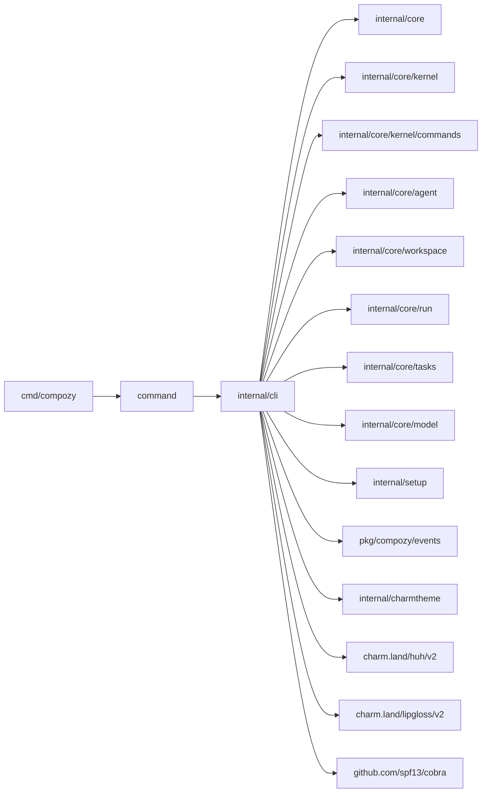

# Refactoring Analysis: CLI & Entry Packages (Group 1)

> **Date**: 2026-04-06
> **Scope**: `internal/cli`, `cmd/compozy`, `command` -- all Go source files (9 production files, 11 test files)
> **Analyzed by**: AI-assisted refactoring analysis (Martin Fowler's catalog)
> **Language/Stack**: Go 1.x, Cobra CLI framework, Charm Huh/Lipgloss TUI libraries
> **Test Coverage**: Good -- every production file has corresponding tests, table-driven subtests used throughout

---

## Executive Summary

The `internal/cli` package is the largest single-package concentration of complexity in the
CLI layer. At 3,380 lines across 9 files, it acts as a monolith that owns command
definition, flag binding, workspace resolution, interactive form collection, theming, task
validation output, skill preflight, and kernel dispatch adapter factories. The biggest
structural opportunity is splitting `root.go` (1,190 lines) into focused files and
extracting the three near-identical "simple command" state types into a shared abstraction.
The `cmd/compozy` and `command` packages are clean and minimal.

| Severity | Count |
|----------|-------|
| P0 -- Critical | 0 |
| P1 -- High | 5 |
| P2 -- Medium | 7 |
| P3 -- Low | 5 |
| **Total** | **17** |

### Top Opportunities (Quick Wins + High Impact)

| # | Finding | Location | Effort | Impact |
|---|---------|----------|--------|--------|
| 1 | root.go is 1,190 lines with 6+ responsibilities | `internal/cli/root.go` | moderate | Reduces cognitive load, enables parallel development |
| 2 | Three near-identical simple-command state types | `internal/cli/root.go:343-445` | moderate | Eliminates ~100 lines of copy-paste code |
| 3 | Three identical loadWorkspaceRoot methods | `internal/cli/workspace_config.go:31-57` | trivial | DRY -- consolidate into one function |
| 4 | commandState struct has 30+ fields (Data Clump) | `internal/cli/root.go:38-83` | significant | Improves readability, reduces parameter surface |
| 5 | Kernel dispatch adapters should be in their own file | `internal/cli/root.go:468-582` | trivial | File-level separation of concerns |

---

## Package Summaries

### `cmd/compozy` (main.go -- 13 lines)

Minimal and clean entry point. Calls `command.New().Execute()` and exits with the correct
code. No issues found.

### `command` (command.go -- 25 lines, doc.go -- 2 lines)

Thin public facade exposing `New()` and `ExitCode()`. One minor finding: uses
`interface{ ExitCode() int }` instead of a named interface. Otherwise clean.

### `internal/cli` (3,380 lines across 9 files)

The CLI glue package. It owns:
- Root command construction and all subcommand definitions (`root.go`)
- Setup command with interactive wizard flow (`setup.go`)
- Interactive form collection for workflow commands (`form.go`)
- TUI theming for Huh forms and Lipgloss chrome (`theme.go`)
- Task validation command and output formatting (`validate_tasks.go`)
- Workspace config resolution and flag-config merging (`workspace_config.go`)
- Signal-based context construction (`command_context.go`)
- Exit code error wrapping (`exit.go`)
- Bundled skill preflight verification (`skills_preflight.go`)

---

## Findings

### P1 -- High

#### F1: root.go is a Large Module (1,190 lines, 6+ distinct responsibilities)

- **Smell**: Large Class / Large Module
- **Category**: Bloater
- **Location**: `internal/cli/root.go:1-1191`
- **Severity**: P1 -- High
- **Action Type**: **(A) File-level split**
- **Impact**: root.go is the single most complex file in the CLI layer. It mixes command
  construction, state management, kernel dispatch adapter factories, config building,
  persisted-exec resumption, prompt source resolution, and error handling. Any change to
  one responsibility requires reading 1,190 lines. Merge conflicts are likely when multiple
  contributors work on different commands.

**Recommended Refactoring**: Extract Module / Split Phase

Split root.go into focused files within the same `cli` package:

| New file | Lines moved | Responsibility |
|----------|-------------|----------------|
| `commands.go` | ~160 | `newFetchReviewsCommand`, `newFixReviewsCommand`, `newStartCommand`, `newExecCommand` factory functions |
| `commands_simple.go` | ~130 | `migrateCommandState`, `syncCommandState`, `archiveCommandState` + their `run()` methods and `newMigrateCommand`, `newSyncCommand`, `newArchiveCommand` |
| `dispatch_adapters.go` | ~120 | `newRunWorkflow`, `newFetchReviewsRunner`, `newMigrateRunner`, `newSyncRunner`, `newArchiveRunner` |
| `state.go` | ~180 | `commandState`, `commandStateDefaults`, `newCommandState`, `buildConfig`, `applyPersistedExecConfig`, `assertPersistedExecCompatibility` |
| `run.go` | ~80 | `run()`, `exec()`, `fetchReviews()`, `runPrepared()`, `preflightTaskMetadata()` methods on commandState |

root.go retains: `NewRootCommand`, `newRootCommandWithDefaults`, `newRootDispatcher`, constants.

**Rationale**: Fowler: "A class with too many responsibilities changes for multiple
unrelated reasons." This is the textbook Divergent Change smell. Each file would have a
single reason to change.

---

#### F2: Three near-identical simple-command state types (Duplicated Code)

- **Smell**: Duplicated Code / Data Clumps
- **Category**: Dispensable + Bloater
- **Location**: `internal/cli/root.go:343-445` (type definitions) and
  `internal/cli/workspace_config.go:31-57` (loadWorkspaceRoot methods) and
  `internal/cli/root.go:753-907` (run methods)
- **Severity**: P1 -- High
- **Action Type**: **(C) Extraction** into a shared abstraction
- **Impact**: `migrateCommandState`, `syncCommandState`, and `archiveCommandState` share
  identical fields (`workspaceRoot`, `rootDir`, `name`, `tasksDir`) and identical
  `loadWorkspaceRoot` method bodies. Their `run()` methods follow the exact same
  structure: resolve workspace -> call function -> print summary. Bug fixes or changes
  to workspace resolution must be applied in three places.

**Current Code** (simplified):
```go
// Three identical loadWorkspaceRoot implementations
func (s *migrateCommandState) loadWorkspaceRoot(ctx context.Context) error {
    workspaceCtx, err := resolveWorkspaceContext(ctx)
    if err != nil { return err }
    s.workspaceRoot = workspaceCtx.Root
    s.projectConfig = workspaceCtx.Config // only migrate has this
    return nil
}

func (s *syncCommandState) loadWorkspaceRoot(ctx context.Context) error {
    workspaceCtx, err := resolveWorkspaceContext(ctx)
    if err != nil { return err }
    s.workspaceRoot = workspaceCtx.Root
    return nil
}

func (s *archiveCommandState) loadWorkspaceRoot(ctx context.Context) error {
    workspaceCtx, err := resolveWorkspaceContext(ctx)
    if err != nil { return err }
    s.workspaceRoot = workspaceCtx.Root
    return nil
}
```

**Recommended Refactoring**: Extract common struct + Combine Functions into Class

```go
type simpleCommandBase struct {
    workspaceRoot string
    projectConfig workspace.ProjectConfig
    rootDir       string
    name          string
    tasksDir      string
}

func (b *simpleCommandBase) loadWorkspaceRoot(ctx context.Context) error {
    workspaceCtx, err := resolveWorkspaceContext(ctx)
    if err != nil { return err }
    b.workspaceRoot = workspaceCtx.Root
    b.projectConfig = workspaceCtx.Config
    return nil
}

type migrateCommandState struct {
    simpleCommandBase
    reviewsDir string
    dryRun     bool
    migrateFn  func(context.Context, core.MigrationConfig) (*core.MigrationResult, error)
}
```

**Rationale**: Rule of Three -- the same pattern appears three times, each requiring
identical maintenance. Embedding a base struct eliminates the duplication while preserving
type-specific fields.

---

#### F3: commandState struct has 30+ fields (Large Parameter List / Data Clump)

- **Smell**: Large Class (field-count proxy), Data Clumps, Long Parameter List
- **Category**: Bloater
- **Location**: `internal/cli/root.go:38-83`
- **Severity**: P1 -- High
- **Action Type**: **(D) Inline fix** -- introduce sub-structs
- **Impact**: `commandState` carries 30+ fields that span multiple domains: workflow
  identity (name, pr, provider, round), runtime config (ide, model, reasoningEffort,
  accessMode), exec-specific fields (promptText, promptFile, readPromptStdin,
  outputFormat, tui, persist, runID), retry config (timeout, maxRetries,
  retryBackoffMultiplier), and injectable functions (8 function fields). This creates
  a "god struct" that every command handler must navigate.

**Current Code** (simplified):
```go
type commandState struct {
    workspaceRoot          string
    projectConfig          workspace.ProjectConfig
    kind                   commandKind
    mode                   core.Mode
    // ... 26 more fields including 8 function fields
}
```

**Recommended Refactoring**: Introduce Parameter Object / Extract Class

Group related fields into sub-structs:

```go
type commandState struct {
    workspaceRoot string
    projectConfig workspace.ProjectConfig
    kind          commandKind
    mode          core.Mode

    identity    workflowIdentity      // name, pr, provider, round, reviewsDir, tasksDir
    runtime     runtimeConfig         // ide, model, reasoningEffort, accessMode, addDirs, etc.
    exec        execConfig            // promptText, promptFile, outputFormat, tui, persist, runID
    retry       retryConfig           // timeout, maxRetries, retryBackoffMultiplier
    callbacks   commandStateCallbacks // all 8 injectable functions
}
```

**Rationale**: Data Clumps that travel together should be named. This makes `buildConfig()`
a simple mapping of sub-structs rather than 30+ individual field copies (lines 945-978).

---

#### F4: Duplicated "apply config" pattern across 5 type-specific functions

- **Smell**: Duplicated Code / Copy-Paste Variations
- **Category**: DRY Violation
- **Location**: `internal/cli/workspace_config.go:123-157`
- **Severity**: P1 -- High
- **Action Type**: **(D) Inline fix**
- **Impact**: `applyStringConfig`, `applyIntConfig`, `applyFloat64Config`,
  `applyBoolConfig`, and `applyStringSliceConfig` are nearly identical functions
  that differ only in their pointer-nil check and type. The same pattern also exists
  in `form.go` with `applyStringInput`, `applyIntInput`, `applyBoolInput`, and
  `applyStringSliceInput` (lines 464-498). This is 10 functions across 2 files that
  do essentially the same thing with minor type variations.

**Current Code** (simplified):
```go
func applyStringConfig(cmd *cobra.Command, flagName string, value *string, setter func(string)) {
    if value == nil || cmd.Flags().Lookup(flagName) == nil || cmd.Flags().Changed(flagName) { return }
    setter(*value)
}
func applyIntConfig(cmd *cobra.Command, flagName string, value *int, setter func(int)) {
    if value == nil || cmd.Flags().Lookup(flagName) == nil || cmd.Flags().Changed(flagName) { return }
    setter(*value)
}
// ... 3 more identical patterns
```

**Recommended Refactoring**: Replace with a generic helper (Go 1.18+ generics)

```go
func applyConfig[T any](cmd *cobra.Command, flagName string, value *T, setter func(T)) {
    if value == nil || cmd.Flags().Lookup(flagName) == nil || cmd.Flags().Changed(flagName) {
        return
    }
    setter(*value)
}
```

For the form `apply*Input` family, a similar generic approach or a unified
`applyFormValue` with type assertions could reduce the 4 functions to 1-2.

**Rationale**: These functions are textbook candidates for Go generics. The duplication
increases the chance of inconsistent guard clause updates.

---

#### F5: Dispatch adapter factories follow identical structure (Copy-Paste Variations)

- **Smell**: Duplicated Code
- **Category**: DRY Violation
- **Location**: `internal/cli/root.go:468-582` (`newRunWorkflow`, `newFetchReviewsRunner`,
  `newMigrateRunner`, `newSyncRunner`, `newArchiveRunner`)
- **Severity**: P1 -- High
- **Action Type**: **(A) File-level split** + **(D) Inline fix**
- **Impact**: Five adapter factory functions follow the exact same pattern:
  1. If dispatcher is nil, return the direct core function
  2. Otherwise, return a closure that converts the config to a typed command and dispatches

  The `newMigrateRunner`, `newSyncRunner`, and `newArchiveRunner` are particularly similar,
  each building a typed command from a `core.Config` with `RootDir` set separately.

**Current Code** (simplified):
```go
func newSyncRunner(dispatcher *kernel.Dispatcher) func(context.Context, core.SyncConfig) (*core.SyncResult, error) {
    if dispatcher == nil { return core.Sync }
    return func(ctx context.Context, cfg core.SyncConfig) (*core.SyncResult, error) {
        typedCommand := commands.WorkflowSyncFromConfig(core.Config{
            WorkspaceRoot: cfg.WorkspaceRoot, Name: cfg.Name, TasksDir: cfg.TasksDir,
        })
        typedCommand.RootDir = cfg.RootDir
        result, err := kernel.Dispatch[commands.WorkflowSyncCommand, commands.WorkflowSyncResult](ctx, dispatcher, typedCommand)
        if err != nil { return nil, err }
        return result.Result, nil
    }
}
// newArchiveRunner is structurally identical
```

**Recommended Refactoring**: Extract to `dispatch_adapters.go` file and consider a generic
dispatch helper that takes a config-to-command converter and a result extractor.

**Rationale**: Moving these to their own file is an immediate quick win. The structural
duplication across sync/archive/migrate can be reduced with a higher-order generic helper.

---

### P2 -- Medium

#### F6: `applyProjectConfig` has conditional complexity with repeated switch-case blocks

- **Smell**: Divergent Change, Repeated Switches
- **Category**: Change Preventer
- **Location**: `internal/cli/workspace_config.go:59-121`
- **Severity**: P2 -- Medium
- **Action Type**: **(D) Inline fix**
- **Impact**: `applyProjectConfig` applies global defaults first, then switches on
  `s.kind` to apply command-specific overrides. The `commandKindExec` branch alone has
  14 `applyConfig` calls that largely mirror the global defaults. Adding a new config
  field requires editing up to 3 places in this function: the global defaults, the
  exec overrides, and potentially the fix-reviews or start overrides.

**Recommended Refactoring**: Replace Conditional with a config overlay model where each
command kind declares which config section(s) to read, and a single loop applies them in
priority order: `[command-specific] > [defaults]`.

---

#### F7: `buildConfig` copies 30+ fields one-by-one (Primitive Obsession)

- **Smell**: Primitive Obsession / Long Function
- **Category**: Bloater
- **Location**: `internal/cli/root.go:935-979`
- **Severity**: P2 -- Medium
- **Action Type**: **(D) Inline fix**
- **Impact**: `buildConfig()` is a 44-line field-by-field copy from `commandState` to
  `core.Config`. If fields are added to `commandState` but forgotten in `buildConfig`,
  they silently default to zero values. The sub-struct grouping from F3 would make this
  a struct-level copy instead.

**Recommended Refactoring**: After F3 sub-struct extraction, `buildConfig` becomes:

```go
return core.Config{
    WorkspaceRoot: s.workspaceRoot,
    Identity:      s.identity.toCoreIdentity(),
    Runtime:       s.runtime.toCoreRuntime(),
    Exec:          s.exec.toCoreExec(),
    // ...
}
```

---

#### F8: `run()` and `exec()` methods are near-duplicates

- **Smell**: Duplicated Code
- **Category**: Dispensable
- **Location**: `internal/cli/root.go:659-713`
- **Severity**: P2 -- Medium
- **Action Type**: **(D) Inline fix**
- **Impact**: `commandState.run()` and `commandState.exec()` follow the same 5-step
  structure: create context -> apply workspace defaults -> resolve inputs -> build config
  -> validate -> run prepared. The only difference is that `exec()` calls
  `resolveExecPromptSource` instead of `maybeCollectInteractiveParams`, and wraps all
  errors in `handleExecError`. They could share a common flow.

**Current Code** (simplified):
```go
func (s *commandState) run(cmd *cobra.Command, _ []string) error {
    ctx, stop := signalCommandContext(cmd)
    defer stop()
    if err := s.applyWorkspaceDefaults(ctx, cmd); err != nil { ... }
    if err := s.maybeCollectInteractiveParams(cmd); err != nil { ... }
    cfg, err := s.buildConfig()
    // ...
    return s.runPrepared(ctx, cmd, cfg)
}

func (s *commandState) exec(cmd *cobra.Command, args []string) error {
    ctx, stop := signalCommandContext(cmd)
    defer stop()
    if err := s.applyWorkspaceDefaults(ctx, cmd); err != nil { ... }
    if err := s.resolveExecPromptSource(cmd, args); err != nil { ... }
    cfg, err := s.buildConfig()
    // ...
    return s.runPrepared(ctx, cmd, cfg)
}
```

**Recommended Refactoring**: Extract a shared `executeCommand` method that takes an
"input resolver" function as a parameter.

---

#### F9: `assertPersistedExecCompatibility` has 5 repetitive if-blocks

- **Smell**: Duplicated Code / Copy-Paste Variations
- **Category**: DRY Violation
- **Location**: `internal/cli/root.go:1005-1031`
- **Severity**: P2 -- Medium
- **Action Type**: **(D) Inline fix**
- **Impact**: Five nearly identical blocks check if a flag was changed and if it differs
  from the persisted value, differing only in the flag name, field accessor, and error
  message. This is a candidate for a loop over a slice of (flagName, newValue, persistedValue)
  tuples.

**Recommended Refactoring**: Introduce a compatibility check helper:

```go
type compatCheck struct {
    flag    string
    current string
    stored  string
}

func assertCompatibility(cmd *cobra.Command, runID string, checks []compatCheck) error {
    for _, c := range checks {
        if cmd.Flags().Changed(c.flag) && c.current != c.stored {
            return fmt.Errorf("--%s %q must match persisted %q for --run-id %q", c.flag, c.current, c.stored, runID)
        }
    }
    return nil
}
```

---

#### F10: `reflect.DeepEqual` used in production code for AddDirs comparison

- **Smell**: Performance concern / Unnecessary reflection
- **Category**: Coupler
- **Location**: `internal/cli/root.go:1027`
- **Severity**: P2 -- Medium
- **Action Type**: **(D) Inline fix**
- **Impact**: `reflect.DeepEqual` is used to compare two `[]string` slices in the
  persisted exec compatibility check. A simple `slices.Equal` (from the standard library
  `slices` package) is more efficient and type-safe. The project's CLAUDE.md explicitly
  states: "Do not use reflection without performance justification."

**Recommended Refactoring**: Replace with `slices.Equal(core.NormalizeAddDirs(cfg.AddDirs), core.NormalizeAddDirs(record.AddDirs))`.

---

#### F11: `newCLIChromeStyles()` is called redundantly in render functions

- **Smell**: Repeated computation
- **Category**: DRY Violation
- **Location**: `internal/cli/theme.go:75-92` and `internal/cli/setup.go:383-469`
- **Severity**: P2 -- Medium
- **Action Type**: **(D) Inline fix**
- **Impact**: `newCLIChromeStyles()` creates a fresh struct of 18 Lipgloss styles every
  time it is called. The functions `renderFormIntro()`, `renderFormSuccess()`,
  `printWelcomeHeader()`, `printBundledSkills()`, `printPreviewSummary()`,
  `printInstallResult()`, and `computeColumnWidths()` each call it independently. While
  not a performance bottleneck, a package-level `var` or `sync.Once` initialization
  would be cleaner.

**Recommended Refactoring**: Initialize styles once at package level or pass them
as a parameter from the caller.

---

#### F12: `panic(err)` in `newRootDispatcher` production path

- **Smell**: Panic in production handler
- **Category**: Conditional Complexity
- **Location**: `internal/cli/root.go:140`
- **Severity**: P2 -- Medium
- **Action Type**: **(D) Inline fix**
- **Impact**: The project's CLAUDE.md explicitly states: "No `panic()` or `log.Fatal()`
  in production paths; reserve these for truly unrecoverable startup failures only."
  While `newRootDispatcher` is called once at startup and a validation failure is
  arguably unrecoverable, the function could return an error instead and let the caller
  (NewRootCommand) handle it. The test `TestNewRootCommandValidatesDispatcherAtStartup`
  uses a package-level `validateRootDispatcher` var to mock this, suggesting the panic
  is not strictly necessary.

**Recommended Refactoring**: Return error from `newRootDispatcher` and handle it in
`NewRootCommand`, or document the panic as an intentional startup-only invariant.

---

### P3 -- Low

| # | Smell | Location | Technique | Action Type | Notes |
|---|-------|----------|-----------|-------------|-------|
| F13 | `interface{ ExitCode() int }` unnamed interface | `command/command.go:20` | Replace Primitive with Object | **(D) Inline fix** | Define a named `exitCoder` interface for clarity. The CLAUDE.md says: "Do not use `interface{}`/`any` when a concrete type is known." While this is a structural interface match, naming it improves readability. |
| F14 | `maxNameLen` calculation duplicated in setup.go | `internal/cli/setup.go:229-234` and `setup.go:400-405` | Extract Function | **(D) Inline fix** | Same `maxNameLen` loop appears twice in `resolveSkillSelection` and `printBundledSkills`. Extract a `maxStringLen(items, accessor)` helper. |
| F15 | `setup.go` is 672 lines mixing command logic, form fields, and styled output | `internal/cli/setup.go:1-672` | Extract Module | **(A) File-level split** | Split into `setup_command.go` (command state + run logic, ~200 lines), `setup_ui.go` (styled print functions, ~200 lines), and keep form resolution in `setup.go` (~250 lines). |
| F16 | `newCommandState`/`newCommandStateWithDefaults` could use functional options | `internal/cli/root.go:447-466` | Introduce Parameter Object | **(D) Inline fix** | The `commandStateDefaults` struct + `withFallbacks()` pattern is a manual version of functional options. While it works, aligning with the project's stated preference for functional options would improve consistency. |
| F17 | `bestEffortRootWorkspaceContext` uses `context.Background()` with timeout | `internal/cli/root.go:145-153` | Move Function | **(D) Inline fix** | CLAUDE.md: "avoid `context.Background()` outside `main` and focused tests." This is called from `newRootDispatcher` which is effectively a startup path, so the use is borderline acceptable. Consider accepting a `context.Context` parameter. |

---

## Coupling Analysis

### Module Dependency Map



### High-Risk Coupling

| Module | Afferent (dependents) | Efferent (dependencies) | Risk |
|--------|----------------------|------------------------|------|
| `internal/cli` | 1 (`command`) | 12 (core, kernel, commands, agent, workspace, run, tasks, model, setup, events, charmtheme, cobra) | high |
| `command` | 1 (`cmd/compozy`) | 1 (`internal/cli`) | low |
| `cmd/compozy` | 0 (entry point) | 1 (`command`) | low |

**Analysis**: `internal/cli` has very high efferent coupling (12 direct imports from
internal packages). This is expected for a CLI glue layer, but the coupling to
`internal/core/kernel/commands` (typed command constructors) is concerning because it
means the CLI layer must understand the kernel's command type system. The dispatch
adapter factories (F5) are the primary coupling point -- if the kernel command API
changes, 5 adapter functions in root.go must be updated.

### Circular Dependencies

None detected. The dependency flow is strictly `cmd -> command -> cli -> core/*`.

---

## DRY Analysis

### Duplicated Code Clusters

| Cluster | Locations | Lines | Extraction Strategy |
|---------|-----------|-------|-------------------|
| loadWorkspaceRoot methods | `workspace_config.go:31-57` (3 methods) | ~27 | Embed a shared base struct (F2) |
| applyConfig type-specific helpers | `workspace_config.go:123-157` (5 funcs) | ~35 | Generic `applyConfig[T]` function (F4) |
| applyInput type-specific helpers | `form.go:464-498` (4 funcs) | ~35 | Generic form input applier (F4) |
| Dispatch adapter factories | `root.go:503-582` (sync/archive/migrate) | ~80 | Higher-order dispatch builder (F5) |
| run() / exec() method bodies | `root.go:659-713` | ~55 | Extract shared flow (F8) |
| assertPersistedExecCompatibility checks | `root.go:1005-1031` | ~27 | Loop over check tuples (F9) |
| maxNameLen calculation | `setup.go:229-234, 400-405` | ~12 | Extract `maxLen` helper (F14) |

### Magic Values

| Value | Occurrences | Suggested Constant Name | Files |
|-------|-------------|------------------------|-------|
| `"10m"` | 1 | `defaultTimeout` | `root.go:642` |
| `1.5` | 1 | `defaultRetryBackoffMultiplier` | `root.go:655` |
| `"medium"` | 1 | `defaultReasoningEffort` | `root.go:630` |
| `80` | 1 | `maxDescriptionLen` | `setup.go:558` |

### Repeated Patterns

1. **Guard clause pattern**: `if cmd.Flags().Lookup(flagName) == nil || cmd.Flags().Changed(flagName) { return }` appears in all 9 `apply*Config` and `apply*Input` functions.

2. **Nullable function field fallback**: Multiple methods on `commandState` check if a
   function field is nil and fall back to a default: `if fn == nil { fn = defaultFn }`.
   This appears in `maybeCollectInteractiveParams` (lines 914-916, 925-927),
   `runPrepared` (1141-1143), `commandIsInteractive` (116-118), `fetchReviews`
   (731-733), and several skill preflight methods. The `commandStateDefaults.withFallbacks()`
   pattern handles this at construction time, but some call sites still do manual nil
   checks, suggesting incomplete adoption.

---

## SOLID Analysis

> **Context**: This project uses a kernel/dispatcher architecture with typed commands,
> handler registry, and domain-specific adapters. SOLID analysis is applicable at the
> package boundary level.

| Principle | Finding | Location | Severity | Recommendation |
|-----------|---------|----------|----------|----------------|
| SRP | `internal/cli` package has 6+ distinct responsibilities | Package level | P1 | File-level split (F1, F15) reduces per-file responsibility |
| SRP | `commandState` owns workflow identity, runtime config, exec config, retry config, and callbacks | `root.go:38-83` | P1 | Sub-struct extraction (F3) |
| OCP | Adding a new "simple command" (like archive/sync/migrate) requires copying an entire state type | `root.go:343-445` | P1 | Extract shared base (F2) makes extension cheaper |
| DIP | CLI dispatch adapters directly construct kernel typed commands | `root.go:468-582` | P2 | Acceptable for a CLI glue layer, but could use a factory interface to decouple |
| ISP | No large interfaces found -- the package uses function fields instead of interfaces | N/A | N/A | Good pattern, no action needed |

---

## Suggested Refactoring Order

### Phase 1: Quick Wins (trivial effort, immediate clarity)

1. **F10**: Replace `reflect.DeepEqual` with `slices.Equal` -- `root.go:1027`
2. **F5 (partial)**: Move dispatch adapter factories to `dispatch_adapters.go` -- `root.go:468-582`
3. **F14**: Extract `maxLen` helper in setup.go -- `setup.go:229,400`
4. **F13**: Name the `exitCoder` interface in `command/command.go`

### Phase 2: High-Impact Structural Changes

1. **F1**: Split `root.go` into 5 focused files (A-level split)
2. **F2**: Extract `simpleCommandBase` shared struct for migrate/sync/archive
3. **F4**: Introduce generic `applyConfig[T]` to replace 5+4 duplicated functions
4. **F8**: Consolidate `run()` and `exec()` into a shared flow
5. **F9**: Consolidate `assertPersistedExecCompatibility` into a loop

### Phase 3: Deeper Architectural Improvements

1. **F3**: Introduce sub-structs for `commandState` field groups
2. **F7**: Simplify `buildConfig()` once sub-structs exist
3. **F6**: Refactor `applyProjectConfig` to use a config overlay model
4. **F15**: Split `setup.go` into command/UI/form files
5. **F12**: Consider returning error from `newRootDispatcher` instead of panicking

### Prerequisites

- All changes are internal to the `cli` package, so no external API changes needed
- Existing tests provide good coverage for safe refactoring
- Phase 2 items (F2, F4) should be done before Phase 3 (F3, F7) since sub-struct
  design depends on how duplication is consolidated

---

## Risks and Caveats

- **F12 (panic)**: The panic in `newRootDispatcher` may be intentional as a
  startup-only invariant assertion. The test `TestNewRootCommandValidatesDispatcherAtStartup`
  replaces the validator via a package-level var, suggesting the team is aware of it.
  Flagged as P2 rather than P0.

- **F3 (sub-structs)**: Introducing sub-structs into `commandState` is a significant
  refactoring that touches many call sites. It should be done incrementally and only
  after F1 (file split) is complete to minimize merge conflicts.

- **F4 (generics)**: The generic `applyConfig[T]` approach requires Go 1.18+. Verify
  the project's minimum Go version before proceeding.

- **Test coverage**: The test suite is comprehensive (11 test files, table-driven tests,
  good coverage of edge cases). All refactorings in this report should be safe to perform
  with the existing test suite as a safety net.

---

## Appendix: Smell Distribution

| Category | Count | % |
|----------|-------|---|
| Bloaters | 4 | 24% |
| Change Preventers | 1 | 6% |
| Dispensables | 3 | 18% |
| Couplers | 1 | 6% |
| Conditional Complexity | 1 | 6% |
| DRY Violations | 5 | 29% |
| SOLID Violations | 2 | 12% |
| **Total** | **17** | **100%** |
