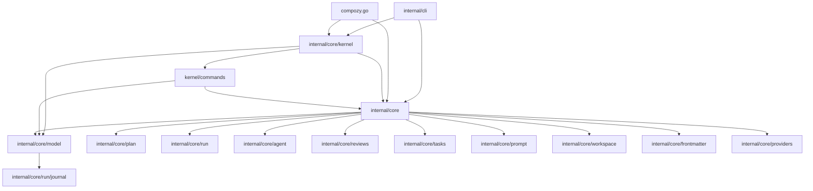

# Refactoring Analysis: Core Foundation Packages

> **Date**: 2026-04-06
> **Scope**: Group 2 -- `internal/core` (root), `internal/core/kernel`, `internal/core/kernel/commands`, `internal/core/model`
> **Analyzed by**: AI-assisted refactoring analysis (Martin Fowler's catalog)
> **Language/Stack**: Go 1.23+
> **Test Coverage**: Present and reasonably thorough across all four packages

---

## Executive Summary

The core foundation packages are well-structured overall with clear separation between the typed kernel dispatcher, command definitions, and domain model. However, the codebase suffers from **three structural config translation chains** that create excessive field-by-field copying (core.Config -> RuntimeFields -> RuntimeConfig), a **large monolithic model package** that mixes unrelated domains (content block serialization, runtime config, workspace paths, task/review metadata), and **duplicated `newPreparation`/`newJob` converter functions** between `api.go` and `handlers.go`. The highest-impact improvement would be splitting `model.go` into focused sub-files and eliminating the triple config translation.

| Severity | Count |
|----------|-------|
| P0 -- Critical | 2 |
| P1 -- High | 5 |
| P2 -- Medium | 6 |
| P3 -- Low | 5 |
| **Total** | **18** |

### Top Opportunities (Quick Wins + High Impact)

| # | Finding | Location | Effort | Impact |
|---|---------|----------|--------|--------|
| 1 | Duplicated `newPreparation`/`newJob` converters | `api.go:393-427`, `handlers.go:258-289` | trivial | Eliminates dual maintenance of identical logic |
| 2 | Triple config translation chain | `api.go:354-391`, `runtime_fields.go:47-121`, `model.go:96-127` | moderate | Reduces 90+ lines of copy-paste field mapping |
| 3 | `model.go` is a 370-line grab bag | `model/model.go:1-370` | moderate | Improves cohesion, navigability, and change cost |
| 4 | `content.go` decode functions are copy-paste | `model/content.go:330-400` | trivial | DRY: 6 identical decode functions become 1 generic |
| 5 | `core_adapters.go` adapter functions are copy-paste | `kernel/core_adapters.go:47-148` | moderate | 6 near-identical dispatch adapter functions |

---

## Package Summaries

### `internal/core` (root-level files)

**Responsibility**: Public facade for the Compozy engine. Defines the legacy `Config` struct, type aliases (Mode, IDE, OutputFormat), result types for each operation (Preparation, FetchResult, MigrationResult, SyncResult, ArchiveResult), and thin forwarding functions that delegate to either registered dispatcher adapters or direct implementations.

**Files analyzed**: `api.go` (428 lines), `fetch.go` (129 lines), `sync.go` (117 lines), `migrate.go` (426 lines), `archive.go` (213 lines), `workspace_paths_test.go` (32 lines)

**Observations**: This package has evolved into a **dual-role** facade -- it both defines the legacy public API surface and contains substantial implementation logic (migration, sync, archive, fetch). The `api.go` file alone holds 30+ type definitions, 6 forwarding functions, config validation, and two conversion functions. The `migrate.go` file is the largest at 426 lines with deep migration logic that belongs closer to the `tasks` or `frontmatter` domain.

### `internal/core/kernel`

**Responsibility**: Typed command dispatcher with handler registry. Provides `Dispatcher`, `Register`, `Dispatch` generics, handler implementations for all six Phase A commands, and the `core_adapters.go` init-time bridge that wires the dispatcher back into the legacy `core` API.

**Files analyzed**: `dispatcher.go` (132 lines), `handlers.go` (290 lines), `deps.go` (89 lines), `core_adapters.go` (148 lines), `doc.go` (2 lines)

**Observations**: Clean generic dispatcher pattern. The `handlers.go` file has 6 handler structs with very similar shapes -- each stores `deps KernelDeps` and `ops operations`, implements `Handle`, and follows the same validate-prepare-execute template. The `core_adapters.go` file has 6 near-identical adapter functions that differ only in the command/result type parameters.

### `internal/core/kernel/commands`

**Responsibility**: Typed command and result contract definitions for the kernel dispatcher. Each command file defines a command struct, result struct, `FromConfig` constructors, and `CoreConfig` / `RuntimeConfig` converters.

**Files analyzed**: `run_start.go` (30 lines), `workflow_prepare.go` (31 lines), `workflow_sync.go` (49 lines), `workflow_archive.go` (47 lines), `workspace_migrate.go` (55 lines), `reviews_fetch.go` (40 lines), `runtime_fields.go` (122 lines), `doc.go` (2 lines)

**Observations**: `runtime_fields.go` is the workhorse -- it contains a 33-field `RuntimeFields` struct that mirrors `core.Config` almost exactly, plus two large field-by-field copy functions. The individual command files are clean and focused but introduce bidirectional conversion (FromConfig + CoreConfig) that creates a round-trip conversion smell.

### `internal/core/model`

**Responsibility**: Shared runtime data structures used across all `internal/core/*` sub-packages.

**Files analyzed**: `model.go` (370 lines), `content.go` (459 lines)

**Observations**: `model.go` conflates 5 distinct concerns: (1) IDE/mode/format constants, (2) `RuntimeConfig` with defaults, (3) workspace path helpers, (4) run/job artifact types, (5) task/review metadata types. `content.go` is a well-designed content block envelope system but has 6 structurally identical decode functions and 6 identical ensure functions that are textbook DRY violations.

---

## Findings

### P0 -- Critical

#### F1: Duplicated `newPreparation` and `newJob` converter functions

- **Smell**: Duplicated Code
- **Category**: Dispensable
- **Location**: `internal/core/api.go:393-427` and `internal/core/kernel/handlers.go:258-289`
- **Severity**: P0 -- Critical
- **Impact**: Bug risk -- any change to the Preparation/Job mapping must be made in two places. The two copies already diverge slightly: `api.go:newJob` copies `groups` into `Job.groups` while `handlers.go:newJob` does not.
- **Action**: **(C) Extraction**

**Current Code** (simplified):
```go
// api.go:393
func newPreparation(prep *model.SolvePreparation) *Preparation {
    jobs := make([]Job, 0, len(prep.Jobs))
    for i := range prep.Jobs {
        jobs = append(jobs, newJob(prep.Jobs[i]))
    }
    return &Preparation{
        Jobs: jobs, InputDir: prep.InputDir, ...
    }
}

// handlers.go:258 -- nearly identical
func newPreparation(prep *model.SolvePreparation) *core.Preparation {
    jobs := make([]core.Job, 0, len(prep.Jobs))
    for idx := range prep.Jobs {
        jobs = append(jobs, newJob(prep.Jobs[idx]))
    }
    return &core.Preparation{
        Jobs: jobs, InputDir: prep.InputDir, ...
    }
}
```

**Recommended Refactoring**: Extract Function -- move the canonical `newPreparation`/`newJob` into a single location (e.g., keep in `api.go` as exported, or a shared internal helper in `core`).

**After** (proposed):
```go
// api.go -- single canonical converter, exported for kernel use
func NewPreparationFromSolve(prep *model.SolvePreparation) *Preparation { ... }
func NewJobFromModel(jb model.Job) Job { ... }

// handlers.go -- delete the duplicate, call core.NewPreparationFromSolve(prep)
```

**Rationale**: The `handlers.go` copy already diverges (missing `groups` field). This is a live bug vector. Fowler: "If you see the same code structure in more than one place, you can be sure that your program will be better if you find a way to unify them."

---

#### F2: Triple config translation chain (core.Config -> RuntimeFields -> RuntimeConfig)

- **Smell**: Data Clumps + Shotgun Surgery
- **Category**: Change Preventer
- **Location**: `internal/core/api.go:354-391` (`Config.runtime()`), `internal/core/kernel/commands/runtime_fields.go:47-84` (`RuntimeFields.RuntimeConfig()`), `internal/core/kernel/commands/runtime_fields.go:86-121` (`runtimeFieldsFromConfig()`)
- **Severity**: P0 -- Critical
- **Impact**: Adding a single new config field (e.g., a new flag) requires updating 4 locations: `core.Config`, `RuntimeFields`, `Config.runtime()`, and `runtimeFieldsFromConfig()`. Each has 30+ fields copied one by one. This is textbook Shotgun Surgery -- a single conceptual change touches 4 files with 120+ lines of mechanical copying.
- **Action**: **(B) Package-level split** or **(D) Inline fix**

**Current Code** (simplified):
```go
// core.Config has 30 fields
// commands.RuntimeFields has the same 30 fields
// core.Config.runtime() copies all 30 fields to model.RuntimeConfig
// commands.runtimeFieldsFromConfig() copies all 30 fields from core.Config to RuntimeFields
// commands.RuntimeFields.RuntimeConfig() copies all 30 fields to model.RuntimeConfig
```

**Recommended Refactoring**: Introduce Parameter Object -- use `model.RuntimeConfig` directly as the embedded field in commands (or make `core.Config` embed `RuntimeFields` directly, collapsing one layer). Alternatively, have `core.Config` implement an interface that `RuntimeFields` also implements, with a single shared `toRuntimeConfig()` function.

**After** (proposed):
```go
// Option A: core.Config embeds RuntimeFields directly
type Config struct {
    commands.RuntimeFields
}

// Option B: Commands accept model.RuntimeConfig directly for the runtime-facing fields
type RunStartCommand struct {
    RuntimeConfig *model.RuntimeConfig
}
```

**Rationale**: The triple copy chain is the single highest change-cost pattern in these packages. Every new config field costs ~8 lines of boilerplate spread across 3 files.

---

### P1 -- High

#### F3: `model.go` is a 370-line grab bag mixing 5 unrelated domains

- **Smell**: Large Class / Divergent Change
- **Category**: Bloater / Change Preventer
- **Location**: `internal/core/model/model.go:1-370`
- **Severity**: P1 -- High
- **Impact**: Changes to IDE constants, runtime config defaults, workspace paths, run artifacts, and task metadata all hit the same file. This violates SRP at the file level and makes it harder to find related code.
- **Action**: **(A) File-level split**

**Recommended Refactoring**: Split Phase / Extract Class -- split `model.go` into focused files within the same package:

1. `constants.go` -- IDE, mode, format, access mode constants (lines 13-59)
2. `runtime_config.go` -- `RuntimeConfig` struct and `ApplyDefaults` (lines 61-127)
3. `workspace_paths.go` -- `CompozyDir`, `TasksBaseDir*`, `RunsBaseDir*`, `ConfigPath*`, `ArchivedTasksDir`, `IsActiveWorkflowDirName` (lines 129-242)
4. `artifacts.go` -- `RunArtifacts`, `JobArtifacts`, `NewRunArtifacts`, `sanitizeRunID` (lines 161-233)
5. `task_review.go` -- `IssueEntry`, `ReviewContext`, `RoundMeta`, `TaskMeta`, `TaskEntry`, `TaskFileMeta`, `ReviewFileMeta` (lines 244-302)
6. `preparation.go` -- `JournalHandle`, `SolvePreparation`, `Job` (lines 304-370)

**Rationale**: File-level splits within the same package are zero-risk refactorings that improve navigability and reduce merge conflict surface.

---

#### F4: 6 structurally identical decode functions in `content.go`

- **Smell**: Duplicated Code / Copy-Paste Variations
- **Category**: DRY Violation
- **Location**: `internal/core/model/content.go:330-400`
- **Severity**: P1 -- High
- **Impact**: Each new block type requires copying the same 10-line decode function pattern. The 6 `decodeXxxBlock` functions and 6 `ensureXxxBlock` functions are structurally identical with only the type name varying.
- **Action**: **(D) Inline fix**

**Current Code** (simplified):
```go
func decodeTextBlock(data []byte) (TextBlock, error) {
    var block TextBlock
    if err := json.Unmarshal(data, &block); err != nil {
        return TextBlock{}, fmt.Errorf("decode %s block: %w", BlockText, err)
    }
    block = ensureTextBlock(block)
    if block.Type != BlockText {
        return TextBlock{}, fmt.Errorf("decode %s block: unexpected type %q", BlockText, block.Type)
    }
    return block, nil
}
// ...repeated 5 more times for ToolUse, ToolResult, Diff, TerminalOutput, Image
```

**Recommended Refactoring**: Replace with a generic function using Go 1.21+ generics:

**After** (proposed):
```go
type typedBlock interface {
    TextBlock | ToolUseBlock | ToolResultBlock | DiffBlock | TerminalOutputBlock | ImageBlock
}

func decodeBlock[T typedBlock](data []byte, expectedType ContentBlockType, ensure func(T) T) (T, error) {
    var block T
    if err := json.Unmarshal(data, &block); err != nil {
        return block, fmt.Errorf("decode %s block: %w", expectedType, err)
    }
    block = ensure(block)
    // type check via ensure already sets the correct type
    return block, nil
}
```

**Rationale**: This is a textbook "Replace Loop with Pipeline" / "Extract Function" opportunity. Adding a new block type currently requires writing 2 new functions (decode + ensure) that are pure boilerplate.

---

#### F5: 6 near-identical core adapter functions in `core_adapters.go`

- **Smell**: Duplicated Code / Copy-Paste Variations
- **Category**: DRY Violation
- **Location**: `internal/core/kernel/core_adapters.go:47-148`
- **Severity**: P1 -- High
- **Impact**: Each adapter function follows the same 12-line pattern: get dispatcher -> dispatch command -> wrap error -> return result. Adding a new command requires copying this boilerplate.
- **Action**: **(D) Inline fix**

**Current Code** (simplified):
```go
func dispatchPrepareAdapter(ctx context.Context, cfg core.Config) (*core.Preparation, error) {
    dispatcher, err := coreAdapterDispatcherFn()
    if err != nil {
        return nil, fmt.Errorf("prepare: %w", err)
    }
    result, err := Dispatch[commands.WorkflowPrepareCommand, commands.WorkflowPrepareResult](
        ctx, dispatcher, commands.WorkflowPrepareFromConfig(cfg),
    )
    if err != nil {
        return nil, fmt.Errorf("prepare: %w", err)
    }
    return result.Preparation, nil
}
// ...repeated for Run, FetchReviews, Migrate, Sync, Archive
```

**Recommended Refactoring**: Extract a generic dispatch-and-wrap helper:

**After** (proposed):
```go
func dispatchAdapter[C any, R any](ctx context.Context, label string, cmd C) (R, error) {
    var zero R
    dispatcher, err := coreAdapterDispatcherFn()
    if err != nil {
        return zero, fmt.Errorf("%s: %w", label, err)
    }
    result, err := Dispatch[C, R](ctx, dispatcher, cmd)
    if err != nil {
        return zero, fmt.Errorf("%s: %w", label, err)
    }
    return result, nil
}
```

**Rationale**: Reduces ~100 lines to ~30, eliminates copy-paste risk. Each adapter becomes a 3-line function calling the generic helper.

---

#### F6: `operations` interface in `handlers.go` uses `core.Config` for `FetchReviews`

- **Smell**: Feature Envy / Coupling
- **Category**: Coupler
- **Location**: `internal/core/kernel/handlers.go:27`
- **Severity**: P1 -- High
- **Impact**: The `operations` interface mixes two abstraction levels: some methods take `*model.RuntimeConfig` (the kernel-native type), while `FetchReviews` takes `core.Config` (the legacy facade type). This forces the kernel package to import `core`, creating a **bidirectional dependency**: `core` imports `kernel` (via `core_adapters.go` init), and `kernel` imports `core`.
- **Action**: **(D) Inline fix**

**Current Code**:
```go
type operations interface {
    ValidateRuntimeConfig(*model.RuntimeConfig) error
    Prepare(context.Context, *model.RuntimeConfig) (*model.SolvePreparation, error)
    Execute(context.Context, *model.SolvePreparation, *model.RuntimeConfig) error
    ExecuteExec(context.Context, *model.RuntimeConfig) error
    FetchReviews(context.Context, core.Config) (*core.FetchResult, error)    // <-- legacy type
    Migrate(context.Context, core.MigrationConfig) (*core.MigrationResult, error)  // <-- legacy type
    Sync(context.Context, core.SyncConfig) (*core.SyncResult, error)               // <-- legacy type
    Archive(context.Context, core.ArchiveConfig) (*core.ArchiveResult, error)       // <-- legacy type
}
```

**Recommended Refactoring**: Move `FetchResult`, `MigrationConfig`, `MigrationResult`, `SyncConfig`, `SyncResult`, `ArchiveConfig`, `ArchiveResult` to the `model` package (since they are pure data types), and have the `operations` interface use `model.*` types exclusively.

**Rationale**: Breaking the bidirectional dependency between `core` and `kernel` is essential for clean layering. The kernel should depend only on `model` and `commands`, not on the legacy `core` facade.

---

#### F7: `handlers.go` has 6 handler structs with identical structure

- **Smell**: Duplicated Code / Speculative Generality pattern
- **Category**: Bloater
- **Location**: `internal/core/kernel/handlers.go:77-256`
- **Severity**: P1 -- High
- **Impact**: Each handler struct stores the same `{deps KernelDeps, ops operations}` pair. The thin handlers (sync, archive, migrate, fetch) do nothing beyond calling one `ops` method and wrapping the result. This is the Middle Man smell for the thin handlers.
- **Action**: **(D) Inline fix**

**Current Code** (simplified):
```go
type workflowSyncHandler struct {
    deps KernelDeps
    ops  operations
}
func (h *workflowSyncHandler) Handle(ctx context.Context, cmd commands.WorkflowSyncCommand) (commands.WorkflowSyncResult, error) {
    result, err := h.ops.Sync(ctx, cmd.CoreConfig())
    if err != nil {
        return commands.WorkflowSyncResult{}, err
    }
    return commands.WorkflowSyncResult{Result: result}, nil
}
// Archive, Migrate, Fetch handlers are identical in shape
```

**Recommended Refactoring**: Use a generic handler adapter for the thin delegation cases:

**After** (proposed):
```go
type delegatingHandler[C any, R any] struct {
    handle func(context.Context, C) (R, error)
}

func (h *delegatingHandler[C, R]) Handle(ctx context.Context, cmd C) (R, error) {
    return h.handle(ctx, cmd)
}
```

**Rationale**: Reduces 4 handler structs + 4 constructors (~80 lines) to 4 function closures. The `runStartHandler` and `workflowPrepareHandler` have enough logic to justify their own structs; the other four do not.

---

### P2 -- Medium

#### F8: `migrate.go` is 426 lines with deep domain logic that belongs in `tasks` or a `migration` sub-package

- **Smell**: Large Module / Divergent Change
- **Category**: Bloater / Change Preventer
- **Location**: `internal/core/migrate.go:1-426`
- **Severity**: P2 -- Medium
- **Impact**: Migration logic (V1-to-V2 task format, legacy review parsing) is implementation detail that pollutes the `core` facade package. Changes to migration formats require editing a file that also participates in the public API surface.
- **Action**: **(B) Package-level split**

**Recommended Refactoring**: Extract the migration implementation into `internal/core/migration/` or into `internal/core/tasks/migration.go`, leaving only the `MigrateDirect` entry point in `core`.

**Rationale**: The `core` package's role is to be a thin facade. The 400+ lines of YAML parsing, WalkDir scanning, and V1-to-V2 format conversion belong in a dedicated migration package.

---

#### F9: `resolveSyncTarget` and `resolveArchiveTarget` are near-duplicates

- **Smell**: Duplicated Code
- **Category**: DRY Violation
- **Location**: `internal/core/sync.go:51-91` and `internal/core/archive.go:59-112`
- **Severity**: P2 -- Medium
- **Impact**: Both functions follow the same pattern: count specific targets, compute rootDir, resolve the path, stat it, verify it is a directory. The archive version adds one extra check (`pathContainsArchivedComponent`), but the first 80% is identical.
- **Action**: **(C) Extraction**

**Current Code** (simplified):
```go
// sync.go:51
func resolveSyncTarget(cfg SyncConfig) (string, bool, error) {
    specificTargets := 0
    if strings.TrimSpace(cfg.Name) != "" { specificTargets++ }
    if strings.TrimSpace(cfg.TasksDir) != "" { specificTargets++ }
    if specificTargets > 1 { return "", false, errors.New("sync accepts only one of --name or --tasks-dir") }
    rootDir := strings.TrimSpace(cfg.RootDir)
    if rootDir == "" { rootDir = model.TasksBaseDirForWorkspace(cfg.WorkspaceRoot) }
    // ...resolve and stat...
}

// archive.go:59 -- 80% identical
func resolveArchiveTarget(cfg ArchiveConfig) (string, string, bool, error) {
    specificTargets := 0
    if strings.TrimSpace(cfg.Name) != "" { specificTargets++ }
    if strings.TrimSpace(cfg.TasksDir) != "" { specificTargets++ }
    if specificTargets > 1 { return "", "", false, errors.New("archive accepts only one of --name or --tasks-dir") }
    rootDir := strings.TrimSpace(cfg.RootDir)
    if rootDir == "" { rootDir = model.TasksBaseDirForWorkspace(cfg.WorkspaceRoot) }
    // ...resolve and stat...
}
```

**Recommended Refactoring**: Extract a shared `resolveWorkflowTarget` helper that handles the common target resolution pattern, and have sync/archive call it with operation-specific post-validation.

---

#### F10: `resolveMigrationTarget` follows the same pattern as F9

- **Smell**: Duplicated Code
- **Category**: DRY Violation
- **Location**: `internal/core/migrate.go:87-129`
- **Severity**: P2 -- Medium
- **Impact**: Third copy of the same target resolution pattern. The only difference is that migration also accepts `--reviews-dir`.
- **Action**: **(C) Extraction** -- shared with F9's extracted helper

---

#### F11: Package-level mutable state in `api.go` and `core_adapters.go`

- **Smell**: Mutable Shared State
- **Category**: Coupler
- **Location**: `internal/core/api.go:30` (`var registeredDispatcherAdapters`), `internal/core/kernel/core_adapters.go:14-19` (`var coreAdapterDispatcher*`), `internal/core/fetch.go:17` (`var defaultProviderRegistry`)
- **Severity**: P2 -- Medium
- **Impact**: Global mutable state makes testing fragile (tests must save/restore state), creates implicit ordering dependencies, and makes concurrency non-obvious. The `init()` in `core_adapters.go` that mutates `core.registeredDispatcherAdapters` is a hidden side effect that couples the packages at import time.
- **Action**: **(D) Inline fix** -- move toward dependency injection via the `KernelDeps` pattern already used by the kernel

**Rationale**: The `init()` registration pattern is a transitional mechanism (documented as "Phase A"). Once all callers migrate to the kernel dispatcher directly, these globals should be removed.

---

#### F12: `content.go` ensure functions are trivial identity wrappers

- **Smell**: Lazy Element
- **Category**: Dispensable
- **Location**: `internal/core/model/content.go:402-430`
- **Severity**: P2 -- Medium
- **Impact**: 6 `ensureXxxBlock` functions each do one thing: set `block.Type = BlockXxx; return block`. These could be inlined into the decode functions or replaced by a single generic function.
- **Action**: **(D) Inline fix**

**After** (proposed):
```go
// Inline into decode, or:
func ensureBlockType[T typedBlock](block T, blockType ContentBlockType) T {
    // set Type field via reflection or type switch
    return block
}
```

---

#### F13: `commands` package imports `core` package creating an upward dependency

- **Smell**: Dependency Inversion violation
- **Category**: Coupler
- **Location**: All files in `internal/core/kernel/commands/*.go`
- **Severity**: P2 -- Medium
- **Impact**: The `commands` sub-package (lower-level) imports the `core` package (higher-level facade). This means `commands` depends on the package it is supposed to serve. The `CoreConfig()` methods on each command return `core.Config`, `core.SyncConfig`, etc., tying the command definitions to the legacy facade types.
- **Action**: **(B) Package-level split** -- move `SyncConfig`, `ArchiveConfig`, `MigrationConfig`, `FetchResult`, etc. to `model`, breaking the upward dependency

---

### P3 -- Low

| # | Smell | Location | Technique | Action | Notes |
|---|-------|----------|-----------|--------|-------|
| F14 | Long Parameter List (4 returns) | `archive.go:59` `resolveArchiveTarget` returns `(string, string, bool, error)` | Introduce Parameter Object | (D) | Consider a `resolvedTarget` struct |
| F15 | Magic string `"medium"` | `model.go:110` `cfg.ReasoningEffort = "medium"` | Extract Constant | (D) | Define `DefaultReasoningEffort = "medium"` |
| F16 | Magic number `1.5` | `model.go:126` `cfg.RetryBackoffMultiplier = 1.5` | Extract Constant | (D) | Define `DefaultRetryBackoffMultiplier = 1.5` |
| F17 | `reviewRoundDirPattern` global regex | `migrate.go:41` | Encapsulate Variable | (D) | Move to function scope or a migration-specific file |
| F18 | `archiveTimestampFormat` constant in facade | `archive.go:18` | Move Constant | (C) | Move to `model` or extracted `archive` sub-package |

---

## Coupling Analysis

### Module Dependency Map



### High-Risk Coupling

| Module | Afferent (dependents) | Efferent (dependencies) | Risk |
|--------|----------------------|------------------------|------|
| `internal/core/model` | 72 files | 1 (journal) | **high** -- most-imported package, any breaking change ripples everywhere |
| `internal/core` (facade) | 20 files | 10 packages | **high** -- wide fan-out makes it fragile, wide fan-in makes changes costly |
| `internal/core/kernel/commands` | 4 files (kernel + tests) | 2 (core, model) | **medium** -- upward dependency on `core` is concerning |
| `internal/core/kernel` | 5 files | 7 packages | **medium** -- high efferent coupling through `operations` interface |

### Circular Dependencies

**Detected**: `internal/core` <-> `internal/core/kernel` -- bidirectional dependency through:
- `kernel` imports `core` (for `core.Config`, `core.FetchResult`, etc. in `handlers.go` and `core_adapters.go`)
- `core` imports `kernel` indirectly via the `init()` in `core_adapters.go` that calls `core.RegisterDispatcherAdapters`

This is managed at runtime via the `init()` registration pattern, so Go compiles it successfully (the import is only `core` -> `kernel` at the Go level via blank import), but logically the packages are mutually dependent.

**Detected**: `commands` -> `core` -- the `commands` sub-package imports `core` for the result/config types, creating an upward dependency.

---

## DRY Analysis

### Duplicated Code Clusters

| Cluster | Locations | Lines | Extraction Strategy |
|---------|-----------|-------|-------------------|
| `newPreparation`/`newJob` converters | `api.go:393-427`, `handlers.go:258-289` | ~65 | Export from `core`, delete kernel copy |
| Target resolution pattern | `sync.go:51-91`, `archive.go:59-112`, `migrate.go:87-129` | ~130 | Extract shared `resolveWorkflowTarget` helper |
| Core adapter dispatch pattern | `core_adapters.go:47-148` | ~100 | Extract generic dispatch helper |
| Content block decode pattern | `content.go:330-400` | ~70 | Replace with generic decode function |
| Content block ensure pattern | `content.go:402-430` | ~30 | Inline or replace with generic |
| Config field-by-field copy | `api.go:354-391`, `runtime_fields.go:47-121` | ~160 | Embed or use single conversion path |

### Magic Values

| Value | Occurrences | Suggested Constant Name | Files |
|-------|-------------|------------------------|-------|
| `"medium"` | 1 | `DefaultReasoningEffort` | `model.go:110` |
| `1.5` | 1 | `DefaultRetryBackoffMultiplier` | `model.go:126` |
| `"20060102-150405"` | 1 | `ArchiveTimestampFormat` (already a constant) | `archive.go:18` |

### Repeated Patterns

**Config field groups**: The triplet `(WorkspaceRoot, RootDir, Name, TasksDir)` appears in `SyncConfig`, `ArchiveConfig`, and `MigrationConfig` as a data clump. These could be extracted into a `WorkflowTargetConfig` struct.

**Handler struct pattern**: All 6 kernel handlers follow `struct { deps KernelDeps; ops operations }` + constructor + Handle method. The 4 thin handlers (sync, archive, migrate, fetch) add no logic beyond delegation.

---

## SOLID Analysis

> **Context**: This project uses a layered architecture with clear module boundaries (kernel, commands, model, plan, run, agent). SOLID analysis is applicable at the package level.

| Principle | Finding | Location | Severity | Recommendation |
|-----------|---------|----------|----------|----------------|
| SRP | `model.go` serves 5 unrelated domains | `model/model.go` | P1 | File-level split (F3) |
| SRP | `core` package is both facade and implementation | `internal/core/*.go` | P2 | Extract `migrate.go` to sub-package (F8) |
| OCP | Adding a new content block type requires 2 new functions + switch cases | `model/content.go` | P1 | Generic decode/ensure (F4) |
| OCP | Adding a new kernel command requires 5 new files/functions | `kernel/handlers.go`, `core_adapters.go` | P1 | Generic handler adapter (F7) + generic dispatch adapter (F5) |
| DIP | `commands` imports `core` (upward dependency) | `kernel/commands/*.go` | P2 | Move result types to `model` (F13) |
| DIP | `kernel` imports `core` via `operations` interface | `kernel/handlers.go:22-31` | P1 | Make `operations` use `model` types only (F6) |
| ISP | `operations` interface has 8 methods; some handlers use only 1 | `kernel/handlers.go:22-31` | P2 | Split into focused interfaces per handler |

---

## Suggested Refactoring Order

### Phase 1: Quick Wins (trivial effort, immediate clarity)

1. **Delete duplicate `newPreparation`/`newJob`** in `handlers.go`, reuse the `core` package version -- `internal/core/kernel/handlers.go:258-289` (F1)
2. **Split `model.go`** into 5-6 focused files within the same package -- `internal/core/model/model.go` (F3)
3. **Extract constants** for magic values in `model.go` -- (F15, F16)
4. **Inline `ensureXxxBlock` functions** into their decode counterparts -- `internal/core/model/content.go:402-430` (F12)

### Phase 2: High-Impact Structural Changes

1. **Introduce generic decode function** for content blocks -- `internal/core/model/content.go` (F4)
2. **Introduce generic dispatch adapter** in `core_adapters.go` -- (F5)
3. **Introduce generic delegating handler** for thin kernel handlers -- (F7)
4. **Extract shared `resolveWorkflowTarget`** helper -- `internal/core/sync.go`, `archive.go`, `migrate.go` (F9, F10)

### Phase 3: Deeper Architectural Improvements

1. **Move result/config types to `model`** to break `commands` -> `core` dependency -- (F13, F6)
2. **Extract migration logic** into a dedicated sub-package -- (F8)
3. **Collapse triple config translation** into a single conversion path -- (F2)
4. **Remove global mutable state** once all callers use kernel dispatcher directly -- (F11)

### Prerequisites

- Phase 1 items are independent and can be done in any order
- F4 (generic decode) should be done after F12 (inline ensure) since F12 simplifies F4
- F13 (move types to model) must be done before F6 (clean operations interface) since F6 depends on the types being in model
- F2 (collapse config chain) is the most invasive and should be done last, after the kernel migration is more mature

---

## Risks and Caveats

- The `init()` registration pattern in `core_adapters.go` is documented as transitional ("Phase A"). The bidirectional coupling it creates is intentional during the migration period. F6 and F13 should be deferred until the migration plan is clear.
- The `core.Config` struct is labeled as "transitional" in its doc comment. The triple translation chain (F2) may naturally resolve as CLI callers migrate to kernel commands directly.
- Some handler boilerplate (F7) may be intentional to maintain explicit, greppable handler types. The trade-off between DRY and discoverability should be considered.
- `content.go` uses `reflect.ValueOf` in `NewContentBlock` which was explicitly justified per project coding style ("Do not use reflection without performance justification"). The content block system is a serialization boundary where reflection is appropriate.

---

## Appendix: Smell Distribution

| Category | Count | % |
|----------|-------|---|
| Bloaters | 3 | 17% |
| Change Preventers | 2 | 11% |
| Dispensables | 2 | 11% |
| Couplers | 3 | 17% |
| Conditional Complexity | 0 | 0% |
| DRY Violations | 6 | 33% |
| SOLID Violations | 2 | 11% |
| **Total** | **18** | **100%** |
