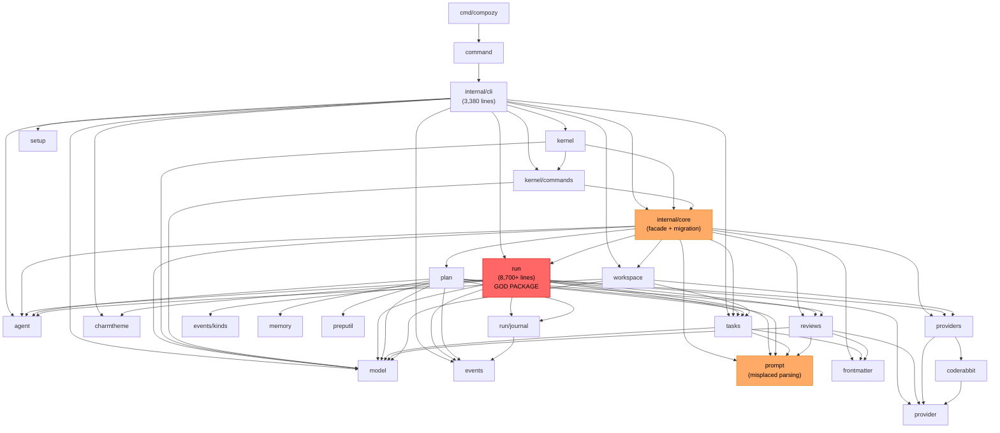

# Refactoring Analysis: Consolidated Summary

> **Date**: 2026-04-06
> **Scope**: Full codebase -- `internal/`, `pkg/`, `cmd/`, `command/`
> **Total production Go code**: ~24,700 lines across 60+ files
> **Analysis method**: 5 parallel subagent analyses using Martin Fowler's refactoring catalog

---

## Aggregate Findings

| Severity | CLI & Entry | Core Foundation | Agent & Run | Plan & Domain | Provider & Public | **Total** |
|----------|:-----------:|:---------------:|:-----------:|:-------------:|:-----------------:|:---------:|
| P0       | 0           | 2               | 4           | 3             | 2                 | **11**    |
| P1       | 5           | 5               | 7           | 8             | 6                 | **31**    |
| P2       | 7           | 6               | 8           | 9             | 9                 | **39**    |
| P3       | 5           | 5               | 6           | 4             | 5                 | **25**    |
| **Total**| **17**      | **18**          | **25**      | **24**        | **22**            | **106**   |

### Smell Distribution (Codebase-wide)

| Category              | Count | %   |
|-----------------------|-------|-----|
| Bloaters              | 28    | 26% |
| Change Preventers     | 18    | 17% |
| DRY Violations        | 31    | 29% |
| Dispensables          | 12    | 11% |
| Couplers              | 8     | 8%  |
| Conditional Complexity| 3     | 3%  |
| SOLID Violations      | 6     | 6%  |

**Key insight**: DRY violations (29%) and Bloaters (26%) dominate. The codebase has organically grown with copy-paste patterns that now create significant Shotgun Surgery risk.

---

## Top 10 Opportunities Ranked by Impact

| Rank | Finding | Source | Severity | Action | Impact | Effort |
|------|---------|--------|----------|--------|--------|--------|
| 1 | **God Package `internal/core/run`** -- 17 files, 8,700+ lines, 7+ responsibilities | G3-F1 | P0 | (B) | Eliminates the single largest maintenance risk; reduces coupling, cognitive load, merge conflicts | significant |
| 2 | **`prompt` package is a misplaced domain parsing layer** -- imported by 8+ packages for parsing, not prompts | G4-F01 | P0 | (B) | Fixes the biggest architectural inversion; relocates parsing to `tasks`/`reviews` where it belongs | moderate |
| 3 | **Massive duplication: `model/content.go` vs `kinds/session.go`** -- 450+ lines of near-identical type hierarchies | G5-F01 | P0 | (C) | Eliminates the largest single DRY violation; every new block type currently requires double maintenance | significant |
| 4 | **`execution.go` at 1,900 lines** -- mixes job lifecycle, shutdown, providers, retries, events | G3-F2 | P0 | (A)+(B) | De-risks the most dangerous file in the codebase; any change here currently has blast-radius across 7 domains | significant |
| 5 | **Triple config translation chain** -- `core.Config` -> `RuntimeFields` -> `RuntimeConfig` | G2-F2 | P0 | (B)/(D) | Adding one config field currently costs ~8 lines across 3 files; collapsing eliminates ~160 lines of mechanical copying | moderate |
| 6 | **Content-block model<->kinds conversion duplication** -- ~200 lines of mirrored switch statements | G3-F4 | P0 | (C) | Every new block type forces Shotgun Surgery across 2 files; single converter eliminates this | moderate |
| 7 | **`exec_flow.go` at 1,176 lines** -- separate execution mode (headless exec with persistence) mixed into batch package | G3-F3 | P0 | (B) | Isolates exec-mode's distinct lifecycle, persistence, and event contract from batch execution | moderate |
| 8 | **Duplicated `newPreparation`/`newJob` converters** -- already diverging (handlers.go drops `groups` field) | G2-F1 | P0 | (C) | Live bug vector: the two copies already differ; trivial to fix by exporting one canonical version | trivial |
| 9 | **Duplicated error wrappers** -- `wrapTaskParseError` and `wrapReviewParseError` copy-pasted across packages | G4-F02+F03 | P0 | (C) | Trivial fix that eliminates 2 copy-paste sites with divergence risk | trivial |
| 10 | **`root.go` at 1,190 lines with 6+ responsibilities** -- command construction, state, dispatch adapters, config building | G1-F1 | P1 | (A) | Reduces cognitive load in the CLI layer; enables parallel development on different concerns | moderate |

---

## All P0 Findings

| ID | Finding | Package | Action | Report |
|----|---------|---------|--------|--------|
| G3-F1 | God Package `run` (17 files, 8,700+ lines) | `internal/core/run` | (B) Package split | agent-run.md |
| G3-F2 | `execution.go` 1,900 lines, 5+ responsibilities | `internal/core/run` | (A)+(B) Split | agent-run.md |
| G3-F3 | `exec_flow.go` 1,176 lines, separate exec mode | `internal/core/run` | (B) Package split | agent-run.md |
| G3-F4 | Duplicated content-block conversion (model<->kinds) | `internal/core/run` | (C) Extraction | agent-run.md |
| G4-F01 | `prompt` is misplaced domain parsing layer | `internal/core/prompt` | (B) Package split | plan-domain.md |
| G4-F02 | Duplicated `wrapTaskParseError` | `plan` + `tasks` | (C) Extraction | plan-domain.md |
| G4-F03 | Duplicated `wrapReviewParseError` | `plan` + `reviews` | (C) Extraction | plan-domain.md |
| G2-F1 | Duplicated `newPreparation`/`newJob` (already diverging) | `core` + `kernel` | (C) Extraction | core-foundation.md |
| G2-F2 | Triple config translation chain (core->RuntimeFields->RuntimeConfig) | `core`, `kernel/commands` | (B)/(D) | core-foundation.md |
| G5-F01 | Massive DRY: `model/content.go` vs `kinds/session.go` (~450 lines duplicated across 2 files) | `model` + `events/kinds` | (C) Extraction | provider-public.md |
| G5-F02 | Dead code: `internal/version` never imported | `internal/version` | (D) Inline fix | provider-public.md |

---

## Architectural Recommendations

### Packages That Should Be CREATED

| New Package | Source Material | Rationale |
|-------------|----------------|-----------|
| `internal/core/run/executor/` | `execution.go` (lifecycle, shutdown, retry, session) | Isolate batch execution engine from TUI and exec-mode |
| `internal/core/run/exec/` | `exec_flow.go` (state machine, persistence, resume) | Exec-mode is a distinct bounded context with its own lifecycle |
| `internal/core/run/ui/` | `ui_model.go`, `ui_view.go`, `ui_update.go`, `ui_layout.go`, `ui_styles.go`, `validation_form.go` | TUI rendering changes independently from execution logic |
| `internal/core/run/transcript/` | `session_view_model.go`, render_blocks from `logging.go` | Transcript model is consumed by both UI and logging |
| `internal/core/contentconv/` | `events.go` (model<->kinds conversion), shared with `ui_model.go` | Single source of truth for bidirectional content-block conversion |
| `internal/core/migration/` | `migrate.go` (426 lines of V1-to-V2 format conversion) | Migration is implementation detail that pollutes the `core` facade |

### Packages That Should Be SPLIT

| Current Package | Proposed Split | Rationale |
|-----------------|---------------|-----------|
| `internal/core/run` (17 production files) | `run/`, `run/executor/`, `run/exec/`, `run/ui/`, `run/transcript/` | God Package with 7+ distinct responsibilities |
| `internal/core/prompt` | Keep prompt-building only; move parsing to `tasks`/`reviews` | Misplaced domain parsing layer creates inverted dependencies |
| `internal/core` (root) | Extract `migration/` sub-package from `migrate.go` | Core facade should be thin; 426-line migration logic belongs elsewhere |

### Packages That Should Be MERGED

| Candidates | Recommendation | Rationale |
|------------|---------------|-----------|
| `internal/core/providers` (13 lines) | Rename to `providerdefaults` or inline `DefaultRegistry()` into call sites | Confusingly similar naming with `provider`; only 3 callers |
| `internal/core/preputil` (40 lines) | Fold into `plan` package | Single-function package adds navigational overhead; only consumer is `plan` |

### Domain Concepts Mapped to Packages

| Domain Concept | Current State | Proposed State |
|----------------|---------------|----------------|
| Task parsing & metadata | Scattered: `prompt/common.go`, `tasks/store.go`, `plan/input.go` | **Consolidated in `tasks/`** -- owns `ParseTaskFile`, sentinels, error wrappers |
| Review parsing & metadata | Scattered: `prompt/common.go`, `reviews/store.go`, `run/execution.go`, `migrate.go` | **Consolidated in `reviews/`** -- owns `ParseReviewContext`, sentinels, error wrappers |
| Content blocks | Duplicated: `model/content.go` + `kinds/session.go` | **Single engine** in shared package, parameterized by JSON tag strategy |
| Batch execution | Monolith: `run/execution.go` | **`run/executor/`** -- lifecycle, shutdown, retry |
| Exec-mode (headless) | Mixed: `run/exec_flow.go` | **`run/exec/`** -- state machine, persistence, events |
| TUI rendering | Mixed: 7 `ui_*` files in `run/` | **`run/ui/`** -- all Bubble Tea components |
| Config translation | Triple chain: `core.Config` -> `RuntimeFields` -> `RuntimeConfig` | **Single path**: embed `RuntimeFields` in `core.Config` or accept `RuntimeConfig` directly |

---

## Current Dependency Diagram

## Proposed Dependency Diagram (After Recommendations)

```mermaid
graph TD
    CMD["cmd/compozy"] --> COMMAND["command"]
    COMMAND --> CLI["internal/cli<br/>(split files)"]
    
    CLI --> CORE["internal/core<br/>(thin facade)"]
    CLI --> KERNEL["kernel"]
    CLI --> COMMANDS["kernel/commands"]
    CLI --> AGENT["agent"]
    CLI --> WORKSPACE["workspace"]
    CLI --> RUNFACADE["run/<br/>(thin facade)"]
    CLI --> TASKS["tasks<br/>(owns parsing)"]
    CLI --> MODEL["model<br/>(split files)"]
    CLI --> SETUP["setup"]
    CLI --> EVENTS["events"]
    CLI --> CHARMTHEME["charmtheme"]
    
    CORE --> MODEL
    CORE --> PLAN["plan<br/>(reduced coupling)"]
    CORE --> RUNFACADE
    CORE --> AGENT
    CORE --> REVIEWS["reviews<br/>(owns parsing)"]
    CORE --> TASKS
    CORE --> PROMPT["prompt<br/>(only builds)"]
    CORE --> WORKSPACE
    CORE --> FRONTMATTER["frontmatter"]
    CORE --> PROVDEFAULTS["provider defaults"]
    
    KERNEL --> MODEL
    KERNEL --> COMMANDS
    COMMANDS --> MODEL
    
    RUNFACADE --> EXECUTOR["run/executor/"]
    RUNFACADE --> EXEC["run/exec/"]
    RUNFACADE --> UI["run/ui/"]
    RUNFACADE --> TRANSCRIPT["run/transcript/"]
    RUNFACADE --> MODEL
    
    EXECUTOR --> AGENT
    EXECUTOR --> JOURNAL["run/journal"]
    EXECUTOR --> MODEL
    EXECUTOR --> CONTENTCONV["contentconv"]
    EXECUTOR --> PROVIDER["provider"]
    EXECUTOR --> REVIEWS
    EXECUTOR --> TASKS
    EXECUTOR --> EVENTS
    EXECUTOR --> KINDS["events/kinds"]
    
    EXEC --> MODEL
    EXEC --> AGENT
    EXEC --> JOURNAL
    EXEC --> EVENTS
    
    UI --> MODEL
    UI --> TRANSCRIPT
    UI --> CONTENTCONV
    UI --> CHARMTHEME
    
    TRANSCRIPT --> MODEL
    TRANSCRIPT --> KINDS
    
    CONTENTCONV --> MODEL
    CONTENTCONV --> KINDS
    
    MIGRATION["migration/"] --> TASKS
    MIGRATION --> REVIEWS
    MIGRATION --> FRONTMATTER
    MIGRATION --> MODEL
    CORE --> MIGRATION
    
    PLAN --> MEMORY["memory"]
    PLAN --> MODEL
    PLAN --> PROMPT
    PLAN --> REVIEWS
    PLAN --> TASKS
    PLAN --> JOURNAL
    PLAN --> EVENTS
    
    TASKS --> FRONTMATTER
    TASKS --> MODEL
    
    REVIEWS --> FRONTMATTER
    REVIEWS --> MODEL
    REVIEWS --> PROVIDER
    
    PROVDEFAULTS --> PROVIDER
    PROVDEFAULTS --> CODERABBIT["coderabbit"]
    CODERABBIT --> PROVIDER
    
    JOURNAL --> EVENTS
    
    WORKSPACE --> AGENT
    WORKSPACE --> MODEL
    WORKSPACE --> PROVDEFAULTS
    WORKSPACE --> TASKS

    style RUNFACADE fill:#66cc66,stroke:#009900,color:#000
    style EXECUTOR fill:#66cc66,stroke:#009900,color:#000
    style EXEC fill:#66cc66,stroke:#009900,color:#000
    style UI fill:#66cc66,stroke:#009900,color:#000
    style TRANSCRIPT fill:#66cc66,stroke:#009900,color:#000
    style CONTENTCONV fill:#66cc66,stroke:#009900,color:#000
    style MIGRATION fill:#66cc66,stroke:#009900,color:#000
    style TASKS fill:#66aaff,stroke:#0066cc,color:#000
    style REVIEWS fill:#66aaff,stroke:#0066cc,color:#000
    style PROMPT fill:#66aaff,stroke:#0066cc,color:#000
```

**Key changes visible in the proposed diagram:**
- `run/` decomposed into `run/executor/`, `run/exec/`, `run/ui/`, `run/transcript/`
- `prompt` no longer depended on by `tasks`, `reviews`, or `plan` for parsing
- `commands` no longer imports `core` (uses `model` types instead)
- `kernel` no longer imports `core` (uses `model` types instead)
- New `contentconv` package eliminates model<->kinds duplication
- New `migration/` sub-package extracted from `core`
- `providers` naming clarified (rename or inline default registry wiring)
- `preputil` absorbed into `plan`

---

## Phased Execution Roadmap

### Phase 0: Trivial Quick Wins (1-2 days)

Zero-risk changes that reduce noise and set the stage for structural work.

| # | Action | Files | Effort | Finding |
|---|--------|-------|--------|---------|
| 1 | Delete duplicate `newPreparation`/`newJob` in `handlers.go`, reuse `core` version | `kernel/handlers.go` | 15 min | G2-F1 |
| 2 | Consolidate `wrapTaskParseError` into `tasks` package | `plan/input.go`, `tasks/store.go` | 15 min | G4-F02 |
| 3 | Consolidate `wrapReviewParseError` into `reviews` package | `plan/input.go`, `reviews/store.go` | 15 min | G4-F03 |
| 4 | Hoist 9+ `regexp.MustCompile` calls to package-level vars | `prompt/common.go`, `plan/input.go` | 20 min | G4-F07 |
| 5 | Replace `reflect.DeepEqual` with `slices.Equal` | `cli/root.go:1027` | 5 min | G1-F10 |
| 6 | Remove duplicate `clampInt`, use `clamp` everywhere | `run/validation_form.go` | 5 min | G3-F14 |
| 7 | Consolidate `copyJSON`/`copyJSONPayload` | `run/events.go`, `run/session_view_model.go` | 5 min | G3-F24 |
| 8 | Remove unused params from `notifyJobStart` | `run/command_io.go` | 5 min | G3-F18 |
| 9 | Wire `internal/version` import or document linker-only usage | `cmd/compozy/main.go` | 15 min | G5-F02 |
| 10 | Fix `mustReadTemplate` to panic on missing embedded template | `prompt/templates.go` | 5 min | G4-F20 |
| 11 | Replace `fmt.Println` with `slog.Info` in `plan/input.go` | `plan/input.go` | 10 min | G4-F08 |
| 12 | Add `job.codeFileLabel()` method, replace 9+ `strings.Join` calls | `run/execution.go`, `run/command_io.go` | 20 min | G3-F13 |
| 13 | Extract `ShutdownBase` embedded struct | `events/kinds/shutdown.go` | 5 min | G5-F05 |
| 14 | Extract `JobAttemptInfo` embedded struct | `events/kinds/job.go` | 10 min | G5-F06 |
| 15 | Merge `groupIssues` into `groupIssuesByCodeFile` | `plan/input.go`, `plan/prepare.go` | 10 min | G4-F11 |

### Phase 1: File-Level Splits (3-5 days)

Safe refactors within existing packages -- no import path changes, no API changes.

| # | Action | Target | Effort | Finding |
|---|--------|--------|--------|---------|
| 1 | Split `root.go` (1,190 lines) into 5 focused files | `internal/cli/` | 2h | G1-F1 |
| 2 | Split `execution.go` (1,900 lines) into lifecycle/shutdown/runner/session/hooks | `run/` | 3h | G3-F2 |
| 3 | Split `types.go` (380 lines) into config/exec_types/ui_types/shutdown_types | `run/` | 1h | G3-F7 |
| 4 | Split `ui_view.go` (1,034 lines) into sidebar/timeline/summary | `run/` | 2h | G3-F9 |
| 5 | Split `session.go` (728 lines) into session + acp_convert | `agent/` | 1h | G3-F5 |
| 6 | Split `tool_call_format.go` (733 lines) into name + input normalization | `agent/` | 1h | G3-F6 |
| 7 | Split `model.go` (370 lines) into constants/runtime_config/paths/artifacts/task_review | `model/` | 1h | G2-F3 |
| 8 | Defer `common.go` split until after Phase 2 parsing relocation | `prompt/` | 1h | G4-F06 |
| 9 | Split `registry.go` (868 lines) into specs/validate/launch | `agent/` | 1h | G3-F12 |
| 10 | Rename `logging.go` to `session_handler.go`, extract `render_blocks.go` | `run/` | 30min | G3-F8 |
| 11 | Split `workspace/config.go` into types/validate/config | `workspace/` | 30min | G4-F14 |
| 12 | Split `run.go` (451 lines) into run/replay/status | `pkg/compozy/runs/` | 1h | G5-F08 |
| 13 | Split `session.go` (449 lines) into content_block + session | `events/kinds/` | 1h | G5-F14 |

### Phase 2: Domain Restructuring (1-2 weeks)

Relocate parsing logic to correct domain packages, break architectural inversions.

| # | Action | Effort | Finding |
|---|--------|--------|---------|
| 1 | Move task parsing (`ParseTaskFile`, `IsTaskCompleted`, `ExtractTaskNumber`, sentinels) from `prompt` to `tasks` | 4h | G4-F01 |
| 2 | Move review parsing (`ParseReviewContext`, `IsReviewResolved`, `ExtractIssueNumber`, sentinels) from `prompt` to `reviews` | 4h | G4-F01 |
| 3 | Move result/config types (`FetchResult`, `SyncConfig`, `MigrationConfig`, etc.) from `core` to `model` | 4h | G2-F6, G2-F13 |
| 4 | Break `commands` -> `core` upward dependency (use `model` types) | 2h | G2-F13 |
| 5 | Break `kernel` -> `core` dependency in `operations` interface | 2h | G2-F6 |
| 6 | Extract shared `resolveWorkflowTarget` helper from sync/archive/migrate | 2h | G2-F9, G2-F10 |
| 7 | Extract shared task file walker into `tasks` | 2h | G4-F09 |
| 8 | Fold `preputil` into `plan` | 30min | G4-F21 |
| 9 | Clarify `providers`/`provider` naming by renaming to a clearer package or inlining `DefaultRegistry()` | 30min | G5-F09 |
| 10 | Split the remaining prompt-only portion of `common.go` after parsing relocation | 1h | G4-F06 |

### Phase 3: Package-Level Splits (2-3 weeks)

Major structural changes -- extract new packages from monoliths.

| # | Action | Effort | Finding |
|---|--------|--------|---------|
| 1 | Extract `internal/core/run/exec/` from `exec_flow.go` | 1-2 days | G3-F3 |
| 2 | Extract `internal/core/run/ui/` from UI files | 1-2 days | G3-F1 |
| 3 | Extract `internal/core/run/executor/` from `execution.go` | 2-3 days | G3-F1, G3-F2 |
| 4 | Extract `internal/core/run/transcript/` from session_view_model + render_blocks | 1 day | G3-F1 |
| 5 | Create `internal/core/contentconv/` for bidirectional model<->kinds conversion | 1 day | G3-F4 |
| 6 | Extract `internal/core/migration/` from `core/migrate.go` | 1 day | G2-F8 |

### Phase 4: DRY & Generics Consolidation (1 week)

Leverage Go generics and shared abstractions to eliminate remaining duplication.

| # | Action | Effort | Finding |
|---|--------|--------|---------|
| 1 | Unify `model/content.go` and `kinds/session.go` via shared generic engine | 4-8h | G5-F01 |
| 2 | Generic `applyConfig[T]` replacing 9 type-specific functions | 1h | G1-F4 |
| 3 | Generic `decodeBlock[T]` replacing 6 decode functions in `content.go` | 1h | G2-F4 |
| 4 | Generic dispatch adapter in `core_adapters.go` | 1h | G2-F5 |
| 5 | Generic delegating handler for thin kernel handlers | 1h | G2-F7 |
| 6 | Collapse triple config translation chain | 4h | G2-F2 |
| 7 | Extract `simpleCommandBase` for migrate/sync/archive CLI states | 2h | G1-F2 |
| 8 | Replace agent spec closures with declarative table | 2h | G5-F03 |
| 9 | Extract generic `selectByName[T]` for skills/agents | 1h | G5-F12 |
| 10 | Introduce `SessionSetupRequest` parameter object | 1h | G3-F10, G3-F11 |
| 11 | Extract sub-structs for `commandState` (30+ fields) | 3h | G1-F3 |

---

## Cross-Report Correlations

Several findings from different reports describe the same systemic issue:

| Systemic Issue | Reports | Impact |
|----------------|---------|--------|
| **Content block type duplication** | G3-F4 (model<->kinds conversion), G5-F01 (identical type hierarchies), G2-F4 (repeated decode functions) | Any new block type requires changes in 4+ locations |
| **Domain parsing in wrong package** | G4-F01 (prompt owns parsing), G4-F02/F03 (error wrappers duplicated because parsing is elsewhere) | 8+ packages depend on `prompt` for non-prompt concerns |
| **Config translation bloat** | G2-F2 (triple chain), G1-F3 (commandState 30+ fields), G1-F7 (buildConfig field-by-field copy) | New config field = ~12 lines of mechanical copying |
| **Target resolution duplication** | G2-F9 (sync/archive targets), G2-F10 (migrate targets), G1-F2 (CLI simple command states) | Three operations share identical resolve-path-stat-verify logic |
| **`run` package overload** | G3-F1 (god package), G3-F2 (execution.go), G3-F3 (exec_flow.go), G3-F7 (types.go), G3-F8 (logging.go), G3-F9 (ui_view.go) | Every change to any execution concern risks all others |

---

## Verification Checklist

The following claims will be verified by the verification subagent:

- [ ] Total finding counts per report match stated totals
- [ ] P0 findings are correctly classified
- [ ] File line counts match actual files
- [ ] Function locations referenced in findings exist at stated lines
- [ ] No contradictions between reports (e.g., same code flagged differently)
- [ ] Proposed package structure doesn't introduce circular dependencies
- [ ] All files mentioned in findings exist in the codebase
- [ ] Duplication claims can be verified by comparing the referenced code sections

---

## Individual Report References

| Report | File | Findings |
|--------|------|----------|
| CLI & Entry | [`20260406-cli-entry.md`](20260406-cli-entry.md) | 17 |
| Core Foundation | [`20260406-core-foundation.md`](20260406-core-foundation.md) | 18 |
| Agent & Run | [`20260406-agent-run.md`](20260406-agent-run.md) | 25 |
| Plan & Domain | [`20260406-plan-domain.md`](20260406-plan-domain.md) | 24 |
| Provider & Public | [`20260406-provider-public.md`](20260406-provider-public.md) | 22 |
