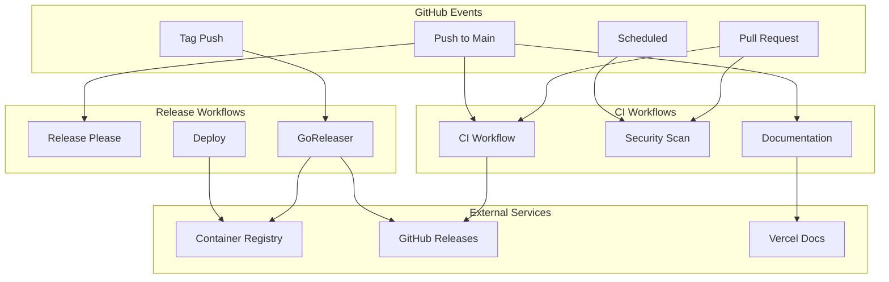

# GitHub Actions Integration Design Document

## Overview

This design document outlines the comprehensive GitHub Actions CI/CD integration for the Compozy workflow orchestration engine. The solution provides automated testing, security scanning, multi-platform releases, and deployment automation while leveraging existing build infrastructure and maintaining developer productivity.

The design follows modern CI/CD best practices with separate workflows for continuous integration and continuous deployment, optimized for monorepo structures, and integrated with release-please and goreleaser for automated semantic releases.

## Architecture

### High-Level Architecture



### Workflow Structure

The CI/CD system consists of five main workflows:

1. **CI Workflow** (`ci.yml`) - Runs on pull requests and pushes
2. **Security Workflow** (`security.yml`) - Runs on schedule and pull requests
3. **Release Please Workflow** (`release-please.yml`) - Manages semantic releases
4. **Release Workflow** (`release.yml`) - Builds and publishes releases
5. **Documentation Workflow** (`docs.yml`) - Updates and deploys documentation

## Components and Interfaces

### 1. Continuous Integration Workflow

**Purpose:** Automated testing, linting, and quality checks for every code change.

**Triggers:**

- Pull requests to main branch
- Pushes to main branch
- Manual dispatch

**Jobs:**

- **Path Detection:** Determines which components changed using `dorny/paths-filter`
- **Go Backend:** Tests Go code with service dependencies
- **Frontend:** Tests TypeScript/Node.js components
- **Integration:** End-to-end testing with full stack

**Service Dependencies:**

```yaml
services:
  postgres:
    image: postgres:15-alpine
    env:
      POSTGRES_PASSWORD: postgres
      POSTGRES_DB: compozy_test
    options: >-
      --health-cmd pg_isready
      --health-interval 10s
      --health-timeout 5s
      --health-retries 5

  redis:
    image: redis:7.2-alpine
    options: >-
      --health-cmd "redis-cli ping"
      --health-interval 10s
      --health-timeout 5s
      --health-retries 5
```

**Caching Strategy:**

- Go module cache: `~/.cache/go-build` and `~/go/pkg/mod`
- Bun cache: `~/.bun/install/cache`
- Docker layer cache for container builds

### 2. Security Scanning Workflow

**Purpose:** Automated security vulnerability detection and dependency management.

**Components:**

- **Dependency Scanning:** Uses `govulncheck` for Go vulnerabilities
- **Container Scanning:** Uses `trivy` for container image vulnerabilities
- **SBOM Generation:** Creates Software Bill of Materials for releases
- **License Compliance:** Scans for license compatibility issues

**Integration Points:**

- Dependabot for automated dependency updates
- GitHub Security Advisories for vulnerability alerts
- CodeQL for static analysis security testing

### 3. Release Management System

**Release Please Integration:**

```yaml
name: Release Please
on:
  push:
    branches: [main]
jobs:
  release-please:
    runs-on: ubuntu-latest
    steps:
      - uses: google-github-actions/release-please-action@v4
        with:
          release-type: go
          package-name: compozy
```

**GoReleaser Configuration:**

```yaml
# .goreleaser.yml
project_name: compozy
builds:
  - env: [CGO_ENABLED=0]
    goos: [linux, darwin, windows]
    goarch: [amd64, arm64]
    ldflags:
      - -s -w
      - -X github.com/compozy/compozy/engine/infra/monitoring.Version={{.Version}}
      - -X github.com/compozy/compozy/engine/infra/monitoring.CommitHash={{.ShortCommit}}

dockers:
  - image_templates:
      - "ghcr.io/compozy/compozy:{{ .Tag }}"
      - "ghcr.io/compozy/compozy:latest"
    dockerfile: ./cluster/Dockerfile.release
```

### 4. Container Image Management

**GitHub Container Registry Integration:**

- Multi-architecture builds (amd64, arm64)
- Automated image signing with cosign
- SLSA provenance attestation
- Image vulnerability scanning with Trivy

**Container Images:**

- **Main Application:** `ghcr.io/compozy/compozy`
- **MCP Proxy:** `ghcr.io/compozy/mcp-proxy`

**Tagging Strategy:**

- `latest` - Latest stable release
- `v{version}` - Specific version tags
- `{branch}` - Branch-specific builds
- `{commit}` - Commit-specific builds

### 5. Documentation Automation

**Components:**

- **Swagger Generation:** Automated OpenAPI spec updates
- **Schema Generation:** JSON schema updates from Go structs
- **Documentation Site:** Automated deployment to Vercel
- **Release Notes:** Automated changelog generation

**Integration:**

- Leverages existing `make swagger` and `make schemagen` targets
- Deploys documentation site using Vercel
- Updates documentation on every main branch push

### 6. Monitoring and Observability

**Metrics Collection:**

- Workflow duration and success rates
- Test execution times and flakiness
- Build artifact sizes and performance
- Security scan results and trends

**Alerting:**

- Failed workflows notify maintainers
- Security vulnerabilities trigger immediate alerts
- Performance degradation warnings
- Dependency update notifications

## Data Models

### Workflow Configuration Schema

```yaml
# Common workflow structure
name: string
on:
  pull_request:
    branches: [main]
    paths: [string]
  push:
    branches: [main]
    tags: [string]
  schedule:
    - cron: string

jobs:
  job_name:
    runs-on: string
    strategy:
      matrix:
        go-version: [string]
        os: [string]
    steps:
      - name: string
        uses: string
        with:
          key: value
        env:
          KEY: value
```

### Release Configuration

```yaml
# Release Please configuration
release-type: go
package-name: compozy
changelog-sections:
  - type: feat
    section: Features
  - type: fix
    section: Bug Fixes
  - type: chore
    section: Miscellaneous
```

### Security Policy

```yaml
# Security scanning configuration
vulnerability-check:
  go-version: "1.24"
  fail-on: critical
  ignore:
    - CVE-XXXX-XXXX # With justification

container-scan:
  severity: HIGH,CRITICAL
  exit-code: 1
  format: sarif
```

## Error Handling

### Failure Recovery Strategies

1. **Transient Failures:**
   - Automatic retry with exponential backoff
   - Service dependency health checks
   - Network timeout handling

2. **Build Failures:**
   - Clear error reporting with actionable messages
   - Artifact preservation for debugging
   - Rollback mechanisms for deployments

3. **Security Failures:**
   - Immediate workflow termination for critical vulnerabilities
   - Notification to security team
   - Automated issue creation for tracking

### Monitoring and Alerting

```yaml
# Workflow failure notification
- name: Notify on Failure
  if: failure()
  uses: 8398a7/action-slack@v3
  with:
    status: failure
    webhook_url: ${{ secrets.SLACK_WEBHOOK }}
```

## Testing Strategy

### Unit Testing

- Leverages existing `make test` target
- Runs Go unit tests with race detection
- Frontend unit tests with Jest/Vitest
- Coverage reporting with codecov integration

### Integration Testing

- Uses testcontainers for database testing
- Full service stack testing with Docker Compose
- API endpoint testing with real dependencies
- End-to-end workflow testing

### Security Testing

- Static analysis with CodeQL
- Dependency vulnerability scanning
- Container image security scanning
- License compliance checking

### Performance Testing

- Build time optimization tracking
- Binary size monitoring
- Container image size optimization
- Workflow execution time tracking

## Implementation Phases

### Phase 1: Foundation (Week 1-2)

- Basic CI workflow with Go testing
- Path-based filtering for monorepo
- Essential security scanning
- Branch protection rules

### Phase 2: Release Automation (Week 3-4)

- Release Please integration
- GoReleaser configuration
- Multi-platform binary builds
- Container image publishing

### Phase 3: Advanced Features (Week 5-6)

- Documentation automation
- Advanced security scanning
- Performance monitoring
- Deployment automation

### Phase 4: Optimization (Week 7-8)

- Workflow optimization and caching
- Advanced monitoring and alerting
- Integration with external tools
- Documentation and training

## Security Considerations

### Access Control

- Minimal required permissions for workflows
- Secure secret management
- Environment-specific access controls
- Audit logging for sensitive operations

### Supply Chain Security

- Pinned action versions with SHA hashes
- SBOM generation for all releases
- Dependency vulnerability scanning
- Container image signing with cosign

### Data Protection

- No sensitive data in logs
- Secure artifact storage
- Encrypted communication channels
- Compliance with security policies

## Performance Optimization

### Caching Strategy

- Multi-level caching for dependencies
- Docker layer caching for images
- Artifact caching between jobs
- Incremental builds where possible

### Parallelization

- Matrix builds for multiple platforms
- Parallel job execution
- Concurrent testing strategies
- Optimized resource utilization

### Resource Management

- Appropriate runner sizing
- Efficient resource allocation
- Cost optimization strategies
- Usage monitoring and reporting
