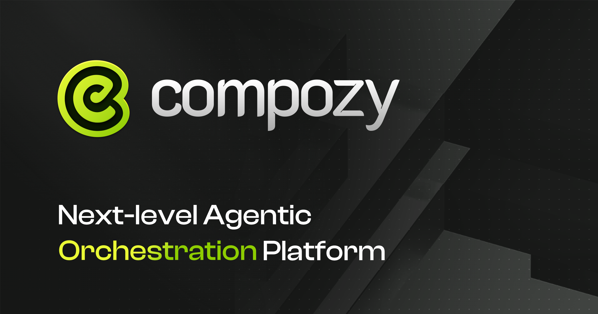

<div align="center">
  
  <br>
  <br>
  <p>
    <a href="https://github.com/compozy/compozy/actions/workflows/ci.yml">
      
    </a>
    <a href="https://pkg.go.dev/github.com/compozy/compozy">
      
    </a>
  </p>
</div>

> [!WARNING]
> ✨ Alpha Release is Here! This project is currently in alpha. Please use with caution, as it may contain bugs and undergo significant changes.

## Next-level Agentic Orchestration Platform

**Compozy** orchestrates multi-agent AI systems with ease. Compozy's enterprise-grade platform uses declarative YAML to deliver scalable, reliable, and cost-efficient distributed workflows, simplifying complex fan-outs, debugging, and monitoring for production-ready automation.

## ✨ Key Features

- **Declarative Workflows**: Define complex AI workflows with simple, human-readable YAML.
- **Developer-Focused**: A comprehensive CLI with hot-reloading for a seamless development experience.
- **Advanced Task Orchestration**: 8 powerful task types including parallel, sequential, and conditional execution.
- **Extensible Tools**: Write custom tools in TypeScript/JavaScript to extend agent capabilities.
- **Multi-Model Support**: Integrates with 7+ LLM providers like OpenAI, Anthropic, Google, and local models.
- **Enterprise-Ready**: With Temporal behind the scenes, Compozy is built for production with persistence, monitoring, and security features.
- **High Performance**: Built with Go at its core, Compozy delivers exceptional speed and efficiency.
- **Multi-Model Support**: Integrates with 7+ LLM providers like OpenAI, Anthropic, Google, and local models.

## 🚀 Getting Started

Get up and running with Compozy in just a few minutes.

### Install via Homebrew (macOS/Linux)

```bash
brew tap compozy/homebrew-compozy
brew install compozy
```

### Install via NPM

```bash
npm install -g @compozy/cli
# Or with Yarn
yarn global add @compozy/cli
# Or with pnpm
pnpm add -g @compozy/cli
```

### Quick Start

```bash
# Create a new project
compozy init my-ai-app
cd my-ai-app

# Start the development server
compozy dev
```

For a complete walkthrough, check out our [**Quick Start Guide**](./docs/content/docs/core/getting-started/quick-start.mdx).

## 📚 Documentation

Our documentation website is the best place to find comprehensive information, tutorials, and API references.

| Section                                                                             | Description                                      |
| ----------------------------------------------------------------------------------- | ------------------------------------------------ |
| 🚀 **[Getting Started](./docs/content/docs/core/getting-started/installation.mdx)** | Installation, setup, and your first workflow     |
| 🛠️ **[Configuration](./docs/content/docs/core/configuration/project-setup.mdx)**    | Project, runtime, and provider configuration     |
| 🎨 **[Template Engine](./docs/content/docs/core/yaml-templates/overview.mdx)**      | Dynamic YAML configuration with templating       |
| 🤖 **[Agents](./docs/content/docs/core/agents/overview.mdx)**                       | Building and configuring AI agents               |
| ⚙️ **[Tasks](./docs/content/docs/core/tasks/overview.mdx)**                         | Orchestrating operations with various task types |
| 🔧 **[Tools](./docs/content/docs/core/tools/overview.mdx)**                         | Extending agent capabilities with custom tools   |
| 🧠 **[Memory & Context](./docs/content/docs/core/memory/overview.mdx)**             | Managing agent memory and conversation context   |
| 🔌 **[MCP Integration](./docs/content/docs/core/mcp/overview.mdx)**                 | Model Context Protocol for external tool servers |
| 📡 **[Signal System](./docs/content/docs/core/signals/overview.mdx)**               | Event-driven communication between components    |
| 🚀 **[Deployment](./docs/content/docs/core/deployment/docker.mdx)**                 | Deploy Compozy to production environments        |
| 💻 **[CLI Reference](./docs/content/docs/cli/overview.mdx)**                        | Command-line interface reference                 |
| 📋 **[Schema Definition](./docs/content/docs/schema/project.mdx)**                  | YAML schema definitions for all components       |
| 🔌 **[API Reference](./docs/content/docs/api/overview.mdx)**                        | REST API for programmatic access                 |

**[➡️ Explore the full documentation](./docs/content/docs/core/index.mdx)**

## 🤝 Community & Contributing

We welcome contributions from the community! Whether it's reporting a bug, suggesting a feature, or submitting a pull request, your input is valuable.

- **[GitHub Issues](https://github.com/compozy/compozy/issues)**: Report bugs and request features.
- **[Contributing Guide](./CONTRIBUTING.md)**: Learn how to contribute to the project.

---

## 🔐 License

This project is licensed under the Business Source License 1.1 (BUSL-1.1). See the [LICENSE](LICENSE) file for details.

<p align="center">Made with ❤️ by the Compozy Team</p>
