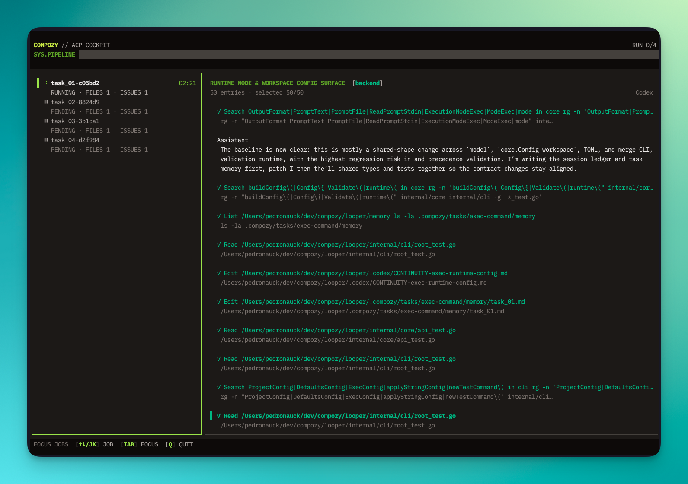
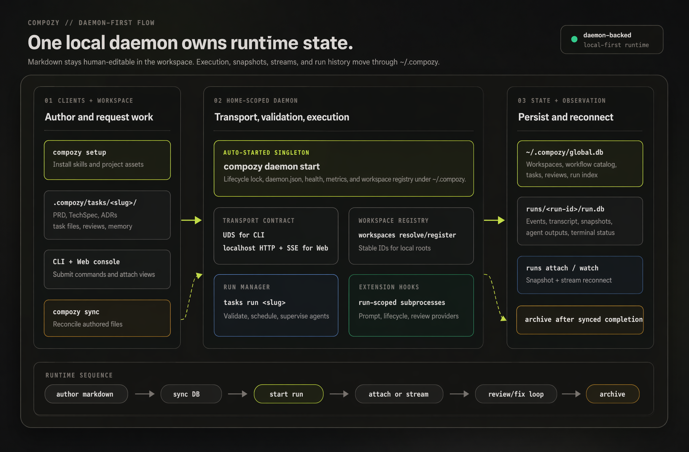

<div align="center">
  <h1>Compozy</h1>
  <p><strong>Orchestrate AI coding agents from idea to shipped code — in a single pipeline.</strong></p>
  <p>
    <a href="https://github.com/compozy/compozy/actions/workflows/ci.yml">
      
    </a>
    <a href="https://pkg.go.dev/github.com/compozy/compozy">
      
    </a>
    <a href="https://goreportcard.com/report/github.com/compozy/compozy">
      
    </a>
    <a href="LICENSE">
      
    </a>
    <a href="https://github.com/compozy/compozy/releases">
      
    </a>
  </p>
</div>

One CLI to replace scattered prompts, manual task tracking, and copy-paste review cycles. Compozy drives the full lifecycle of AI-assisted development: product ideation, technical specification, task breakdown with codebase-informed enrichment, concurrent execution across agents, and automated PR review remediation.

<div align="center">
  
</div>

## ✨ Highlights

- **One command, 40+ agents.** Install bundled skills into Claude Code, Codex, Cursor, Droid, OpenCode, Pi, Gemini, and 40+ other agents and editors with `compozy setup`.
- **Idea to code in a structured pipeline.** Optional Issue → PRD → TechSpec → Tasks → Execution → Review. Each phase produces plain markdown artifacts that feed into the next. Start from an issue for full research and debate, or jump straight to PRD if you already have a clear scope.
- **Codebase-aware enrichment.** Tasks aren't generic prompts. Compozy spawns parallel agents to explore your codebase, discover patterns, and ground every task in real project context.
- **Multi-agent execution.** Run tasks through ACP-capable runtimes like Claude Code, Codex, Cursor, Droid, OpenCode, Pi, or Gemini — just change `--ide`. Concurrent batch processing with configurable timeouts, retries, and exponential backoff, all with a live terminal UI.
- **Workflow memory between runs.** Agents inherit context from every previous task — decisions, learnings, errors, and handoffs. Two-tier markdown memory with automatic compaction keeps context fresh without manual bookkeeping.
- **Provider-agnostic reviews.** Fetch review comments from CodeRabbit, GitHub, or run AI-powered reviews internally. All normalize to the same format. Provider threads resolve automatically after fixes.
- **Markdown everywhere.** PRDs, specs, tasks, reviews, and ADRs are human-readable markdown files. Version-controlled, diffable, editable between steps. No vendor lock-in.
- **Frontmatter for machine-readable metadata.** Tasks and review issues keep parseable metadata in standard YAML frontmatter instead of custom XML tags.
- **Single binary, local-first.** Compiles to one Go binary with zero runtime dependencies. Your code and data stay on your machine.
- **Embeddable.** Use as a standalone CLI or import as a Go package into your own tools.

## 📦 Installation

#### Homebrew

```bash
brew tap compozy/compozy
brew install --cask compozy
```

#### NPM

```bash
npm install -g @compozy/cli
```

#### Go

```bash
go install github.com/compozy/compozy/cmd/compozy@latest
```

#### From Source

```bash
git clone git@github.com:compozy/compozy.git
cd compozy && make verify && go build ./cmd/compozy
```

Then install bundled skills into your AI agents:

```bash
compozy setup          # interactive — pick agents and skills
compozy setup --all    # install everything to every detected agent
```

Execution runtimes are separate from skill installation. To run `compozy start` or `compozy fix-reviews`, install an ACP-capable runtime or adapter on `PATH` for the `--ide` you choose:

| Runtime      | `--ide` flag   | Expected ACP command             |
| ------------ | -------------- | -------------------------------- |
| Claude Agent | `claude`       | `claude-agent-acp`               |
| Codex CLI    | `codex`        | `codex-acp`                      |
| Cursor       | `cursor-agent` | `cursor-agent acp`               |
| Droid        | `droid`        | `droid exec --output-format acp` |
| OpenCode     | `opencode`     | `opencode acp`                   |
| pi ACP       | `pi`           | `pi-acp`                         |
| Gemini CLI   | `gemini`       | `gemini --acp`                   |

When the direct ACP command is not installed, Compozy can also fall back to supported launchers such as `npx @zed-industries/codex-acp` when the launcher is available locally.

## 🔄 How It Works

<div align="center">
  
</div>

Every artifact is a plain markdown file in `.compozy/tasks/<name>/`. You can read, edit, or version-control any of them between steps.

Task and review issue files use YAML frontmatter for parseable metadata such as `status`, `domain`, `severity`, and `provider_ref`. Task workflow `_meta.md` files can be refreshed explicitly with `compozy sync`. Fully completed workflows can be moved out of the active task root with `compozy archive`. If you have an older project with XML-tagged artifacts, run `compozy migrate` once before using `start` or `fix-reviews`.

## ⚙️ Workspace Config

Compozy can load project defaults from `.compozy/config.toml`.

- The CLI discovers the nearest `.compozy/` directory by walking upward from the current working directory.
- If `.compozy/config.toml` exists, Compozy loads it once at command startup.
- Interactive forms for `compozy start`, `compozy fix-reviews`, and `compozy fetch-reviews` are prefilled from the resolved config.
- Explicit CLI flags always win over config values.

Precedence is:

```text
explicit flags > command section > [defaults] > built-in defaults
```

Example:

```toml
[defaults]
ide = "codex"
model = "gpt-5.4"
reasoning_effort = "medium"
timeout = "10m"
tail_lines = 0
add_dirs = ["../shared"]
auto_commit = false
max_retries = 0
retry_backoff_multiplier = 1.5

[start]
include_completed = false

[fix_reviews]
concurrent = 2
batch_size = 3
grouped = true
include_resolved = false

[fetch_reviews]
provider = "coderabbit"
```

Supported sections in v1:

- `[defaults]` for shared execution defaults such as `ide`, `model`, `reasoning_effort`, `timeout`, `tail_lines`, `add_dirs`, `auto_commit`, `max_retries`, and `retry_backoff_multiplier`
- `[start]` for `include_completed`
- `[fix_reviews]` for `concurrent`, `batch_size`, `grouped`, and `include_resolved`
- `[fetch_reviews]` for `provider`

Notes:

- `.compozy/config.toml` is optional. If it is absent, Compozy keeps the current built-in defaults.
- `.compozy/tasks` remains the fixed workflow root in this version; the config file does not change the workflow root path.
- Unknown keys and invalid value types are rejected during config loading.

## 🚀 Quick Start

This walkthrough builds a feature called **user-auth** from idea to shipped code.

### 1. Install skills

```bash
compozy setup
```

Auto-detects installed agents and copies (or symlinks) skills into their configuration directories.

### 2. (Optional) Create an Issue

Inside your AI agent (Claude Code, Codex, Cursor, OpenCode, Pi, etc.):

```
/cy-idea-factory user-auth
```

Transforms a raw idea into a structured issue spec — asks targeted questions, researches market and codebase in parallel, runs business analysis and council debate, suggests high-leverage alternatives, and produces a research-backed issue. Skip this step if you already have a clear feature scope.

### 3. Create a PRD

```
/cy-create-prd user-auth
```

Interactive brainstorming session — reads the issue if one exists, asks clarifying questions, spawns parallel agents to research your codebase and the web, produces a business-focused PRD with ADRs.

### 4. Create a TechSpec

```
/cy-create-techspec user-auth
```

Reads your PRD, explores the codebase architecture, asks technical clarification questions. Produces architecture specs, API designs, and data models.

### 5. Break down into tasks

```
/cy-create-tasks user-auth
```

Analyzes both documents, explores your codebase for relevant files and patterns, produces individually executable task files with status tracking, context, and acceptance criteria.

### 6. Execute tasks

```bash
compozy start --name user-auth --ide claude
```

Each pending task is processed sequentially — the agent reads the spec, implements the code, validates it, and updates the task status. Use `--dry-run` to preview prompts without executing.

### 7. Review

**Option A** — AI-powered review inside your agent:

```
/cy-review-round user-auth
```

**Option B** — Fetch from an external provider:

```bash
compozy fetch-reviews --provider coderabbit --pr 42 --name user-auth
```

Both produce the same output: `.compozy/tasks/user-auth/reviews-001/issue_*.md`

### 8. Fix review issues

```bash
compozy fix-reviews --name user-auth --ide claude --concurrent 2 --batch-size 3
```

Agents triage each issue as valid or invalid, implement fixes for valid issues, and update statuses. Provider threads are resolved automatically.

### 9. Iterate and ship

Repeat steps 7–8. Each cycle creates a new review round (`reviews-002/`, `reviews-003/`), preserving full history. When clean — merge and ship.

## 🧩 Skills

Compozy bundles 9 skills that its workflows depend on. They run inside your AI agent — no context switching to external tools.

| Skill                | Purpose                                                                    |
| -------------------- | -------------------------------------------------------------------------- |
| `cy-idea-factory`    | Raw idea → structured issue spec with market research, business analysis, and council debate |
| `cy-create-prd`      | Issue/idea → Product Requirements Document with ADRs                       |
| `cy-create-techspec` | PRD → Technical Specification with architecture exploration                |
| `cy-create-tasks`    | PRD + TechSpec → Independently implementable task files                    |
| `cy-execute-task`    | Executes one task end-to-end: implement, validate, track, commit           |
| `cy-workflow-memory` | Maintains cross-task context so agents pick up where the last one left off |
| `cy-review-round`    | Comprehensive code review → structured issue files                         |
| `cy-fix-reviews`     | Triage, fix, verify, and resolve review issues                             |
| `cy-final-verify`    | Enforces verification evidence before any completion claim                 |

### 🧠 Workflow Memory

When agents execute tasks, context gets lost between runs — decisions made, errors hit, patterns discovered. Compozy solves this with a two-tier memory system that gives each agent a running history of the workflow.

Every task execution automatically bootstraps two markdown files inside `.compozy/tasks/<name>/memory/`:

| File         | Scope              | What goes here                                                                  |
| ------------ | ------------------ | ------------------------------------------------------------------------------- |
| `MEMORY.md`  | Cross-task, shared | Architecture decisions, discovered patterns, open risks, handoffs between tasks |
| `task_01.md` | Single task        | Objective snapshot, files touched, errors hit, what's ready for the next run    |

**How it works:**

1. Before a task runs, Compozy creates the memory directory and scaffolds both files with section templates if they don't exist yet.
2. The agent reads both memory files before writing any code — treating them as mandatory context, not optional notes.
3. During execution, the agent keeps task memory current: decisions, learnings, errors, and corrections.
4. Only durable, cross-task context gets promoted to shared memory. Task-local details stay in the task file.
5. Before completion, the agent updates memory with anything that helps the next run start faster.

**Automatic compaction.** Memory files have soft limits (150 lines / 12 KB for shared, 200 lines / 16 KB per task). When a file exceeds its threshold, Compozy flags it for compaction — the agent trims noise and repetition while preserving active risks, decisions, and handoffs.

**No duplication.** Memory files don't copy what's already in the repo, git history, PRD, or task specs. They capture only what would otherwise be lost between runs: the _why_ behind decisions, surprising findings, and context that makes the next agent immediately productive.

The `cy-workflow-memory` skill handles all of this automatically when referenced in task prompts. No manual setup required — just run `compozy start` and agents inherit context from every previous run.

### 🤖 Supported Agents

**Execution** (`compozy start`, `compozy fix-reviews`) — ACP-capable runtimes that can run tasks:

| Agent       | `--ide` flag   |
| ----------- | -------------- |
| Claude Code | `claude`       |
| Codex       | `codex`        |
| Cursor      | `cursor-agent` |
| Droid       | `droid`        |
| OpenCode    | `opencode`     |
| Pi          | `pi`           |
| Gemini      | `gemini`       |

**Skill installation** (`compozy setup`) — 40+ agents and editors, including Claude Code, Codex, Cursor, Droid, OpenCode, Pi, Gemini CLI, GitHub Copilot, Windsurf, Amp, Continue, Goose, Roo Code, Augment, Kiro CLI, Cline, and many more. Run `compozy setup` to see all detected agents on your system.

When installing to multiple agents, Compozy offers two modes:

- **Symlink** _(default)_ — One canonical copy with symlinks from each agent directory. All agents stay in sync.
- **Copy** — Independent copies per agent. Use `--copy` when symlinks are not supported.

## 📖 CLI Reference

<details>
<summary><code>compozy setup</code> — Install bundled skills for supported agents</summary>

```bash
compozy setup [flags]
```

| Flag             | Default | Description                                  |
| ---------------- | ------- | -------------------------------------------- |
| `--agent`, `-a`  |         | Target agent name (repeatable)               |
| `--skill`, `-s`  |         | Skill name to install (repeatable)           |
| `--global`, `-g` | `false` | Install to user directory instead of project |
| `--copy`         | `false` | Copy files instead of symlinking             |
| `--list`, `-l`   | `false` | List bundled skills without installing       |
| `--yes`, `-y`    | `false` | Skip confirmation prompts                    |
| `--all`          | `false` | Install all skills to all agents             |

</details>

<details>
<summary><code>compozy migrate</code> — Convert legacy XML-tagged artifacts to frontmatter</summary>

```bash
compozy migrate [flags]
```

| Flag            | Default          | Description                                       |
| --------------- | ---------------- | ------------------------------------------------- |
| `--root-dir`    | `.compozy/tasks` | Workflow root to scan recursively                 |
| `--name`        |                  | Restrict migration to one workflow name           |
| `--tasks-dir`   |                  | Restrict migration to one task workflow directory |
| `--reviews-dir` |                  | Restrict migration to one review round directory  |
| `--dry-run`     | `false`          | Preview migrations without writing files          |

</details>

<details>
<summary><code>compozy sync</code> — Refresh task workflow metadata files</summary>

```bash
compozy sync [flags]
```

| Flag          | Default          | Description                                  |
| ------------- | ---------------- | -------------------------------------------- |
| `--root-dir`  | `.compozy/tasks` | Workflow root to scan                        |
| `--name`      |                  | Restrict sync to one workflow name           |
| `--tasks-dir` |                  | Restrict sync to one task workflow directory |

</details>

<details>
<summary><code>compozy archive</code> — Move fully completed workflows into the archive root</summary>

```bash
compozy archive [flags]
```

| Flag          | Default          | Description                                       |
| ------------- | ---------------- | ------------------------------------------------- |
| `--root-dir`  | `.compozy/tasks` | Workflow root to scan                             |
| `--name`      |                  | Restrict archiving to one workflow name           |
| `--tasks-dir` |                  | Restrict archiving to one task workflow directory |

</details>

<details>
<summary><code>compozy start</code> — Execute PRD task files</summary>

```bash
compozy start [flags]
```

Running `compozy start` with no flags opens the interactive form automatically.
When present, `.compozy/config.toml` can provide defaults for runtime flags such as
`--ide`, `--model`, `--reasoning-effort`, `--timeout`, `--add-dir`, and `--auto-commit`.

| Flag                         | Default     | Description                                                   |
| ---------------------------- | ----------- | ------------------------------------------------------------- |
| `--name`                     |             | Workflow name (`.compozy/tasks/<name>`)                       |
| `--tasks-dir`                |             | Path to tasks directory                                       |
| `--ide`                      | `codex`     | Agent: `claude`, `codex`, `cursor`, `droid`, `opencode`, `pi` |
| `--model`                    | _(per IDE)_ | Model override                                                |
| `--reasoning-effort`         | `medium`    | `low`, `medium`, `high`, `xhigh`                              |
| `--timeout`                  | `10m`       | Activity timeout per job                                      |
| `--max-retries`              | `0`         | Retry failed jobs N times                                     |
| `--retry-backoff-multiplier` | `1.5`       | Timeout multiplier per retry                                  |
| `--tail-lines`               | `30`        | Log lines shown per job in UI                                 |
| `--add-dir`                  |             | Additional directories to allow (repeatable)                  |
| `--auto-commit`              | `false`     | Auto-commit after each task                                   |
| `--include-completed`        | `false`     | Re-run completed tasks                                        |
| `--dry-run`                  | `false`     | Preview prompts without executing                             |

</details>

<details>
<summary><code>compozy fetch-reviews</code> — Fetch review comments into a review round</summary>

```bash
compozy fetch-reviews [flags]
```

Running `compozy fetch-reviews` with no flags opens the interactive form automatically.
When present, `.compozy/config.toml` can provide defaults such as `--provider`.

| Flag         | Default | Description                               |
| ------------ | ------- | ----------------------------------------- |
| `--provider` |         | Review provider (`coderabbit`, etc.)      |
| `--pr`       |         | Pull request number                       |
| `--name`     |         | Workflow name                             |
| `--round`    | `0`     | Round number (auto-increments if omitted) |

</details>

<details>
<summary><code>compozy fix-reviews</code> — Dispatch AI agents to remediate review issues</summary>

```bash
compozy fix-reviews [flags]
```

Running `compozy fix-reviews` with no flags opens the interactive form automatically.
When present, `.compozy/config.toml` can provide runtime defaults as well as review workflow
defaults such as `--concurrent`, `--batch-size`, `--grouped`, and `--include-resolved`.

| Flag                         | Default     | Description                                                   |
| ---------------------------- | ----------- | ------------------------------------------------------------- |
| `--name`                     |             | Workflow name                                                 |
| `--round`                    | `0`         | Round number (latest if omitted)                              |
| `--reviews-dir`              |             | Override review directory path                                |
| `--ide`                      | `codex`     | Agent: `claude`, `codex`, `cursor`, `droid`, `opencode`, `pi` |
| `--model`                    | _(per IDE)_ | Model override                                                |
| `--batch-size`               | `1`         | Issues per batch                                              |
| `--concurrent`               | `1`         | Parallel batches                                              |
| `--grouped`                  | `false`     | Generate grouped issue summaries                              |
| `--include-resolved`         | `false`     | Re-process resolved issues                                    |
| `--reasoning-effort`         | `medium`    | `low`, `medium`, `high`, `xhigh`                              |
| `--timeout`                  | `10m`       | Activity timeout per job                                      |
| `--max-retries`              | `0`         | Retry failed jobs N times                                     |
| `--retry-backoff-multiplier` | `1.5`       | Timeout multiplier per retry                                  |
| `--tail-lines`               | `30`        | Log lines shown per job in UI                                 |
| `--add-dir`                  |             | Additional directories to allow (repeatable)                  |
| `--auto-commit`              | `false`     | Auto-commit after each batch                                  |
| `--dry-run`                  | `false`     | Preview prompts without executing                             |

</details>

<details>
<summary><strong>Go Package Usage</strong> — Use Compozy as a library in your own tools</summary>

```go
// Prepare work without executing
prep, err := compozy.Prepare(context.Background(), compozy.Config{
    Name:     "multi-repo",
    TasksDir: ".compozy/tasks/multi-repo",
    Mode:     compozy.ModePRDTasks,
    DryRun:   true,
})

// Fetch reviews and run remediation
_, _ = compozy.FetchReviews(context.Background(), compozy.Config{
    Name:     "my-feature",
    Provider: "coderabbit",
    PR:       "259",
})

// Preview a legacy artifact migration
_, _ = compozy.Migrate(context.Background(), compozy.MigrationConfig{
    DryRun: true,
})

_ = compozy.Run(context.Background(), compozy.Config{
    Name:            "my-feature",
    Mode:            compozy.ModePRReview,
    IDE:             compozy.IDECodex,
    ReasoningEffort: "medium",
})

// Embed the Cobra command in another CLI
root := command.New()
_ = root.Execute()
```

</details>

<details>
<summary><strong>Project Layout</strong></summary>

```
cmd/compozy/             CLI entry point
command/                 Public Cobra wrapper for embedding
internal/cli/            Cobra flags, interactive form, CLI glue
internal/core/           Internal facade for preparation and execution
  agent/                 IDE command validation and process construction
  memory/                Workflow memory bootstrapping, inspection, and compaction detection
  model/                 Shared runtime data structures
  plan/                  Input discovery, filtering, grouping, batch prep
  prompt/                Prompt builders emitting runtime context + skill names
  run/                   Execution pipeline, logging, shutdown, Bubble Tea UI
internal/setup/          Bundled skill installer (agent detection, symlink/copy)
internal/version/        Build metadata
skills/                  Bundled installable skills
.compozy/config.toml     Optional workspace defaults for CLI execution
.compozy/tasks/          Default workflow artifact root (PRDs, TechSpecs, tasks, ADRs, reviews)
```

</details>

## 🛠️ Development

```bash
make verify    # Full pipeline: fmt → lint → test → build
make fmt       # Format code
make lint      # Lint (zero tolerance)
make test      # Tests with race detector
make build     # Compile binary
make deps      # Tidy and verify modules
```

## 🤝 Contributing

Contributions are welcome. See [CONTRIBUTING.md](CONTRIBUTING.md) for guidelines.

## 📄 License

[MIT](LICENSE)
