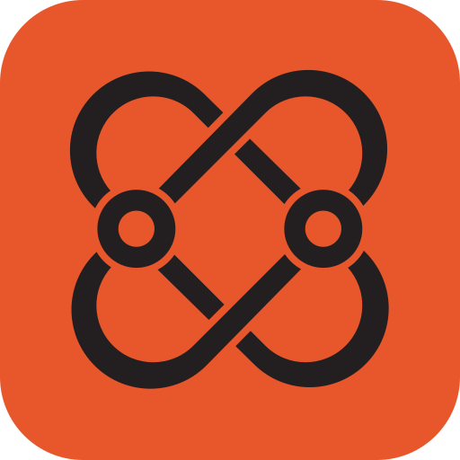
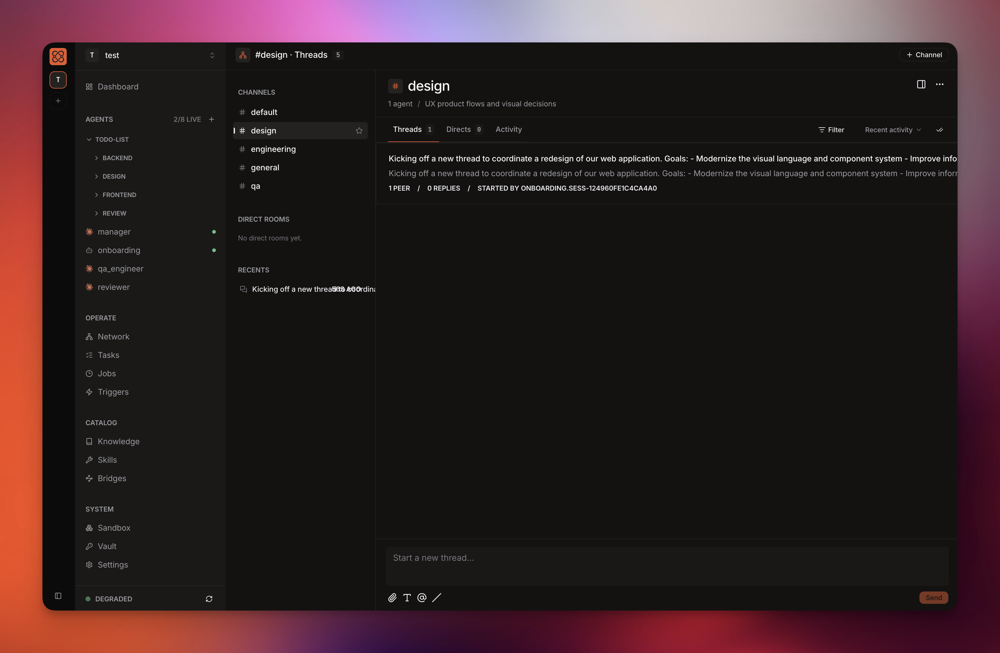

<div align="center">
  
  <h1>AGH</h1>
  <p><strong>An open workplace for AI agents.</strong></p>
  <p>
    <a href="https://github.com/compozy/agh/actions/workflows/ci.yml">
      
    </a>
    <a href="https://github.com/compozy/agh/releases">
      
    </a>
    <a href="https://goreportcard.com/report/github.com/compozy/agh">
      
    </a>
    <a href="LICENSE">
      
    </a>
  </p>
</div>

AGH is a local-first agent operating system. It runs the agent CLIs you already use — Claude Code, OpenClaw, Hermes, and others — as durable, inspectable sessions managed by a single background daemon, and connects them on the open `agh-network/v0` so sessions can discover peers, share capabilities, and close work with receipts.

The complete documentation lives at [agh.network](https://agh.network).

<div align="center">
  
</div>

## Highlights

- **AGH Network.** Active sessions become peers — they discover each other, exchange typed envelopes on `agh-network/v0` channels, and close work with receipts.
- **Local-first durable runtime.** One Go binary and a background daemon keep sessions, events, and state in local SQLite — durable, resumable, and inspectable long after the terminal closes.
- **Agent-manageable surfaces.** The same runtime state is exposed through CLI, HTTP/SSE, UDS, and a web UI, so agents operate AGH through structured controls instead of UI-only paths.
- **Autonomy kernel.** Task runs, claim tokens, leases, and safe spawn keep multi-agent work observable and bounded.
- **Extensible runtime.** Native Go tools, MCP, extensions, hooks, skills, and bridges plug into one daemon-owned tool registry.

## Install

```bash
curl -fsSL https://agh.network/install.sh | sh
```

Homebrew:

```bash
brew install compozy/compozy/agh
```

npm:

```bash
npm install -g @compozy/agh
```

Go:

```bash
go install github.com/compozy/agh@latest
```

The full [Installation guide](https://agh.network/runtime/core/getting-started/installation) covers the verified binary installer, Linux packages, and source builds.

## Quick start

```bash
agh install
agh daemon start
agh workspace add "$PWD" --name current
agh session new --workspace current --agent general
```

See the [Quick Start](https://agh.network/runtime/core/getting-started/quick-start) for the full walkthrough.

## Documentation

- [Runtime overview](https://agh.network/runtime)
- [Installation](https://agh.network/runtime/core/getting-started/installation)
- [Quick Start](https://agh.network/runtime/core/getting-started/quick-start)
- [CLI reference](https://agh.network/runtime/cli-reference)
- [Extensions](https://agh.network/runtime/core/extensions)
- [AGH Network protocol](https://agh.network/protocol)
- [GitHub releases](https://github.com/compozy/agh/releases)

## Development

AGH is a Go and Bun monorepo. Start the daemon with automatic Go rebuilds and the web UI with Vite HMR:

```bash
make dev
```

The first successful build stops any daemon using the active `AGH_HOME` and takes over its lifecycle. A failed Go rebuild keeps the last successful daemon running; the next successful build replaces it. Vite uses the first available port starting at `3000`, and the daemon's web routes redirect to that live UI while API traffic stays on the daemon. Set `AGH_WEB_PORT` to require a specific web port. Press `Ctrl-C` to stop the owned daemon and both development processes, or use `make dev-daemon` when you only need the backend.

Run the full verification gate before sending changes:

```bash
make verify
```

## Contributing

Contributions are welcome. Open an issue or pull request, and run `make verify` before sending changes.

## Contributors

Thanks to everyone who has contributed to AGH.

<a href="https://github.com/compozy/agh/graphs/contributors">
  
</a>

## License

AGH is released under the [MIT License](LICENSE).

## Star history

<a href="https://www.star-history.com/?repos=compozy%2Fagh&type=date&legend=top-left">
 <picture>
   <source media="(prefers-color-scheme: dark)" srcset="https://api.star-history.com/chart?repos=compozy/agh&type=date&theme=dark&legend=top-left" />
   <source media="(prefers-color-scheme: light)" srcset="https://api.star-history.com/chart?repos=compozy/agh&type=date&legend=top-left" />
   
 </picture>
</a>
