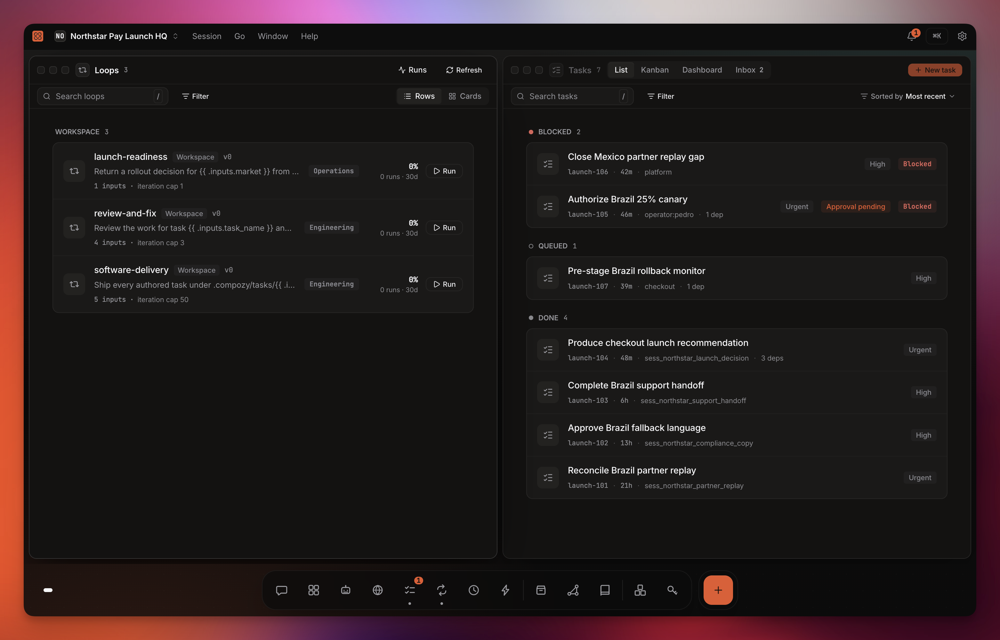
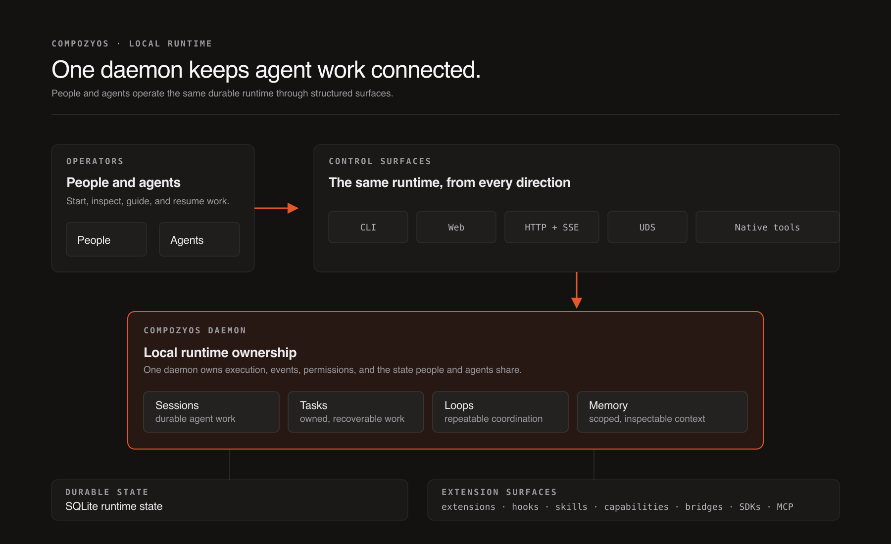

<div align="center">
  
  <h1>CompozyOS</h1>
  <p><strong>A local-first operating system for agent work.</strong></p>
  <p>
    <a href="https://github.com/compozy/compozy/actions/workflows/ci.yml">
      
    </a>
    <a href="https://github.com/compozy/compozy/releases">
      
    </a>
    <a href="https://goreportcard.com/report/github.com/compozy/compozy">
      
    </a>
    <a href="https://pkg.go.dev/github.com/compozy/compozy">
      
    </a>
    <a href="LICENSE">
      
    </a>
  </p>
</div>

CompozyOS gives agent work a durable place to live. One local daemon connects sessions, tasks,
loops, memory, permissions, automation, and tools. People can see and steer the work through the web
shell and CLI; agents operate the same state through structured HTTP, UDS, MCP, and native-tool
surfaces.

> [!WARNING]
> The v0.3 line is in beta. The previous v0.2.15 product is deprecated and maintained only for
> critical fixes on [`legacy/v0.2`](https://github.com/compozy/compozy/tree/legacy/v0.2). Start with
> the [migration guide](MIGRATION_GUIDE.md) before replacing an existing v0.2 installation.

<div align="center">
  
</div>

## ✨ Highlights

- **Work survives the terminal.** Sessions and Loop runs belong to the daemon, so closing one client
  does not erase the work.
- **One state, several control surfaces.** Web, CLI, HTTP/SSE, UDS, MCP, and native tools expose the
  same runtime-owned resources.
- **People stay in control.** Approvals, permissions, run state, artifacts, and agent activity remain
  inspectable while work continues in the background.
- **Local-first by default.** One Go binary and SQLite-backed stores keep runtime state on the
  operator's machine unless a configured provider or extension owns an external boundary.
- **Remote access stays explicit.** [Remote Gateway](https://compozy.com/docs/operations/remote-gateway)
  pairs devices and exposes only the private or public surfaces an operator enables.
- **Built to extend.** Agents, skills, capabilities, hooks, bridges, and extension kits plug into
  explicit runtime contracts.
- **Compozy Network.** Sessions can discover peers, exchange typed messages, delegate work, and close
  it with receipts over `compozy-network/v0`.

## 📦 Installation

The v0.3 beta ships through the channels below. Homebrew continues to serve the deprecated v0.2 line
during the beta window and is intentionally omitted here. The `compozy` formula returns with v0.3.0
stable.

#### Verified installer

The installer pins the latest published beta and verifies Sigstore provenance before installing the
binary on macOS or Linux.

```bash
curl -fsSL https://compozy.com/install.sh | sh
```

#### NPM

```bash
npm install -g @compozy/cli@beta
```

#### Go

Go's `@latest` still resolves the v0.2 stable line while v0.3 is in beta, so install with the
explicit tag shown on the [latest release](https://github.com/compozy/compozy/releases/latest):

```bash
go install github.com/compozy/compozy@<release-tag>
```

#### From Source

```bash
git clone https://github.com/compozy/compozy.git
cd compozy
go build -o ./bin/compozy .
```

The [installation guide](https://compozy.com/docs/getting-started/installation) covers
installer flags, Linux packages, source builds, verification, and managed updates.

## 🔄 How It Works

<div align="center">
  
</div>

People and agents send commands through public control surfaces. The home-scoped daemon resolves the
workspace, applies permissions and runtime policy, coordinates ACP agents, and persists events and
resource state. Web and streaming clients read that same daemon-owned truth instead of maintaining a
parallel model.

### Daemon Runtime Model

`compozy daemon start`, `compozy status`, and `compozy daemon stop` manage the local daemon.
Sessions, tasks, Loop runs, memory,
automation, tools, and Compozy Network activity keep explicit owners and workspace boundaries. Use
structured CLI output (`-o json`), HTTP/SSE, UDS, MCP, or native tools when another agent or program
needs to manage the same resources.

### Task Schema v2

Authored task files remain portable Markdown with typed frontmatter. The v0.3 runtime imports them
into durable tasks and executes them through Loops; it does not revive the v0.2 `tasks run` pipeline.
See [Migrate from v0.2.15](MIGRATION_GUIDE.md) for the exact schema and command changes.

## ⚙️ Config Files

Global defaults live in `~/.compozy/config.toml`; a workspace can override supported fields through
`.compozy/config.toml`. Explicit command flags win over workspace configuration, which wins over
global configuration and built-in defaults.

```bash
compozy config path
compozy config validate
compozy config show -o json
```

Configuration, credentials, and provider-home policies have different owners. Follow the
[configuration guide](https://compozy.com/docs/configuration/config-toml) instead of copying
v0.2 state into a v0.3 home.

## Reusable Agents

Agent definitions live under `~/.compozy/agents/<name>/` or `.compozy/agents/<name>/`. Each definition
has an `AGENT.md` and may include an agent-local `mcp.json`. Workspace definitions override global
definitions as a whole.

```bash
compozy agent list -o json
compozy agent info general -o json
compozy session new --agent general
```

## 🔌 Extensions

Extensions add versioned resources and runtime behavior through declared provide surfaces. The daemon
owns discovery, enablement, trust decisions, lifecycle, and hooks; extensions do not bypass public
runtime contracts.

### Build one in three commands

```bash
compozy extension init hello --template tool-provider-go
compozy extension dev hello
compozy tool invoke ext__hello__search --workspace . --input '{"query":"compozy"}'
```

Authoring is code-first: you declare the tool once in code and `compozy extension build` generates
the manifest. Walkthrough:
[Build your first extension](https://compozy.com/docs/guides/build-your-first-extension).

### SDK support

`@compozy/extension-sdk` (npm, MIT) and `github.com/compozy/compozy/sdk/go` are published and
version-matched to the daemon.

### Extension CLI

```bash
compozy extension list -o json
compozy extension status <name> -o json
compozy extension provenance <name> -o json
compozy extension logs <name> --follow
```

### Learn more

- [Build your first extension](https://compozy.com/docs/guides/build-your-first-extension)
- [Extensions](https://compozy.com/docs/extensions)
- [Publish an extension](https://compozy.com/docs/extensions/publish)
- [Capabilities and extension kits](https://compozy.com/docs/extensions)
- [Official Compozy skill](skills/compozy/)
- [Migration guide](MIGRATION_GUIDE.md)

## 🚀 Quick Start

Bootstrap the home, start the daemon, enter the repository you want agents to work in, and create one
durable session. Compozy infers and registers the workspace from the current directory; use
`--workspace <id|name|path>` only when you need an override.

```bash
compozy install
compozy daemon start
compozy session new --agent general --name first-run
```

The [Quick Start](https://compozy.com/docs/getting-started/quick-start) continues through the
first prompt, live attachment, inspection, and cleanup.

## 🧩 Skills

Skills are daemon-discovered resources with explicit source and scope. Use the structured skill and
marketplace surfaces to inspect what is active instead of copying v0.2 setup directories forward.

```bash
compozy skill list -o json
compozy skill inspect <name> -o json
compozy marketplace search --kind skill --query <term> -o json
```

### 🧠 Workflow Memory

Durable memory is scoped and daemon-owned. Agents can inspect, propose, and consolidate memory through
the same public contracts as people. The v0.2 workflow-memory files remain ordinary repository
artifacts; they are not imported as hidden runtime state.

### 🤖 Supported Agents

Compozy runs ACP-compatible agent CLIs and adapters. The active provider catalog and each agent's
runtime settings are runtime truth; inspect them before selecting a model or reasoning mode. See the
[provider guide](https://compozy.com/docs/agents/providers) for authentication and
provider-home policies.

## 📖 CLI Reference

The generated [CLI reference](https://compozy.com/docs/cli-reference) is authoritative for verbs,
flags, structured output, and exit behavior. Start with:

```bash
compozy --help
compozy version
compozy doctor -o json
```

## Documentation

- [Runtime overview](https://compozy.com/docs)
- [Installation](https://compozy.com/docs/getting-started/installation)
- [Quick Start](https://compozy.com/docs/getting-started/quick-start)
- [Migrate from v0.2.15](MIGRATION_GUIDE.md)
- [CLI reference](https://compozy.com/docs/cli-reference)
- [Compozy Network protocol](https://compozy.com/protocol)
- [GitHub releases](https://github.com/compozy/compozy/releases)

## 🛠️ Development

CompozyOS is a Go and Bun monorepo. Start the daemon with automatic Go rebuilds and the web UI with
Vite HMR:

```bash
make dev
```

Run the full repository gate once the change is ready:

```bash
make verify
```

Read [AGENTS.md](AGENTS.md) and the surface-specific instructions before editing.

## Star History

<a href="https://www.star-history.com/?repos=compozy%2Fcompozy&type=date&legend=top-left">
 <picture>
   <source media="(prefers-color-scheme: dark)" srcset="https://api.star-history.com/chart?repos=compozy/compozy&type=date&theme=dark&legend=top-left" />
   <source media="(prefers-color-scheme: light)" srcset="https://api.star-history.com/chart?repos=compozy/compozy&type=date&legend=top-left" />
   
 </picture>
</a>

## 🤝 Contributing

Contributions are welcome. Open an issue or pull request, keep public behavior agent-manageable, and
run `make verify` before sending changes. [Security reports](SECURITY.md) belong in the repository's
private security channel, not a public issue.

## Contributors

Thanks to everyone who has contributed to Compozy.

<a href="https://github.com/compozy/compozy/graphs/contributors">
  
</a>

## 📄 License

Compozy is distributed under the [MIT License](LICENSE).
