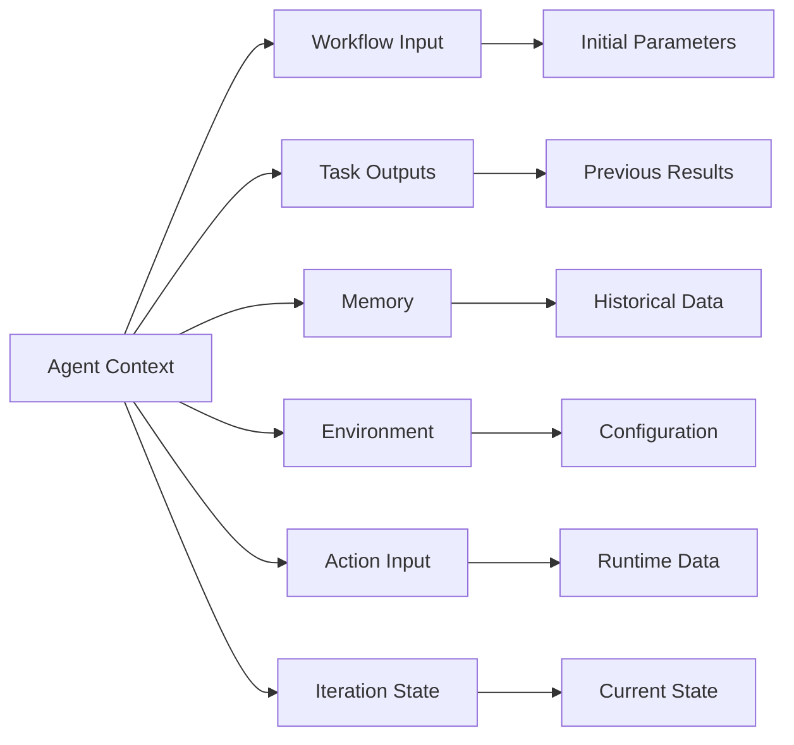

## Overview

Context in Compozy agents refers to all the information available to an agent during execution - from workflow inputs and previous task outputs to memory and environment variables. Effective context management is crucial for agent performance and accuracy.

## Context Sources

Agents have access to multiple context sources:



## Context Variables

### Workflow Context

Access workflow-level information:

```yaml
actions:
  - id: process-request
    prompt: |
      Process request for: {{.workflow.input.user_name}}
      Request ID: {{.workflow.input.request_id}}
      Priority: {{.workflow.input.priority}}
      
      Workflow metadata:
      - Started at: {{.workflow.started_at}}
      - Workflow ID: {{.workflow.id}}
```

Available workflow context:
- `{{.workflow.input.*}}` - All workflow input parameters
- `{{.workflow.id}}` - Unique workflow execution ID
- `{{.workflow.started_at}}` - Workflow start timestamp
- `{{.workflow.config.*}}` - Workflow configuration values

### Task Context

Access outputs from previous tasks:

```yaml
actions:
  - id: analyze-results
    prompt: |
      Analyze the combined results:
      
      Weather data: {{.tasks.weather.output | toJson}}
      Temperature: {{.tasks.weather.output.temperature}}°C
      
      User preferences: {{.tasks.preferences.output.items}}
      
      Previous analysis:
      {{range .tasks.initial_analysis.output.findings}}
      - {{.}}
      {{end}}
```

Task output access patterns:
- `{{.tasks.TASK_ID.output}}` - Complete output object
- `{{.tasks.TASK_ID.output.field}}` - Specific field
- `{{.tasks.TASK_ID.status}}` - Task execution status
- `{{.tasks.TASK_ID.error}}` - Task error if any

### Collection Context

In collection tasks, access current item and index:

```yaml
tasks:
  - id: process-items
    type: collection
    items: "{{.workflow.input.items}}"
    task:
      type: basic
      $use: agent(local::agents.#(id="processor"))
      action: process-item
      
agents:
  - id: processor
    actions:
      - id: process-item
        prompt: |
          Process item {{.index}} of {{len .parent.items}}:
          Current item: {{.item | toJson}}
          
          Previous items processed: {{.index}}
          Items remaining: {{sub (len .parent.items) .index}}
```

### Memory Context

Access memory content in prompts:

```yaml
agents:
  - id: contextual-agent
    memory:
      - id: user_context
        key: "user:{{.workflow.input.user_id}}"
    
    actions:
      - id: personalized-response
        prompt: |
          Respond to: {{.input.message}}
          
          The conversation history and user preferences are 
          automatically included from memory.
          
          Build on previous context naturally.
```

## Context Building Strategies

### Hierarchical Context

Build context from multiple levels:

```yaml
instructions: |
  You are a {{.workflow.input.agent_role}} assistant.
  
  Global context:
  - Organization: {{.env.ORG_NAME}}
  - Environment: {{.env.ENVIRONMENT}}
  
  User context:
  - User ID: {{.workflow.input.user_id}}
  - User tier: {{.workflow.input.user_tier}}
  
  Session context:
  - Session ID: {{.workflow.input.session_id}}
  - Session start: {{.workflow.input.session_start}}
```

### Selective Context

Include only relevant context to optimize token usage:

```yaml
actions:
  - id: focused-analysis
    prompt: |
      Analyze the sales data for Q4.
      
      {{/* Only include relevant context */}}
      Q4 Revenue: {{.tasks.revenue_calc.output.q4_total}}
      YoY Growth: {{.tasks.revenue_calc.output.growth_rate}}%
      
      {{/* Omit irrelevant quarterly data to save tokens */}}
```

### Dynamic Context

Build context based on conditions:

```yaml
actions:
  - id: adaptive-response
    prompt: |
      {{if .workflow.input.include_history}}
      Historical context:
      {{range .tasks.fetch_history.output.events}}
      - {{.date}}: {{.description}}
      {{end}}
      {{end}}
      
      {{if eq .workflow.input.mode "detailed"}}
      Provide a comprehensive analysis including:
      - Root cause analysis
      - Impact assessment  
      - Mitigation strategies
      {{else}}
      Provide a brief summary of key findings.
      {{end}}
```

## Context Templates

### Template Functions

Compozy supports Sprig template functions:

```yaml
prompt: |
  # String manipulation
  Title: {{.input.title | upper}}
  Slug: {{.input.title | lower | replace " " "-"}}
  
  # Date formatting
  Current date: {{now | date "2006-01-02"}}
  Deadline: {{.input.deadline | date "Jan 2, 2006"}}
  
  # Conditionals
  Priority: {{.input.priority | default "normal"}}
  Status: {{if .tasks.validation.output.passed}}✓{{else}}✗{{end}}
  
  # Lists and iteration
  Total items: {{len .input.items}}
  {{range $i, $item := .input.items}}
  {{$i}}: {{$item.name}} ({{$item.status}})
  {{end}}
  
  # Math operations
  Average: {{div (add .output.score1 .output.score2) 2}}
  Percentage: {{mul (div .output.completed .output.total) 100}}%
```

### JSON Handling

Work with JSON data in context:

```yaml
prompt: |
  # Pretty print JSON
  Configuration:
  {{.tasks.config.output | toPrettyJson}}
  
  # Parse JSON string
  {{$data := .input.json_string | fromJson}}
  Parsed value: {{$data.field}}
  
  # Convert to JSON
  Items as JSON: {{.input.items | toJson}}
```

## Context Optimization

### Token Management

Strategies to optimize context size:

<Tabs>
  <Tab title="Summarization">
    ```yaml
    actions:
      - id: process-with-summary
        prompt: |
          {{/* Instead of full history */}}
          Summary of previous interactions:
          {{.tasks.summarize.output.key_points}}
          
          {{/* Instead of all details */}}
          Relevant findings: {{.tasks.analyze.output.relevant_only}}
    ```
  </Tab>
  
  <Tab title="Filtering">
    ```yaml
    actions:
      - id: filtered-context
        prompt: |
          {{/* Filter to recent items only */}}
          Recent activities (last 5):
          {{range $i, $activity := .tasks.fetch.output.activities}}
            {{if lt $i 5}}
            - {{$activity.description}}
            {{end}}
          {{end}}
    ```
  </Tab>
  
  <Tab title="Compression">
    ```yaml
    actions:
      - id: compressed-context
        prompt: |
          {{/* Use IDs instead of full objects */}}
          Process orders: {{.tasks.orders.output.order_ids}}
          
          {{/* Extract only needed fields */}}
          Users: {{range .tasks.users.output}}
          - {{.id}}: {{.status}}
          {{end}}
    ```
  </Tab>
</Tabs>

### Context Caching

Reuse computed context across actions:

```yaml
agents:
  - id: efficient-agent
    with:
      # Compute once, use many times
      base_context: |
        Project: {{.workflow.input.project}}
        Phase: {{.workflow.input.phase}}
        Team: {{.workflow.input.team}}
    
    actions:
      - id: analyze
        prompt: |
          {{.agent.with.base_context}}
          
          Analyze the requirements...
      
      - id: validate
        prompt: |
          {{.agent.with.base_context}}
          
          Validate the implementation...
```

## Context Debugging

### Debugging Templates

Test template rendering:

```yaml
actions:
  - id: debug-context
    prompt: |
      DEBUG: Context inspection
      
      Workflow inputs:
      {{.workflow.input | toPrettyJson}}
      
      Available tasks:
      {{range $key, $task := .tasks}}
      - {{$key}}: {{$task.status}}
      {{end}}
      
      Environment:
      {{range $key, $val := .env}}
      - {{$key}}: {{$val}}
      {{end}}
```

### Context Validation

Validate required context:

```yaml
actions:
  - id: validated-action
    prompt: |
      {{if not .workflow.input.user_id}}
      ERROR: user_id is required in workflow input
      {{end}}
      
      {{if not .tasks.auth.output.token}}
      ERROR: Authentication must complete before this action
      {{end}}
      
      {{/* Proceed only with valid context */}}
      Process authenticated request for user {{.workflow.input.user_id}}
```

## Advanced Context Patterns

### Context Inheritance

Pass context through workflow stages:

```yaml
tasks:
  - id: enrich-context
    type: basic
    outputs:
      enriched:
        original: "{{.workflow.input}}"
        metadata:
          timestamp: "{{now}}"
          source: "enrichment"
        user_data: "{{.tasks.fetch_user.output}}"
  
  - id: process-enriched
    type: basic
    with:
      context: "{{.tasks.enrich-context.output.enriched}}"
```

### Cross-Workflow Context

Share context between workflows using signals:

```yaml
# Workflow 1: Send context
tasks:
  - id: send-context
    type: signal
    signal:
      id: context-ready
      payload:
        workflow_id: "{{.workflow.id}}"
        context: "{{.tasks.prepare.output}}"

# Workflow 2: Receive context
triggers:
  - type: signal
    name: context-ready

tasks:
  - id: use-context
    with:
      received_context: "{{.trigger.payload.context}}"
```

### Context Transformation

Transform context for different uses:

```yaml
actions:
  - id: transform-context
    prompt: |
      {{/* Transform list to map */}}
      {{$userMap := dict}}
      {{range .tasks.users.output}}
        {{$_ := set $userMap .id .}}
      {{end}}
      
      {{/* Access transformed data */}}
      User details: {{index $userMap .input.user_id}}
      
      {{/* Aggregate context */}}
      {{$total := 0}}
      {{range .tasks.items.output}}
        {{$total = add $total .value}}
      {{end}}
      Total value: {{$total}}
```

## Best Practices

<FeatureCardList cols={2}>
  <FeatureCard title="Minimize Context">
    Include only necessary information to optimize token usage and response time
  </FeatureCard>
  <FeatureCard title="Structure Clearly">
    Organize context hierarchically for better agent comprehension
  </FeatureCard>
  <FeatureCard title="Validate Early">
    Check for required context before processing to fail fast
  </FeatureCard>
  <FeatureCard title="Cache Computed Values">
    Avoid recomputing expensive context transformations
  </FeatureCard>
</FeatureCardList>

## Next Steps

<FeatureCardList cols={2}>
  <FeatureCard title="Structured Outputs" href="/docs/core/agents/structured-outputs">
    Learn about JSON mode and output validation
  </FeatureCard>
  <FeatureCard title="Multi-Agent Patterns" href="/docs/core/agents/multi-agent-patterns">
    Explore context sharing in multi-agent systems
  </FeatureCard>
</FeatureCardList>
