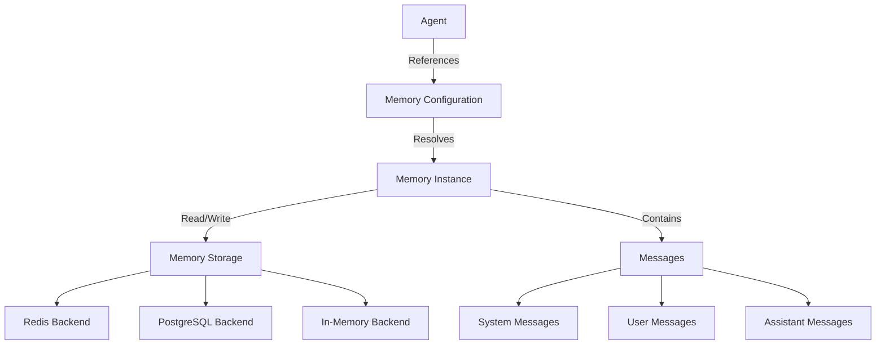

## Overview

Memory in Compozy allows agents to maintain context across workflow steps, sessions, and even between different workflow executions. This enables stateful interactions, personalization, and complex multi-turn conversations.

## Memory Architecture



## Memory Configuration

### Basic Memory Setup

Configure memory references in your agent:

```yaml
agents:
  - id: conversational-agent
    config:
      provider: openai
      model: gpt-4-turbo-preview
    instructions: |
      You are a helpful assistant that remembers previous conversations.
      Use context from memory to provide personalized responses.
    memory:
      - id: user_memory           # Memory resource ID
        key: "user:{{.workflow.input.user_id}}"  # Dynamic key
        mode: "read-write"        # Access mode
```

### Memory Reference Structure

Each memory reference requires:

| Field | Type | Description | Required |
|-------|------|-------------|----------|
| `id` | string | References a memory resource | Yes |
| `key` | string | Template for the memory instance key | Yes |
| `mode` | string | Access mode: `read-write` or `read-only` | No (default: `read-write`) |

### Dynamic Key Templates

Memory keys support template expressions:

```yaml
memory:
  # User-specific memory
  - id: user_context
    key: "user:{{.workflow.input.user_id}}"
  
  # Session-based memory
  - id: session_memory
    key: "session:{{.workflow.input.session_id}}"
  
  # Conversation threads
  - id: conversation
    key: "thread:{{.workflow.input.thread_id}}:{{.workflow.input.user_id}}"
  
  # Time-based memory
  - id: daily_context
    key: "daily:{{.workflow.input.date}}:{{.workflow.input.user_id}}"
```

## Memory Resources

Define memory resources that agents can reference:

```yaml
# memory/user_memory.yaml
resource: memory
id: user_memory
description: Persistent user context and preferences

config:
  provider: redis
  ttl: 2592000  # 30 days in seconds
  namespace: "compozy:memory:users"

schema:
  type: object
  properties:
    preferences:
      type: object
    history:
      type: array
      items:
        type: object
```

## Memory Access Patterns

### Read-Write Memory

Full access to read and modify memory:

```yaml
agents:
  - id: personal-assistant
    memory:
      - id: user_preferences
        key: "prefs:{{.workflow.input.user_id}}"
        mode: "read-write"
    
    actions:
      - id: update-preferences
        prompt: |
          Based on the user's request: {{.input.request}}
          
          Current preferences from memory will be available.
          Update preferences as needed based on the conversation.
```

### Read-Only Memory

Access memory without modification rights:

```yaml
agents:
  - id: support-agent
    memory:
      - id: user_history
        key: "history:{{.workflow.input.user_id}}"
        mode: "read-only"
    
    instructions: |
      You can view user history but cannot modify it.
      Use historical context to provide better support.
```

### Multiple Memory Contexts

Agents can access multiple memory instances:

```yaml
agents:
  - id: multi-context-agent
    memory:
      - id: user_profile
        key: "profile:{{.workflow.input.user_id}}"
      - id: team_context
        key: "team:{{.workflow.input.team_id}}"
      - id: project_state
        key: "project:{{.workflow.input.project_id}}"
```

## Memory Content Structure

Memory stores conversation messages with metadata:

```json
{
  "messages": [
    {
      "role": "system",
      "content": "Initial system context",
      "timestamp": "2024-01-15T10:00:00Z"
    },
    {
      "role": "user",
      "content": "User message",
      "timestamp": "2024-01-15T10:00:01Z",
      "metadata": {
        "user_id": "user123",
        "session_id": "sess456"
      }
    },
    {
      "role": "assistant",
      "content": "Agent response",
      "timestamp": "2024-01-15T10:00:02Z",
      "metadata": {
        "agent_id": "personal-assistant",
        "tokens_used": 150
      }
    }
  ]
}
```

## Memory in Action

### Conversational Memory

Build conversational agents with context:

```yaml
# Workflow with conversational memory
tasks:
  - id: chat
    type: basic
    $use: agent(local::agents.#(id="chat-agent"))
    action: respond
    with:
      message: "{{.workflow.input.message}}"

agents:
  - id: chat-agent
    memory:
      - id: conversation
        key: "chat:{{.workflow.input.session_id}}"
    
    actions:
      - id: respond
        prompt: |
          Continue the conversation naturally.
          User message: {{.input.message}}
          
          Use previous context to maintain conversation flow.
          Reference earlier topics when relevant.
```

### User Preference Learning

Agents that learn and adapt:

```yaml
agents:
  - id: recommendation-agent
    memory:
      - id: user_preferences
        key: "prefs:{{.workflow.input.user_id}}"
    
    instructions: |
      You provide personalized recommendations.
      Learn from user feedback and choices.
      Adapt suggestions based on historical preferences.
    
    actions:
      - id: recommend
        prompt: |
          Suggest items based on:
          - User request: {{.input.request}}
          - Historical preferences from memory
          - Previous successful recommendations
```

### Multi-Agent Collaboration

Share memory between agents:

```yaml
agents:
  - id: researcher
    memory:
      - id: research_notes
        key: "research:{{.workflow.input.topic}}"
        mode: "read-write"
    actions:
      - id: research
        prompt: "Research the topic and store findings in memory"
  
  - id: writer
    memory:
      - id: research_notes
        key: "research:{{.workflow.input.topic}}"
        mode: "read-only"
    actions:
      - id: write
        prompt: "Write article based on research notes in memory"
```

## Memory Management

### Memory Lifecycle

<Steps>
  <Step title="Initialization">
    Memory instance created when first referenced with a specific key
  </Step>
  <Step title="Population">
    Messages appended during agent interactions
  </Step>
  <Step title="Retrieval">
    Full conversation history provided to agent as context
  </Step>
  <Step title="Expiration">
    Memory expires based on TTL configuration
  </Step>
</Steps>

### Memory Size Considerations

<Note>
Memory content counts toward the agent's context window. Large conversation histories may need truncation.
</Note>

Strategies for managing memory size:

1. **Set appropriate TTLs** to expire old memories
2. **Use separate memory instances** for different contexts
3. **Implement memory summarization** for long conversations
4. **Archive old memories** to secondary storage

### Memory Operations via API

Manage memory through the HTTP API:

```bash
# Write to memory
curl -X POST http://localhost:8080/api/v0/memory/write \
  -H "Content-Type: application/json" \
  -d '{
    "key": "user:123",
    "message": {
      "role": "system",
      "content": "User prefers technical explanations"
    }
  }'

# Read memory
curl http://localhost:8080/api/v0/memory/read?key=user:123

# Clear memory
curl -X POST http://localhost:8080/api/v0/memory/clear \
  -H "Content-Type: application/json" \
  -d '{"key": "user:123"}'
```

## Advanced Patterns

### Contextual Memory Selection

Dynamically select memory based on context:

```yaml
agents:
  - id: adaptive-agent
    memory:
      - id: "{{.workflow.input.memory_type}}_memory"
        key: "{{.workflow.input.memory_type}}:{{.workflow.input.context_id}}"
```

### Memory Summarization

Implement memory compression for long conversations:

```yaml
actions:
  - id: summarize-conversation
    prompt: |
      The conversation has reached 50 messages.
      Create a concise summary of key points, decisions, and context.
      This summary will replace the full conversation history.
    json_mode: true
    output:
      type: object
      properties:
        summary:
          type: string
        key_points:
          type: array
          items:
            type: string
        user_preferences:
          type: object
```

### Cross-Workflow Memory

Share memory across different workflows:

```yaml
# Workflow 1: Data Collection
agents:
  - id: collector
    memory:
      - id: shared_data
        key: "project:{{.env.PROJECT_ID}}:data"

# Workflow 2: Data Analysis  
agents:
  - id: analyzer
    memory:
      - id: shared_data
        key: "project:{{.env.PROJECT_ID}}:data"
```

## Best Practices

<AccordionGroup>
  <Accordion title="Key Design">
    - Use hierarchical keys for organization
    - Include relevant IDs in key templates
    - Consider key uniqueness and collisions
    - Document key naming conventions
  </Accordion>
  
  <Accordion title="Access Control">
    - Use read-only mode when modification isn't needed
    - Separate memory instances by security context
    - Validate user access to memory keys
    - Implement proper key sanitization
  </Accordion>
  
  <Accordion title="Performance">
    - Set appropriate TTLs to prevent unbounded growth
    - Monitor memory size and token usage
    - Implement pagination for large histories
    - Use caching for frequently accessed memories
  </Accordion>
  
  <Accordion title="Privacy">
    - Encrypt sensitive memory content
    - Implement data retention policies
    - Provide user controls for memory deletion
    - Audit memory access patterns
  </Accordion>
</AccordionGroup>

## Next Steps

<FeatureCardList cols={2}>
  <FeatureCard title="Context Management" href="/docs/core/agents/context">
    Learn about managing agent context effectively
  </FeatureCard>
  <FeatureCard title="Multi-Agent Patterns" href="/docs/core/agents/multi-agent-patterns">
    Explore patterns for multi-agent collaboration
  </FeatureCard>
</FeatureCardList>
