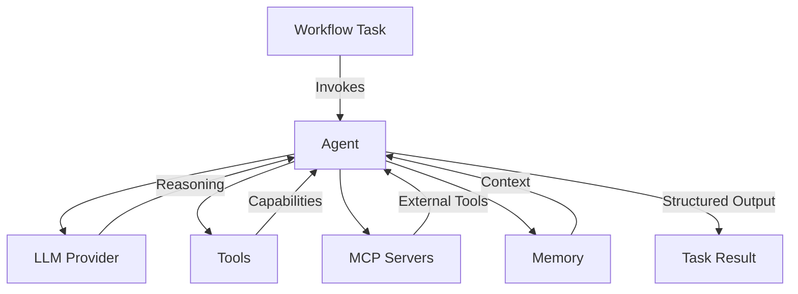

## What are Agents?

Agents in Compozy are **autonomous AI-powered entities** that can reason, make decisions, and execute actions based on natural language instructions. They serve as the intelligent core of Compozy workflows, orchestrating complex tasks through advanced language model capabilities.

## Key Capabilities

Agents combine several powerful features to deliver intelligent automation:

<FeatureCardList cols={2}>
  <FeatureCard title="Natural Language Understanding" icon="brain">
    Process and understand complex instructions in plain English, enabling intuitive task definitions
  </FeatureCard>
  <FeatureCard title="Dynamic Decision Making" icon="route">
    Make contextual decisions based on goals, constraints, and real-time information
  </FeatureCard>
  <FeatureCard title="Tool Utilization" icon="wrench">
    Access and use external tools dynamically to extend capabilities beyond text generation
  </FeatureCard>
  <FeatureCard title="Iterative Problem Solving" icon="repeat">
    Self-correct and refine responses over multiple iterations for improved accuracy
  </FeatureCard>
</FeatureCardList>

## Core Features

### 🤖 LLM Integration
Connect to various AI providers including OpenAI, Anthropic, Google, and local models through a unified interface.

### 🎯 Action System
Define structured actions with input/output schemas for type-safe, predictable interactions.

### 🔧 Tool Access
Utilize external tools and APIs dynamically, from file operations to complex integrations.

### 🌐 MCP Support
Extend capabilities through Model Context Protocol servers for standardized tool interfaces.

### 🧠 Memory Management
Access shared context across workflow steps and maintain conversational state.

### 🔄 Iterative Execution
Allow agents to refine their responses through multiple reasoning iterations.

## Basic Agent Configuration

Here's a simple example of an agent configuration:

```yaml
resource: agent
id: code-assistant
version: 0.1.0

config:
  provider: anthropic
  model: claude-3-opus-20240229
  params:
    temperature: 0.7
    max_tokens: 4000

instructions: |
  You are an expert software engineer specializing in code review.
  Focus on clarity, performance, and best practices.
  Always explain your reasoning and provide actionable feedback.

actions:
  - id: review-code
    prompt: "Analyze the provided code for quality and improvements"
    input:
      type: object
      properties:
        code:
          type: string
          description: "The code to review"
        language:
          type: string
          enum: ["python", "go", "javascript"]
      required: ["code", "language"]
    json_mode: true
    output:
      type: object
      properties:
        issues:
          type: array
          items:
            type: object
            properties:
              severity:
                type: string
                enum: ["critical", "high", "medium", "low"]
              description:
                type: string
```

## How Agents Work

<Steps>
  <Step title="Initialization">
    Agent loads configuration including instructions, model settings, and available tools
  </Step>
  <Step title="Context Building">
    Gathers relevant context from workflow inputs, memory, and previous task outputs
  </Step>
  <Step title="Action Execution">
    Processes the specified action with the given inputs and constraints
  </Step>
  <Step title="Tool Usage">
    Dynamically decides when and how to use available tools to complete the task
  </Step>
  <Step title="Iteration">
    Refines response through multiple iterations if needed (up to max_iterations)
  </Step>
  <Step title="Output Generation">
    Produces structured output according to the action's schema
  </Step>
</Steps>

## Agent Architecture



## Use Cases

Agents excel in various scenarios:

<AccordionGroup>
  <Accordion title="Code Analysis & Review">
    - Automated code quality assessment
    - Security vulnerability detection
    - Performance optimization suggestions
    - Best practice enforcement
  </Accordion>
  
  <Accordion title="Data Processing">
    - ETL pipeline orchestration
    - Data validation and cleansing
    - Report generation
    - Insight extraction
  </Accordion>
  
  <Accordion title="Customer Support">
    - Intelligent ticket routing
    - Automated response generation
    - Knowledge base queries
    - Escalation decisions
  </Accordion>
  
  <Accordion title="Content Generation">
    - Technical documentation
    - Marketing copy
    - Email templates
    - Social media posts
  </Accordion>
</AccordionGroup>

## Best Practices

<Tabs>
  <Tab title="Instructions">
    - Be clear and specific about the agent's role
    - Define boundaries and constraints
    - Include domain-specific knowledge
    - Use markdown for better structure
  </Tab>
  
  <Tab title="Actions">
    - Create focused, single-purpose actions
    - Define clear input/output schemas
    - Use descriptive action IDs
    - Enable JSON mode for structured outputs
  </Tab>
  
  <Tab title="Configuration">
    - Choose appropriate model based on task complexity
    - Set reasonable token limits
    - Configure iteration limits based on needs
    - Use environment variables for sensitive data
  </Tab>
</Tabs>

## Related Documentation

### 🔗 Cross-References
- **[Core Concepts: Agents](/docs/core/getting-started/core-concepts#3-agents)** - Agents in workflow context
- **[Task Integration](/docs/core/tasks/basic-tasks)** - How agents work with tasks
- **[YAML Templates](/docs/core/yaml-templates/overview)** - Dynamic agent configuration
- **[Configuration: Providers](/docs/core/configuration/providers)** - LLM provider setup

### 🤖 Agent-Related Topics
- **Agent Memory** ↔ **[Memory Systems](/docs/core/memory/memory-concepts)** ↔ **[Memory Operations](/docs/core/memory/operations)**
- **Agent Tools** ↔ **[Tools Overview](/docs/core/tools/tools-overview)** ↔ **[MCP Integration](/docs/core/mcp/mcp-overview)**
- **Agent Context** ↔ **[Template Variables](/docs/core/yaml-templates/context-variables)**

## Next Steps

<FeatureCardList cols={2}>
  <FeatureCard title="LLM Integration" href="/docs/core/agents/llm-integration">
    Connect to OpenAI, Anthropic, Groq, and more
  </FeatureCard>
  <FeatureCard title="Instructions & Actions" href="/docs/core/agents/instructions-actions">
    Define agent behavior and structured actions
  </FeatureCard>
  <FeatureCard title="Tools" href="/docs/core/agents/tools">
    Extend capabilities with external tools and MCP
  </FeatureCard>
  <FeatureCard title="Memory" href="/docs/core/agents/memory">
    Implement stateful conversations and context
  </FeatureCard>
</FeatureCardList>

### 📚 Learning Paths
- **Beginner**: [Overview](/docs/core/agents/overview) → [LLM Integration](/docs/core/agents/llm-integration) → [Instructions & Actions](/docs/core/agents/instructions-actions)
- **Intermediate**: [Tools](/docs/core/agents/tools) → [Memory](/docs/core/agents/memory) → [Multi-Agent Patterns](/docs/core/agents/multi-agent-patterns)
- **Advanced**: [Structured Outputs](/docs/core/agents/structured-outputs) → [Context Management](/docs/core/agents/context)
