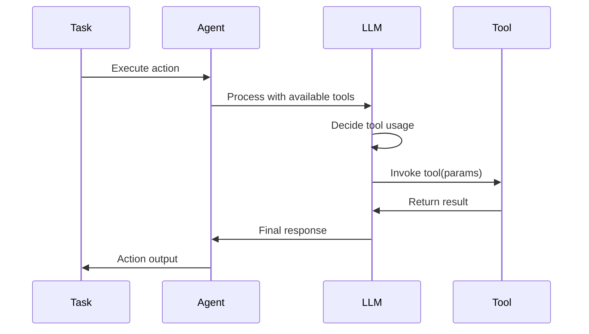

## Overview

Tools extend agent capabilities by providing access to external functions, APIs, and services. When tools are configured, agents can dynamically decide when and how to use them to complete tasks, enabling powerful automation workflows.

## How Tools Work with Agents

When an agent has tools available:

1. **Tool Discovery**: The agent receives descriptions of available tools
2. **Decision Making**: Based on the task, the agent decides if and which tools to use
3. **Tool Invocation**: The agent calls tools with appropriate parameters
4. **Result Integration**: Tool outputs are incorporated into the agent's response



## Tool Configuration

### Basic Tool Assignment

Assign tools to agents in the agent configuration:

```yaml
agents:
  - id: data-processor
    config:
      provider: openai
      model: gpt-4-turbo-preview
    instructions: |
      You are a data processing assistant.
      Use available tools to fetch, process, and analyze data.
    tools:
      - $ref: local::tools.#(id=="fetch-data")
      - $ref: local::tools.#(id=="transform-data")
      - $ref: local::tools.#(id=="save-results")
```

### Tool References

Tools can be referenced in multiple ways:

<Tabs>
  <Tab title="Local Reference">
    ```yaml
    # Reference tools defined in the same workflow file
    tools:
      - $ref: local::tools.#(id=="weather_tool")
      - $ref: local::tools.#(id=="calculator")
    ```
  </Tab>

  <Tab title="Resource Reference">
    ```yaml
    # Reference tools from external files
    tools:
      - resource: tool
        id: file-reader
      - resource: tool
        id: api-client
    ```
  </Tab>

  <Tab title="Inline Definition">
    ```yaml
    # Define tools inline (not recommended for reusability)
    tools:
      - id: simple-tool
        description: "A simple calculation tool"
        input:
          type: object
          properties:
            operation:
              type: string
            values:
              type: array
              items:
                type: number
    ```
  </Tab>
</Tabs>

## Tool Usage Patterns

### Automatic Tool Selection

By default, agents automatically decide when to use tools:

```yaml
config:
  provider: openai
  model: gpt-4-turbo-preview
  tool_choice: auto  # Default behavior

actions:
  - id: process-request
    prompt: |
      Process the user's request using available tools as needed.
      Request: {{.input.request}}
```

### Forced Tool Usage

Force the agent to use a specific tool:

```yaml
config:
  tool_choice: "weather_tool"  # Force specific tool

# Or disable tool usage
config:
  tool_choice: none
```

### Tool Execution Examples

<AccordionGroup>
  <Accordion title="File Operations">
    ```yaml
    agents:
      - id: file-manager
        instructions: |
          You manage files and directories.
          Use tools to read, write, and organize files.
        tools:
          - id: read-file
            description: "Read contents of a file"
            input:
              type: object
              properties:
                path:
                  type: string
                  description: "File path to read"

          - id: write-file
            description: "Write content to a file"
            input:
              type: object
              properties:
                path:
                  type: string
                content:
                  type: string
    ```
  </Accordion>

  <Accordion title="API Integration">
    ```yaml
    agents:
      - id: api-orchestrator
        instructions: |
          You orchestrate API calls to gather and process data.
          Chain multiple API calls to build comprehensive responses.
        tools:
          - id: http-request
            description: "Make HTTP requests to APIs"
            input:
              type: object
              properties:
                url:
                  type: string
                method:
                  type: string
                  enum: ["GET", "POST", "PUT", "DELETE"]
                headers:
                  type: object
                body:
                  type: object

          - id: parse-response
            description: "Parse and extract data from API responses"
    ```
  </Accordion>

  <Accordion title="Data Processing">
    ```yaml
    agents:
      - id: data-analyst
        instructions: |
          You analyze data using various processing tools.
          Transform, aggregate, and visualize data as needed.
        tools:
          - id: sql-query
            description: "Execute SQL queries on datasets"
            input:
              type: object
              properties:
                query:
                  type: string
                params:
                  type: array

          - id: aggregate-data
            description: "Perform aggregations on data"

          - id: generate-chart
            description: "Create visualizations from data"
    ```
  </Accordion>
</AccordionGroup>

## MCP Tools

Agents can use tools provided by MCP (Model Context Protocol) servers:

```yaml
agents:
  - id: system-admin
    instructions: |
      You are a system administrator with access to server tools.
    mcps:
      - id: filesystem
        transport: stdio
        command: npx
        args: ["-y", "@modelcontextprotocol/server-filesystem", "/"]

    actions:
      - id: check-logs
        prompt: |
          Use the MCP filesystem tools to:
          1. List files in /var/log
          2. Read the most recent error logs
          3. Summarize any critical issues found
```

## Tool Execution Flow

### Sequential Tool Usage

Agents can chain tools for complex operations:

```yaml
actions:
  - id: analyze-and-report
    prompt: |
      1. Use the fetch-data tool to get latest metrics
      2. Use the analyze-trends tool to identify patterns
      3. Use the generate-report tool to create a summary
      4. Use the send-email tool to deliver the report
    json_mode: true
    output:
      type: object
      properties:
        metrics:
          type: object
        trends:
          type: array
        report_url:
          type: string
        email_sent:
          type: boolean
```

### Conditional Tool Usage

Agents decide tool usage based on context:

```yaml
actions:
  - id: smart-search
    prompt: |
      Search for: {{.input.query}}

      Decide which tools to use:
      - Use web-search for current events or general knowledge
      - Use database-query for internal company data
      - Use file-search for documentation
      - Combine multiple sources if needed
```

### Parallel Tool Execution

Some providers support parallel tool calls:

```yaml
actions:
  - id: gather-intel
    prompt: |
      Gather information about {{.input.company}} from multiple sources:
      - Search news articles
      - Check financial data
      - Analyze social media sentiment
      - Query industry databases

      Execute these searches in parallel for efficiency.
```

## Tool Development for Agents

### Tool Design Principles

<FeatureCardList cols={2}>
  <FeatureCard title="Clear Descriptions">
    Write descriptions that help agents understand when and how to use the tool
  </FeatureCard>
  <FeatureCard title="Predictable Behavior">
    Tools should have consistent, predictable outputs
  </FeatureCard>
  <FeatureCard title="Error Messages">
    Provide clear error messages that agents can interpret
  </FeatureCard>
  <FeatureCard title="Idempotency">
    Design tools to be safely retryable when possible
  </FeatureCard>
</FeatureCardList>

### Example Tool Implementation

```typescript
// weather_tool.ts
interface Input {
  city: string;
  units?: "celsius" | "fahrenheit";
}

interface Output {
  temperature: number;
  description: string;
  humidity: number;
  wind_speed: number;
}

async function execute(input: Input): Promise<Output> {
  // Tool implementation
  const response = await fetch(
    `https://api.weather.com/v1/weather?city=${input.city}`
  );

  if (!response.ok) {
    throw new Error(`Failed to fetch weather for ${input.city}`);
  }

  const data = await response.json();

  return {
    temperature: input.units === "fahrenheit"
      ? data.temp_f
      : data.temp_c,
    description: data.description,
    humidity: data.humidity,
    wind_speed: data.wind_speed
  };
}

// Tool registration
export default {
  id: "weather_tool",
  description: "Get current weather for any city worldwide",
  execute
};
```

## Best Practices

### Tool Selection

1. **Minimize Tool Count**: Only provide tools relevant to the agent's purpose
2. **Clear Naming**: Use descriptive tool IDs and descriptions
3. **Avoid Overlap**: Each tool should have a distinct purpose
4. **Document Side Effects**: Clearly indicate if tools modify state

### Error Handling

```yaml
actions:
  - id: safe-operation
    prompt: |
      Perform the requested operation.

      If any tool fails:
      1. Log the error details
      2. Attempt alternative approaches
      3. Provide clear feedback about what went wrong
      4. Suggest manual steps if automation fails
```

### Performance Considerations

- **Tool Latency**: Consider tool execution time in workflows
- **Rate Limits**: Implement proper rate limiting for API tools
- **Caching**: Cache tool results when appropriate
- **Timeouts**: Set reasonable timeouts for long-running tools

## Advanced Patterns

### Tool Composition

Create higher-level tools from primitives:

```yaml
tools:
  - id: analyze-codebase
    description: "Comprehensive codebase analysis"
    compose:
      - list-files
      - read-file
      - analyze-code
      - generate-report
```

### Dynamic Tool Loading

Load tools based on workflow context:

```yaml
agents:
  - id: adaptive-agent
    instructions: |
      You adapt your capabilities based on the task domain.
    tools:
      $if: .workflow.input.domain == "finance"
      $then:
        - $ref: resource::tool::finance-calculator
        - $ref: resource::tool::market-data
      $else:
        - $ref: resource::tool::general-calculator
```

## Next Steps

<FeatureCardList cols={2}>
  <FeatureCard title="Memory Systems" href="/docs/core/agents/memory">
    Learn how agents maintain context across interactions
  </FeatureCard>
  <FeatureCard title="MCP Integration" href="/docs/core/mcp/overview">
    Explore Model Context Protocol for advanced tool capabilities
  </FeatureCard>
</FeatureCardList>
