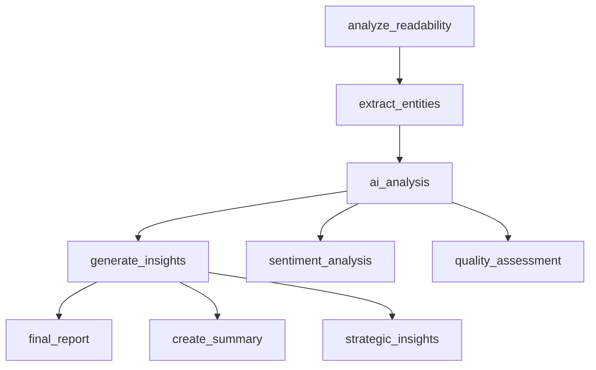

<Mermaid chart={`graph LR
    A[Installation] --> B[Core Concepts]
    B --> C[First Workflow]
    C --> D[Quick Start]

    classDef completed fill:#f8f9fa,stroke:#6c757d,stroke-width:1px,color:#495057
    classDef current fill:#e9ecef,stroke:#495057,stroke-width:2px,color:#212529
    classDef future fill:#f8f9fa,stroke:#dee2e6,stroke-width:1px,color:#6c757d

    class A,B completed
    class C current
    class D future`} />

In this comprehensive tutorial, you'll build a complete AI-powered workflow that demonstrates Compozy's core features. We'll create a **Smart Content Analyzer** that processes articles, extracts key information, and generates insights using multiple AI agents working together.

## Related Concepts

This tutorial demonstrates key Compozy concepts:
- **[Agent Configuration](/docs/core/agents/overview)** - Setting up AI agents with specific instructions
- **[Task Orchestration](/docs/core/tasks/basic-tasks)** - Coordinating multiple processing steps
- **[YAML Templates](/docs/core/yaml-templates/overview)** - Dynamic configuration and data flow
- **[Provider Integration](/docs/core/configuration/providers)** - Connecting to LLM services

## What You'll Build

By the end of this tutorial, you'll have a workflow that:
- Accepts article content as input
- Analyzes readability and sentiment
- Extracts key topics and entities
- Generates a comprehensive summary
- Provides actionable insights and recommendations

## Prerequisites

Before starting, ensure you have:
- Compozy installed and running ([Installation Guide](/docs/getting-started/installation))
- Basic understanding of [Core Concepts](/docs/getting-started/core-concepts)
- A text editor or IDE
- API key for an LLM provider (we'll use Groq in this example)

import { Steps, Step } from "@/components/ui/step";

## Building the project

<Steps numbered className="mt-8">

<Step title="Project Setup" description="Create a new directory and configure your project">

Create a new directory for your workflow project:

```bash
mkdir content-analyzer
cd content-analyzer
```

### Project Configuration

Create `compozy.yaml` to define your project:

```yaml
name: content-analyzer
version: "1.0.0"
description: AI-powered content analysis and insights generation

author:
  name: Your Name
  email: your.email@example.com

workflows:
  - source: ./workflow.yaml

models:
  - provider: groq
    model: llama-3.3-70b-versatile
    api_key: "{{ .env.GROQ_API_KEY }}"
  - provider: groq
    model: llama-3.1-8b-instant
    api_key: "{{ .env.GROQ_API_KEY }}"

runtime:
  type: deno
  entrypoint: "./main.ts"
  permissions:
    - --allow-read
    - --allow-net
    - --allow-env
```

### Environment Setup

Create `.env` file:

```bash
# Get your free API key from https://groq.com
GROQ_API_KEY=your_groq_api_key_here
```

</Step>

<Step title="Create Analysis Tools" description="Build TypeScript tools for text analysis">


### Readability Analysis Tool

Create `readability_tool.ts`:

```typescript
interface ReadabilityInput {
  content: string;
}

interface ReadabilityOutput {
  reading_level: string;
  avg_sentence_length: number;
  word_count: number;
  complex_words: number;
  readability_score: number;
}

const input: ReadabilityInput = JSON.parse(await Bun.stdin.text());

function calculateReadability(text: string): ReadabilityOutput {
  const sentences = text.split(/[.!?]+/).filter(s => s.trim().length > 0);
  const words = text.split(/\s+/).filter(w => w.length > 0);
  const complexWords = words.filter(word => word.length > 6);

  const avgSentenceLength = words.length / sentences.length;
  const complexWordRatio = complexWords.length / words.length;

  // Simplified Flesch Reading Ease calculation
  const readabilityScore = 206.835 - (1.015 * avgSentenceLength) - (84.6 * complexWordRatio);

  let readingLevel: string;
  if (readabilityScore >= 90) readingLevel = "Very Easy";
  else if (readabilityScore >= 80) readingLevel = "Easy";
  else if (readabilityScore >= 70) readingLevel = "Fairly Easy";
  else if (readabilityScore >= 60) readingLevel = "Standard";
  else if (readabilityScore >= 50) readingLevel = "Fairly Difficult";
  else if (readabilityScore >= 30) readingLevel = "Difficult";
  else readingLevel = "Very Difficult";

  return {
    reading_level: readingLevel,
    avg_sentence_length: Math.round(avgSentenceLength * 100) / 100,
    word_count: words.length,
    complex_words: complexWords.length,
    readability_score: Math.round(readabilityScore * 100) / 100
  };
}

const result = calculateReadability(input.content);
console.log(JSON.stringify(result));
```

### Entity Extraction Tool

Create `entity_extractor.ts`:

```typescript
interface EntityInput {
  content: string;
}

interface EntityOutput {
  people: string[];
  organizations: string[];
  locations: string[];
  dates: string[];
  topics: string[];
}

const input: EntityInput = JSON.parse(await Bun.stdin.text());

function extractEntities(text: string): EntityOutput {
  // Simple regex-based entity extraction (in production, use NLP libraries)
  const peopleRegex = /\b[A-Z][a-z]+ [A-Z][a-z]+\b/g;
  const orgRegex = /\b[A-Z][a-z]+ (?:Inc|Corp|LLC|Ltd|Company|Organization|Foundation)\b/g;
  const locationRegex = /\b(?:in|at|from) ([A-Z][a-z]+(?:, [A-Z][a-z]+)*)\b/g;
  const dateRegex = /\b(?:January|February|March|April|May|June|July|August|September|October|November|December) \d{1,2}, \d{4}\b/g;

  const people = [...new Set(text.match(peopleRegex) || [])];
  const organizations = [...new Set(text.match(orgRegex) || [])];
  const locations = [...new Set(Array.from(text.matchAll(locationRegex), m => m[1]))];
  const dates = [...new Set(text.match(dateRegex) || [])];

  // Extract topics using simple keyword analysis
  const commonWords = new Set(['the', 'and', 'or', 'but', 'in', 'on', 'at', 'to', 'for', 'of', 'with', 'by', 'is', 'are', 'was', 'were', 'be', 'been', 'have', 'has', 'had', 'do', 'does', 'did', 'will', 'would', 'could', 'should', 'may', 'might', 'must', 'can', 'shall', 'this', 'that', 'these', 'those', 'a', 'an']);

  const words = text.toLowerCase().split(/\s+/).map(w => w.replace(/[^\w]/g, ''));
  const wordFreq = new Map<string, number>();

  words.forEach(word => {
    if (word.length > 3 && !commonWords.has(word)) {
      wordFreq.set(word, (wordFreq.get(word) || 0) + 1);
    }
  });

  const topics = Array.from(wordFreq.entries())
    .sort((a, b) => b[1] - a[1])
    .slice(0, 5)
    .map(([word]) => word);

  return {
    people,
    organizations,
    locations,
    dates,
    topics
  };
}

const result = extractEntities(input.content);
console.log(JSON.stringify(result));
```

### Main Runtime Entry Point

Create `main.ts`:

```typescript
// Main runtime entry point for Bun
// This initializes the runtime environment for tools

console.log("Content Analyzer runtime initialized");

// Export any shared utilities or configurations
export const config = {
  version: "1.0.0",
  name: "content-analyzer"
};
```

</Step>

<Step title="Define AI Agents" description="Create agents that perform different analysis tasks using AI">


### Content Analysis Agent

Create `agents/content_analyzer.yaml`:

```yaml
resource: agent
id: content_analyzer
description: Analyzes content for sentiment, tone, and quality
version: 1.0.0

config:
  provider: groq
  model: llama-3.3-70b-versatile
  api_key: "{{ .env.GROQ_API_KEY }}"

instructions: |
  You are a professional content analyst with expertise in:
  - Sentiment analysis and emotional tone detection
  - Content quality assessment
  - Audience targeting and engagement evaluation
  - Writing style and voice analysis

  Always provide detailed, actionable insights with specific examples from the content.
  Be objective and constructive in your analysis.

actions:
  - id: analyze_sentiment
    json_mode: true
    prompt: |
      Analyze the sentiment and emotional tone of this content:

      "{{ .input.content }}"

      Provide detailed sentiment analysis including:
      - Overall sentiment (positive, negative, neutral)
      - Emotional tone (professional, casual, urgent, etc.)
      - Key phrases that indicate sentiment
      - Confidence level (0-100%)
    output:
      type: object
      properties:
        overall_sentiment:
          type: string
          enum: [positive, negative, neutral]
        emotional_tone:
          type: string
        confidence:
          type: number
          minimum: 0
          maximum: 100
        key_phrases:
          type: array
          items:
            type: string
        analysis_details:
          type: string
      required:
        - overall_sentiment
        - emotional_tone
        - confidence
        - key_phrases
        - analysis_details

  - id: assess_quality
    json_mode: true
    prompt: |
      Assess the overall quality of this content:

      "{{ .input.content }}"

      Evaluate based on:
      - Clarity and coherence
      - Accuracy and factual content
      - Engagement and readability
      - Structure and organization
      - Target audience appropriateness

      Provide a quality score (1-10) and detailed feedback.
    output:
      type: object
      properties:
        quality_score:
          type: number
          minimum: 1
          maximum: 10
        clarity_score:
          type: number
          minimum: 1
          maximum: 10
        engagement_score:
          type: number
          minimum: 1
          maximum: 10
        structure_score:
          type: number
          minimum: 1
          maximum: 10
        strengths:
          type: array
          items:
            type: string
        areas_for_improvement:
          type: array
          items:
            type: string
        detailed_feedback:
          type: string
      required:
        - quality_score
        - clarity_score
        - engagement_score
        - structure_score
        - strengths
        - areas_for_improvement
        - detailed_feedback
```

### Insight Generator Agent

Create `agents/insight_generator.yaml`:

```yaml
resource: agent
id: insight_generator
description: Generates actionable insights and recommendations
version: 1.0.0

config:
  provider: groq
  model: llama-3.1-8b-instant
  api_key: "{{ .env.GROQ_API_KEY }}"

instructions: |
  You are a strategic content consultant who specializes in:
  - Synthesizing complex analysis into clear insights
  - Providing actionable recommendations
  - Identifying content optimization opportunities
  - Creating executive summaries

  Always focus on practical, implementable suggestions that add real value.

actions:
  - id: generate_summary
    json_mode: true
    prompt: |
      Based on the comprehensive analysis results, generate a executive summary:

      Content Analysis:
      - Readability: {{ .input.readability | toJson }}
      - Sentiment: {{ .input.sentiment | toJson }}
      - Quality: {{ .input.quality | toJson }}
      - Entities: {{ .input.entities | toJson }}

      Create a concise executive summary with key findings and recommendations.
    output:
      type: object
      properties:
        executive_summary:
          type: string
        key_findings:
          type: array
          items:
            type: string
        recommendations:
          type: array
          items:
            type: object
            properties:
              category:
                type: string
              suggestion:
                type: string
              priority:
                type: string
                enum: [high, medium, low]
        content_score:
          type: number
          minimum: 0
          maximum: 100
      required:
        - executive_summary
        - key_findings
        - recommendations
        - content_score

  - id: generate_insights
    json_mode: true
    prompt: |
      Analyze the following content analysis results and provide strategic insights:

      Analysis Results:
      {{ .input.analysis_results | toJson }}

      Focus on:
      - Content performance patterns
      - Audience engagement potential
      - Optimization opportunities
      - Strategic recommendations
    output:
      type: object
      properties:
        insights:
          type: array
          items:
            type: object
            properties:
              insight:
                type: string
              impact:
                type: string
                enum: [high, medium, low]
              effort:
                type: string
                enum: [high, medium, low]
        next_steps:
          type: array
          items:
            type: string
        success_metrics:
          type: array
          items:
            type: string
      required:
        - insights
        - next_steps
        - success_metrics
```

</Step>

<Step title="Create the Main Workflow" description="Orchestrate all components into a cohesive workflow">


Create `workflow.yaml`:

```yaml
id: content-analyzer
version: 1.0.0
description: Comprehensive content analysis and insights generation workflow

config:
  input:
    type: object
    properties:
      content:
        type: string
        description: The article or content to analyze
        minLength: 100
      title:
        type: string
        description: Optional title for the content
      author:
        type: string
        description: Optional author name
    required:
      - content

schemas:
  - id: content_input
    type: object
    properties:
      content:
        type: string
        description: The content to analyze
    required:
      - content

tools:
  - id: readability_analyzer
    description: Analyzes text readability and complexity
    input:
      $ref: local::schemas.#(id=="content_input")

  - id: entity_extractor
    description: Extracts named entities and topics from content
    input:
      $ref: local::schemas.#(id=="content_input")

agents:
  - $ref: resource::agent::agents/content_analyzer.yaml#(id=="content_analyzer")
  - $ref: resource::agent::agents/insight_generator.yaml#(id=="insight_generator")

tasks:
  # Phase 1: Technical Analysis
  - id: analyze_readability
    type: basic
    description: Analyze content readability and complexity
    $use: tool(local::tools.#(id=="readability_analyzer"))
    with:
      content: "{{ .workflow.input.content }}"
    outputs:
      readability_metrics: "{{ .output }}"
    on_success:
      next: extract_entities

  - id: extract_entities
    type: basic
    description: Extract named entities and key topics
    $use: tool(local::tools.#(id=="entity_extractor"))
    with:
      content: "{{ .workflow.input.content }}"
    outputs:
      entities: "{{ .output }}"
    on_success:
      next: ai_analysis

  # Phase 2: AI-Powered Analysis
  - id: ai_analysis
    type: parallel
    description: Perform sentiment and quality analysis in parallel
    strategy: wait_all
    tasks:
      - id: sentiment_analysis
        type: basic
        $use: agent(local::agents.#(id=="content_analyzer"))
        action: analyze_sentiment
        with:
          content: "{{ .workflow.input.content }}"
        outputs:
          sentiment_results: "{{ .output }}"

      - id: quality_assessment
        type: basic
        $use: agent(local::agents.#(id=="content_analyzer"))
        action: assess_quality
        with:
          content: "{{ .workflow.input.content }}"
        outputs:
          quality_results: "{{ .output }}"
    on_success:
      next: generate_insights

  # Phase 3: Insight Generation
  - id: generate_insights
    type: composite
    description: Generate comprehensive insights and recommendations
    strategy: fail_fast
    tasks:
      - id: create_summary
        type: basic
        $use: agent(local::agents.#(id=="insight_generator"))
        action: generate_summary
        with:
          readability: "{{ .tasks.analyze_readability.output.readability_metrics }}"
          sentiment: "{{ .tasks.ai_analysis.children.sentiment_analysis.output.sentiment_results }}"
          quality: "{{ .tasks.ai_analysis.children.quality_assessment.output.quality_results }}"
          entities: "{{ .tasks.extract_entities.output.entities }}"
        outputs:
          executive_summary: "{{ .output }}"

      - id: strategic_insights
        type: basic
        $use: agent(local::agents.#(id=="insight_generator"))
        action: generate_insights
        with:
          analysis_results:
            readability: "{{ .tasks.analyze_readability.output.readability_metrics }}"
            sentiment: "{{ .tasks.ai_analysis.children.sentiment_analysis.output.sentiment_results }}"
            quality: "{{ .tasks.ai_analysis.children.quality_assessment.output.quality_results }}"
            entities: "{{ .tasks.extract_entities.output.entities }}"
        outputs:
          strategic_insights: "{{ .output }}"
    on_success:
      next: final_report

  # Phase 4: Final Report Generation
  - id: final_report
    type: aggregate
    description: Compile comprehensive analysis report
    outputs:
      metadata:
        title: "{{ .workflow.input.title | default \"Untitled Content\" }}"
        author: "{{ .workflow.input.author | default \"Unknown\" }}"
        analyzed_at: "{{ now }}"
        word_count: "{{ .tasks.analyze_readability.output.readability_metrics.word_count }}"

      technical_analysis:
        readability: "{{ .tasks.analyze_readability.output.readability_metrics }}"
        entities: "{{ .tasks.extract_entities.output.entities }}"

      ai_analysis:
        sentiment: "{{ .tasks.ai_analysis.children.sentiment_analysis.output.sentiment_results }}"
        quality: "{{ .tasks.ai_analysis.children.quality_assessment.output.quality_results }}"

      insights:
        executive_summary: "{{ .tasks.generate_insights.children.create_summary.output.executive_summary }}"
        strategic_insights: "{{ .tasks.generate_insights.children.strategic_insights.output.strategic_insights }}"

      overall_score: "{{ .tasks.generate_insights.children.create_summary.output.executive_summary.content_score }}"
    final: true

# Workflow outputs
outputs:
  analysis_complete: true
  report: "{{ .tasks.final_report.output }}"
  summary: "{{ .tasks.final_report.output.insights.executive_summary.executive_summary }}"
  score: "{{ .tasks.final_report.output.overall_score }}"
  recommendations: "{{ .tasks.final_report.output.insights.executive_summary.recommendations }}"
```

</Step>

<Step title="Test Your Workflow" description="Validate the workflow with sample content">


Create `test_content.txt`:

```text
Artificial Intelligence is revolutionizing the way we work and live. Companies like OpenAI and Google are leading the charge in developing advanced AI systems that can understand and generate human-like text. The implications of this technology are far-reaching, affecting industries from healthcare to finance.

In healthcare, AI is being used to diagnose diseases more accurately and develop personalized treatment plans. For instance, machine learning algorithms can analyze medical images to detect cancer cells with greater precision than human radiologists. This technology was first demonstrated at Stanford University in 2019 and has since been adopted by major hospitals worldwide.

The financial sector is also experiencing significant changes due to AI adoption. Banks are using AI-powered systems to detect fraudulent transactions in real-time, while investment firms leverage algorithms to make trading decisions. However, these advances also raise important questions about job displacement and the need for workforce retraining.

As we move forward, it's crucial to ensure that AI development remains ethical and transparent. Organizations must implement proper governance frameworks and consider the societal impact of their AI systems. The future of AI depends on our ability to harness its power responsibly while addressing potential risks and challenges.
```

### Test the Workflow

Create `test.http` to test your workflow:

```http
### Execute the content analyzer workflow
POST http://localhost:8000/api/v0/workflows/content-analyzer/execute
Content-Type: application/json

{
  "input": {
    "content": "Artificial Intelligence is revolutionizing the way we work and live. Companies like OpenAI and Google are leading the charge in developing advanced AI systems that can understand and generate human-like text. The implications of this technology are far-reaching, affecting industries from healthcare to finance.\n\nIn healthcare, AI is being used to diagnose diseases more accurately and develop personalized treatment plans. For instance, machine learning algorithms can analyze medical images to detect cancer cells with greater precision than human radiologists. This technology was first demonstrated at Stanford University in 2019 and has since been adopted by major hospitals worldwide.\n\nThe financial sector is also experiencing significant changes due to AI adoption. Banks are using AI-powered systems to detect fraudulent transactions in real-time, while investment firms leverage algorithms to make trading decisions. However, these advances also raise important questions about job displacement and the need for workforce retraining.\n\nAs we move forward, it's crucial to ensure that AI development remains ethical and transparent. Organizations must implement proper governance frameworks and consider the societal impact of their AI systems. The future of AI depends on our ability to harness its power responsibly while addressing potential risks and challenges.",
    "title": "AI Revolution in Modern Industries",
    "author": "Tech Analyst"
  }
}

### Check execution status
GET http://localhost:8000/api/v0/executions/{{execution_id}}
```

### Expected Output

Your workflow should return a comprehensive analysis like this:

```json
{
  "execution_id": "exec_123456",
  "status": "completed",
  "outputs": {
    "analysis_complete": true,
    "score": 75,
    "summary": "The content demonstrates strong technical knowledge and covers multiple AI applications effectively. The writing is clear and well-structured, making complex topics accessible to a general audience. Key strengths include comprehensive coverage of AI applications across industries and balanced perspective on benefits and challenges.",
    "recommendations": [
      {
        "category": "Content Structure",
        "suggestion": "Add more specific examples and case studies to support claims",
        "priority": "medium"
      },
      {
        "category": "Engagement",
        "suggestion": "Include more interactive elements or questions to engage readers",
        "priority": "low"
      }
    ],
    "report": {
      "metadata": {
        "title": "AI Revolution in Modern Industries",
        "author": "Tech Analyst",
        "analyzed_at": "2024-01-15T10:30:00Z",
        "word_count": 234
      },
      "technical_analysis": {
        "readability": {
          "reading_level": "Standard",
          "avg_sentence_length": 19.5,
          "word_count": 234,
          "complex_words": 45,
          "readability_score": 58.3
        },
        "entities": {
          "people": [],
          "organizations": ["OpenAI", "Google", "Stanford University"],
          "locations": [],
          "dates": ["2019"],
          "topics": ["artificial", "intelligence", "systems", "healthcare", "financial"]
        }
      },
      "ai_analysis": {
        "sentiment": {
          "overall_sentiment": "positive",
          "emotional_tone": "professional",
          "confidence": 85,
          "key_phrases": ["revolutionizing", "advanced AI systems", "greater precision", "significant changes"],
          "analysis_details": "The content maintains an optimistic yet balanced tone about AI development, acknowledging both benefits and challenges."
        },
        "quality": {
          "quality_score": 7,
          "clarity_score": 8,
          "engagement_score": 6,
          "structure_score": 8,
          "strengths": ["Clear structure", "Comprehensive coverage", "Balanced perspective"],
          "areas_for_improvement": ["More specific examples", "Stronger call to action", "Interactive elements"],
          "detailed_feedback": "Well-written piece with good flow and logical progression. Could benefit from more concrete examples and data to support claims."
        }
      }
    }
  }
}
```

</Step>

<Step title="Understanding the Workflow" description="Learn how the components work together">


Your workflow demonstrates several key Compozy concepts:

1. **Multi-phase execution**: Technical analysis → AI analysis → Insight generation → Final report
2. **Parallel processing**: Sentiment and quality analysis run simultaneously
3. **Composite tasks**: Multiple insight generation tasks grouped together
4. **Data flow**: Results from each phase feed into the next
5. **Resource references**: External agent configurations loaded dynamically

### Task Dependencies



### Key Features Demonstrated

- **Tool Integration**: TypeScript tools for technical analysis
- **Agent Actions**: Structured AI analysis with JSON schemas
- **Parallel Execution**: Multiple AI analyses running concurrently
- **Data Aggregation**: Combining results from multiple sources
- **Template Expressions**: Dynamic data access and transformation
- **Resource References**: Modular agent configurations

</Step>

<Step title="Extending Your Workflow" description="Add additional features and capabilities">


Create `sentiment_tool.ts` for additional sentiment analysis:

```typescript
interface SentimentInput {
  content: string;
}

interface SentimentOutput {
  polarity: number;
  subjectivity: number;
  emotions: Record<string, number>;
}

const input: SentimentInput = JSON.parse(await Bun.stdin.text());

// Simple sentiment analysis implementation
function analyzeSentiment(text: string): SentimentOutput {
  const positiveWords = ['good', 'great', 'excellent', 'amazing', 'wonderful', 'fantastic', 'beneficial', 'effective', 'successful'];
  const negativeWords = ['bad', 'terrible', 'awful', 'horrible', 'disappointing', 'problematic', 'challenging', 'difficult', 'concerning'];

  const words = text.toLowerCase().split(/\s+/);
  const positiveCount = words.filter(word => positiveWords.some(pos => word.includes(pos))).length;
  const negativeCount = words.filter(word => negativeWords.some(neg => word.includes(neg))).length;

  const polarity = (positiveCount - negativeCount) / words.length;
  const subjectivity = (positiveCount + negativeCount) / words.length;

  return {
    polarity: Math.round(polarity * 1000) / 1000,
    subjectivity: Math.round(subjectivity * 1000) / 1000,
    emotions: {
      positive: positiveCount,
      negative: negativeCount,
      neutral: words.length - positiveCount - negativeCount
    }
  };
}

const result = analyzeSentiment(input.content);
console.log(JSON.stringify(result));
```

### Add Memory Integration

Enhance your workflow with memory for historical analysis:

```yaml
# Add to workflow.yaml
tasks:
  - id: store_analysis
    type: memory
    operation: append
    key: "content_analysis:{{ .workflow.input.title | default \"untitled\" }}"
    content: |
      Analysis completed at {{ now }}:
      Score: {{ .tasks.final_report.output.overall_score }}
      Summary: {{ .tasks.final_report.output.insights.executive_summary.executive_summary }}
    on_success:
      next: final_report
```

### Add Conditional Logic

Use router tasks for different analysis paths:

```yaml
tasks:
  - id: content_router
    type: router
    condition: "{{ .tasks.analyze_readability.output.readability_metrics.word_count }}"
    routes:
      short:  # < 500 words
        condition: "{{ lt .tasks.analyze_readability.output.readability_metrics.word_count 500 }}"
        next: short_content_analysis
      long:   # >= 500 words
        condition: "{{ ge .tasks.analyze_readability.output.readability_metrics.word_count 500 }}"
        next: full_analysis
```

</Step>

</Steps>

## Troubleshooting

### Common Issues

**Agent not found errors**:
```bash
# Ensure agent files are in the correct location
ls -la agents/
# Check agent resource references in workflow.yaml
```

**Tool execution failures**:
```bash
# Test tools independently
deno run --allow-all readability_tool.ts
echo '{"content": "test"}' | deno run --allow-all readability_tool.ts
```

**API key issues**:
```bash
# Verify environment variables
echo $GROQ_API_KEY
# Test API connectivity
curl -H "Authorization: Bearer $GROQ_API_KEY" https://api.groq.com/openai/v1/models
```

**Template expression errors**:
```yaml
# Debug template expressions
debug_output: "{{ .tasks.analyze_readability.output | toJson }}"
```

### Performance Optimization

**Parallel execution**:
```yaml
# Use parallel tasks for independent operations
type: parallel
strategy: wait_all
```

**Resource management**:
```yaml
# Optimize runtime permissions
runtime:
  permissions:
    - --allow-read=./
    - --allow-net=api.groq.com
    - --allow-env=GROQ_API_KEY
```

## Next Steps

Congratulations! You've built a sophisticated AI-powered content analysis workflow. Here's how to continue learning:

### 🚀 Advanced Features
- **[Memory Systems](/docs/core/memory)** - Add persistent memory for user preferences
- **[Signal Tasks](/docs/core/signals)** - Create event-driven workflows
- **[MCP Integration](/docs/core/mcp)** - Connect external services and APIs
- **[Scheduled Workflows](/docs/core/scheduling)** - Automate content analysis

### 🔧 Workflow Patterns
- **[Multi-Agent Patterns](/docs/core/agents/multi-agent-patterns)** - Coordinate multiple AI agents
- **[Error Handling](/docs/core/tasks/flow-control)** - Robust error recovery strategies
- **[Performance Optimization](/docs/core/tasks/parallel-processing)** - Scale your workflows

### 💡 Real-World Applications
- **[Content Management](/docs/examples/content-generation)** - Automated content workflows
- **[Customer Support](/docs/examples/customer-support)** - AI-powered support systems
- **[Data Processing](/docs/examples/data-processing)** - Batch analysis pipelines

### 🌍 Community & Resources
- **[GitHub Repository](https://github.com/compozy/compozy)** - Source code and examples
- **[Discord Community](https://discord.gg/compozy)** - Get help and share projects
- **[Documentation](https://docs.compozy.dev)** - Complete reference guides

## See Also

### 📖 Related Documentation
- **[Quick Start Guide](/docs/core/getting-started/quick-start)** - Faster workflow creation for experienced users
- **[Core Concepts](/docs/core/getting-started/core-concepts)** - Deep dive into Compozy fundamentals
- **[Documentation Index](/docs/core/reference-index)** - Complete cross-reference system

### 🔧 Technical Deep Dives
- **[Agent Instructions & Actions](/docs/core/agents/instructions-actions)** - Master agent behavior definition
- **[Task Flow Control](/docs/core/tasks/flow-control)** - Advanced workflow orchestration
- **[YAML Template System](/docs/core/yaml-templates/overview)** - Dynamic configuration mastery
- **[Tool Development Guide](/docs/core/tools/typescript-development)** - Build custom tools

### 🏗️ Architecture & Patterns
- **[Multi-Agent Coordination](/docs/core/agents/multi-agent-patterns)** - Scale beyond single agents
- **[Memory & Context Management](/docs/core/memory/memory-concepts)** - Stateful workflow patterns
- **[Error Handling Strategies](/docs/core/tasks/flow-control)** - Production-ready resilience
- **[Performance Optimization](/docs/core/tasks/parallel-processing)** - High-performance workflows

You now have the foundation to build complex AI workflows with Compozy. The patterns you've learned here can be adapted to countless use cases across different industries and applications.
