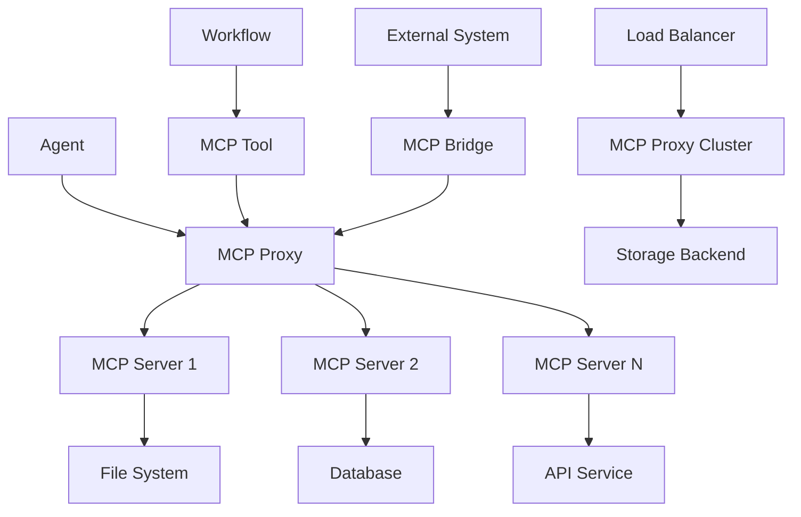

# Integration Patterns

MCP (Model Context Protocol) integration patterns provide proven approaches for connecting external tools and services with Compozy agents and workflows. This guide covers common patterns, best practices, and implementation strategies.

## Integration Architecture



## Agent Integration Patterns

### Single MCP Server Integration

Simple integration with one MCP server:

```yaml
# Agent configuration
resource: agent
id: file_manager
description: Agent with file system access via MCP
version: 1.0.0

config:
  provider: openai
  model: gpt-4
  api_key: "{{ .env.OPENAI_API_KEY }}"

# MCP server configuration
mcps:
  - id: filesystem
    transport: stdio
    command: npx
    args:
      - -y
      - "@modelcontextprotocol/server-filesystem"
      - "/workspace"
    proto: "2025-03-26"
    start_timeout: 15s

instructions: |
  You are a file management assistant with access to the file system.
  You can read, write, and organize files in the workspace directory.
  Always confirm destructive operations before executing them.

actions:
  - id: list_files
    prompt: |
      List all files in the current workspace directory.
      Show file sizes and modification dates.

  - id: read_file
    prompt: |
      Read the contents of: {{ .workflow.input.filename }}

  - id: write_file
    prompt: |
      Write the following content to {{ .workflow.input.filename }}:
      {{ .workflow.input.content }}

  - id: organize_files
    prompt: |
      Organize the files in the workspace by:
      1. Creating appropriate directory structure
      2. Moving files to logical locations
      3. Removing any duplicate files
```

### Multiple MCP Servers Integration

Agent accessing multiple MCP servers:

```yaml
resource: agent
id: development_assistant
description: Development assistant with multiple tool access
version: 1.0.0

config:
  provider: openai
  model: gpt-4
  api_key: "{{ .env.OPENAI_API_KEY }}"

# Multiple MCP servers
mcps:
  - id: filesystem
    transport: stdio
    command: npx
    args:
      - -y
      - "@modelcontextprotocol/server-filesystem"
      - "/workspace"
    proto: "2025-03-26"

  - id: database
    transport: stdio
    command: python
    args:
      - mcp_server_database.py
      - "--connection-string"
      - "{{ .env.DATABASE_URL }}"
    proto: "2025-03-26"

  - id: web_search
    url: "http://localhost:3001"
    transport: sse
    env:
      SEARCH_API_KEY: "{{ .env.SEARCH_API_KEY }}"
    proto: "2025-03-26"

instructions: |
  You are a development assistant with access to:
  1. File system operations
  2. Database queries and updates
  3. Web search capabilities

  Use these tools to help with development tasks, research, and code management.

actions:
  - id: research_and_implement
    prompt: |
      Research the topic: {{ .workflow.input.topic }}

      Then:
      1. Search for relevant information online
      2. Check existing code files for related implementations
      3. Query the database for existing data structures
      4. Implement a solution based on your findings

  - id: code_review
    prompt: |
      Review the code in: {{ .workflow.input.file_path }}

      Check for:
      1. Code quality and best practices
      2. Security vulnerabilities
      3. Performance optimizations
      4. Database query efficiency
```

### Dynamic MCP Server Selection

Agent that selects MCP servers based on context:

```yaml
resource: agent
id: adaptive_assistant
description: Assistant that adapts MCP server usage based on task
version: 1.0.0

config:
  provider: openai
  model: gpt-4
  api_key: "{{ .env.OPENAI_API_KEY }}"

mcps:
  - id: local_filesystem
    transport: stdio
    command: npx
    args: ["-y", "@modelcontextprotocol/server-filesystem", "./"]
    condition: '{{ eq .workflow.input.environment "local" }}'

  - id: remote_filesystem
    url: "http://remote-mcp:8080"
    transport: sse
    condition: '{{ eq .workflow.input.environment "remote" }}'

  - id: database_readonly
    transport: stdio
    command: python
    args: ["db_server.py", "--read-only"]
    condition: '{{ eq .workflow.input.operation_type "read" }}'

  - id: database_readwrite
    transport: stdio
    command: python
    args: ["db_server.py", "--full-access"]
    condition: '{{ eq .workflow.input.operation_type "write" }}'

instructions: |
  You are an adaptive assistant that uses different MCP servers based on the task context.
  The available MCP servers will vary based on the environment and operation type.

actions:
  - id: adaptive_operation
    prompt: |
      Task: {{ .workflow.input.task }}
      Environment: {{ .workflow.input.environment }}
      Operation Type: {{ .workflow.input.operation_type }}

      Use the appropriate MCP tools available for this context to complete the task.
```

## Workflow Integration Patterns

### MCP Tool Task Pattern

Using MCP tools directly in workflow tasks:

```yaml
id: data_processing_workflow
version: 1.0.0
description: Workflow using MCP tools for data processing

config:
  input:
    type: object
    properties:
      data_source:
        type: string
        description: Path to data source
      output_format:
        type: string
        enum: ["json", "csv", "xml"]

tools:
  - id: mcp_proxy_tool
    description: Access MCP servers via proxy
    input:
      type: object
      properties:
        mcp_server:
          type: string
          description: MCP server identifier
        tool_name:
          type: string
          description: Tool name to execute
        parameters:
          type: object
          description: Tool parameters

tasks:
  - id: read_data
    type: basic
    $use: tool(local::tools.#(id=="mcp_proxy_tool"))
    with:
      mcp_server: "filesystem"
      tool_name: "read_file"
      parameters:
        path: "{{ .workflow.input.data_source }}"
    outputs:
      raw_data: "{{ .output.content }}"

  - id: process_data
    type: basic
    $use: agent(local::agents.#(id=="data_processor"))
    with:
      data: "{{ .tasks.read_data.output.raw_data }}"
      format: "{{ .workflow.input.output_format }}"
    outputs:
      processed_data: "{{ .output.processed }}"

  - id: save_results
    type: basic
    $use: tool(local::tools.#(id=="mcp_proxy_tool"))
    with:
      mcp_server: "filesystem"
      tool_name: "write_file"
      parameters:
        path: "results.{{ .workflow.input.output_format }}"
        content: "{{ .tasks.process_data.output.processed_data }}"
```

### Parallel MCP Operations

Parallel execution with multiple MCP servers:

```yaml
id: parallel_mcp_workflow
version: 1.0.0
description: Parallel processing using multiple MCP servers

tasks:
  - id: parallel_data_collection
    type: parallel
    strategy: wait_all
    tasks:
      - id: collect_filesystem_data
        type: basic
        $use: tool(local::tools.#(id=="mcp_proxy_tool"))
        with:
          mcp_server: "filesystem"
          tool_name: "list_directory"
          parameters:
            path: "/data"

      - id: collect_database_data
        type: basic
        $use: tool(local::tools.#(id=="mcp_proxy_tool"))
        with:
          mcp_server: "database"
          tool_name: "query"
          parameters:
            sql: "SELECT * FROM data_table"

      - id: collect_api_data
        type: basic
        $use: tool(local::tools.#(id=="mcp_proxy_tool"))
        with:
          mcp_server: "web_api"
          tool_name: "fetch"
          parameters:
            url: "https://api.example.com/data"

  - id: merge_and_process
    type: basic
    $use: agent(local::agents.#(id=="data_merger"))
    with:
      filesystem_data: "{{ .tasks.parallel_data_collection.output.collect_filesystem_data }}"
      database_data: "{{ .tasks.parallel_data_collection.output.collect_database_data }}"
      api_data: "{{ .tasks.parallel_data_collection.output.collect_api_data }}"
    depends_on: [parallel_data_collection]
```

### Error Handling and Fallbacks

Robust error handling with MCP integrations:

```yaml
id: resilient_mcp_workflow
version: 1.0.0
description: Workflow with MCP error handling and fallbacks

tasks:
  - id: primary_data_access
    type: basic
    $use: tool(local::tools.#(id=="mcp_proxy_tool"))
    with:
      mcp_server: "primary_database"
      tool_name: "query"
      parameters:
        query: "{{ .workflow.input.query }}"

    retry:
      max_attempts: 3
      backoff: exponential
      backoff_factor: 2

    on_error: fallback_data_access

  - id: fallback_data_access
    type: basic
    $use: tool(local::tools.#(id=="mcp_proxy_tool"))
    with:
      mcp_server: "backup_database"
      tool_name: "query"
      parameters:
        query: "{{ .workflow.input.query }}"

    on_error: file_data_access

  - id: file_data_access
    type: basic
    $use: tool(local::tools.#(id=="mcp_proxy_tool"))
    with:
      mcp_server: "filesystem"
      tool_name: "read_file"
      parameters:
        path: "backup_data.json"

  - id: process_data
    type: basic
    $use: agent(local::agents.#(id=="data_processor"))
    with:
      data: |-
        {{- if .tasks.primary_data_access.output -}}
          {{ .tasks.primary_data_access.output }}
        {{- else if .tasks.fallback_data_access.output -}}
          {{ .tasks.fallback_data_access.output }}
        {{- else -}}
          {{ .tasks.file_data_access.output }}
        {{- end -}}
```

## MCP Tool Implementation Patterns

### Generic MCP Proxy Tool

Reusable tool for MCP server communication:

```typescript
// mcp_proxy_tool.ts
interface MCPProxyInput {
  mcp_server: string;
  tool_name: string;
  parameters: Record<string, any>;
  timeout?: number;
}

interface MCPProxyOutput {
  success: boolean;
  result?: any;
  error?: string;
  server_info?: {
    name: string;
    version: string;
    protocol_version: string;
  };
}

export default async function mcpProxyTool(input: MCPProxyInput): Promise<MCPProxyOutput> {
  const { mcp_server, tool_name, parameters, timeout = 30000 } = input;

  try {
    // Connect to MCP proxy
    const proxyUrl = process.env.MCP_PROXY_URL || 'http://localhost:8081';
    const authToken = process.env.MCP_PROXY_TOKEN;

    const headers: Record<string, string> = {
      'Content-Type': 'application/json',
    };

    if (authToken) {
      headers['Authorization'] = `Bearer ${authToken}`;
    }

    // Make request to MCP proxy
    const response = await fetch(`${proxyUrl}/api/v1/mcp/${mcp_server}/tool/${tool_name}`, {
      method: 'POST',
      headers,
      body: JSON.stringify(parameters),
      signal: AbortSignal.timeout(timeout),
    });

    if (!response.ok) {
      throw new Error(`HTTP ${response.status}: ${response.statusText}`);
    }

    const result = await response.json();

    return {
      success: true,
      result: result.result,
      server_info: result.server_info,
    };

  } catch (error) {
    return {
      success: false,
      error: error.message,
    };
  }
}
```

### Specialized MCP Tools

Domain-specific MCP tools:

```typescript
// filesystem_mcp_tool.ts
interface FilesystemInput {
  operation: 'read' | 'write' | 'list' | 'delete' | 'create_dir';
  path: string;
  content?: string;
  recursive?: boolean;
}

interface FilesystemOutput {
  success: boolean;
  result?: any;
  error?: string;
}

export default async function filesystemMCPTool(input: FilesystemInput): Promise<FilesystemOutput> {
  const { operation, path, content, recursive = false } = input;

  try {
    let toolName: string;
    let parameters: Record<string, any> = { path };

    switch (operation) {
      case 'read':
        toolName = 'read_file';
        break;
      case 'write':
        toolName = 'write_file';
        parameters.content = content;
        break;
      case 'list':
        toolName = 'list_directory';
        parameters.recursive = recursive;
        break;
      case 'delete':
        toolName = 'delete_file';
        break;
      case 'create_dir':
        toolName = 'create_directory';
        parameters.recursive = recursive;
        break;
      default:
        throw new Error(`Unsupported operation: ${operation}`);
    }

    // Use generic MCP proxy tool
    const result = await mcpProxyTool({
      mcp_server: 'filesystem',
      tool_name: toolName,
      parameters,
    });

    return result;

  } catch (error) {
    return {
      success: false,
      error: error.message,
    };
  }
}

// database_mcp_tool.ts
interface DatabaseInput {
  operation: 'query' | 'execute' | 'transaction';
  sql: string;
  parameters?: Record<string, any>;
  transaction_queries?: string[];
}

interface DatabaseOutput {
  success: boolean;
  result?: any;
  rows_affected?: number;
  error?: string;
}

export default async function databaseMCPTool(input: DatabaseInput): Promise<DatabaseOutput> {
  const { operation, sql, parameters = {}, transaction_queries = [] } = input;

  try {
    let toolName: string;
    let toolParameters: Record<string, any>;

    switch (operation) {
      case 'query':
        toolName = 'execute_query';
        toolParameters = { query: sql, parameters };
        break;
      case 'execute':
        toolName = 'execute_statement';
        toolParameters = { statement: sql, parameters };
        break;
      case 'transaction':
        toolName = 'execute_transaction';
        toolParameters = { queries: transaction_queries };
        break;
      default:
        throw new Error(`Unsupported operation: ${operation}`);
    }

    const result = await mcpProxyTool({
      mcp_server: 'database',
      tool_name: toolName,
      parameters: toolParameters,
    });

    return result;

  } catch (error) {
    return {
      success: false,
      error: error.message,
    };
  }
}
```

## External System Integration

### API Gateway Pattern

Integrate external APIs through MCP:

```yaml
# MCP Server for API Gateway
mcps:
  - id: api_gateway
    url: "http://api-gateway-mcp:8080"
    transport: sse
    env:
      API_GATEWAY_TOKEN: "{{ .env.API_GATEWAY_TOKEN }}"
      RATE_LIMIT_CONFIG: "1000/hour"
    proto: "2025-03-26"

# Workflow using API Gateway
id: api_integration_workflow
version: 1.0.0
description: Workflow integrating external APIs via MCP

tasks:
  - id: fetch_user_data
    type: basic
    $use: tool(local::tools.#(id=="mcp_proxy_tool"))
    with:
      mcp_server: "api_gateway"
      tool_name: "get_user"
      parameters:
        user_id: "{{ .workflow.input.user_id }}"
        include_preferences: true

  - id: update_user_preferences
    type: basic
    $use: tool(local::tools.#(id=="mcp_proxy_tool"))
    with:
      mcp_server: "api_gateway"
      tool_name: "update_user"
      parameters:
        user_id: "{{ .workflow.input.user_id }}"
        preferences: "{{ .workflow.input.new_preferences }}"
    depends_on: [fetch_user_data]

  - id: send_notification
    type: basic
    $use: tool(local::tools.#(id=="mcp_proxy_tool"))
    with:
      mcp_server: "api_gateway"
      tool_name: "send_notification"
      parameters:
        user_id: "{{ .workflow.input.user_id }}"
        message: "Your preferences have been updated"
        channel: "email"
    depends_on: [update_user_preferences]
```

### Message Queue Integration

Integrate with message queues via MCP:

```yaml
# MCP Server for Message Queue
mcps:
  - id: message_queue
    transport: stdio
    command: python
    args:
      - mcp_queue_server.py
      - "--queue-type"
      - "rabbitmq"
      - "--connection-string"
      - "{{ .env.RABBITMQ_URL }}"
    proto: "2025-03-26"

# Workflow with message queue integration
id: message_processing_workflow
version: 1.0.0
description: Workflow processing messages from queue

tasks:
  - id: consume_messages
    type: basic
    $use: tool(local::tools.#(id=="mcp_proxy_tool"))
    with:
      mcp_server: "message_queue"
      tool_name: "consume_messages"
      parameters:
        queue_name: "{{ .workflow.input.queue_name }}"
        max_messages: 10
        timeout: 30
    outputs:
      messages: "{{ .output.messages }}"

  - id: process_messages
    type: collection
    mode: parallel
    strategy: best_effort
    items: "{{ .tasks.consume_messages.output.messages }}"
    task:
      id: "process-message-{{ .index }}"
      type: basic
      $use: agent(local::agents.#(id=="message_processor"))
      with:
        message: "{{ .item }}"
        message_index: "{{ .index }}"
    depends_on: [consume_messages]

  - id: publish_results
    type: basic
    $use: tool(local::tools.#(id=="mcp_proxy_tool"))
    with:
      mcp_server: "message_queue"
      tool_name: "publish_message"
      parameters:
        exchange: "results"
        routing_key: "processed"
        message:
          processed_count: "{{ len .tasks.process_messages.output }}"
          results: "{{ .tasks.process_messages.output }}"
          timestamp: "{{ now }}"
    depends_on: [process_messages]
```

### Database Integration Patterns

Advanced database integration:

```yaml
# Multi-database MCP configuration
mcps:
  - id: primary_db
    transport: stdio
    command: python
    args:
      - mcp_db_server.py
      - "--db-type"
      - "postgresql"
      - "--connection-string"
      - "{{ .env.PRIMARY_DB_URL }}"
    proto: "2025-03-26"

  - id: analytics_db
    transport: stdio
    command: python
    args:
      - mcp_db_server.py
      - "--db-type"
      - "clickhouse"
      - "--connection-string"
      - "{{ .env.ANALYTICS_DB_URL }}"
    proto: "2025-03-26"

  - id: cache_db
    transport: stdio
    command: python
    args:
      - mcp_db_server.py
      - "--db-type"
      - "redis"
      - "--connection-string"
      - "{{ .env.REDIS_URL }}"
    proto: "2025-03-26"

# Workflow with multi-database operations
id: multi_db_workflow
version: 1.0.0
description: Workflow using multiple databases

tasks:
  - id: fetch_user_data
    type: basic
    $use: tool(local::tools.#(id=="database_mcp_tool"))
    with:
      mcp_server: "primary_db"
      operation: "query"
      sql: "SELECT * FROM users WHERE id = %(user_id)s"
      parameters:
        user_id: "{{ .workflow.input.user_id }}"

  - id: check_cache
    type: basic
    $use: tool(local::tools.#(id=="mcp_proxy_tool"))
    with:
      mcp_server: "cache_db"
      tool_name: "get"
      parameters:
        key: "user_analytics:{{ .workflow.input.user_id }}"

  - id: fetch_analytics
    type: basic
    $use: tool(local::tools.#(id=="database_mcp_tool"))
    with:
      mcp_server: "analytics_db"
      operation: "query"
      sql: "SELECT * FROM user_analytics WHERE user_id = %(user_id)s"
      parameters:
        user_id: "{{ .workflow.input.user_id }}"
    condition: "{{ empty .tasks.check_cache.output.result }}"

  - id: update_cache
    type: basic
    $use: tool(local::tools.#(id=="mcp_proxy_tool"))
    with:
      mcp_server: "cache_db"
      tool_name: "set"
      parameters:
        key: "user_analytics:{{ .workflow.input.user_id }}"
        value: "{{ .tasks.fetch_analytics.output.result }}"
        ttl: 3600
    condition: "{{ not (empty .tasks.fetch_analytics.output.result) }}"
    depends_on: [fetch_analytics]
```

## Best Practices

### Error Handling

```typescript
// Robust error handling in MCP tools
async function robustMCPCall(serverName: string, toolName: string, parameters: any, retries = 3): Promise<any> {
  let lastError: Error;

  for (let attempt = 1; attempt <= retries; attempt++) {
    try {
      const result = await mcpProxyTool({
        mcp_server: serverName,
        tool_name: toolName,
        parameters,
        timeout: 30000,
      });

      if (result.success) {
        return result.result;
      } else {
        throw new Error(result.error || 'Unknown MCP error');
      }

    } catch (error) {
      lastError = error;
      console.warn(`MCP call attempt ${attempt} failed: ${error.message}`);

      if (attempt < retries) {
        // Exponential backoff
        await new Promise(resolve => setTimeout(resolve, Math.pow(2, attempt) * 1000));
      }
    }
  }

  throw lastError;
}
```

### Connection Management

```typescript
// Connection pooling for MCP servers
class MCPConnectionPool {
  private connections: Map<string, Connection> = new Map();
  private maxConnections: number = 10;

  async getConnection(serverName: string): Promise<Connection> {
    let connection = this.connections.get(serverName);

    if (!connection || !connection.isHealthy()) {
      connection = await this.createConnection(serverName);
      this.connections.set(serverName, connection);
    }

    return connection;
  }

  private async createConnection(serverName: string): Promise<Connection> {
    // Implementation depends on MCP server type
    return new Connection(serverName);
  }

  async closeAll(): Promise<void> {
    for (const [name, connection] of this.connections) {
      await connection.close();
    }
    this.connections.clear();
  }
}
```

### Configuration Management

```yaml
# Environment-specific MCP configurations
mcps:
  - id: filesystem
    transport: stdio
    command: npx
    args:
      - -y
      - "@modelcontextprotocol/server-filesystem"
      - "{{ .env.WORKSPACE_PATH | default './workspace' }}"
    proto: "2025-03-26"
    env:
      LOG_LEVEL: "{{ .env.MCP_LOG_LEVEL | default 'INFO' }}"
      MAX_FILE_SIZE: "{{ .env.MAX_FILE_SIZE | default '10MB' }}"

  - id: database
    transport: stdio
    command: python
    args:
      - mcp_db_server.py
      - "--connection-string"
      - "{{ .env.DATABASE_URL }}"
    proto: "2025-03-26"
    env:
      POOL_SIZE: "{{ .env.DB_POOL_SIZE | default '10' }}"
      TIMEOUT: "{{ .env.DB_TIMEOUT | default '30' }}"
```

### Monitoring and Logging

```typescript
// MCP operation logging
class MCPLogger {
  static async logOperation(operation: string, serverName: string, toolName: string, parameters: any, result: any, duration: number): Promise<void> {
    const logEntry = {
      timestamp: new Date().toISOString(),
      operation,
      server_name: serverName,
      tool_name: toolName,
      parameters: this.sanitizeParameters(parameters),
      success: result.success,
      error: result.error,
      duration_ms: duration,
    };

    // Log to structured logging system
    console.log(JSON.stringify(logEntry));

    // Send to monitoring system
    await this.sendToMonitoring(logEntry);
  }

  private static sanitizeParameters(params: any): any {
    // Remove sensitive data before logging
    const sanitized = { ...params };

    // Remove common sensitive fields
    delete sanitized.password;
    delete sanitized.token;
    delete sanitized.api_key;
    delete sanitized.secret;

    return sanitized;
  }

  private static async sendToMonitoring(logEntry: any): Promise<void> {
    // Implementation depends on monitoring system
  }
}
```

This comprehensive guide provides proven patterns for integrating MCP servers with Compozy agents and workflows, ensuring robust, scalable, and maintainable integrations.

## Next Steps

- Configure [Security & Authentication](/docs/core/mcp/security-authentication) for MCP integrations
- Set up [Monitoring & Metrics](/docs/core/mcp/monitoring-metrics) for integration health
- Review [Production Deployment](/docs/core/mcp/production-deployment) considerations
- Explore [Development & Debugging](/docs/core/mcp/development-debugging) techniques
