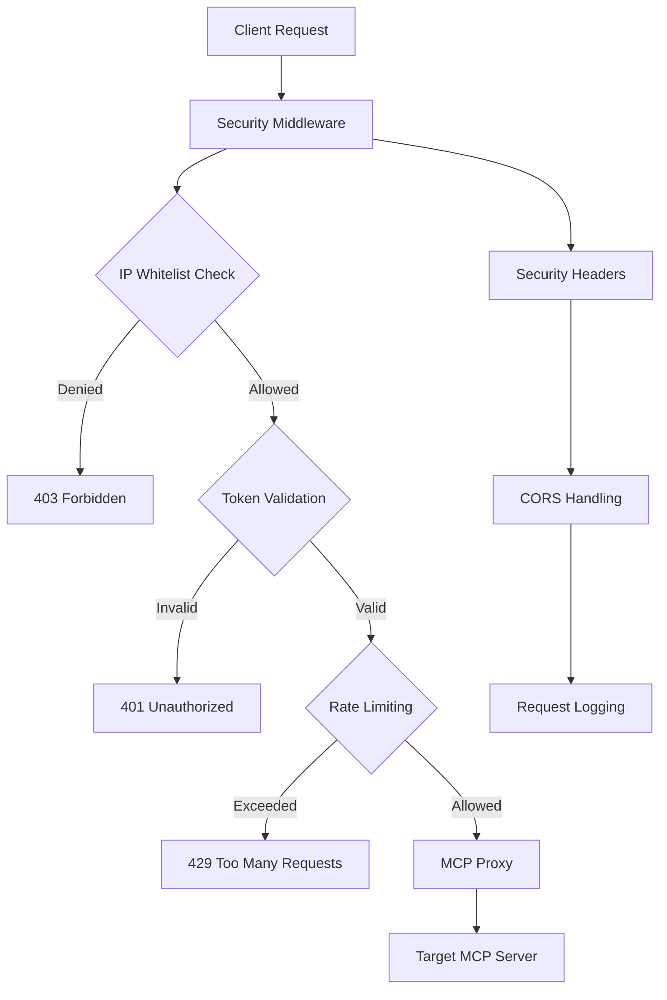

# Security & Authentication

The MCP Proxy provides comprehensive security features including token-based authentication, IP filtering, rate limiting, and security headers. This guide covers configuring and managing security for your MCP deployments.

## Security Architecture



## Token-Based Authentication

### Configuration

Configure authentication in your MCP proxy settings:

```yaml
# compozy.yaml
mcps:
  - id: secure_mcp_server
    url: "http://localhost:8081"
    transport: sse
    auth:
      type: token
      token: "{{ .env.MCP_AUTH_TOKEN }}"
      header: "Authorization"
      prefix: "Bearer"
    security:
      ip_whitelist:
        - "127.0.0.1"
        - "::1"
        - "192.168.1.0/24"
      rate_limit:
        requests_per_minute: 60
        burst_size: 10
```

### Environment Variables

Set authentication tokens securely:

```bash
# .env
MCP_AUTH_TOKEN=your-secure-token-here
MCP_ADMIN_TOKEN=admin-token-for-management
```

### Token Generation

Generate secure tokens programmatically:

```go
package main

import (
    "crypto/rand"
    "encoding/base64"
    "fmt"
)

func generateSecureToken(length int) (string, error) {
    bytes := make([]byte, length)
    if _, err := rand.Read(bytes); err != nil {
        return "", err
    }
    return base64.URLEncoding.EncodeToString(bytes), nil
}

func main() {
    token, err := generateSecureToken(32)
    if err != nil {
        panic(err)
    }
    fmt.Printf("Generated token: %s\n", token)
}
```

## IP Filtering and Access Control

### Whitelist Configuration

Configure IP whitelisting for access control:

```yaml
# IP whitelist configuration
mcps:
  - id: production_mcp
    url: "http://localhost:8081"
    security:
      ip_whitelist:
        # Local development
        - "127.0.0.1"
        - "::1"
        
        # Private networks
        - "192.168.0.0/16"
        - "10.0.0.0/8"
        - "172.16.0.0/12"
        
        # Specific production IPs
        - "203.0.113.0/24"
        - "198.51.100.0/24"
      
      # Block specific IPs
      ip_blacklist:
        - "192.168.1.100"
        - "10.0.0.50"
```

### Dynamic IP Management

Implement dynamic IP management:

```go
package security

import (
    "net"
    "sync"
    "time"
)

type IPManager struct {
    whitelist map[string]time.Time
    blacklist map[string]time.Time
    mu        sync.RWMutex
}

func NewIPManager() *IPManager {
    return &IPManager{
        whitelist: make(map[string]time.Time),
        blacklist: make(map[string]time.Time),
    }
}

func (m *IPManager) IsAllowed(ip string) bool {
    m.mu.RLock()
    defer m.mu.RUnlock()
    
    // Check blacklist first
    if expiry, exists := m.blacklist[ip]; exists {
        if time.Now().Before(expiry) {
            return false
        }
        // Remove expired blacklist entry
        delete(m.blacklist, ip)
    }
    
    // Check whitelist
    if expiry, exists := m.whitelist[ip]; exists {
        if time.Now().Before(expiry) {
            return true
        }
        // Remove expired whitelist entry
        delete(m.whitelist, ip)
    }
    
    return false
}

func (m *IPManager) AddToWhitelist(ip string, duration time.Duration) {
    m.mu.Lock()
    defer m.mu.Unlock()
    m.whitelist[ip] = time.Now().Add(duration)
}

func (m *IPManager) AddToBlacklist(ip string, duration time.Duration) {
    m.mu.Lock()
    defer m.mu.Unlock()
    m.blacklist[ip] = time.Now().Add(duration)
}

func (m *IPManager) IsInNetwork(ip string, networks []string) bool {
    clientIP := net.ParseIP(ip)
    if clientIP == nil {
        return false
    }
    
    for _, network := range networks {
        _, ipNet, err := net.ParseCIDR(network)
        if err != nil {
            // Try as single IP
            if netIP := net.ParseIP(network); netIP != nil {
                if clientIP.Equal(netIP) {
                    return true
                }
            }
            continue
        }
        
        if ipNet.Contains(clientIP) {
            return true
        }
    }
    
    return false
}
```

## Rate Limiting

### Configuration Options

Configure rate limiting to prevent abuse:

```yaml
mcps:
  - id: rate_limited_mcp
    url: "http://localhost:8081"
    security:
      rate_limit:
        # Global rate limits
        requests_per_minute: 100
        requests_per_hour: 1000
        requests_per_day: 10000
        
        # Burst capacity
        burst_size: 20
        
        # Per-IP limits
        per_ip_requests_per_minute: 10
        per_ip_burst_size: 5
        
        # Per-token limits
        per_token_requests_per_minute: 50
        per_token_burst_size: 10
```

### Rate Limiting Implementation

```go
package security

import (
    "fmt"
    "sync"
    "time"
)

type RateLimiter struct {
    limits map[string]*TokenBucket
    mu     sync.RWMutex
}

type TokenBucket struct {
    tokens     int
    maxTokens  int
    refillRate int
    lastRefill time.Time
    mu         sync.Mutex
}

func NewRateLimiter() *RateLimiter {
    return &RateLimiter{
        limits: make(map[string]*TokenBucket),
    }
}

func (rl *RateLimiter) Allow(key string, maxTokens, refillRate int) bool {
    rl.mu.Lock()
    bucket, exists := rl.limits[key]
    if !exists {
        bucket = &TokenBucket{
            tokens:     maxTokens,
            maxTokens:  maxTokens,
            refillRate: refillRate,
            lastRefill: time.Now(),
        }
        rl.limits[key] = bucket
    }
    rl.mu.Unlock()
    
    return bucket.consume()
}

func (tb *TokenBucket) consume() bool {
    tb.mu.Lock()
    defer tb.mu.Unlock()
    
    now := time.Now()
    elapsed := now.Sub(tb.lastRefill)
    
    // Refill tokens based on elapsed time
    tokensToAdd := int(elapsed.Seconds()) * tb.refillRate / 60 // per minute
    tb.tokens = min(tb.tokens+tokensToAdd, tb.maxTokens)
    tb.lastRefill = now
    
    if tb.tokens > 0 {
        tb.tokens--
        return true
    }
    
    return false
}

func min(a, b int) int {
    if a < b {
        return a
    }
    return b
}

// Usage example
func (rl *RateLimiter) CheckRequest(ip, token string) error {
    // Check per-IP rate limit
    if !rl.Allow(fmt.Sprintf("ip:%s", ip), 10, 10) {
        return fmt.Errorf("rate limit exceeded for IP: %s", ip)
    }
    
    // Check per-token rate limit
    if token != "" && !rl.Allow(fmt.Sprintf("token:%s", token), 50, 50) {
        return fmt.Errorf("rate limit exceeded for token")
    }
    
    return nil
}
```

## Security Headers

### HTTP Security Headers

Configure security headers for HTTP responses:

```go
package security

import (
    "net/http"
    "time"
)

type SecurityHeaders struct {
    CSPPolicy           string
    HSTSMaxAge          time.Duration
    XFrameOptions       string
    XContentTypeOptions string
    ReferrerPolicy      string
    PermissionsPolicy   string
}

func DefaultSecurityHeaders() *SecurityHeaders {
    return &SecurityHeaders{
        CSPPolicy: "default-src 'self'; script-src 'self' 'unsafe-inline'; style-src 'self' 'unsafe-inline'; connect-src 'self' ws: wss:",
        HSTSMaxAge: 365 * 24 * time.Hour,
        XFrameOptions: "DENY",
        XContentTypeOptions: "nosniff",
        ReferrerPolicy: "strict-origin-when-cross-origin",
        PermissionsPolicy: "camera=(), microphone=(), geolocation=()",
    }
}

func (sh *SecurityHeaders) Apply(w http.ResponseWriter) {
    if sh.CSPPolicy != "" {
        w.Header().Set("Content-Security-Policy", sh.CSPPolicy)
    }
    
    if sh.HSTSMaxAge > 0 {
        w.Header().Set("Strict-Transport-Security", 
            fmt.Sprintf("max-age=%d; includeSubDomains", int(sh.HSTSMaxAge.Seconds())))
    }
    
    if sh.XFrameOptions != "" {
        w.Header().Set("X-Frame-Options", sh.XFrameOptions)
    }
    
    if sh.XContentTypeOptions != "" {
        w.Header().Set("X-Content-Type-Options", sh.XContentTypeOptions)
    }
    
    if sh.ReferrerPolicy != "" {
        w.Header().Set("Referrer-Policy", sh.ReferrerPolicy)
    }
    
    if sh.PermissionsPolicy != "" {
        w.Header().Set("Permissions-Policy", sh.PermissionsPolicy)
    }
    
    // Additional security headers
    w.Header().Set("X-XSS-Protection", "1; mode=block")
    w.Header().Set("X-DNS-Prefetch-Control", "off")
    w.Header().Set("X-Download-Options", "noopen")
    w.Header().Set("X-Permitted-Cross-Domain-Policies", "none")
}
```

## CORS Configuration

### CORS Setup

Configure Cross-Origin Resource Sharing:

```yaml
mcps:
  - id: cors_enabled_mcp
    url: "http://localhost:8081"
    security:
      cors:
        enabled: true
        allowed_origins:
          - "https://app.example.com"
          - "https://admin.example.com"
        allowed_methods:
          - "GET"
          - "POST"
          - "PUT"
          - "DELETE"
          - "OPTIONS"
        allowed_headers:
          - "Content-Type"
          - "Authorization"
          - "X-Requested-With"
        exposed_headers:
          - "X-Total-Count"
          - "X-Rate-Limit-Remaining"
        allow_credentials: true
        max_age: 86400
```

### CORS Middleware

```go
package security

import (
    "net/http"
    "strings"
)

type CORSConfig struct {
    AllowedOrigins   []string
    AllowedMethods   []string
    AllowedHeaders   []string
    ExposedHeaders   []string
    AllowCredentials bool
    MaxAge           int
}

func (c *CORSConfig) Handler(next http.Handler) http.Handler {
    return http.HandlerFunc(func(w http.ResponseWriter, r *http.Request) {
        origin := r.Header.Get("Origin")
        
        // Check if origin is allowed
        if c.isOriginAllowed(origin) {
            w.Header().Set("Access-Control-Allow-Origin", origin)
        }
        
        // Set other CORS headers
        if len(c.AllowedMethods) > 0 {
            w.Header().Set("Access-Control-Allow-Methods", strings.Join(c.AllowedMethods, ", "))
        }
        
        if len(c.AllowedHeaders) > 0 {
            w.Header().Set("Access-Control-Allow-Headers", strings.Join(c.AllowedHeaders, ", "))
        }
        
        if len(c.ExposedHeaders) > 0 {
            w.Header().Set("Access-Control-Expose-Headers", strings.Join(c.ExposedHeaders, ", "))
        }
        
        if c.AllowCredentials {
            w.Header().Set("Access-Control-Allow-Credentials", "true")
        }
        
        if c.MaxAge > 0 {
            w.Header().Set("Access-Control-Max-Age", fmt.Sprintf("%d", c.MaxAge))
        }
        
        // Handle preflight requests
        if r.Method == "OPTIONS" {
            w.WriteHeader(http.StatusOK)
            return
        }
        
        next.ServeHTTP(w, r)
    })
}

func (c *CORSConfig) isOriginAllowed(origin string) bool {
    if len(c.AllowedOrigins) == 0 {
        return false
    }
    
    for _, allowed := range c.AllowedOrigins {
        if allowed == "*" || allowed == origin {
            return true
        }
        
        // Support wildcards
        if strings.HasPrefix(allowed, "*.") {
            domain := strings.TrimPrefix(allowed, "*.")
            if strings.HasSuffix(origin, domain) {
                return true
            }
        }
    }
    
    return false
}
```

## TLS/SSL Configuration

### TLS Setup

Configure TLS for secure connections:

```yaml
mcps:
  - id: secure_mcp_server
    url: "https://localhost:8443"
    transport: sse
    tls:
      enabled: true
      cert_file: "/path/to/cert.pem"
      key_file: "/path/to/key.pem"
      ca_file: "/path/to/ca.pem"
      insecure_skip_verify: false
      min_version: "1.2"
      max_version: "1.3"
      cipher_suites:
        - "TLS_AES_128_GCM_SHA256"
        - "TLS_AES_256_GCM_SHA384"
        - "TLS_CHACHA20_POLY1305_SHA256"
```

### Certificate Management

```go
package security

import (
    "crypto/tls"
    "crypto/x509"
    "fmt"
    "io/ioutil"
    "time"
)

type TLSConfig struct {
    CertFile           string
    KeyFile            string
    CAFile             string
    InsecureSkipVerify bool
    MinVersion         string
    MaxVersion         string
    CipherSuites       []string
}

func (tc *TLSConfig) BuildTLSConfig() (*tls.Config, error) {
    config := &tls.Config{
        InsecureSkipVerify: tc.InsecureSkipVerify,
    }
    
    // Load certificate and key
    if tc.CertFile != "" && tc.KeyFile != "" {
        cert, err := tls.LoadX509KeyPair(tc.CertFile, tc.KeyFile)
        if err != nil {
            return nil, fmt.Errorf("failed to load certificate: %w", err)
        }
        config.Certificates = []tls.Certificate{cert}
    }
    
    // Load CA certificate
    if tc.CAFile != "" {
        caCert, err := ioutil.ReadFile(tc.CAFile)
        if err != nil {
            return nil, fmt.Errorf("failed to read CA certificate: %w", err)
        }
        
        caCertPool := x509.NewCertPool()
        if !caCertPool.AppendCertsFromPEM(caCert) {
            return nil, fmt.Errorf("failed to parse CA certificate")
        }
        config.RootCAs = caCertPool
    }
    
    // Set TLS versions
    if tc.MinVersion != "" {
        config.MinVersion = tc.tlsVersionFromString(tc.MinVersion)
    }
    if tc.MaxVersion != "" {
        config.MaxVersion = tc.tlsVersionFromString(tc.MaxVersion)
    }
    
    // Set cipher suites
    if len(tc.CipherSuites) > 0 {
        config.CipherSuites = tc.cipherSuitesFromStrings(tc.CipherSuites)
    }
    
    return config, nil
}

func (tc *TLSConfig) tlsVersionFromString(version string) uint16 {
    switch version {
    case "1.0":
        return tls.VersionTLS10
    case "1.1":
        return tls.VersionTLS11
    case "1.2":
        return tls.VersionTLS12
    case "1.3":
        return tls.VersionTLS13
    default:
        return 0
    }
}

func (tc *TLSConfig) cipherSuitesFromStrings(suites []string) []uint16 {
    var result []uint16
    for _, suite := range suites {
        switch suite {
        case "TLS_AES_128_GCM_SHA256":
            result = append(result, tls.TLS_AES_128_GCM_SHA256)
        case "TLS_AES_256_GCM_SHA384":
            result = append(result, tls.TLS_AES_256_GCM_SHA384)
        case "TLS_CHACHA20_POLY1305_SHA256":
            result = append(result, tls.TLS_CHACHA20_POLY1305_SHA256)
        }
    }
    return result
}
```

## Security Monitoring

### Audit Logging

Implement comprehensive audit logging:

```go
package security

import (
    "encoding/json"
    "fmt"
    "net/http"
    "time"
)

type AuditEvent struct {
    Timestamp    time.Time `json:"timestamp"`
    Type         string    `json:"type"`
    Source       string    `json:"source"`
    User         string    `json:"user,omitempty"`
    Action       string    `json:"action"`
    Resource     string    `json:"resource,omitempty"`
    Success      bool      `json:"success"`
    Error        string    `json:"error,omitempty"`
    RemoteAddr   string    `json:"remote_addr"`
    UserAgent    string    `json:"user_agent"`
    RequestID    string    `json:"request_id"`
    SessionID    string    `json:"session_id,omitempty"`
}

type AuditLogger struct {
    events chan AuditEvent
}

func NewAuditLogger() *AuditLogger {
    logger := &AuditLogger{
        events: make(chan AuditEvent, 1000),
    }
    
    go logger.processEvents()
    return logger
}

func (al *AuditLogger) LogEvent(event AuditEvent) {
    event.Timestamp = time.Now()
    
    select {
    case al.events <- event:
    default:
        // Channel full, drop event or handle overflow
        fmt.Printf("Audit log channel full, dropping event: %+v\n", event)
    }
}

func (al *AuditLogger) processEvents() {
    for event := range al.events {
        // Log to multiple destinations
        al.logToJSON(event)
        al.logToSyslog(event)
        al.logToDatabase(event)
    }
}

func (al *AuditLogger) logToJSON(event AuditEvent) {
    data, err := json.Marshal(event)
    if err != nil {
        fmt.Printf("Failed to marshal audit event: %v\n", err)
        return
    }
    
    fmt.Printf("AUDIT: %s\n", string(data))
}

func (al *AuditLogger) logToSyslog(event AuditEvent) {
    // Implement syslog integration
}

func (al *AuditLogger) logToDatabase(event AuditEvent) {
    // Implement database logging
}

// Middleware for audit logging
func (al *AuditLogger) AuditMiddleware(next http.Handler) http.Handler {
    return http.HandlerFunc(func(w http.ResponseWriter, r *http.Request) {
        startTime := time.Now()
        
        // Capture response
        recorder := &responseRecorder{ResponseWriter: w, statusCode: 200}
        
        next.ServeHTTP(recorder, r)
        
        // Log the request
        al.LogEvent(AuditEvent{
            Type:       "http_request",
            Source:     "mcp_proxy",
            Action:     r.Method,
            Resource:   r.URL.Path,
            Success:    recorder.statusCode < 400,
            RemoteAddr: r.RemoteAddr,
            UserAgent:  r.UserAgent(),
            RequestID:  r.Header.Get("X-Request-ID"),
        })
    })
}

type responseRecorder struct {
    http.ResponseWriter
    statusCode int
}

func (rr *responseRecorder) WriteHeader(code int) {
    rr.statusCode = code
    rr.ResponseWriter.WriteHeader(code)
}
```

### Security Metrics

Track security-related metrics:

```go
package security

import (
    "sync"
    "time"
)

type SecurityMetrics struct {
    AuthenticationAttempts    int64
    AuthenticationFailures    int64
    RateLimitExceeded        int64
    IPBlocked                int64
    TokensGenerated          int64
    TokensRevoked            int64
    SecurityViolations       int64
    LastViolation            time.Time
    mu                       sync.RWMutex
}

func (sm *SecurityMetrics) IncrementAuthAttempts() {
    sm.mu.Lock()
    defer sm.mu.Unlock()
    sm.AuthenticationAttempts++
}

func (sm *SecurityMetrics) IncrementAuthFailures() {
    sm.mu.Lock()
    defer sm.mu.Unlock()
    sm.AuthenticationFailures++
}

func (sm *SecurityMetrics) IncrementRateLimitExceeded() {
    sm.mu.Lock()
    defer sm.mu.Unlock()
    sm.RateLimitExceeded++
}

func (sm *SecurityMetrics) IncrementIPBlocked() {
    sm.mu.Lock()
    defer sm.mu.Unlock()
    sm.IPBlocked++
}

func (sm *SecurityMetrics) IncrementSecurityViolations() {
    sm.mu.Lock()
    defer sm.mu.Unlock()
    sm.SecurityViolations++
    sm.LastViolation = time.Now()
}

func (sm *SecurityMetrics) GetMetrics() map[string]interface{} {
    sm.mu.RLock()
    defer sm.mu.RUnlock()
    
    return map[string]interface{}{
        "authentication_attempts": sm.AuthenticationAttempts,
        "authentication_failures": sm.AuthenticationFailures,
        "rate_limit_exceeded":     sm.RateLimitExceeded,
        "ip_blocked":              sm.IPBlocked,
        "tokens_generated":        sm.TokensGenerated,
        "tokens_revoked":          sm.TokensRevoked,
        "security_violations":     sm.SecurityViolations,
        "last_violation":          sm.LastViolation,
    }
}
```

## Best Practices

### Security Checklist

1. **Authentication**
   - Use strong, randomly generated tokens
   - Implement token rotation
   - Store tokens securely (environment variables, secrets manager)
   - Validate tokens on every request

2. **Authorization**
   - Implement role-based access control
   - Use principle of least privilege
   - Validate permissions for each operation
   - Audit access patterns

3. **Network Security**
   - Use HTTPS/TLS in production
   - Implement IP whitelisting
   - Configure proper firewall rules
   - Monitor network traffic

4. **Input Validation**
   - Validate all inputs
   - Sanitize user data
   - Use parameterized queries
   - Implement input length limits

5. **Monitoring and Alerting**
   - Log all security events
   - Monitor for suspicious activity
   - Set up alerts for security violations
   - Regular security audits

### Security Testing

```bash
# Test authentication
curl -H "Authorization: Bearer invalid-token" http://localhost:8081/api/v1/mcp/list

# Test rate limiting
for i in {1..100}; do
  curl -H "Authorization: Bearer $TOKEN" http://localhost:8081/api/v1/mcp/list
done

# Test IP filtering
curl -H "X-Forwarded-For: 192.168.1.100" http://localhost:8081/api/v1/mcp/list
```

### Security Configuration Template

```yaml
# Production security configuration
mcps:
  - id: production_mcp
    url: "https://mcp.example.com"
    auth:
      type: token
      token: "{{ .env.MCP_PRODUCTION_TOKEN }}"
      header: "Authorization"
      prefix: "Bearer"
    
    security:
      # IP restrictions
      ip_whitelist:
        - "10.0.0.0/8"
        - "172.16.0.0/12"
        - "192.168.0.0/16"
      
      # Rate limiting
      rate_limit:
        requests_per_minute: 60
        burst_size: 10
        per_ip_requests_per_minute: 10
      
      # CORS configuration
      cors:
        enabled: true
        allowed_origins:
          - "https://app.example.com"
        allowed_methods: ["GET", "POST"]
        allow_credentials: true
        max_age: 86400
      
      # TLS configuration
      tls:
        enabled: true
        min_version: "1.2"
        cipher_suites:
          - "TLS_AES_128_GCM_SHA256"
          - "TLS_AES_256_GCM_SHA384"
```

This comprehensive security configuration ensures your MCP deployments are protected against common threats while maintaining performance and usability.

## Next Steps

- Configure [Storage Backends](/docs/core/mcp/storage-backends) for security tokens
- Set up [Monitoring & Metrics](/docs/core/mcp/monitoring-metrics) for security events
- Review [Production Deployment](/docs/core/mcp/production-deployment) security considerations
- Explore [Integration Patterns](/docs/core/mcp/integration-patterns) for secure workflows
