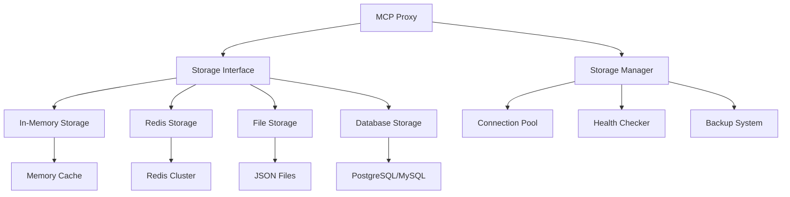

# Storage Backends

The MCP Proxy supports multiple storage backends for persisting MCP server definitions, connection states, and operational data. This guide covers configuration, implementation, and management of different storage options.

## Storage Architecture



## In-Memory Storage

### Configuration

Configure in-memory storage for development and testing:

```yaml
# compozy.yaml
mcps:
  - id: development_mcp
    url: "http://localhost:8081"
    storage:
      type: memory
      config:
        max_entries: 1000
        ttl: 3600s
        cleanup_interval: 300s
        gc_threshold: 0.8
```

### Implementation

```go
package storage

import (
    "context"
    "encoding/json"
    "fmt"
    "sync"
    "time"
)

type MemoryStorage struct {
    data          map[string]*StorageEntry
    mu            sync.RWMutex
    maxEntries    int
    defaultTTL    time.Duration
    cleanupTicker *time.Ticker
    stopCh        chan struct{}
}

type StorageEntry struct {
    Value     interface{}
    ExpiresAt time.Time
    CreatedAt time.Time
    UpdatedAt time.Time
}

func NewMemoryStorage(maxEntries int, defaultTTL time.Duration) *MemoryStorage {
    ms := &MemoryStorage{
        data:       make(map[string]*StorageEntry),
        maxEntries: maxEntries,
        defaultTTL: defaultTTL,
        stopCh:     make(chan struct{}),
    }
    
    // Start cleanup routine
    ms.cleanupTicker = time.NewTicker(5 * time.Minute)
    go ms.cleanupExpired()
    
    return ms
}

func (ms *MemoryStorage) Set(ctx context.Context, key string, value interface{}, ttl time.Duration) error {
    ms.mu.Lock()
    defer ms.mu.Unlock()
    
    // Check if we need to make space
    if len(ms.data) >= ms.maxEntries {
        if err := ms.evictOldest(); err != nil {
            return fmt.Errorf("failed to evict entries: %w", err)
        }
    }
    
    if ttl == 0 {
        ttl = ms.defaultTTL
    }
    
    now := time.Now()
    ms.data[key] = &StorageEntry{
        Value:     value,
        ExpiresAt: now.Add(ttl),
        CreatedAt: now,
        UpdatedAt: now,
    }
    
    return nil
}

func (ms *MemoryStorage) Get(ctx context.Context, key string) (interface{}, error) {
    ms.mu.RLock()
    defer ms.mu.RUnlock()
    
    entry, exists := ms.data[key]
    if !exists {
        return nil, fmt.Errorf("key not found: %s", key)
    }
    
    if time.Now().After(entry.ExpiresAt) {
        delete(ms.data, key)
        return nil, fmt.Errorf("key expired: %s", key)
    }
    
    return entry.Value, nil
}

func (ms *MemoryStorage) Delete(ctx context.Context, key string) error {
    ms.mu.Lock()
    defer ms.mu.Unlock()
    
    delete(ms.data, key)
    return nil
}

func (ms *MemoryStorage) List(ctx context.Context, prefix string) ([]string, error) {
    ms.mu.RLock()
    defer ms.mu.RUnlock()
    
    var keys []string
    for key := range ms.data {
        if prefix == "" || strings.HasPrefix(key, prefix) {
            keys = append(keys, key)
        }
    }
    
    return keys, nil
}

func (ms *MemoryStorage) Health(ctx context.Context) error {
    ms.mu.RLock()
    defer ms.mu.RUnlock()
    
    usage := float64(len(ms.data)) / float64(ms.maxEntries)
    if usage > 0.9 {
        return fmt.Errorf("memory storage usage high: %.2f%%", usage*100)
    }
    
    return nil
}

func (ms *MemoryStorage) Close() error {
    close(ms.stopCh)
    ms.cleanupTicker.Stop()
    return nil
}

func (ms *MemoryStorage) cleanupExpired() {
    for {
        select {
        case <-ms.cleanupTicker.C:
            ms.mu.Lock()
            now := time.Now()
            for key, entry := range ms.data {
                if now.After(entry.ExpiresAt) {
                    delete(ms.data, key)
                }
            }
            ms.mu.Unlock()
        case <-ms.stopCh:
            return
        }
    }
}

func (ms *MemoryStorage) evictOldest() error {
    if len(ms.data) == 0 {
        return nil
    }
    
    var oldestKey string
    var oldestTime time.Time
    
    for key, entry := range ms.data {
        if oldestKey == "" || entry.CreatedAt.Before(oldestTime) {
            oldestKey = key
            oldestTime = entry.CreatedAt
        }
    }
    
    delete(ms.data, oldestKey)
    return nil
}

func (ms *MemoryStorage) Stats() map[string]interface{} {
    ms.mu.RLock()
    defer ms.mu.RUnlock()
    
    return map[string]interface{}{
        "type":        "memory",
        "entries":     len(ms.data),
        "max_entries": ms.maxEntries,
        "usage":       float64(len(ms.data)) / float64(ms.maxEntries),
    }
}
```

## Redis Storage

### Configuration

Configure Redis storage for production environments:

```yaml
# compozy.yaml
mcps:
  - id: production_mcp
    url: "http://localhost:8081"
    storage:
      type: redis
      config:
        address: "localhost:6379"
        password: "{{ .env.REDIS_PASSWORD }}"
        database: 0
        pool_size: 10
        min_idle_connections: 5
        max_retries: 3
        dial_timeout: 5s
        read_timeout: 3s
        write_timeout: 3s
        pool_timeout: 4s
        idle_timeout: 300s
        key_prefix: "mcp:"
        cluster_mode: false
        sentinel_mode: false
```

### Redis Cluster Configuration

```yaml
# Redis cluster configuration
mcps:
  - id: clustered_mcp
    storage:
      type: redis
      config:
        cluster_mode: true
        cluster_addresses:
          - "redis-node1:6379"
          - "redis-node2:6379"
          - "redis-node3:6379"
        cluster_password: "{{ .env.REDIS_CLUSTER_PASSWORD }}"
        max_redirects: 8
        read_only: false
        route_by_latency: true
        route_randomly: false
```

### Redis Implementation

```go
package storage

import (
    "context"
    "encoding/json"
    "fmt"
    "strings"
    "time"
    
    "github.com/redis/go-redis/v9"
)

type RedisStorage struct {
    client    redis.UniversalClient
    keyPrefix string
}

type RedisConfig struct {
    Address             string        `yaml:"address"`
    Password            string        `yaml:"password"`
    Database            int           `yaml:"database"`
    PoolSize            int           `yaml:"pool_size"`
    MinIdleConnections  int           `yaml:"min_idle_connections"`
    MaxRetries          int           `yaml:"max_retries"`
    DialTimeout         time.Duration `yaml:"dial_timeout"`
    ReadTimeout         time.Duration `yaml:"read_timeout"`
    WriteTimeout        time.Duration `yaml:"write_timeout"`
    PoolTimeout         time.Duration `yaml:"pool_timeout"`
    IdleTimeout         time.Duration `yaml:"idle_timeout"`
    KeyPrefix           string        `yaml:"key_prefix"`
    ClusterMode         bool          `yaml:"cluster_mode"`
    ClusterAddresses    []string      `yaml:"cluster_addresses"`
    ClusterPassword     string        `yaml:"cluster_password"`
    SentinelMode        bool          `yaml:"sentinel_mode"`
    SentinelAddresses   []string      `yaml:"sentinel_addresses"`
    SentinelPassword    string        `yaml:"sentinel_password"`
    MasterName          string        `yaml:"master_name"`
}

func NewRedisStorage(config *RedisConfig) (*RedisStorage, error) {
    var client redis.UniversalClient
    
    if config.ClusterMode {
        client = redis.NewClusterClient(&redis.ClusterOptions{
            Addrs:        config.ClusterAddresses,
            Password:     config.ClusterPassword,
            DialTimeout:  config.DialTimeout,
            ReadTimeout:  config.ReadTimeout,
            WriteTimeout: config.WriteTimeout,
            PoolSize:     config.PoolSize,
            MinIdleConns: config.MinIdleConnections,
            MaxRetries:   config.MaxRetries,
        })
    } else if config.SentinelMode {
        client = redis.NewFailoverClient(&redis.FailoverOptions{
            MasterName:       config.MasterName,
            SentinelAddrs:    config.SentinelAddresses,
            SentinelPassword: config.SentinelPassword,
            Password:         config.Password,
            DB:               config.Database,
            DialTimeout:      config.DialTimeout,
            ReadTimeout:      config.ReadTimeout,
            WriteTimeout:     config.WriteTimeout,
            PoolSize:         config.PoolSize,
            MinIdleConns:     config.MinIdleConnections,
            MaxRetries:       config.MaxRetries,
        })
    } else {
        client = redis.NewClient(&redis.Options{
            Addr:         config.Address,
            Password:     config.Password,
            DB:           config.Database,
            DialTimeout:  config.DialTimeout,
            ReadTimeout:  config.ReadTimeout,
            WriteTimeout: config.WriteTimeout,
            PoolSize:     config.PoolSize,
            MinIdleConns: config.MinIdleConnections,
            MaxRetries:   config.MaxRetries,
        })
    }
    
    // Test connection
    ctx, cancel := context.WithTimeout(context.Background(), 5*time.Second)
    defer cancel()
    
    if err := client.Ping(ctx).Err(); err != nil {
        return nil, fmt.Errorf("failed to connect to Redis: %w", err)
    }
    
    return &RedisStorage{
        client:    client,
        keyPrefix: config.KeyPrefix,
    }, nil
}

func (rs *RedisStorage) Set(ctx context.Context, key string, value interface{}, ttl time.Duration) error {
    fullKey := rs.keyPrefix + key
    
    data, err := json.Marshal(value)
    if err != nil {
        return fmt.Errorf("failed to marshal value: %w", err)
    }
    
    if ttl == 0 {
        ttl = 24 * time.Hour // Default TTL
    }
    
    return rs.client.Set(ctx, fullKey, data, ttl).Err()
}

func (rs *RedisStorage) Get(ctx context.Context, key string) (interface{}, error) {
    fullKey := rs.keyPrefix + key
    
    data, err := rs.client.Get(ctx, fullKey).Result()
    if err != nil {
        if err == redis.Nil {
            return nil, fmt.Errorf("key not found: %s", key)
        }
        return nil, fmt.Errorf("failed to get key: %w", err)
    }
    
    var value interface{}
    if err := json.Unmarshal([]byte(data), &value); err != nil {
        return nil, fmt.Errorf("failed to unmarshal value: %w", err)
    }
    
    return value, nil
}

func (rs *RedisStorage) Delete(ctx context.Context, key string) error {
    fullKey := rs.keyPrefix + key
    return rs.client.Del(ctx, fullKey).Err()
}

func (rs *RedisStorage) List(ctx context.Context, prefix string) ([]string, error) {
    fullPrefix := rs.keyPrefix + prefix + "*"
    
    keys, err := rs.client.Keys(ctx, fullPrefix).Result()
    if err != nil {
        return nil, fmt.Errorf("failed to list keys: %w", err)
    }
    
    // Remove key prefix from results
    var result []string
    for _, key := range keys {
        if strings.HasPrefix(key, rs.keyPrefix) {
            result = append(result, strings.TrimPrefix(key, rs.keyPrefix))
        }
    }
    
    return result, nil
}

func (rs *RedisStorage) Health(ctx context.Context) error {
    return rs.client.Ping(ctx).Err()
}

func (rs *RedisStorage) Close() error {
    return rs.client.Close()
}

func (rs *RedisStorage) Stats() map[string]interface{} {
    ctx := context.Background()
    info := rs.client.Info(ctx, "memory", "stats").Val()
    
    stats := map[string]interface{}{
        "type": "redis",
        "info": info,
    }
    
    // Parse specific metrics
    lines := strings.Split(info, "\n")
    for _, line := range lines {
        if strings.Contains(line, "used_memory_human") {
            stats["memory_usage"] = strings.Split(line, ":")[1]
        }
        if strings.Contains(line, "connected_clients") {
            stats["connected_clients"] = strings.Split(line, ":")[1]
        }
    }
    
    return stats
}

// Advanced Redis operations
func (rs *RedisStorage) SetWithExpiration(ctx context.Context, key string, value interface{}, expiration time.Time) error {
    ttl := time.Until(expiration)
    if ttl <= 0 {
        return fmt.Errorf("expiration time is in the past")
    }
    
    return rs.Set(ctx, key, value, ttl)
}

func (rs *RedisStorage) GetTTL(ctx context.Context, key string) (time.Duration, error) {
    fullKey := rs.keyPrefix + key
    return rs.client.TTL(ctx, fullKey).Result()
}

func (rs *RedisStorage) Expire(ctx context.Context, key string, ttl time.Duration) error {
    fullKey := rs.keyPrefix + key
    return rs.client.Expire(ctx, fullKey, ttl).Err()
}

func (rs *RedisStorage) Exists(ctx context.Context, key string) (bool, error) {
    fullKey := rs.keyPrefix + key
    count, err := rs.client.Exists(ctx, fullKey).Result()
    return count > 0, err
}

// Batch operations
func (rs *RedisStorage) MultiSet(ctx context.Context, keyValues map[string]interface{}, ttl time.Duration) error {
    pipe := rs.client.Pipeline()
    
    for key, value := range keyValues {
        data, err := json.Marshal(value)
        if err != nil {
            return fmt.Errorf("failed to marshal value for key %s: %w", key, err)
        }
        
        fullKey := rs.keyPrefix + key
        pipe.Set(ctx, fullKey, data, ttl)
    }
    
    _, err := pipe.Exec(ctx)
    return err
}

func (rs *RedisStorage) MultiGet(ctx context.Context, keys []string) (map[string]interface{}, error) {
    pipe := rs.client.Pipeline()
    
    // Build pipeline commands
    commands := make(map[string]*redis.StringCmd)
    for _, key := range keys {
        fullKey := rs.keyPrefix + key
        commands[key] = pipe.Get(ctx, fullKey)
    }
    
    _, err := pipe.Exec(ctx)
    if err != nil {
        return nil, err
    }
    
    // Process results
    result := make(map[string]interface{})
    for key, cmd := range commands {
        data, err := cmd.Result()
        if err != nil {
            if err == redis.Nil {
                continue // Skip missing keys
            }
            return nil, fmt.Errorf("failed to get key %s: %w", key, err)
        }
        
        var value interface{}
        if err := json.Unmarshal([]byte(data), &value); err != nil {
            return nil, fmt.Errorf("failed to unmarshal value for key %s: %w", key, err)
        }
        
        result[key] = value
    }
    
    return result, nil
}
```

## File Storage

### Configuration

Configure file-based storage:

```yaml
mcps:
  - id: file_based_mcp
    storage:
      type: file
      config:
        base_path: "/var/lib/compozy/mcp"
        file_permissions: 0644
        dir_permissions: 0755
        sync_writes: true
        backup_enabled: true
        backup_interval: 3600s
        max_backups: 10
```

### File Storage Implementation

```go
package storage

import (
    "context"
    "encoding/json"
    "fmt"
    "io/fs"
    "os"
    "path/filepath"
    "strings"
    "sync"
    "time"
)

type FileStorage struct {
    basePath        string
    filePermissions fs.FileMode
    dirPermissions  fs.FileMode
    syncWrites      bool
    mu              sync.RWMutex
    backupEnabled   bool
    backupInterval  time.Duration
    maxBackups      int
    backupTicker    *time.Ticker
    stopCh          chan struct{}
}

type FileConfig struct {
    BasePath        string        `yaml:"base_path"`
    FilePermissions fs.FileMode   `yaml:"file_permissions"`
    DirPermissions  fs.FileMode   `yaml:"dir_permissions"`
    SyncWrites      bool          `yaml:"sync_writes"`
    BackupEnabled   bool          `yaml:"backup_enabled"`
    BackupInterval  time.Duration `yaml:"backup_interval"`
    MaxBackups      int           `yaml:"max_backups"`
}

func NewFileStorage(config *FileConfig) (*FileStorage, error) {
    // Create base directory if it doesn't exist
    if err := os.MkdirAll(config.BasePath, config.DirPermissions); err != nil {
        return nil, fmt.Errorf("failed to create base directory: %w", err)
    }
    
    fs := &FileStorage{
        basePath:        config.BasePath,
        filePermissions: config.FilePermissions,
        dirPermissions:  config.DirPermissions,
        syncWrites:      config.SyncWrites,
        backupEnabled:   config.BackupEnabled,
        backupInterval:  config.BackupInterval,
        maxBackups:      config.MaxBackups,
        stopCh:          make(chan struct{}),
    }
    
    // Start backup routine if enabled
    if config.BackupEnabled {
        fs.backupTicker = time.NewTicker(config.BackupInterval)
        go fs.backupRoutine()
    }
    
    return fs, nil
}

func (fs *FileStorage) Set(ctx context.Context, key string, value interface{}, ttl time.Duration) error {
    fs.mu.Lock()
    defer fs.mu.Unlock()
    
    filePath := fs.getFilePath(key)
    
    // Create directory if it doesn't exist
    dir := filepath.Dir(filePath)
    if err := os.MkdirAll(dir, fs.dirPermissions); err != nil {
        return fmt.Errorf("failed to create directory: %w", err)
    }
    
    // Create file entry with metadata
    entry := &FileEntry{
        Value:     value,
        CreatedAt: time.Now(),
        UpdatedAt: time.Now(),
    }
    
    if ttl > 0 {
        entry.ExpiresAt = time.Now().Add(ttl)
    }
    
    data, err := json.Marshal(entry)
    if err != nil {
        return fmt.Errorf("failed to marshal entry: %w", err)
    }
    
    // Write to temporary file first
    tempPath := filePath + ".tmp"
    if err := os.WriteFile(tempPath, data, fs.filePermissions); err != nil {
        return fmt.Errorf("failed to write temporary file: %w", err)
    }
    
    // Atomic rename
    if err := os.Rename(tempPath, filePath); err != nil {
        os.Remove(tempPath) // Clean up temp file
        return fmt.Errorf("failed to rename file: %w", err)
    }
    
    // Sync to disk if required
    if fs.syncWrites {
        if file, err := os.OpenFile(filePath, os.O_RDONLY, 0); err == nil {
            file.Sync()
            file.Close()
        }
    }
    
    return nil
}

func (fs *FileStorage) Get(ctx context.Context, key string) (interface{}, error) {
    fs.mu.RLock()
    defer fs.mu.RUnlock()
    
    filePath := fs.getFilePath(key)
    
    data, err := os.ReadFile(filePath)
    if err != nil {
        if os.IsNotExist(err) {
            return nil, fmt.Errorf("key not found: %s", key)
        }
        return nil, fmt.Errorf("failed to read file: %w", err)
    }
    
    var entry FileEntry
    if err := json.Unmarshal(data, &entry); err != nil {
        return nil, fmt.Errorf("failed to unmarshal entry: %w", err)
    }
    
    // Check expiration
    if !entry.ExpiresAt.IsZero() && time.Now().After(entry.ExpiresAt) {
        os.Remove(filePath) // Clean up expired file
        return nil, fmt.Errorf("key expired: %s", key)
    }
    
    return entry.Value, nil
}

func (fs *FileStorage) Delete(ctx context.Context, key string) error {
    fs.mu.Lock()
    defer fs.mu.Unlock()
    
    filePath := fs.getFilePath(key)
    err := os.Remove(filePath)
    if err != nil && !os.IsNotExist(err) {
        return fmt.Errorf("failed to delete file: %w", err)
    }
    
    return nil
}

func (fs *FileStorage) List(ctx context.Context, prefix string) ([]string, error) {
    fs.mu.RLock()
    defer fs.mu.RUnlock()
    
    var keys []string
    
    err := filepath.WalkDir(fs.basePath, func(path string, d fs.DirEntry, err error) error {
        if err != nil {
            return err
        }
        
        if d.IsDir() {
            return nil
        }
        
        // Convert file path back to key
        relPath, err := filepath.Rel(fs.basePath, path)
        if err != nil {
            return err
        }
        
        key := strings.ReplaceAll(relPath, string(filepath.Separator), ":")
        key = strings.TrimSuffix(key, ".json")
        
        if prefix == "" || strings.HasPrefix(key, prefix) {
            keys = append(keys, key)
        }
        
        return nil
    })
    
    return keys, err
}

func (fs *FileStorage) Health(ctx context.Context) error {
    // Check if base directory is accessible
    if _, err := os.Stat(fs.basePath); err != nil {
        return fmt.Errorf("base directory not accessible: %w", err)
    }
    
    // Check write permissions
    testFile := filepath.Join(fs.basePath, ".health_check")
    if err := os.WriteFile(testFile, []byte("test"), fs.filePermissions); err != nil {
        return fmt.Errorf("write permission check failed: %w", err)
    }
    
    os.Remove(testFile)
    return nil
}

func (fs *FileStorage) Close() error {
    if fs.backupTicker != nil {
        fs.backupTicker.Stop()
    }
    close(fs.stopCh)
    return nil
}

func (fs *FileStorage) Stats() map[string]interface{} {
    fs.mu.RLock()
    defer fs.mu.RUnlock()
    
    var fileCount int
    var totalSize int64
    
    filepath.WalkDir(fs.basePath, func(path string, d fs.DirEntry, err error) error {
        if err != nil || d.IsDir() {
            return err
        }
        
        fileCount++
        if info, err := d.Info(); err == nil {
            totalSize += info.Size()
        }
        
        return nil
    })
    
    return map[string]interface{}{
        "type":       "file",
        "base_path":  fs.basePath,
        "file_count": fileCount,
        "total_size": totalSize,
    }
}

func (fs *FileStorage) getFilePath(key string) string {
    // Convert key to safe file path
    safePath := strings.ReplaceAll(key, ":", string(filepath.Separator))
    return filepath.Join(fs.basePath, safePath+".json")
}

func (fs *FileStorage) backupRoutine() {
    for {
        select {
        case <-fs.backupTicker.C:
            fs.createBackup()
        case <-fs.stopCh:
            return
        }
    }
}

func (fs *FileStorage) createBackup() {
    backupDir := filepath.Join(fs.basePath, "backups")
    os.MkdirAll(backupDir, fs.dirPermissions)
    
    timestamp := time.Now().Format("20060102_150405")
    backupPath := filepath.Join(backupDir, fmt.Sprintf("backup_%s.tar.gz", timestamp))
    
    // Create compressed backup (implementation depends on requirements)
    // This would typically use tar/gzip to create a compressed archive
    
    // Clean up old backups
    fs.cleanupOldBackups(backupDir)
}

func (fs *FileStorage) cleanupOldBackups(backupDir string) {
    entries, err := os.ReadDir(backupDir)
    if err != nil {
        return
    }
    
    if len(entries) <= fs.maxBackups {
        return
    }
    
    // Sort by modification time and remove oldest
    // Implementation would sort entries and remove excess files
}

type FileEntry struct {
    Value     interface{} `json:"value"`
    CreatedAt time.Time   `json:"created_at"`
    UpdatedAt time.Time   `json:"updated_at"`
    ExpiresAt time.Time   `json:"expires_at,omitempty"`
}
```

## Storage Manager

### Interface Definition

```go
package storage

import (
    "context"
    "time"
)

type Storage interface {
    Set(ctx context.Context, key string, value interface{}, ttl time.Duration) error
    Get(ctx context.Context, key string) (interface{}, error)
    Delete(ctx context.Context, key string) error
    List(ctx context.Context, prefix string) ([]string, error)
    Health(ctx context.Context) error
    Close() error
    Stats() map[string]interface{}
}

type StorageManager struct {
    primary   Storage
    secondary Storage
    fallback  Storage
}

func NewStorageManager(primary, secondary, fallback Storage) *StorageManager {
    return &StorageManager{
        primary:   primary,
        secondary: secondary,
        fallback:  fallback,
    }
}

func (sm *StorageManager) Set(ctx context.Context, key string, value interface{}, ttl time.Duration) error {
    // Try primary first
    if err := sm.primary.Set(ctx, key, value, ttl); err == nil {
        // Async write to secondary if available
        if sm.secondary != nil {
            go sm.secondary.Set(context.Background(), key, value, ttl)
        }
        return nil
    }
    
    // Fall back to secondary
    if sm.secondary != nil {
        if err := sm.secondary.Set(ctx, key, value, ttl); err == nil {
            return nil
        }
    }
    
    // Final fallback
    if sm.fallback != nil {
        return sm.fallback.Set(ctx, key, value, ttl)
    }
    
    return fmt.Errorf("all storage backends failed")
}

func (sm *StorageManager) Get(ctx context.Context, key string) (interface{}, error) {
    // Try primary first
    if value, err := sm.primary.Get(ctx, key); err == nil {
        return value, nil
    }
    
    // Try secondary
    if sm.secondary != nil {
        if value, err := sm.secondary.Get(ctx, key); err == nil {
            // Async write back to primary
            go sm.primary.Set(context.Background(), key, value, time.Hour)
            return value, nil
        }
    }
    
    // Try fallback
    if sm.fallback != nil {
        if value, err := sm.fallback.Get(ctx, key); err == nil {
            // Async write back to primary
            go sm.primary.Set(context.Background(), key, value, time.Hour)
            return value, nil
        }
    }
    
    return nil, fmt.Errorf("key not found in any storage backend")
}

func (sm *StorageManager) Health(ctx context.Context) map[string]error {
    health := make(map[string]error)
    
    health["primary"] = sm.primary.Health(ctx)
    
    if sm.secondary != nil {
        health["secondary"] = sm.secondary.Health(ctx)
    }
    
    if sm.fallback != nil {
        health["fallback"] = sm.fallback.Health(ctx)
    }
    
    return health
}
```

## Best Practices

### Storage Selection Guide

1. **Development/Testing**: Use in-memory storage for fast iteration
2. **Production**: Use Redis for high performance and scalability
3. **Backup/Archive**: Use file storage for long-term persistence
4. **Hybrid**: Combine multiple storage types for redundancy

### Configuration Examples

```yaml
# Development configuration
mcps:
  - id: dev_mcp
    storage:
      type: memory
      config:
        max_entries: 1000
        ttl: 1h

# Production configuration
mcps:
  - id: prod_mcp
    storage:
      type: redis
      config:
        address: "redis-cluster:6379"
        password: "{{ .env.REDIS_PASSWORD }}"
        pool_size: 20
        key_prefix: "mcp:prod:"

# High availability configuration
mcps:
  - id: ha_mcp
    storage:
      type: multi
      config:
        primary:
          type: redis
          config:
            address: "redis-primary:6379"
        secondary:
          type: redis
          config:
            address: "redis-secondary:6379"
        fallback:
          type: file
          config:
            base_path: "/var/lib/compozy/fallback"
```

### Performance Optimization

1. **Connection Pooling**: Configure appropriate pool sizes
2. **Caching**: Use TTL values to reduce storage load
3. **Batch Operations**: Use bulk operations when possible
4. **Monitoring**: Track storage performance metrics
5. **Cleanup**: Implement automatic cleanup of expired entries

### Security Considerations

1. **Authentication**: Use strong passwords for Redis
2. **Encryption**: Enable TLS for network connections
3. **Access Control**: Implement proper ACLs
4. **Backup Security**: Encrypt backup files
5. **Monitoring**: Log all storage operations

This comprehensive storage backend configuration ensures reliable, scalable, and secure data persistence for your MCP deployments.

## Next Steps

- Set up [Monitoring & Metrics](/docs/core/mcp/monitoring-metrics) for storage backends
- Configure [Security & Authentication](/docs/core/mcp/security-authentication) for secure storage
- Review [Production Deployment](/docs/core/mcp/production-deployment) considerations
- Explore [Integration Patterns](/docs/core/mcp/integration-patterns) for storage optimization
