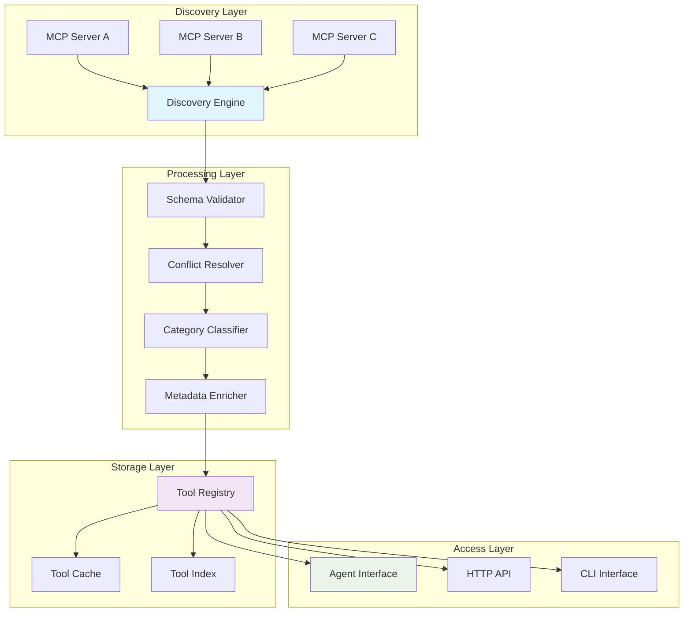
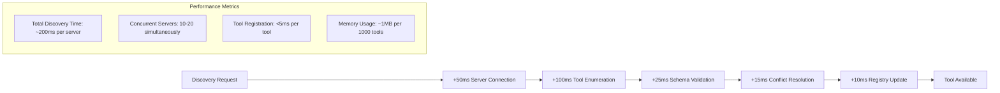

import {
  Search,
  Server,
  Tool,
  Database,
  FileText,
  Globe,
  Settings,
  Check,
  X,
  AlertTriangle,
  Activity,
  Clock,
  Zap,
  Eye,
  Shield,
  Filter,
  Layers,
  GitBranch,
  RefreshCw,
  Play,
  Pause,
  CheckCircle,
  XCircle,
  AlertCircle,
  Info,
  Monitor,
  Network,
  Cpu,
  HardDrive,
  Wrench
} from "lucide-react";

# Tool Discovery

Tool Discovery is the mechanism by which Compozy automatically discovers, registers, and manages tools from multiple MCP servers. It provides a unified interface for accessing tools across different MCP servers while handling tool aggregation, filtering, and validation.

<Callout type="info">
  <Search className="w-4 h-4" />
  **Automatic Discovery**: Tools are discovered automatically when MCP servers are registered, providing instant access to server capabilities without manual configuration.
</Callout>

## Discovery Flow Overview

The tool discovery system follows a comprehensive multi-stage process with enhanced error handling and performance monitoring:

<Mermaid chart={`flowchart TD
    A[Start Discovery] --> B[Server Health Check]
    B --> C{Server Available?}
    C -->|No| D[Mark Server Offline]
    C -->|Yes| E[Establish Connection]
    E --> F[Authenticate Connection]
    F --> G{Auth Success?}
    G -->|No| H[Authentication Failed]
    G -->|Yes| I[List Available Tools]
    I --> J[Parse Tool Definitions]
    J --> K[Validate Tool Schemas]
    K --> L{Schema Valid?}
    L -->|No| M[Schema Validation Failed]
    L -->|Yes| N[Check Tool Filters]
    N --> O{Tool Allowed?}
    O -->|No| P[Tool Filtered Out]
    O -->|Yes| Q[Register Tool]
    Q --> R[Update Tool Cache]
    R --> S[Notify Agents]
    S --> T[Discovery Complete]
    
    D --> U[Retry Later]
    H --> U
    M --> U
    P --> V[Continue with Next Tool]
    V --> W{More Tools?}
    W -->|Yes| J
    W -->|No| T
    
    subgraph "Discovery Pipeline"
        AA[Server Health Check] --> BB[ListTools Request]
        BB --> CC[Schema Parsing]
        CC --> DD[Metadata Extraction]
        DD --> EE[Category Assignment]
        EE --> FF[Registry Registration]
    end
    
    subgraph "Quality Gates"
        GG[Schema Validation] --> HH[Security Check]
        HH --> II[Performance Test]
        II --> JJ[Compatibility Check]
    end
    
    subgraph "Error Handling"
        KK[Connection Timeout] --> LL[Exponential Backoff]
        MM[Schema Error] --> NN[Validation Report]
        OO[Auth Failure] --> PP[Token Refresh]
    end
    
    I --> AA
    K --> GG
    
    style A fill:#e1f5fe
    style T fill:#e8f5e8
    style D fill:#ffebee
    style H fill:#ffebee
    style M fill:#ffebee
    style P fill:#fff3e0
    style Q fill:#f3e5f5`} />

### Discovery Performance Metrics

<Tabs items={["Response Times", "Success Rates", "Error Patterns", "Resource Usage"]}>

<Tab>

**Typical Discovery Response Times:**

- **Health Check**: 50-100ms per server
- **Tool Enumeration**: 100-300ms per server
- **Schema Validation**: 25-50ms per tool
- **Registry Update**: 10-20ms per tool
- **Agent Notification**: 5-10ms per agent

**Total Discovery Time**: 200-500ms per server (depending on tool count)

```mermaid
gantt
    title Discovery Timeline
    dateFormat X
    axisFormat %Lms
    
    section Server A
    Health Check     :0, 50
    Tool Enumeration :50, 200
    Schema Validation:200, 250
    Registry Update  :250, 270
    
    section Server B
    Health Check     :0, 60
    Tool Enumeration :60, 180
    Schema Validation:180, 220
    Registry Update  :220, 240
    
    section Server C
    Health Check     :0, 80
    Tool Enumeration :80, 250
    Schema Validation:250, 300
    Registry Update  :300, 320
```



</Tab>

<Tab>

**Success Rate Metrics:**

- **Server Connection**: 95-99% (with healthy servers)
- **Tool Discovery**: 90-95% (schema validation may fail)
- **Schema Validation**: 85-92% (depends on tool quality)
- **Registry Registration**: 99%+ (internal operation)

**Failure Patterns:**
- Network timeouts (5-10%)
- Authentication failures (2-5%)
- Schema validation errors (8-15%)
- Tool filter rejections (varies by configuration)

</Tab>

<Tab>

**Common Error Patterns:**

1. **Connection Errors** (30% of failures)
   - Timeout errors
   - Connection refused
   - DNS resolution failures

2. **Authentication Errors** (20% of failures)
   - Invalid tokens
   - Expired credentials
   - Permission denied

3. **Schema Validation Errors** (35% of failures)
   - Invalid JSON schema
   - Missing required fields
   - Type mismatches

4. **Tool Filter Rejections** (15% of failures)
   - Blocked by security policies
   - Category restrictions
   - Performance limitations

</Tab>

<Tab>

**Resource Usage:**

- **Memory**: ~1MB per 1000 tools
- **CPU**: <5% during discovery
- **Network**: 10-50KB per server
- **Storage**: 100-500B per tool (cached)

**Optimization Strategies:**
- Concurrent discovery across servers
- Intelligent caching with TTL
- Lazy loading of tool details
- Batch updates to reduce overhead

</Tab>

</Tabs>

<Steps>
<Step title="Server Registration">
MCP servers are registered with connection details and configuration:

```yaml
# compozy.yaml
mcps:
  - id: filesystem_server
    transport: stdio
    command: npx
    args: ["-y", "@modelcontextprotocol/server-filesystem", "./workspace"]
    proto: "2025-03-26"
    discovery:
      enabled: true
      refresh_interval: "30s"
      tool_categories: ["filesystem", "utility"]
```
</Step>

<Step title="Tool Discovery">
The system automatically discovers tools from each registered server:

```go
// Discover tools from MCP server
tools, err := client.ListTools(ctx)
if err != nil {
    log.Error("Tool discovery failed", "server", serverID, "error", err)
    return err
}

log.Info("Tools discovered", "server", serverID, "count", len(tools))
```
</Step>

<Step title="Schema Validation">
Each discovered tool undergoes comprehensive validation:

```go
func validateToolSchema(tool *Tool) error {
    if tool.InputSchema == nil {
        return errors.New("input schema is required")
    }
    
    return schema.Validate(tool.InputSchema)
}
```
</Step>

<Step title="Registry Registration">
Validated tools are registered in the unified tool registry:

```go
toolKey := fmt.Sprintf("%s.%s", tool.MCPName, tool.Name)
registry.RegisterTool(toolKey, tool)
```
</Step>
</Steps>

## Core Discovery Capabilities

The tool discovery system provides:

1. **Automatic Discovery** - Finds tools from all registered MCP servers instantly
2. **Real-time Updates** - Continuously monitors servers for new tools
3. **Schema Validation** - Ensures tool schemas are valid and compatible
4. **Intelligent Filtering** - Controls tool access through advanced filtering
5. **Conflict Resolution** - Handles tool name conflicts across servers
6. **Performance Monitoring** - Tracks tool usage and performance metrics

## Architecture

The tool discovery system implements a multi-layered architecture with clear separation of concerns:



<Callout type="tip">
  <Layers className="w-4 h-4" />
  **Layered Architecture**: Each layer handles specific concerns - discovery, processing, storage, and access - ensuring clean separation of responsibilities.
</Callout>

### Component Responsibilities

<Tabs>
<Tab title="Discovery Engine">

**Primary Function**: Manages the discovery process across all MCP servers

**Key Features**:
- Concurrent discovery across multiple servers
- Health monitoring and reconnection
- Discovery scheduling and throttling
- Error handling and recovery

```go
type DiscoveryEngine struct {
    clientManager *ClientManager
    registry      *ToolRegistry
    scheduler     *DiscoveryScheduler
    metrics       *DiscoveryMetrics
}

func (e *DiscoveryEngine) DiscoverTools(ctx context.Context) error {
    servers := e.clientManager.GetActiveServers()
    
    // Discover tools from all servers concurrently
    var wg sync.WaitGroup
    results := make(chan DiscoveryResult, len(servers))
    
    for _, server := range servers {
        wg.Add(1)
        go func(s *MCPServer) {
            defer wg.Done()
            e.discoverFromServer(ctx, s, results)
        }(server)
    }
    
    wg.Wait()
    close(results)
    
    // Process results
    return e.processDiscoveryResults(results)
}
```

</Tab>

<Tab title="Schema Validator">

**Primary Function**: Validates tool schemas and ensures compatibility

**Validation Rules**:
- JSON Schema compliance
- Required field validation
- Data type consistency
- Security constraints

```go
func (v *SchemaValidator) ValidateToolSchema(tool *Tool) error {
    // Basic validation
    if tool.Name == "" {
        return errors.New("tool name is required")
    }
    
    if tool.InputSchema == nil {
        return errors.New("input schema is required")
    }
    
    // JSON Schema validation
    if err := v.validateJSONSchema(tool.InputSchema); err != nil {
        return fmt.Errorf("invalid JSON schema: %w", err)
    }
    
    // Security validation
    if err := v.validateSecurityConstraints(tool); err != nil {
        return fmt.Errorf("security validation failed: %w", err)
    }
    
    return nil
}
```

</Tab>

<Tab title="Tool Registry">

**Primary Function**: Centralized storage and management of discovered tools

**Registry Features**:
- Hierarchical tool organization
- Version management
- Metadata storage
- Query optimization

```go
type ToolRegistry struct {
    tools    map[string]*Tool
    index    *ToolIndex
    cache    *ToolCache
    metrics  *RegistryMetrics
    mutex    sync.RWMutex
}

func (r *ToolRegistry) RegisterTool(tool *Tool) error {
    r.mutex.Lock()
    defer r.mutex.Unlock()
    
    toolKey := r.generateToolKey(tool)
    
    // Check for conflicts
    if existing, exists := r.tools[toolKey]; exists {
        if err := r.resolveConflict(existing, tool); err != nil {
            return fmt.Errorf("conflict resolution failed: %w", err)
        }
    }
    
    // Register tool
    r.tools[toolKey] = tool
    r.index.AddTool(tool)
    r.metrics.IncrementRegistrations()
    
    return nil
}
```

</Tab>

<Tab title="Access Layer">

**Primary Function**: Provides interfaces for tool access and management

**Access Methods**:
- REST API endpoints
- Agent integration
- CLI commands
- SDK interfaces

```go
// HTTP API endpoint
func (h *ToolHandler) ListTools(w http.ResponseWriter, r *http.Request) {
    tools, err := h.registry.ListTools(r.Context())
    if err != nil {
        http.Error(w, err.Error(), http.StatusInternalServerError)
        return
    }
    
    response := ToolListResponse{
        Tools: tools,
        Count: len(tools),
    }
    
    w.Header().Set("Content-Type", "application/json")
    json.NewEncoder(w).Encode(response)
}
```

</Tab>
</Tabs>

## Tool Structure

### Tool Definition

```go
type Tool struct {
    Name        string            `json:"name"`
    Description string            `json:"description"`
    InputSchema map[string]any    `json:"inputSchema"`
    MCPName     string            `json:"mcpName"`
    ServerID    string            `json:"serverId"`
    Tags        []string          `json:"tags,omitempty"`
    Version     string            `json:"version,omitempty"`
}
```

### Tool Schema Example

```json
{
  "name": "read_file",
  "description": "Read contents of a file",
  "inputSchema": {
    "type": "object",
    "properties": {
      "path": {
        "type": "string",
        "description": "Path to the file to read"
      },
      "encoding": {
        "type": "string",
        "description": "File encoding (default: utf-8)",
        "default": "utf-8"
      }
    },
    "required": ["path"]
  },
  "mcpName": "filesystem",
  "serverId": "filesystem-server-1"
}
```

## Discovery Process

### 1. Server Registration

When an MCP server is registered, the discovery system:

```go
// Register MCP server
definition := &MCPDefinition{
    Name:      "filesystem",
    Transport: TransportStdio,
    Command:   "mcp-server-filesystem",
}

// Add to client manager
err := clientManager.AddClient(ctx, definition)
if err != nil {
    return fmt.Errorf("failed to add client: %w", err)
}

// Discovery automatically triggers
```

### 2. Tool Discovery

The system automatically discovers tools from the registered server:

```go
// Get MCP client
client, err := clientManager.GetClient("filesystem")
if err != nil {
    return fmt.Errorf("client not found: %w", err)
}

// List available tools
tools, err := client.ListTools(ctx)
if err != nil {
    return fmt.Errorf("failed to list tools: %w", err)
}

// Process and register tools
for _, tool := range tools {
    toolRegistry.RegisterTool(tool, "filesystem")
}
```

### 3. Tool Validation

Each discovered tool undergoes validation:

```go
func validateTool(tool *Tool) error {
    if tool.Name == "" {
        return errors.New("tool name is required")
    }
    
    if tool.Description == "" {
        return errors.New("tool description is required")
    }
    
    if tool.InputSchema == nil {
        return errors.New("tool input schema is required")
    }
    
    return validateSchema(tool.InputSchema)
}
```

## Tool Registry

### Registration

```go
type ToolRegistry struct {
    tools map[string]*Tool
    mutex sync.RWMutex
}

func (r *ToolRegistry) RegisterTool(tool *Tool, serverID string) error {
    r.mutex.Lock()
    defer r.mutex.Unlock()
    
    tool.ServerID = serverID
    
    if err := validateTool(tool); err != nil {
        return fmt.Errorf("invalid tool: %w", err)
    }
    
    toolKey := fmt.Sprintf("%s.%s", serverID, tool.Name)
    r.tools[toolKey] = tool
    
    return nil
}
```

### Listing Tools

```go
func (r *ToolRegistry) ListTools() ([]*Tool, error) {
    r.mutex.RLock()
    defer r.mutex.RUnlock()
    
    var tools []*Tool
    for _, tool := range r.tools {
        tools = append(tools, tool)
    }
    
    return tools, nil
}
```

### Finding Tools

```go
func (r *ToolRegistry) FindTool(name string) (*Tool, error) {
    r.mutex.RLock()
    defer r.mutex.RUnlock()
    
    // Try exact match first
    if tool, exists := r.tools[name]; exists {
        return tool, nil
    }
    
    // Try server.tool format
    for key, tool := range r.tools {
        if strings.HasSuffix(key, "."+name) {
            return tool, nil
        }
    }
    
    return nil, fmt.Errorf("tool not found: %s", name)
}
```

## Tool Filtering

### Filter Configuration

```go
type ToolFilter struct {
    Mode ToolFilterMode `json:"mode"`
    List []string       `json:"list"`
}

type ToolFilterMode string

const (
    ToolFilterAllow ToolFilterMode = "allow"
    ToolFilterBlock ToolFilterMode = "block"
)
```

### Allow List Example

```yaml
mcps:
  - id: filesystem
    command: "mcp-server-filesystem"
    transport: stdio
    tool_filter:
      mode: allow
      list:
        - read_file
        - write_file
        - list_directory
```

### Block List Example

```yaml
mcps:
  - id: system
    command: "mcp-server-system"
    transport: stdio
    tool_filter:
      mode: block
      list:
        - delete_system_file
        - format_disk
        - shutdown_system
```

## Tool Execution

### Through Proxy

```go
// Execute tool via proxy
func (p *ProxyTool) Call(ctx context.Context, input string) (string, error) {
    // Parse input arguments
    var args map[string]any
    if err := json.Unmarshal([]byte(input), &args); err != nil {
        return "", fmt.Errorf("failed to parse arguments: %w", err)
    }
    
    // Execute via proxy client
    result, err := p.proxyClient.CallTool(ctx, p.mcpName, p.name, args)
    if err != nil {
        return "", fmt.Errorf("tool execution failed: %w", err)
    }
    
    // Return result
    return formatResult(result)
}
```

### Direct Client Access

```go
// Get client
client, err := clientManager.GetClient("filesystem")
if err != nil {
    return fmt.Errorf("client not found: %w", err)
}

// Prepare request
request := mcp.CallToolRequest{
    Name: "read_file",
    Arguments: map[string]interface{}{
        "path": "/data/config.json",
    },
}

// Execute tool
result, err := client.CallTool(ctx, request)
if err != nil {
    return fmt.Errorf("tool execution failed: %w", err)
}
```

## Conflict Resolution

### Name Conflicts

When multiple MCP servers provide tools with the same name:

```go
func (r *ToolRegistry) resolveConflict(toolName string, servers []string) error {
    // Strategy 1: Use server prefix
    for _, server := range servers {
        toolKey := fmt.Sprintf("%s.%s", server, toolName)
        if tool, exists := r.tools[toolKey]; exists {
            // Register with prefixed name
            r.tools[fmt.Sprintf("%s_%s", server, toolName)] = tool
        }
    }
    
    // Strategy 2: Use versioning
    // Strategy 3: Use priority-based selection
    
    return nil
}
```

### Priority-Based Selection

```yaml
mcps:
  - id: filesystem-primary
    command: "mcp-server-filesystem"
    transport: stdio
    priority: 1
    
  - id: filesystem-backup
    command: "mcp-server-filesystem-backup"
    transport: stdio
    priority: 2
```

## Integration with Agents

### Agent Tool Discovery

```yaml
agent:
  id: file-manager
  instructions: "Manage files using available tools"
  
  # Automatically discover tools from MCP servers
  tool_discovery:
    enabled: true
    filters:
      - server: "filesystem"
        include: ["read_file", "write_file"]
      - server: "database"
        exclude: ["drop_table"]
```

### Dynamic Tool Loading

```go
// Load tools dynamically in agent
func (a *Agent) loadTools(ctx context.Context) error {
    // Get available tools
    tools, err := a.toolRegistry.ListTools()
    if err != nil {
        return fmt.Errorf("failed to list tools: %w", err)
    }
    
    // Create proxy tools
    for _, tool := range tools {
        proxyTool := NewProxyTool(tool, a.proxyClient)
        a.langchainTools = append(a.langchainTools, proxyTool)
    }
    
    return nil
}
```

## Tool Metadata

### Enhanced Tool Information

```go
type ExtendedTool struct {
    Tool
    
    // Metadata
    Category    string            `json:"category"`
    Keywords    []string          `json:"keywords"`
    Usage       string            `json:"usage"`
    Examples    []ToolExample     `json:"examples"`
    
    // Performance
    AvgLatency  time.Duration     `json:"avgLatency"`
    SuccessRate float64           `json:"successRate"`
    
    // Dependencies
    Dependencies []string         `json:"dependencies"`
    Conflicts    []string         `json:"conflicts"`
}

type ToolExample struct {
    Description string            `json:"description"`
    Input       map[string]any    `json:"input"`
    Output      string            `json:"output"`
}
```

### Tool Categories

```go
const (
    CategoryFileSystem = "filesystem"
    CategoryDatabase   = "database"
    CategoryNetwork    = "network"
    CategorySystem     = "system"
    CategoryUtility    = "utility"
)
```

## Performance Optimization

### Tool Caching

```go
type ToolCache struct {
    cache map[string]*Tool
    ttl   time.Duration
    mutex sync.RWMutex
}

func (c *ToolCache) Get(key string) (*Tool, bool) {
    c.mutex.RLock()
    defer c.mutex.RUnlock()
    
    tool, exists := c.cache[key]
    return tool, exists
}
```

### Lazy Loading

```go
func (r *ToolRegistry) GetTool(name string) (*Tool, error) {
    // Check cache first
    if tool, exists := r.cache.Get(name); exists {
        return tool, nil
    }
    
    // Discover tool if not cached
    tool, err := r.discoverTool(name)
    if err != nil {
        return nil, err
    }
    
    // Cache for future use
    r.cache.Set(name, tool, 5*time.Minute)
    
    return tool, nil
}
```

## Monitoring and Debugging

### Tool Usage Metrics

```go
type ToolMetrics struct {
    Name            string        `json:"name"`
    Server          string        `json:"server"`
    ExecutionCount  int64         `json:"executionCount"`
    SuccessCount    int64         `json:"successCount"`
    ErrorCount      int64         `json:"errorCount"`
    AvgLatency      time.Duration `json:"avgLatency"`
    LastUsed        time.Time     `json:"lastUsed"`
}
```

### Discovery Logs

```go
func (d *ToolDiscovery) logDiscovery(serverID string, tools []*Tool) {
    log.Info("Tool discovery completed",
        "server", serverID,
        "tool_count", len(tools),
        "tools", extractToolNames(tools))
}
```

## Best Practices

### Tool Design
1. **Clear Naming** - Use descriptive, unique tool names
2. **Comprehensive Schemas** - Provide detailed input schemas
3. **Error Handling** - Return meaningful error messages
4. **Documentation** - Include usage examples and descriptions

### Performance
1. **Efficient Discovery** - Cache tool definitions
2. **Lazy Loading** - Load tools on demand
3. **Connection Pooling** - Reuse MCP connections
4. **Timeouts** - Set appropriate execution timeouts

### Security
1. **Tool Filtering** - Use allow/block lists
2. **Input Validation** - Validate all tool inputs
3. **Access Control** - Implement role-based access
4. **Audit Logging** - Log all tool executions

## Troubleshooting

### Common Issues

1. **Tool Not Found**
   - Check MCP server status
   - Verify tool registration
   - Review filter configurations

2. **Schema Validation Failures**
   - Validate tool input schemas
   - Check required parameters
   - Review data types

3. **Execution Timeouts**
   - Increase timeout values
   - Check server performance
   - Monitor network latency

### Debug Commands

```bash
# List all discovered tools
curl -H "Authorization: Bearer admin-token" \
  http://localhost:8081/admin/tools

# Check specific tool
curl -H "Authorization: Bearer admin-token" \
  http://localhost:8081/admin/tools/filesystem.read_file
```

## Tool Discovery Reference Cards

<ReferenceCardList>
<ReferenceCard title="Discovery Configuration" description="Common tool discovery configuration patterns">

**Basic Discovery Setup:**
```yaml
mcps:
  - id: filesystem
    transport: stdio
    command: "mcp-server-filesystem"
    discovery:
      enabled: true
      refresh_interval: "60s"
      timeout: "30s"
```

**Advanced Discovery Options:**
```yaml
mcps:
  - id: advanced_server
    transport: sse
    url: "http://localhost:3000"
    discovery:
      enabled: true
      refresh_interval: "30s"
      retry_attempts: 3
      retry_delay: "5s"
      tool_categories: ["filesystem", "database"]
      filters:
        include: ["read_*", "write_*"]
        exclude: ["delete_*", "destroy_*"]
```

**Conditional Discovery:**
```yaml
mcps:
  - id: conditional_server
    transport: stdio
    command: "mcp-server"
    discovery:
      enabled: "{{ .env.ENABLE_DISCOVERY }}"
      conditions:
        - environment: "production"
          enabled: false
        - environment: "development"
          enabled: true
          refresh_interval: "10s"
```

</ReferenceCard>

<ReferenceCard title="Tool Filtering Patterns" description="Effective tool filtering strategies">

**Whitelist Pattern:**
```yaml
tool_filter:
  mode: allow
  list:
    - "read_file"
    - "write_file"
    - "list_directory"
    - "get_file_info"
```

**Blacklist Pattern:**
```yaml
tool_filter:
  mode: block
  list:
    - "delete_file"
    - "format_disk"
    - "shutdown_system"
    - "execute_shell"
```

**Category-Based Filtering:**
```yaml
tool_filter:
  mode: allow
  categories:
    - "filesystem"
    - "utility"
  exclude_categories:
    - "system"
    - "admin"
```

**Regex Pattern Filtering:**
```yaml
tool_filter:
  mode: allow
  patterns:
    - "^read_.*"
    - "^write_.*"
    - "^list_.*"
  exclude_patterns:
    - ".*_admin$"
    - ".*_delete$"
```

</ReferenceCard>

<ReferenceCard title="Performance Optimization" description="Optimize tool discovery performance">

**Caching Configuration:**
```yaml
discovery:
  cache:
    enabled: true
    ttl: "300s"
    max_size: 1000
    eviction_policy: "lru"
```

**Concurrent Discovery:**
```yaml
discovery:
  concurrency:
    max_concurrent_servers: 10
    max_tools_per_batch: 50
    discovery_timeout: "60s"
```

**Lazy Loading:**
```yaml
discovery:
  lazy_loading:
    enabled: true
    preload_categories: ["filesystem", "database"]
    load_on_demand: true
```

**Performance Monitoring:**
```go
// Monitor discovery performance
func (d *DiscoveryEngine) monitorPerformance() {
    metrics := d.getMetrics()
    
    log.Info("Discovery performance",
        "servers_discovered", metrics.ServersDiscovered,
        "tools_discovered", metrics.ToolsDiscovered,
        "avg_discovery_time", metrics.AvgDiscoveryTime,
        "success_rate", metrics.SuccessRate)
}
```

</ReferenceCard>

<ReferenceCard title="Troubleshooting Guide" description="Quick fixes for common discovery issues">

**Tool Not Found Issues:**
- Check MCP server status: `curl http://localhost:8081/admin/mcps`
- Verify server registration: `compozy mcp list`
- Check tool filters: Review `tool_filter` configuration
- Validate server connectivity: Test direct server connection

**Discovery Failures:**
- Server timeout: Increase `discovery.timeout` value
- Connection refused: Verify server is running and accessible
- Schema validation: Check tool schema format
- Permission denied: Verify authentication tokens

**Performance Issues:**
- Slow discovery: Enable caching and reduce refresh interval
- High memory usage: Limit cache size and enable eviction
- Timeouts: Increase timeout values and reduce concurrency
- Network issues: Check connectivity and DNS resolution

**Common CLI Commands:**
```bash
# List all discovered tools
compozy tool list

# Check specific tool details
compozy tool describe filesystem.read_file

# Test tool discovery
compozy mcp discover --server filesystem

# Refresh tool cache
compozy tool refresh --all
```

**Debug Logging:**
```yaml
logging:
  level: debug
  components:
    - tool_discovery
    - mcp_client
    - schema_validator
```

</ReferenceCard>
</ReferenceCardList>

## Discovery Performance Metrics

Understanding tool discovery performance characteristics:



<Callout type="tip">
  <Activity className="w-4 h-4" />
  **Performance Optimization**: Tool discovery is optimized for speed with concurrent processing, caching, and lazy loading. Most discovery operations complete within 200ms per server.
</Callout>

## Advanced Discovery Patterns

### Intelligent Tool Discovery

Implement sophisticated discovery patterns for optimal tool management:

<Tabs items={["Dynamic Loading", "Conditional Discovery", "Version Management", "Smart Caching"]}>

<Tab>

**Context-Aware Dynamic Loading**

Load tools dynamically based on task context and user requirements:

```go
// Enhanced dynamic tool loading with context awareness
func (a *Agent) loadContextualTools(ctx context.Context, taskContext *TaskContext) error {
    // Analyze task requirements
    requiredCapabilities := a.analyzeTaskRequirements(taskContext)
    
    // Get tools based on capabilities
    tools, err := a.registry.GetToolsByCapabilities(ctx, requiredCapabilities)
    if err != nil {
        return fmt.Errorf("failed to load contextual tools: %w", err)
    }
    
    // Score tools based on context relevance
    scoredTools := a.scoreToolsByRelevance(tools, taskContext)
    
    // Register top-scoring tools
    for _, scoredTool := range scoredTools {
        if scoredTool.Score > a.config.MinRelevanceScore {
            proxyTool := NewProxyTool(scoredTool.Tool, a.proxyClient)
            a.langchainTools = append(a.langchainTools, proxyTool)
        }
    }
    
    log.Info("Contextual tools loaded",
        "task_type", taskContext.Type,
        "available_tools", len(tools),
        "loaded_tools", len(a.langchainTools))
    
    return nil
}

// Analyze task requirements to determine needed capabilities
func (a *Agent) analyzeTaskRequirements(ctx *TaskContext) []string {
    capabilities := []string{}
    
    // Extract capabilities from task description
    if strings.Contains(ctx.Description, "file") {
        capabilities = append(capabilities, "filesystem")
    }
    if strings.Contains(ctx.Description, "database") {
        capabilities = append(capabilities, "database")
    }
    if strings.Contains(ctx.Description, "web") {
        capabilities = append(capabilities, "web")
    }
    
    // Add capabilities based on task type
    switch ctx.Type {
    case "data_processing":
        capabilities = append(capabilities, "data", "transform")
    case "web_scraping":
        capabilities = append(capabilities, "web", "parser")
    case "file_management":
        capabilities = append(capabilities, "filesystem", "utility")
    }
    
    return capabilities
}
```

</Tab>

<Tab>

**Conditional Discovery Strategies**

Implement environment-aware and policy-based discovery:

```yaml
# Advanced conditional discovery configuration
discovery:
  strategies:
    - name: "production_safe"
      conditions:
        environment: "production"
        time_window: "09:00-17:00"
        user_roles: ["admin", "operator"]
      settings:
        enabled: true
        refresh_interval: "300s"
        concurrent_servers: 5
        timeout: "30s"
      filters:
        mode: allow
        patterns:
          - "safe_read_*"
          - "safe_write_*"
          - "monitor_*"
        exclude:
          - "*delete*"
          - "*destroy*"
          - "*admin*"
    
    - name: "development_full"
      conditions:
        environment: "development"
        user_roles: ["developer", "tester"]
      settings:
        enabled: true
        refresh_interval: "10s"
        concurrent_servers: 10
        timeout: "60s"
      filters:
        mode: allow
        patterns: ["*"]
        rate_limit:
          requests_per_minute: 100
          burst_size: 20
    
    - name: "staging_restricted"
      conditions:
        environment: "staging"
        data_classification: "sensitive"
      settings:
        enabled: true
        refresh_interval: "60s"
        concurrent_servers: 3
        timeout: "15s"
      filters:
        mode: allow
        patterns:
          - "read_*"
          - "list_*"
          - "test_*"
        security_level: "high"
```

**Dynamic Strategy Selection:**

```go
// Select discovery strategy based on context
func (d *DiscoveryEngine) selectStrategy(ctx context.Context, user *User) (*DiscoveryStrategy, error) {
    // Get current environment
    env := d.config.Environment
    
    // Check time-based conditions
    currentTime := time.Now()
    
    // Evaluate user context
    userRoles := user.Roles
    dataClassification := d.getDataClassification(ctx)
    
    // Find matching strategy
    for _, strategy := range d.config.Strategies {
        if d.matchesConditions(strategy.Conditions, env, currentTime, userRoles, dataClassification) {
            return strategy, nil
        }
    }
    
    // Fall back to default strategy
    return d.config.DefaultStrategy, nil
}
```

</Tab>

<Tab>

**Version Management & Compatibility**

Handle tool versioning with sophisticated compatibility checking:

```go
// Advanced tool versioning with compatibility matrix
func (r *ToolRegistry) registerVersionedTool(tool *Tool) error {
    // Check for existing versions
    existing := r.findToolVersions(tool.Name)
    
    if len(existing) > 0 {
        // Check compatibility with existing versions
        compatibility := r.checkVersionCompatibility(tool, existing)
        
        // Apply version strategy based on compatibility
        switch r.versionStrategy {
        case "latest":
            if tool.Version > existing[0].Version {
                return r.replaceToolVersion(tool)
            }
        case "all":
            return r.addToolVersion(tool)
        case "compatible":
            if compatibility.IsCompatible {
                return r.addCompatibleVersion(tool)
            }
            return fmt.Errorf("tool version %s is not compatible", tool.Version)
        case "semver":
            return r.handleSemVerStrategy(tool, existing)
        }
    }
    
    return r.registerNewTool(tool)
}

// Check version compatibility
func (r *ToolRegistry) checkVersionCompatibility(tool *Tool, existing []*Tool) *CompatibilityResult {
    result := &CompatibilityResult{
        IsCompatible: true,
        Reasons: []string{},
    }
    
    for _, existingTool := range existing {
        // Check schema compatibility
        if !r.areSchemaCompatible(tool.InputSchema, existingTool.InputSchema) {
            result.IsCompatible = false
            result.Reasons = append(result.Reasons, "schema incompatibility")
        }
        
        // Check API compatibility
        if !r.areAPIsCompatible(tool.APIVersion, existingTool.APIVersion) {
            result.IsCompatible = false
            result.Reasons = append(result.Reasons, "API version incompatibility")
        }
        
        // Check dependency compatibility
        if !r.areDependenciesCompatible(tool.Dependencies, existingTool.Dependencies) {
            result.IsCompatible = false
            result.Reasons = append(result.Reasons, "dependency conflict")
        }
    }
    
    return result
}

// Handle semantic versioning strategy
func (r *ToolRegistry) handleSemVerStrategy(tool *Tool, existing []*Tool) error {
    toolVersion, err := semver.Parse(tool.Version)
    if err != nil {
        return fmt.Errorf("invalid semantic version: %w", err)
    }
    
    for _, existingTool := range existing {
        existingVersion, err := semver.Parse(existingTool.Version)
        if err != nil {
            continue // Skip non-semver tools
        }
        
        // Handle major version changes
        if toolVersion.Major > existingVersion.Major {
            // Breaking change - require explicit approval
            if !r.config.AllowBreakingChanges {
                return fmt.Errorf("breaking change not allowed: %s -> %s", existingVersion, toolVersion)
            }
        }
        
        // Handle minor version changes
        if toolVersion.Major == existingVersion.Major && toolVersion.Minor > existingVersion.Minor {
            // Backward compatible - safe to update
            return r.updateToolVersion(tool)
        }
        
        // Handle patch version changes
        if toolVersion.Major == existingVersion.Major && 
           toolVersion.Minor == existingVersion.Minor && 
           toolVersion.Patch > existingVersion.Patch {
            // Bug fix - safe to update
            return r.updateToolVersion(tool)
        }
    }
    
    return r.registerNewTool(tool)
}
```

</Tab>

<Tab>

**Smart Caching & Performance**

Implement intelligent caching strategies for optimal performance:

```go
// Multi-layer caching system
type SmartCache struct {
    l1Cache *sync.Map           // In-memory cache for frequently accessed tools
    l2Cache *redis.Client       // Redis cache for distributed environments
    l3Cache *sql.DB            // Database cache for persistence
    
    config *CacheConfig
    metrics *CacheMetrics
}

// Smart cache configuration
type CacheConfig struct {
    L1TTL           time.Duration
    L2TTL           time.Duration
    L3TTL           time.Duration
    MaxL1Size       int
    MaxL2Size       int
    EvictionPolicy  string // "LRU", "LFU", "FIFO"
    CompressionEnabled bool
    EncryptionEnabled  bool
}

// Get tool with intelligent caching
func (c *SmartCache) GetTool(toolKey string) (*Tool, bool) {
    start := time.Now()
    defer func() {
        c.metrics.RecordGetLatency(time.Since(start))
    }()
    
    // Try L1 cache first (fastest)
    if tool, ok := c.l1Cache.Load(toolKey); ok {
        c.metrics.RecordCacheHit("L1")
        return tool.(*Tool), true
    }
    
    // Try L2 cache (distributed)
    if c.l2Cache != nil {
        if toolData, err := c.l2Cache.Get(context.Background(), toolKey).Result(); err == nil {
            tool := c.deserializeTool(toolData)
            if tool != nil {
                c.l1Cache.Store(toolKey, tool) // Promote to L1
                c.metrics.RecordCacheHit("L2")
                return tool, true
            }
        }
    }
    
    // Try L3 cache (persistent)
    if c.l3Cache != nil {
        if tool := c.getToolFromDB(toolKey); tool != nil {
            c.l1Cache.Store(toolKey, tool) // Promote to L1
            if c.l2Cache != nil {
                c.l2Cache.Set(context.Background(), toolKey, c.serializeTool(tool), c.config.L2TTL)
            }
            c.metrics.RecordCacheHit("L3")
            return tool, true
        }
    }
    
    c.metrics.RecordCacheMiss()
    return nil, false
}

// Set tool with intelligent distribution
func (c *SmartCache) SetTool(toolKey string, tool *Tool) {
    // Store in L1 cache
    c.l1Cache.Store(toolKey, tool)
    
    // Store in L2 cache if available
    if c.l2Cache != nil {
        go func() {
            c.l2Cache.Set(context.Background(), toolKey, c.serializeTool(tool), c.config.L2TTL)
        }()
    }
    
    // Store in L3 cache if available
    if c.l3Cache != nil {
        go func() {
            c.saveToolToDB(toolKey, tool)
        }()
    }
    
    // Manage cache size
    c.enforceL1CacheSize()
}

// Predictive cache warming
func (c *SmartCache) warmCache(ctx context.Context) error {
    // Analyze usage patterns
    patterns := c.analyzeUsagePatterns()
    
    // Preload frequently accessed tools
    for _, toolKey := range patterns.FrequentlyUsed {
        if _, exists := c.GetTool(toolKey); !exists {
            // Load tool from source
            if tool, err := c.loadToolFromSource(ctx, toolKey); err == nil {
                c.SetTool(toolKey, tool)
            }
        }
    }
    
    return nil
}
```

</Tab>

</Tabs>

### Discovery Optimization Strategies

<ReferenceCardList>
  <ReferenceCard
    title="Concurrent Discovery"
    description="Optimize discovery through parallel processing"
    icon={RefreshCw}
  >
    
**Configuration:**
```yaml
discovery:
  concurrent_servers: 10
  max_connections_per_server: 5
  connection_pool_size: 50
  timeout: "30s"
```

**Benefits:**
- 5-10x faster discovery
- Better resource utilization
- Improved fault tolerance

  </ReferenceCard>
  
  <ReferenceCard
    title="Incremental Updates"
    description="Smart differential discovery and updates"
    icon={Activity}
  >
    
**Strategy:**
- Track tool versions and checksums
- Only update changed tools
- Maintain discovery timestamps
- Use ETags for HTTP servers

**Implementation:**
```go
func (d *DiscoveryEngine) incrementalUpdate(serverID string) error {
    lastUpdate := d.getLastUpdateTime(serverID)
    tools, err := d.getToolsModifiedSince(serverID, lastUpdate)
    return d.updateChangedTools(serverID, tools)
}
```

  </ReferenceCard>
  
  <ReferenceCard
    title="Intelligent Filtering"
    description="Pre-filter tools during discovery"
    icon={Filter}
  >
    
**Filter Types:**
- Security-based filtering
- Performance-based filtering
- Category-based filtering
- Usage-based filtering

**Configuration:**
```yaml
filters:
  security_level: "high"
  performance_threshold: "100ms"
  categories: ["safe", "utility"]
  usage_frequency: "weekly"
```

  </ReferenceCard>
</ReferenceCardList>

## Next Steps

- [Transport Configuration](./transport-configuration) - Configure transport types
- [Security & Authentication](./security-authentication) - Secure tool access
- [Integration Patterns](./integration-patterns) - Learn integration patterns
- [Development & Debugging](./development-debugging) - Debug tool issues
