# Integration Patterns

Memory integration is essential for building context-aware AI applications. This guide provides proven patterns for integrating memory with agents, workflows, and tools effectively.

## Related Documentation

### 🔗 Cross-References
- **[Memory Concepts & Architecture](/docs/core/memory/memory-concepts)** - Understanding memory system architecture
- **[Memory Configuration](/docs/core/memory/configuration)** - Setting up memory resources for integration
- **[Memory Operations](/docs/core/memory/operations)** - Core memory operations and patterns
- **[Privacy & Security](/docs/core/memory/privacy-security)** - Securing integrated memory systems
- **[Troubleshooting](/docs/core/memory/troubleshooting)** - Production deployment and monitoring

### 🧠 Memory-Related Topics
- **Integration Patterns** ↔ **[Multi-Agent Patterns](/docs/core/agents/multi-agent-patterns)** ↔ **[Advanced Task Patterns](/docs/core/tasks/advanced-patterns)**
- **Advanced Integration** ↔ **[Performance Monitoring](/docs/core/memory/memory-concepts#performance-monitoring--optimization)** ↔ **[Production Deployment](/docs/core/memory/troubleshooting#production-deployment--monitoring)**
- **Enterprise Security** ↔ **[Security Hardening](/docs/core/memory/troubleshooting#security-hardening--compliance)** ↔ **[Compliance Auditing](/docs/core/memory/troubleshooting#disaster-recovery--backup)**

## Agent Memory Integration

Agent-memory integration patterns enable AI agents to maintain context across interactions and provide personalized responses.

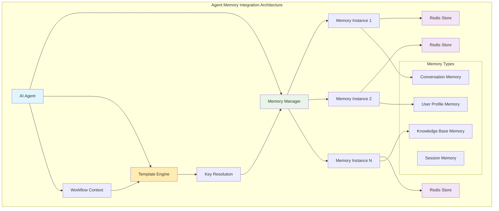

<Tabs defaultValue="single" className="w-full">
<TabsList className="grid w-full grid-cols-3">
  <TabsTrigger value="single">Single Memory</TabsTrigger>
  <TabsTrigger value="multi">Multi-Memory</TabsTrigger>
  <TabsTrigger value="conditional">Conditional Access</TabsTrigger>
</TabsList>

<TabsContent value="single">
### Single Memory Configuration
Simple agent with one memory resource for basic conversation history:

```yaml
agents:
  - id: chat_agent
    config:
      $ref: global::models.#(provider=="openai")
      temperature: 0.7
      max_tokens: 1000
    
    # Single memory resource
    memory:
      - id: conversation_memory
        key: "user:{{.workflow.input.user_id}}"
    
    instructions: |
      You are a helpful assistant with access to conversation history.
      Use the context from previous messages to provide relevant responses.
    
    actions:
      - id: chat
        prompt: |
          Current message: {{.workflow.input.message}}
          
          Respond helpfully using any relevant context from our conversation history.
```

**Use Cases:**
- Simple chatbots with basic memory
- Personal assistants with user-specific context
- Basic conversation continuity
- Development and testing scenarios

**Benefits:**
- Simple configuration and setup
- Minimal resource overhead
- Easy to understand and debug
- Fast performance for single-context use cases
</TabsContent>

<TabsContent value="multi">
### Multi-Memory Configuration
Agent with multiple memory resources for different contexts:

```yaml
agents:
  - id: support_agent
    config:
      $ref: global::models.#(provider=="openai")
    
    # Multiple memory resources
    memory:
      - id: conversation_memory
        key: "support:{{.ticket_id}}"
      - id: user_profile_memory
        key: "user:{{.user_id}}"
      - id: knowledge_base_memory
        key: "kb:{{.category}}"
    
    instructions: |
      You are a customer support agent with access to:
      1. Current conversation history
      2. User profile and preferences
      3. Knowledge base information
      
      Use all available context to provide comprehensive support.
    
    actions:
      - id: provide_support
        prompt: |
          Support Request: {{.workflow.input.request}}
          
          Conversation Context: {{.memory.conversation_memory}}
          User Profile: {{.memory.user_profile_memory}}
          Knowledge Base: {{.memory.knowledge_base_memory}}
          
          Provide detailed support using all available context.
```

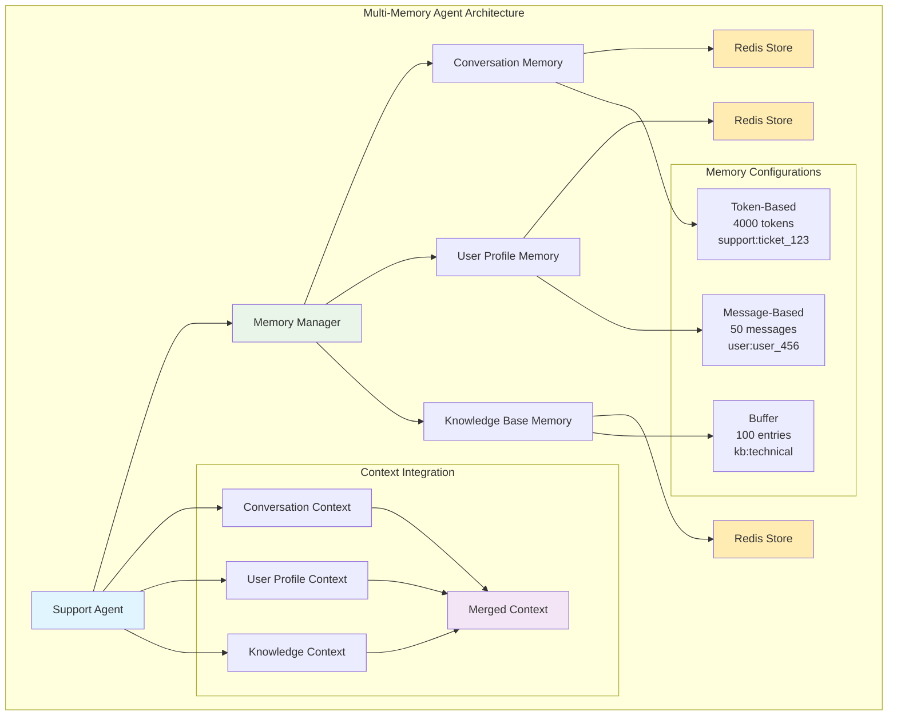

**Use Cases:**
- Customer support systems
- Enterprise AI assistants
- Multi-context applications
- Complex workflow orchestration

**Benefits:**
- Rich contextual understanding
- Personalized responses
- Scalable architecture
- Separation of concerns
</TabsContent>

<TabsContent value="conditional">
### Conditional Memory Access
Agent that conditionally accesses memory based on context:

```yaml
agents:
  - id: adaptive_agent
    config:
      $ref: global::models.#(provider=="openai")
    
    memory:
      - id: personal_memory
        key: "user:{{.workflow.input.user_id}}"
        # Only load if user is authenticated
        condition: "{{.workflow.input.authenticated}}"
      - id: session_memory
        key: "session:{{.session_id}}"
        # Always available for session context
    
    instructions: |
      You are an adaptive assistant that uses different memory contexts
      based on user authentication and session state.
    
    actions:
      - id: respond
        prompt: |
          Message: {{.workflow.input.message}}
          
          
          Personal Context: {{.memory.personal_memory}}
          
          
          Session Context: {{.memory.session_memory}}
          
          Respond appropriately based on available context.
```

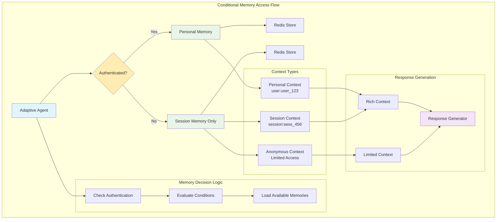

**Use Cases:**
- Multi-tenant applications
- Privacy-sensitive systems
- Progressive disclosure scenarios
- Authentication-based contexts

**Benefits:**
- Dynamic memory loading
- Privacy and security controls
- Resource optimization
- Flexible access patterns
</TabsContent>
</Tabs>

## Workflow Memory Patterns

Workflow memory patterns define how memory operations are integrated into workflow execution for optimal performance and reliability.

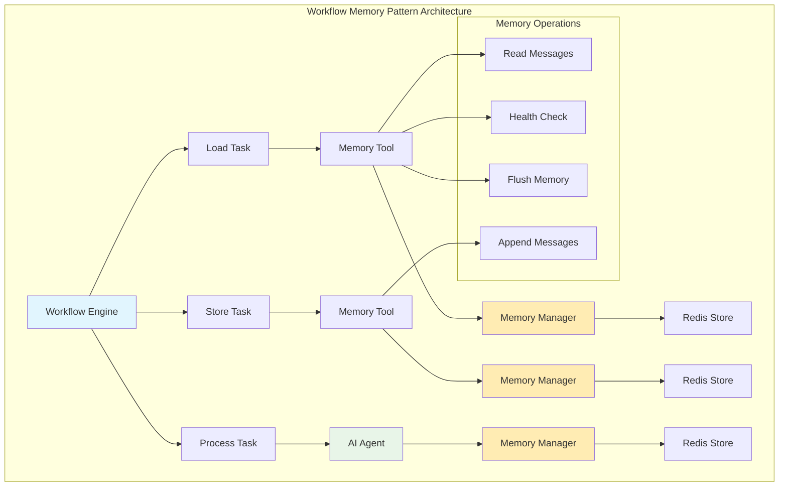

<Tabs defaultValue="load_process_store" className="w-full">
<TabsList className="grid w-full grid-cols-3">
  <TabsTrigger value="load_process_store">Load-Process-Store</TabsTrigger>
  <TabsTrigger value="parallel_ops">Parallel Operations</TabsTrigger>
  <TabsTrigger value="memory_aggregation">Memory Aggregation</TabsTrigger>
</TabsList>

<TabsContent value="load_process_store">
### Load-Process-Store Pattern
Standard pattern for memory-enabled workflows with health checking and conditional flushing:

```yaml
id: memory_workflow
version: 1.0.0
description: Standard memory workflow pattern

tasks:
  # 1. Load existing context
  - id: load_context
    type: basic
    $use: tool(local::tools.#(id="memory_tool"))
    with:
      operation: "read"
      memory_key: "user:{{.workflow.input.user_id}}"
      include_metadata: true
    outputs:
      context: "{{.output.messages}}"
      token_count: "{{.output.token_count}}"
  
  # 2. Check memory health and decide on processing
  - id: check_memory_health
    type: basic
    $use: tool(local::tools.#(id="memory_health_tool"))
    with:
      memory_key: "user:{{.workflow.input.user_id}}"
      max_tokens: 4000
    outputs:
      needs_flush: "{{.output.needs_flush}}"
      remaining_tokens: "{{.output.remaining_tokens}}"
  
  # 3. Conditional flush if memory is full
  - id: flush_if_needed
    type: router
    condition: "{{.tasks.check_memory_health.output.needs_flush}}"
    routes:
      needs_flush:
        $ref: local::tasks.#(id="flush_memory")
      no_flush:
        $ref: local::tasks.#(id="process_message")
  
  # 4. Flush memory task
  - id: flush_memory
    type: basic
    $use: tool(local::tools.#(id="memory_tool"))
    with:
      operation: "flush"
      memory_key: "user:{{.workflow.input.user_id}}"
      force: true
    on_success:
      next: process_message
  
  # 5. Process message with context
  - id: process_message
    type: basic
    $use: agent(local::agents.#(id="chat_agent"))
    with:
      message: "{{.workflow.input.message}}"
      context: "{{.tasks.load_context.output.context}}"
    outputs:
      response: "{{.output.response}}"
  
  # 6. Store interaction
  - id: store_interaction
    type: basic
    $use: tool(local::tools.#(id="memory_tool"))
    with:
      operation: "append"
      memory_key: "user:{{.workflow.input.user_id}}"
      message: |
        User: {{.workflow.input.message}}
        Assistant: {{.tasks.process_message.output.response}}
        Timestamp: {{now}}
```

**Pattern Benefits:**
- **Systematic approach**: Well-defined stages for memory operations
- **Health monitoring**: Proactive memory management with health checks
- **Conditional logic**: Smart decisions based on memory state
- **Error handling**: Graceful handling of memory issues
- **Scalability**: Works with any memory type and configuration

**Use Cases:**
- Standard conversational AI workflows
- Customer support systems
- Personal assistant applications
- Educational chatbots
</TabsContent>

<TabsContent value="parallel_ops">
### Parallel Memory Operations
Efficient parallel loading and storing of multiple memory contexts:

```yaml
id: parallel_memory_workflow
version: 1.0.0
description: Parallel memory loading pattern

tasks:
  # Load multiple memory contexts in parallel
  - id: load_memories
    type: parallel
    strategy: wait_all
    tasks:
      - id: load_conversation
        type: basic
        $use: tool(local::tools.#(id="memory_tool"))
        with:
          operation: "read"
          memory_key: "conversation:{{.conversation_id}}"
      
      - id: load_user_profile
        type: basic
        $use: tool(local::tools.#(id="memory_tool"))
        with:
          operation: "read"
          memory_key: "user:{{.user_id}}"
      
      - id: load_preferences
        type: basic
        $use: tool(local::tools.#(id="memory_tool"))
        with:
          operation: "read"
          memory_key: "preferences:{{.user_id}}"
  
  # Process with all contexts
  - id: process_with_contexts
    type: basic
    $use: agent(local::agents.#(id="multi_context_agent"))
    with:
      message: "{{.workflow.input.message}}"
      conversation_context: "{{.tasks.load_memories.output.load_conversation}}"
      user_context: "{{.tasks.load_memories.output.load_user_profile}}"
      preferences_context: "{{.tasks.load_memories.output.load_preferences}}"
  
  # Store results in parallel
  - id: store_results
    type: parallel
    strategy: best_effort
    tasks:
      - id: store_conversation
        type: basic
        $use: tool(local::tools.#(id="memory_tool"))
        with:
          operation: "append"
          memory_key: "conversation:{{.conversation_id}}"
          message: "{{.tasks.process_with_contexts.output.response}}"
      
      - id: update_user_profile
        type: basic
        $use: tool(local::tools.#(id="memory_tool"))
        with:
          operation: "update"
          memory_key: "user:{{.user_id}}"
          updates: "{{.tasks.process_with_contexts.output.user_updates}}"
```

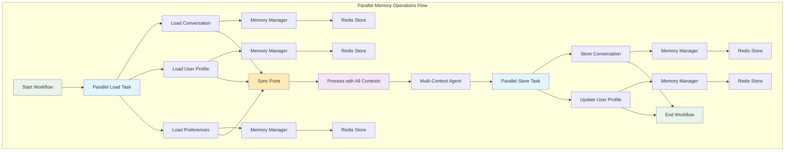

**Pattern Benefits:**
- **Performance optimization**: Parallel execution reduces latency
- **Resource efficiency**: Concurrent operations maximize throughput
- **Fault tolerance**: Best-effort storage continues on partial failures
- **Scalability**: Handles multiple memory contexts efficiently

**Use Cases:**
- Multi-context AI applications
- Real-time systems requiring fast response
- High-throughput conversation systems
- Enterprise applications with multiple data sources
</TabsContent>

<TabsContent value="memory_aggregation">
### Memory Aggregation Pattern
Combine multiple memory sources for comprehensive context:

```yaml
id: memory_aggregation_workflow
version: 1.0.0
description: Memory aggregation pattern

tasks:
  # Aggregate multiple memory sources
  - id: aggregate_memories
    type: basic
    $use: tool(local::tools.#(id="memory_aggregator_tool"))
    with:
      memory_keys:
        - "conversation:{{.conversation_id}}"
        - "user:{{.user_id}}"
        - "project:{{.project_id}}"
      aggregation_strategy: "weighted"
      weights:
        conversation: 0.6
        user: 0.3
        project: 0.1
      max_total_tokens: 2000
    outputs:
      aggregated_context: "{{.output.context}}"
      source_breakdown: "{{.output.sources}}"
  
  # Process with aggregated context
  - id: process_with_aggregated_context
    type: basic
    $use: agent(local::agents.#(id="context_aware_agent"))
    with:
      message: "{{.workflow.input.message}}"
      context: "{{.tasks.aggregate_memories.output.aggregated_context}}"
      context_sources: "{{.tasks.aggregate_memories.output.source_breakdown}}"
```

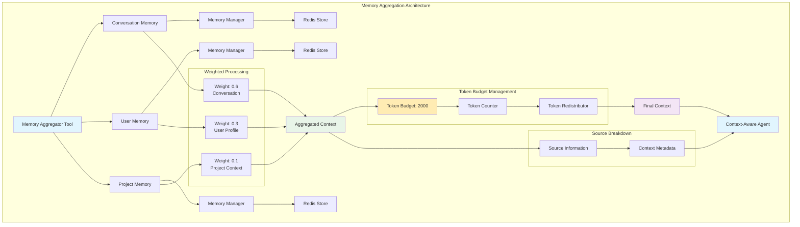

**Pattern Benefits:**
- **Unified context**: Single comprehensive view from multiple sources
- **Weighted prioritization**: Important contexts get more representation
- **Token budget management**: Controlled resource usage
- **Source transparency**: Clear indication of context origins

**Use Cases:**
- Enterprise knowledge management systems
- Multi-tenant applications
- Complex decision-making workflows
- Hierarchical information systems
</TabsContent>
</Tabs>


## Tool Integration Patterns

Tool integration patterns provide the interface between workflows and the memory system, enabling flexible and powerful memory operations.

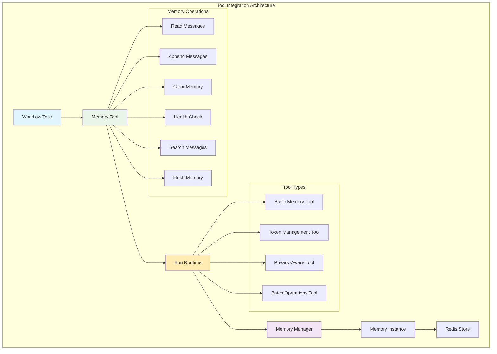

<Tabs defaultValue="basic_tool" className="w-full">
<TabsList className="grid w-full grid-cols-4">
  <TabsTrigger value="basic_tool">Basic Tool</TabsTrigger>
  <TabsTrigger value="token_tool">Token Management</TabsTrigger>
  <TabsTrigger value="privacy_tool">Privacy-Aware</TabsTrigger>
  <TabsTrigger value="batch_tool">Batch Operations</TabsTrigger>
</TabsList>

<TabsContent value="basic_tool">
### Memory Tool Implementation
Complete memory tool with all operations:

```typescript
interface MemoryToolInput {
  operation: 'read' | 'append' | 'clear' | 'health' | 'search' | 'flush';
  memory_key: string;
  message?: string;
  search_query?: string;
  search_limit?: number;
  force_flush?: boolean;
  include_metadata?: boolean;
}

interface MemoryToolOutput {
  success: boolean;
  messages?: Array<{
    role: string;
    content: string;
    timestamp: string;
    metadata?: Record<string, any>;
  }>;
  message_count?: number;
  token_count?: number;
  error?: string;
  search_results?: Array<{
    message: any;
    relevance_score?: number;
  }>;
  health?: {
    token_count: number;
    message_count: number;
    last_flush?: string;
    strategy: string;
  };
}

export default async function memoryTool(input: MemoryToolInput): Promise<MemoryToolOutput> {
  const { operation, memory_key, message, search_query, search_limit = 10, force_flush = false, include_metadata = true } = input;
  
  try {
    switch (operation) {
      case 'read':
        return await readMemoryOperation(memory_key, include_metadata);
      
      case 'append':
        if (!message) {
          throw new Error('Message is required for append operation');
        }
        return await appendMemoryOperation(memory_key, message);
      
      case 'clear':
        return await clearMemoryOperation(memory_key);
      
      case 'health':
        return await healthMemoryOperation(memory_key);
      
      case 'search':
        if (!search_query) {
          throw new Error('Search query is required for search operation');
        }
        return await searchMemoryOperation(memory_key, search_query, search_limit);
      
      case 'flush':
        return await flushMemoryOperation(memory_key, force_flush);
      
      default:
        throw new Error(`Unknown operation: ${operation}`);
    }
  } catch (error) {
    return {
      success: false,
      error: error.message || 'Unknown error occurred'
    };
  }
}
```

**Tool Benefits:**
- **Comprehensive operations**: Support for all memory operations
- **Error handling**: Robust error handling with informative messages
- **Metadata support**: Optional metadata inclusion for performance optimization
- **Flexible parameters**: Configurable operation parameters
- **Type safety**: Full TypeScript type definitions
</TabsContent>

<TabsContent value="token_tool">
### Token Management Tool
Specialized tool for token-based memory management:

```typescript
interface TokenMemoryInput {
  memory_key: string;
  max_tokens: number;
  operation: 'check_budget' | 'estimate_append';
  message?: string;
}

interface TokenMemoryOutput {
  current_tokens: number;
  max_tokens: number;
  remaining_tokens: number;
  utilization_percent: number;
  needs_flush: boolean;
  estimated_tokens?: number;
  projected_tokens?: number;
  will_exceed_limit?: boolean;
}

export async function tokenMemoryTool(input: TokenMemoryInput): Promise<TokenMemoryOutput> {
  const { memory_key, max_tokens, operation } = input;
  
  const health = await getMemoryHealth(memory_key);
  const currentTokens = health.token_count;
  
  switch (operation) {
    case 'check_budget':
      return {
        current_tokens: currentTokens,
        max_tokens,
        remaining_tokens: max_tokens - currentTokens,
        utilization_percent: (currentTokens / max_tokens) * 100,
        needs_flush: currentTokens > (max_tokens * 0.8)
      };
    
    case 'estimate_append':
      const { message } = input;
      const estimatedTokens = await estimateTokenCount(message);
      return {
        current_tokens: currentTokens,
        max_tokens,
        remaining_tokens: max_tokens - currentTokens,
        utilization_percent: (currentTokens / max_tokens) * 100,
        needs_flush: currentTokens > (max_tokens * 0.8),
        estimated_tokens: estimatedTokens,
        projected_tokens: currentTokens + estimatedTokens,
        will_exceed_limit: (currentTokens + estimatedTokens) > max_tokens
      };
  }
}
```

**Token Management Features:**
- **Budget tracking**: Real-time token usage monitoring
- **Utilization metrics**: Percentage-based usage tracking
- **Predictive analysis**: Estimate token usage before append
- **Threshold management**: Configurable flush thresholds
- **Cost optimization**: Intelligent token budget management
</TabsContent>

<TabsContent value="privacy_tool">
### Privacy-Aware Memory Tool
Tool with privacy controls and data protection:

```typescript
interface PrivacyMemoryInput {
  memory_key: string;
  message: string;
  privacy_level: 'public' | 'private' | 'confidential';
  redact_patterns?: string[];
}

interface PrivacyMemoryOutput {
  success: boolean;
  message: string;
  persisted: boolean;
  redaction_applied: boolean;
}

export async function privacyMemoryTool(input: PrivacyMemoryInput): Promise<PrivacyMemoryOutput> {
  const { memory_key, message, privacy_level, redact_patterns } = input;
  
  let processedMessage = message;
  
  // Apply redaction patterns
  if (redact_patterns) {
    for (const pattern of redact_patterns) {
      processedMessage = processedMessage.replace(new RegExp(pattern, 'gi'), '[REDACTED]');
    }
  }
  
  // Apply privacy metadata
  const privacyMetadata = {
    privacy_level,
    redaction_applied: redact_patterns ? true : false,
    do_not_persist: privacy_level === 'confidential'
  };
  
  if (privacyMetadata.do_not_persist) {
    return {
      success: true,
      message: 'Message processed but not persisted due to privacy level',
      persisted: false,
      redaction_applied: privacyMetadata.redaction_applied
    };
  }
  
  await appendWithPrivacy(memory_key, processedMessage, privacyMetadata);
  return {
    success: true,
    message: 'Message processed and stored with privacy controls',
    persisted: true,
    redaction_applied: privacyMetadata.redaction_applied
  };
}
```

**Privacy Features:**
- **Data redaction**: Automatic pattern-based content redaction
- **Privacy levels**: Configurable privacy levels for different use cases
- **Selective persistence**: Choice to persist or process without storage
- **Metadata tracking**: Privacy metadata for audit and compliance
- **Compliance support**: Built-in support for privacy regulations
</TabsContent>

<TabsContent value="batch_tool">
### Batch Operations Tool
Tool for efficient batch memory operations:

```typescript
interface BatchMemoryInput {
  operations: Array<{
    memory_key: string;
    operation: 'read' | 'append' | 'clear' | 'health';
    message?: string;
  }>;
  parallel?: boolean;
}

interface BatchMemoryOutput {
  success: boolean;
  results: Array<{
    operation: any;
    success: boolean;
    data?: any;
    error?: string;
  }>;
}

export async function batchMemoryTool(input: BatchMemoryInput): Promise<BatchMemoryOutput> {
  const { operations, parallel = true } = input;
  
  if (parallel) {
    // Execute operations in parallel
    const results = await Promise.allSettled(
      operations.map(op => performMemoryOperation(op.memory_key, op.operation, op))
    );
    
    return {
      success: true,
      results: results.map((result, index) => ({
        operation: operations[index],
        success: result.status === 'fulfilled',
        data: result.status === 'fulfilled' ? result.value : undefined,
        error: result.status === 'rejected' ? result.reason : undefined
      }))
    };
  } else {
    // Execute operations sequentially
    const results = [];
    for (const op of operations) {
      try {
        const result = await performMemoryOperation(op.memory_key, op.operation, op);
        results.push({ operation: op, success: true, data: result });
      } catch (error) {
        results.push({ operation: op, success: false, error: error.message });
      }
    }
    
    return {
      success: true,
      results
    };
  }
}
```

**Batch Operation Features:**
- **Parallel execution**: Concurrent operations for better performance
- **Sequential execution**: Ordered operations when dependencies exist
- **Error handling**: Graceful handling of individual operation failures
- **Result aggregation**: Comprehensive result collection and reporting
- **Flexibility**: Support for mixed operation types in single batch
</TabsContent>
</Tabs>


## Advanced Integration Patterns

### Memory-Aware Agent Router
Route agents based on memory state:

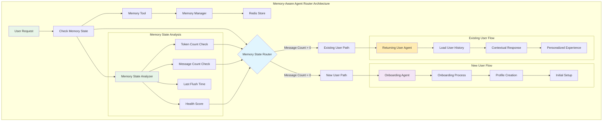

```yaml
id: memory_aware_router
version: 1.0.0
description: Route to different agents based on memory state

tasks:
  # Check memory state
  - id: check_memory_state
    type: basic
    $use: tool(local::tools.#(id="memory_tool"))
    with:
      operation: "health"
      memory_key: "user:{{.workflow.input.user_id}}"
  
  # Route based on memory state
  - id: route_by_memory
    type: router
    condition: |
      {{- if gt .tasks.check_memory_state.output.message_count 0 -}}
        existing_user
      {{- else -}}
        new_user
      {{- end -}}
    routes:
      existing_user:
        $ref: local::tasks.#(id="existing_user_flow")
      new_user:
        $ref: local::tasks.#(id="new_user_flow")
  
  # Existing user flow with context
  - id: existing_user_flow
    type: basic
    $use: agent(local::agents.#(id="returning_user_agent"))
    with:
      message: "{{.workflow.input.message}}"
      user_history: "{{.tasks.check_memory_state.output.messages}}"
  
  # New user flow with onboarding
  - id: new_user_flow
    type: basic
    $use: agent(local::agents.#(id="onboarding_agent"))
    with:
      message: "{{.workflow.input.message}}"
```

**Pattern Benefits:**
- **Intelligent routing**: Automatic agent selection based on memory state
- **User experience optimization**: Tailored flows for new vs. returning users
- **Context preservation**: Leverages existing memory for personalization
- **Scalable architecture**: Easy to extend with additional routing conditions
- **Memory-driven decisions**: Uses actual memory data for routing logic

### Memory Synchronization Pattern
Sync memory across multiple instances:

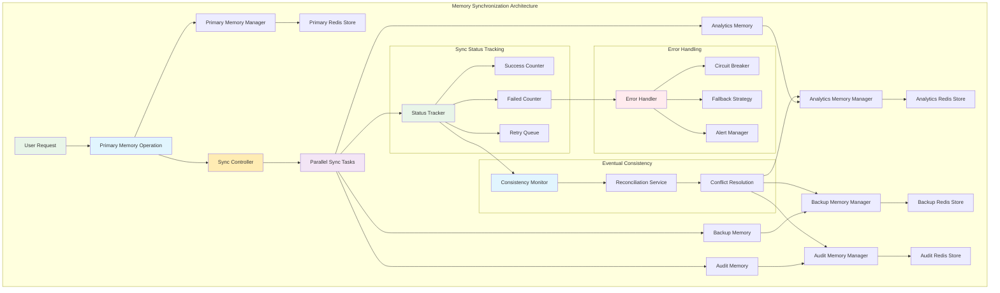

```yaml
id: memory_sync_workflow
version: 1.0.0
description: Synchronize memory across multiple instances

tasks:
  # Primary memory operation
  - id: primary_operation
    type: basic
    $use: tool(local::tools.#(id="memory_tool"))
    with:
      operation: "append"
      memory_key: "primary:{{.workflow.input.user_id}}"
      message: "{{.workflow.input.message}}"
  
  # Sync to secondary memories
  - id: sync_memories
    type: parallel
    strategy: best_effort
    tasks:
      - id: sync_analytics
        type: basic
        $use: tool(local::tools.#(id="memory_tool"))
        with:
          operation: "append"
          memory_key: "analytics:{{.workflow.input.user_id}}"
          message: "{{.workflow.input.message}}"
      
      - id: sync_backup
        type: basic
        $use: tool(local::tools.#(id="memory_tool"))
        with:
          operation: "append"
          memory_key: "backup:{{.workflow.input.user_id}}"
          message: "{{.workflow.input.message}}"
  
  # Handle sync failures
  - id: handle_sync_failures
    type: basic
    $use: tool(local::tools.#(id="sync_error_handler"))
    with:
      primary_result: "{{.tasks.primary_operation.output}}"
      sync_results: "{{.tasks.sync_memories.output}}"
```

**Pattern Benefits:**
- **Data consistency**: Ensures multiple memory instances stay synchronized
- **Fault tolerance**: Best-effort strategy handles partial failures gracefully
- **Scalability**: Parallel synchronization improves performance
- **Conflict resolution**: Built-in handling of synchronization conflicts
- **Monitoring**: Comprehensive tracking of sync status and failures

### Context-Aware Memory Management
Intelligent memory management based on context:

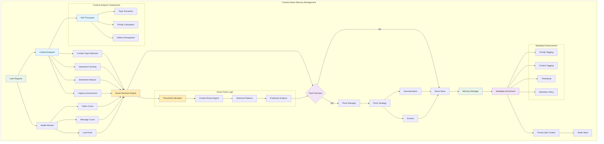

```typescript
export async function contextAwareMemoryTool(input: ContextAwareMemoryInput): Promise<ContextAwareMemoryOutput> {
  const { memory_key, message, context, smart_flush = true } = input;
  
  // Analyze context to determine memory strategy
  const contextAnalysis = await analyzeContext(context);
  
  // Check current memory state
  const health = await getMemoryHealth(memory_key);
  
  // Determine if flush is needed based on context
  let shouldFlush = false;
  if (smart_flush) {
    shouldFlush = await shouldFlushBasedOnContext(health, contextAnalysis);
  }
  
  // Perform flush if needed
  if (shouldFlush) {
    await flushMemory(memory_key, false);
  }
  
  // Determine message priority based on context
  const priority = determinePriority(message, contextAnalysis);
  
  // Store message with context-aware metadata
  await appendWithMetadata(memory_key, message, {
    priority,
    context_type: contextAnalysis.type,
    importance_score: contextAnalysis.importance,
    timestamp: new Date().toISOString()
  });
  
  return {
    success: true,
    flush_performed: shouldFlush,
    priority_assigned: priority,
    context_analysis: contextAnalysis
  };
}

async function analyzeContext(context: any): Promise<ContextAnalysis> {
  // Implement context analysis logic
  return {
    type: 'conversation',
    importance: 0.8,
    topic: 'technical_support',
    sentiment: 'neutral',
    urgency: 'medium'
  };
}

async function shouldFlushBasedOnContext(health: MemoryHealth, analysis: ContextAnalysis): Promise<boolean> {
  // Implement smart flush logic based on context
  const tokenUtilization = health.token_count / 4000; // Assuming 4000 max tokens
  
  if (tokenUtilization > 0.9) return true; // Always flush when very full
  if (analysis.importance > 0.9) return false; // Don't flush during important conversations
  if (analysis.urgency === 'high') return false; // Don't flush during urgent interactions
  
  return tokenUtilization > 0.7; // Normal threshold
}
```

**Pattern Benefits:**
- **Intelligent decision making**: Context-aware flush decisions based on conversation importance
- **Adaptive memory management**: Dynamic strategies based on conversation context
- **Priority-based storage**: Important messages get special handling and metadata
- **Predictive optimization**: Historical patterns inform future memory management decisions
- **Metadata enrichment**: Rich context information preserved with messages

## Performance Patterns

### Memory Caching Pattern
Cache frequently accessed memory data:

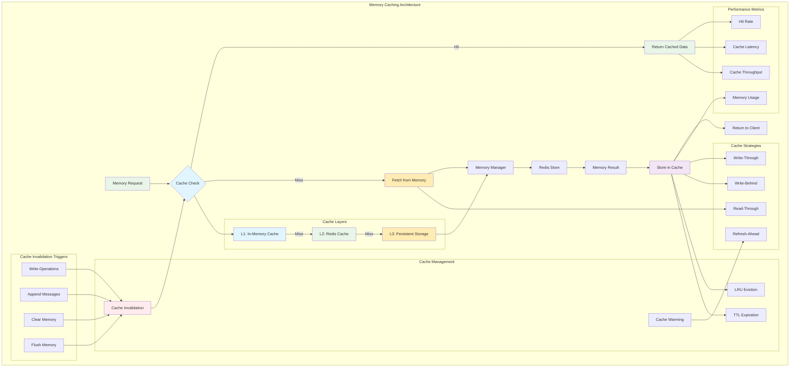

```typescript
const memoryCache = new Map<string, { data: any; timestamp: number; ttl: number }>();

export async function cachedMemoryTool(input: CachedMemoryInput): Promise<CachedMemoryOutput> {
  const { memory_key, operation, cache_ttl = 300000 } = input; // 5 minutes default TTL
  
  const cacheKey = `${memory_key}:${operation}`;
  const now = Date.now();
  
  // Check cache for read operations
  if (operation === 'read') {
    const cached = memoryCache.get(cacheKey);
    if (cached && (now - cached.timestamp) < cached.ttl) {
      return {
        success: true,
        data: cached.data,
        cache_hit: true
      };
    }
  }
  
  // Perform actual operation
  const result = await performMemoryOperation(memory_key, operation, input);
  
  // Cache the result for read operations
  if (operation === 'read' && result.success) {
    memoryCache.set(cacheKey, {
      data: result.data,
      timestamp: now,
      ttl: cache_ttl
    });
  }
  
  // Invalidate cache for write operations
  if (operation === 'append' || operation === 'clear') {
    memoryCache.delete(`${memory_key}:read`);
  }
  
  return {
    ...result,
    cache_hit: false
  };
}
```

**Caching Benefits:**
- **Performance optimization**: Reduced latency for frequently accessed memory data
- **Resource efficiency**: Minimized Redis load and network traffic
- **Scalability**: Better handling of high-frequency memory operations
- **Multi-level caching**: Layered cache hierarchy for optimal performance
- **Intelligent invalidation**: Smart cache invalidation based on memory operations

### Batch Memory Operations
Optimize multiple memory operations:

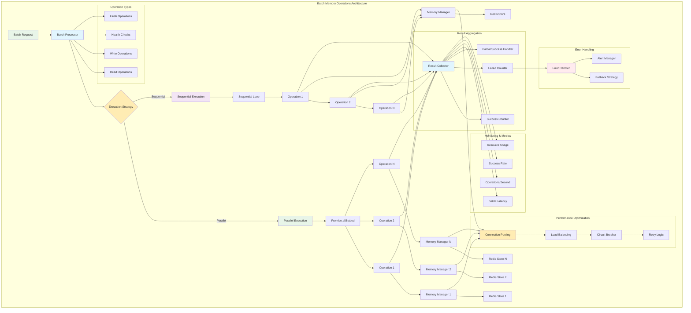

```typescript
export async function batchMemoryTool(input: BatchMemoryInput): Promise<BatchMemoryOutput> {
  const { operations, parallel = true } = input;
  
  if (parallel) {
    // Execute operations in parallel
    const results = await Promise.allSettled(
      operations.map(op => performMemoryOperation(op.memory_key, op.operation, op))
    );
    
    return {
      success: true,
      results: results.map((result, index) => ({
        operation: operations[index],
        success: result.status === 'fulfilled',
        data: result.status === 'fulfilled' ? result.value : undefined,
        error: result.status === 'rejected' ? result.reason : undefined
      }))
    };
  } else {
    // Execute operations sequentially
    const results = [];
    for (const op of operations) {
      try {
        const result = await performMemoryOperation(op.memory_key, op.operation, op);
        results.push({ operation: op, success: true, data: result });
      } catch (error) {
        results.push({ operation: op, success: false, error: error.message });
      }
    }
    
    return {
      success: true,
      results
    };
  }
}
```

**Batch Operation Benefits:**
- **Throughput optimization**: Higher operations per second through batching
- **Resource efficiency**: Better utilization of connections and memory
- **Fault tolerance**: Graceful handling of partial batch failures
- **Flexible execution**: Choice between parallel and sequential execution
- **Comprehensive monitoring**: Detailed metrics and error tracking for batch operations

## Advanced Integration Features

### Multi-Agent Memory Sharing

Complex AI applications often require multiple agents to share memory context for collaborative problem-solving:

<Tabs defaultValue="sharing" className="w-full">
<TabsList className="grid w-full grid-cols-3">
  <TabsTrigger value="sharing">Memory Sharing</TabsTrigger>
  <TabsTrigger value="orchestration">Agent Orchestration</TabsTrigger>
  <TabsTrigger value="coordination">Memory Coordination</TabsTrigger>
</TabsList>

<TabsContent value="sharing">
### Inter-Agent Memory Sharing

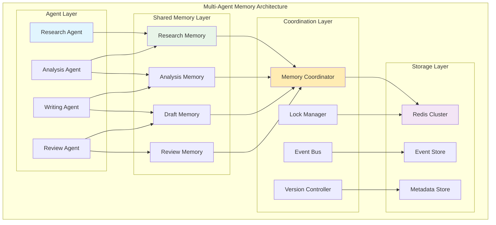

**Multi-Agent Memory Configuration:**
```yaml
# Collaborative research project
agents:
  - id: research_agent
    memory:
      - id: research_data
        key: "project:{{.workflow.input.project_id}}:research"
        mode: "read-write"
      - id: shared_context
        key: "project:{{.workflow.input.project_id}}:context"
        mode: "read-write"
  
  - id: analysis_agent
    memory:
      - id: research_data
        key: "project:{{.workflow.input.project_id}}:research"
        mode: "read-only"
      - id: analysis_results
        key: "project:{{.workflow.input.project_id}}:analysis"
        mode: "read-write"
      - id: shared_context
        key: "project:{{.workflow.input.project_id}}:context"
        mode: "read-write"
  
  - id: writing_agent
    memory:
      - id: analysis_results
        key: "project:{{.workflow.input.project_id}}:analysis"
        mode: "read-only"
      - id: draft_content
        key: "project:{{.workflow.input.project_id}}:draft"
        mode: "read-write"
      - id: shared_context
        key: "project:{{.workflow.input.project_id}}:context"
        mode: "read-write"
```

**Memory Sharing Patterns:**
- **Read-Write Access**: Primary agent for data creation and updates
- **Read-Only Access**: Secondary agents for data consumption
- **Shared Context**: Common memory for coordination and status
- **Versioned Memory**: Track changes and maintain consistency
</TabsContent>

<TabsContent value="orchestration">
### Agent Orchestration with Memory

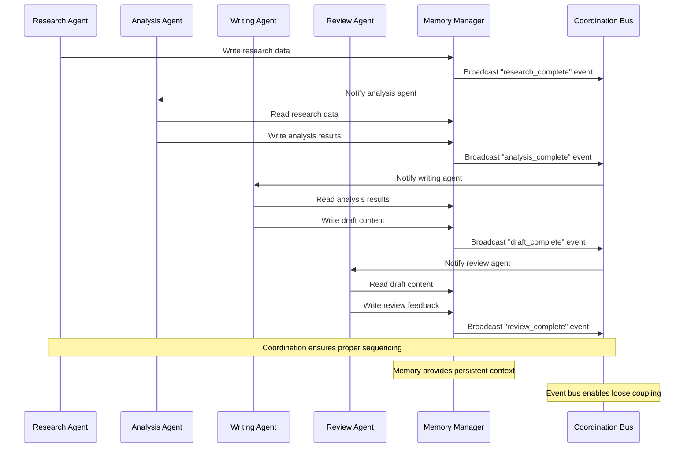

**Orchestration Configuration:**
```yaml
# Agent orchestration workflow
id: collaborative_workflow
version: 1.0.0
description: Multi-agent collaboration with memory coordination

tasks:
  - id: research_phase
    type: basic
    $use: agent(local::agents.#(id="research_agent"))
    action: conduct_research
    with:
      topic: "{{.workflow.input.research_topic}}"
      project_id: "{{.workflow.input.project_id}}"
    
    on_success:
      next: analysis_phase
      event: "research_complete"
  
  - id: analysis_phase
    type: basic
    $use: agent(local::agents.#(id="analysis_agent"))
    action: analyze_research
    with:
      project_id: "{{.workflow.input.project_id}}"
    
    on_success:
      next: writing_phase
      event: "analysis_complete"
  
  - id: writing_phase
    type: basic
    $use: agent(local::agents.#(id="writing_agent"))
    action: write_content
    with:
      project_id: "{{.workflow.input.project_id}}"
      content_type: "{{.workflow.input.content_type}}"
    
    on_success:
      next: review_phase
      event: "draft_complete"
  
  - id: review_phase
    type: basic
    $use: agent(local::agents.#(id="review_agent"))
    action: review_content
    with:
      project_id: "{{.workflow.input.project_id}}"
    
    final: true
```
</TabsContent>

<TabsContent value="coordination">
### Memory Coordination Patterns

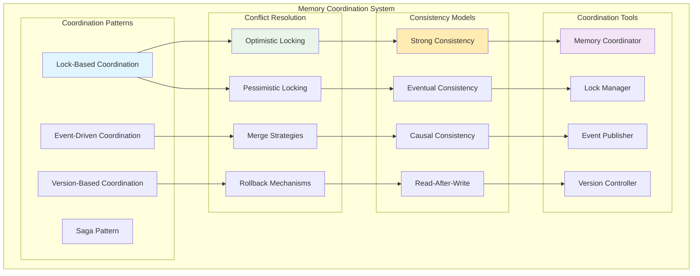

**Coordination Implementation:**
```typescript
// Memory coordination service
export class MemoryCoordinator {
  private lockManager: LockManager;
  private eventBus: EventBus;
  private versionController: VersionController;
  
  async coordinateMemoryAccess(
    memoryKey: string,
    operation: MemoryOperation,
    agents: string[]
  ): Promise<CoordinationResult> {
    // 1. Acquire coordination lock
    const lock = await this.lockManager.acquire(
      `coord:${memoryKey}`, 
      { timeout: 30000 }
    );
    
    try {
      // 2. Check current version
      const version = await this.versionController.getCurrentVersion(memoryKey);
      
      // 3. Execute operation with version check
      const result = await this.executeCoordinatedOperation(
        memoryKey, 
        operation, 
        version
      );
      
      // 4. Update version and notify agents
      await this.versionController.incrementVersion(memoryKey);
      await this.eventBus.publish(`memory:${memoryKey}:updated`, {
        version: version + 1,
        operation: operation.type,
        timestamp: Date.now()
      });
      
      return result;
      
    } finally {
      // 5. Release coordination lock
      await this.lockManager.release(lock);
    }
  }
}
```

**Coordination Patterns:**
- **Lock-Based**: Exclusive access for critical operations
- **Event-Driven**: Asynchronous coordination via events
- **Version-Based**: Optimistic concurrency with version tracking
- **Saga Pattern**: Distributed transaction management
</TabsContent>
</Tabs>

### Advanced MCP Integration

Model Context Protocol (MCP) integration enables sophisticated memory interactions with external systems:

<Tabs defaultValue="mcp_memory" className="w-full">
<TabsList className="grid w-full grid-cols-3">
  <TabsTrigger value="mcp_memory">MCP Memory Tools</TabsTrigger>
  <TabsTrigger value="external_sync">External Sync</TabsTrigger>
  <TabsTrigger value="hybrid_memory">Hybrid Memory</TabsTrigger>
</TabsList>

<TabsContent value="mcp_memory">
### MCP Memory Tool Integration

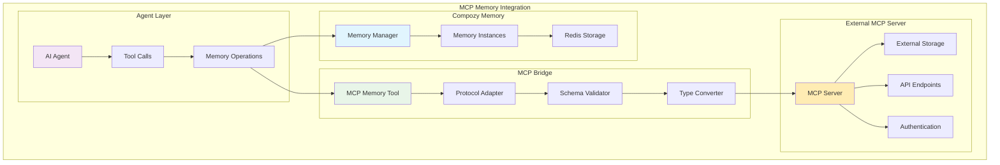

**MCP Memory Tool Configuration:**
```yaml
# Agent with MCP memory integration
agents:
  - id: advanced_agent
    memory:
      - id: local_memory
        key: "user:{{.workflow.input.user_id}}:local"
        mode: "read-write"
    
    mcps:
      - id: external_memory
        transport: http
        url: "http://memory-service:8080"
        auth:
          type: "bearer"
          token: "{{.env.MEMORY_SERVICE_TOKEN}}"
    
    instructions: |
      You have access to both local and external memory systems.
      Use local memory for conversation context and external memory for
      persistent knowledge and shared data.
    
    actions:
      - id: hybrid_memory_search
        prompt: |
          Search for information in both local and external memory:
          Query: {{.input.query}}
          
          First check local memory, then use MCP tools to search external systems.
          Combine results for comprehensive response.
```

**MCP Memory Operations:**
```typescript
// MCP memory tool implementation
export class MCPMemoryTool {
  async searchMemory(query: string, sources: string[]): Promise<SearchResult> {
    const results = await Promise.all(
      sources.map(source => this.searchSource(source, query))
    );
    
    return {
      query,
      sources,
      results: results.flat(),
      combined: this.combineResults(results)
    };
  }
  
  async syncMemory(
    localKey: string, 
    externalKey: string,
    direction: 'local-to-external' | 'external-to-local' | 'bidirectional'
  ): Promise<SyncResult> {
    // Implementation for memory synchronization
  }
}
```
</TabsContent>

<TabsContent value="external_sync">
### External System Synchronization

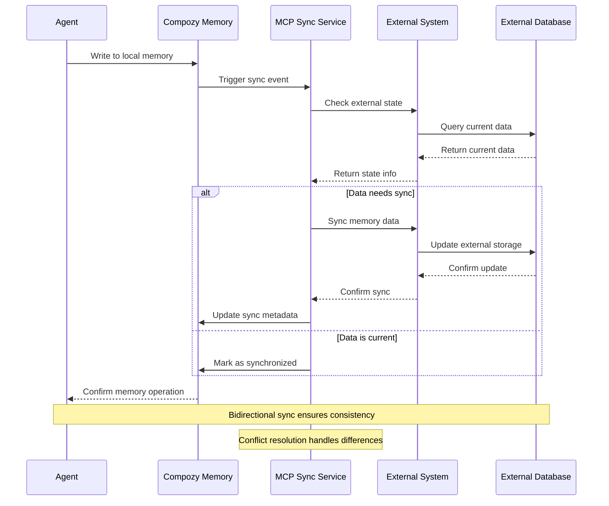

**Synchronization Configuration:**
```yaml
# External memory synchronization
mcps:
  - id: crm_sync
    transport: http
    url: "http://crm-system:8080"
    sync_config:
      enabled: true
      direction: "bidirectional"
      interval: "5m"
      conflict_resolution: "last_write_wins"
      
  - id: knowledge_base
    transport: sse
    url: "http://kb-service:8080/events"
    sync_config:
      enabled: true
      direction: "external-to-local"
      real_time: true
      
tools:
  - id: memory_sync_tool
    description: Synchronize memory with external systems
    execute: ./sync_tool.ts
    input:
      type: object
      properties:
        operation:
          type: string
          enum: ["sync", "pull", "push"]
        target_system:
          type: string
        memory_key:
          type: string
      required:
        - operation
        - target_system
        - memory_key
```
</TabsContent>

<TabsContent value="hybrid_memory">
### Hybrid Memory Architecture

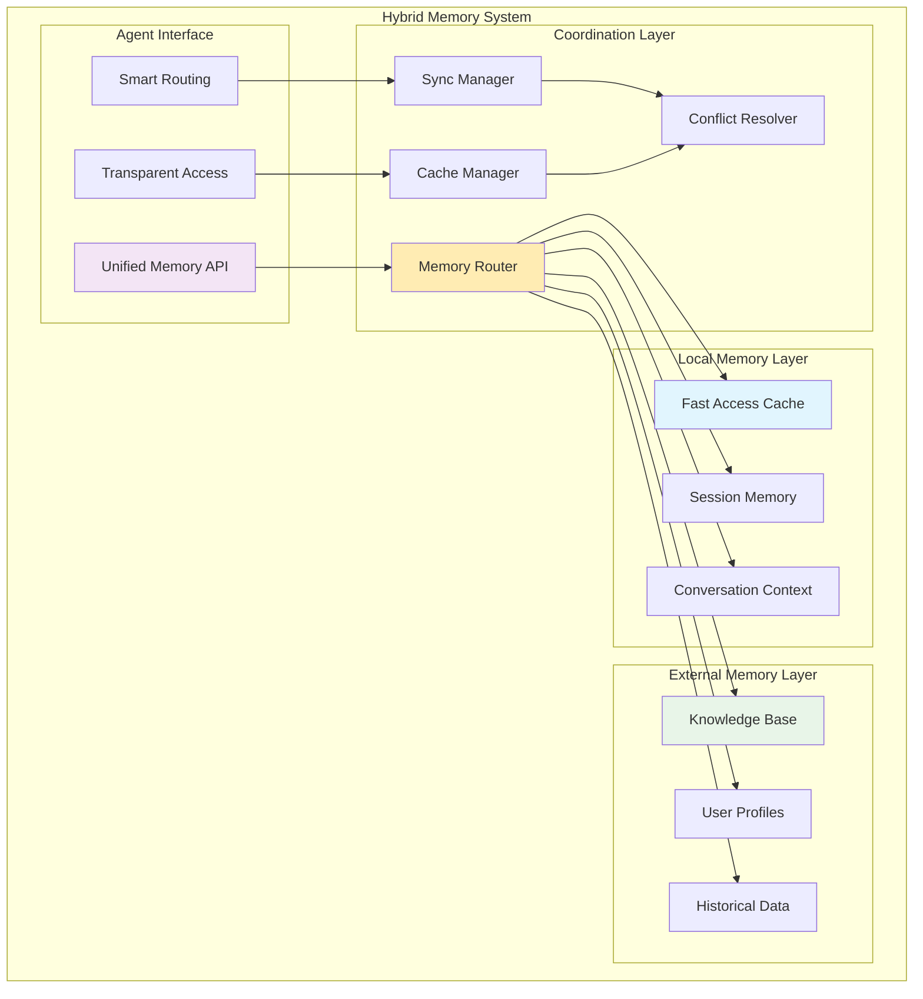

**Hybrid Memory Implementation:**
```typescript
// Hybrid memory manager
export class HybridMemoryManager {
  private localMemory: LocalMemoryManager;
  private externalMemory: ExternalMemoryManager;
  private router: MemoryRouter;
  
  async read(key: string, options?: ReadOptions): Promise<MemoryData> {
    const route = this.router.determineRoute(key, 'read');
    
    switch (route.strategy) {
      case 'local-first':
        return this.readLocalFirst(key, options);
      case 'external-first':
        return this.readExternalFirst(key, options);
      case 'merged':
        return this.readMerged(key, options);
      default:
        throw new Error(`Unknown routing strategy: ${route.strategy}`);
    }
  }
  
  async write(key: string, data: MemoryData, options?: WriteOptions): Promise<WriteResult> {
    const route = this.router.determineRoute(key, 'write');
    
    // Write to appropriate targets based on routing strategy
    const results = await Promise.allSettled([
      route.targets.includes('local') ? this.localMemory.write(key, data, options) : null,
      route.targets.includes('external') ? this.externalMemory.write(key, data, options) : null
    ]);
    
    return this.aggregateWriteResults(results);
  }
}
```

**Routing Strategies:**
- **Local-First**: Prefer local memory for speed, fallback to external
- **External-First**: Prefer external memory for consistency, cache locally
- **Merged**: Combine data from both sources intelligently
- **Partitioned**: Route based on data type or access patterns
</TabsContent>
</Tabs>

### Enterprise Security & Compliance

Production memory systems require robust security and compliance features:

<Tabs defaultValue="security" className="w-full">
<TabsList className="grid w-full grid-cols-3">
  <TabsTrigger value="security">Security Hardening</TabsTrigger>
  <TabsTrigger value="compliance">Compliance</TabsTrigger>
  <TabsTrigger value="governance">Data Governance</TabsTrigger>
</TabsList>

<TabsContent value="security">
### Security Hardening

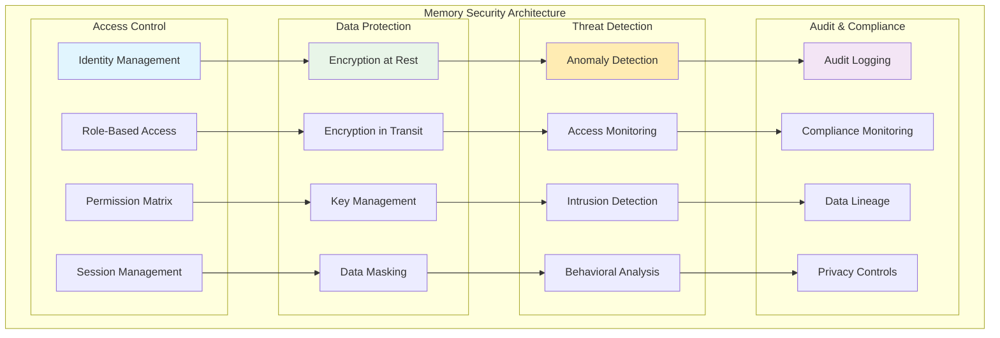

**Security Configuration:**
```yaml
# Enterprise security configuration
memory:
  security:
    encryption:
      at_rest: true
      in_transit: true
      key_rotation: "30d"
      algorithm: "AES-256-GCM"
      
    access_control:
      rbac_enabled: true
      default_permissions: "read-only"
      session_timeout: "1h"
      max_concurrent_sessions: 10
      
    monitoring:
      audit_logging: true
      anomaly_detection: true
      failed_access_threshold: 5
      suspicious_pattern_detection: true
      
    compliance:
      data_retention: "90d"
      pii_detection: true
      anonymization: true
      gdpr_compliance: true
```
</TabsContent>

<TabsContent value="compliance">
### Compliance Framework

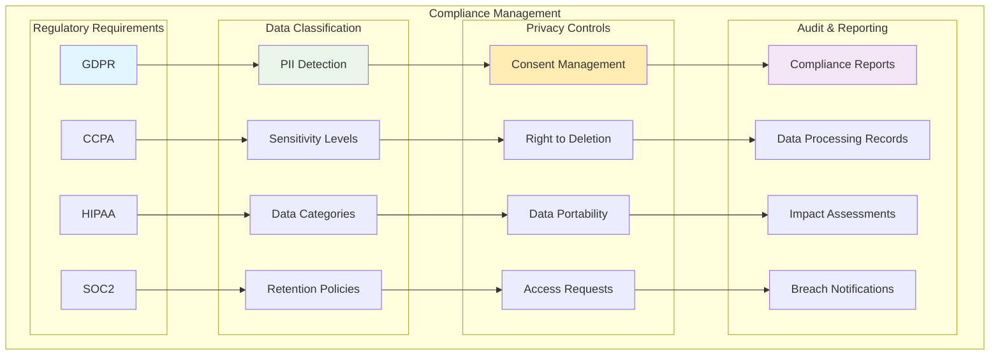

**Compliance Implementation:**
```typescript
// Compliance manager for memory operations
export class ComplianceManager {
  async processMemoryOperation(
    operation: MemoryOperation,
    context: ComplianceContext
  ): Promise<ComplianceResult> {
    // 1. Check consent
    const consent = await this.checkConsent(context.userId, operation.type);
    if (!consent.valid) {
      throw new ComplianceError('Insufficient consent for operation');
    }
    
    // 2. Classify data
    const classification = await this.classifyData(operation.data);
    
    // 3. Apply policies
    const policies = await this.getPolicies(classification);
    const processedData = await this.applyPolicies(operation.data, policies);
    
    // 4. Log for audit
    await this.auditLog({
      operation: operation.type,
      user: context.userId,
      classification: classification.level,
      policies: policies.map(p => p.name),
      timestamp: Date.now()
    });
    
    return {
      success: true,
      processedData,
      classification,
      appliedPolicies: policies
    };
  }
}
```
</TabsContent>

<TabsContent value="governance">
### Data Governance

```mermaid
graph TB
    subgraph "Data Governance Framework"
        subgraph "Data Stewardship"
            DS1[Data Owners]
            DS2[Data Stewards]
            DS3[Data Custodians]
            DS4[Data Users]
        end
        
        subgraph "Policy Management"
            PM1[Data Policies]
            PM2[Access Policies]
            PM3[Retention Policies]
            PM4[Quality Policies]
        end
        
        subgraph "Lifecycle Management"
            LM1[Data Creation]
            LM2[Data Usage]
            LM3[Data Archival]
            LM4[Data Deletion]
        end
        
        subgraph "Quality Assurance"
            QA1[Data Validation]
            QA2[Quality Metrics]
            QA3[Data Lineage]
            QA4[Impact Analysis]
        end
        
        DS1 --> PM1
        DS2 --> PM2
        DS3 --> PM3
        DS4 --> PM4
        
        PM1 --> LM1
        PM2 --> LM2
        PM3 --> LM3
        PM4 --> LM4
        
        LM1 --> QA1
        LM2 --> QA2
        LM3 --> QA3
        LM4 --> QA4
    end
    
    style DS1 fill:#e1f5fe
    style PM1 fill:#e8f5e8
    style LM1 fill:#ffecb3
    style QA1 fill:#f3e5f5
```

**Governance Configuration:**
```yaml
# Data governance configuration
governance:
  data_stewardship:
    data_owners:
      - name: "Privacy Officer"
        responsibilities: ["privacy_policy", "consent_management"]
      - name: "Security Officer"  
        responsibilities: ["access_control", "encryption"]
        
  policies:
    retention:
      default_ttl: "90d"
      pii_ttl: "30d"
      logs_ttl: "7y"
      
    quality:
      validation_rules:
        - type: "schema_validation"
          required: true
        - type: "data_freshness"
          threshold: "24h"
        - type: "completeness"
          threshold: 0.95
          
  lifecycle:
    stages:
      - name: "creation"
        validations: ["schema", "privacy", "security"]
      - name: "usage"
        monitoring: ["access_patterns", "performance"]
      - name: "archival"
        triggers: ["age", "usage_frequency"]
      - name: "deletion"
        confirmations: ["policy_compliance", "legal_hold"]
```
</TabsContent>
</Tabs>

## Best Practices for Integration

### Error Handling
- Implement comprehensive retry logic
- Provide graceful degradation when memory is unavailable
- Log all memory operations for debugging
- Monitor memory health and performance
- Handle concurrent access conflicts

### Performance Optimization
- Use pagination for large memory datasets
- Implement caching for frequently accessed data
- Batch operations when possible
- Monitor token usage and implement budgeting
- Use appropriate TTL settings

### Security Considerations
- Validate all memory keys and inputs
- Implement proper access controls
- Use privacy controls for sensitive data
- Monitor for unusual access patterns
- Implement rate limiting for memory operations

### Monitoring and Observability
- Track memory usage metrics
- Monitor operation latency
- Alert on memory failures
- Track token consumption
- Monitor flush frequency and effectiveness

### Production Deployment
- Implement horizontal scaling strategies
- Use Redis clustering for high availability
- Set up comprehensive monitoring and alerting
- Implement backup and disaster recovery
- Plan for capacity growth and optimization

These advanced integration patterns provide enterprise-grade capabilities for building sophisticated, secure, and scalable memory-enabled applications.
