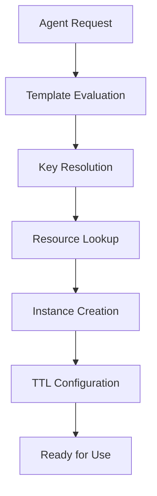

# Memory Concepts & Architecture

Compozy's memory system provides persistent, scalable context management for AI agents across workflow executions. Built on distributed systems principles, it enables agents to maintain conversation history, learn from interactions, and provide contextual responses.

## Related Documentation

### 🔗 Cross-References
- **[Core Concepts: Memory](/docs/core/getting-started/core-concepts#5-memory-systems)** - Memory in workflow context
- **[Agent Memory](/docs/core/agents/memory)** - How agents use memory
- **[Memory Tasks](/docs/core/tasks/memory-tasks)** - Task-based memory operations
- **[YAML Templates](/docs/core/yaml-templates/overview)** - Dynamic memory configuration

### 🧠 Memory-Related Topics
- **Memory Operations** ↔ **[Agent Memory](/docs/core/agents/memory)** ↔ **[Memory Tasks](/docs/core/tasks/memory-tasks)**
- **Memory Configuration** ↔ **[Project Setup](/docs/core/configuration/project-setup)** ↔ **[Runtime Configuration](/docs/core/configuration/runtime-config)**
- **Memory Integration** ↔ **[Multi-Agent Patterns](/docs/core/agents/multi-agent-patterns)** ↔ **[Advanced Task Patterns](/docs/core/tasks/advanced-patterns)**

## Core Architecture

The memory system is built around several key components that work together to provide reliable, performant memory management:

### Memory Manager
The central orchestrator that:
- Creates and retrieves memory instances based on resource configurations
- Evaluates key templates using workflow context
- Manages lifecycle and resource allocation
- Coordinates with privacy and token management systems

### Memory Instances
Individual memory containers that:
- Store and retrieve messages with full context preservation
- Implement configurable eviction and flushing strategies
- Provide thread-safe concurrent access patterns
- Support pagination for large conversation histories

### Storage Layer
Redis-based persistence with:
- Atomic operations for consistency
- TTL management for automatic cleanup
- Metadata caching for O(1) operations
- Circuit breaker patterns for resilience

## Memory Types

Compozy supports three distinct memory management strategies:

### Token-Based Memory (`token_based`)
Manages memory based on token consumption, ideal for LLM context window optimization:

```yaml
resource: memory
id: conversation_memory
type: token_based
max_tokens: 4000
max_context_ratio: 0.8  # Use 80% of model's context window
model: gpt-4
```

**Use cases:**
- Conversation histories with large models
- Complex multi-turn interactions
- Token budget optimization

### Message Count-Based Memory (`message_count_based`)
Manages memory based on the number of messages:

```yaml
resource: memory
id: simple_chat
type: message_count_based
max_messages: 100
```

**Use cases:**
- Simple chat applications
- Fixed-size conversation windows
- Predictable memory patterns

### Buffer Memory (`buffer`)
Simple storage without sophisticated eviction, useful for testing:

```yaml
resource: memory
id: debug_memory
type: buffer
max_messages: 50
```

**Use cases:**
- Development and testing
- Temporary storage
- Simple use cases without complex requirements

## Key Resolution System

Memory instances are identified using dynamic key templates that support workflow context injection:

### Template Syntax
```yaml
key: "user:{{.workflow.input.user_id}}"
key: "session:{{.session_id}}:conversation"
key: "project:{{.project_id}}:{{.agent_id}}"
```

### Context Variables
Available template variables include:
- `{{.workflow.input.*}}` - Workflow input parameters
- `{{.session_id}}` - Current session identifier
- `{{.project_id}}` - Project context
- `{{.agent_id}}` - Agent identifier
- Custom context from workflow execution

### Key Resolution Process
1. Template evaluation using workflow context
2. Namespace prefixing for multi-tenancy
3. Collision detection and validation
4. Instance creation or retrieval

## Lifecycle Management

Memory instances follow a well-defined lifecycle with automated management:

### Creation and Initialization


### TTL Management
Three distinct TTL behaviors control instance lifecycle:

- **AppendTTL**: Extends TTL on each message append (default: 30m)
- **ClearTTL**: Sets TTL after memory clear (default: 5m)
- **FlushTTL**: Sets TTL after flush operations (default: 1h)

```yaml
persistence:
  type: redis
  ttl: 24h
append_ttl: "30m"
clear_ttl: "5m"
flush_ttl: "1h"
```

### Automatic Cleanup
- TTL-based expiration for unused instances
- Garbage collection of orphaned data
- Periodic health monitoring and cleanup

## Thread Safety and Concurrency

The memory system provides robust concurrent access through:

### Distributed Locking
- Redis-based distributed locks for atomic operations
- Configurable lock timeouts per operation type
- Automatic lock release and cleanup
- Deadlock prevention mechanisms

### Atomic Operations
```go
// Example: Atomic message append with token count update
AppendMessageWithTokenCount(ctx, key, message, tokenCount)

// Example: Atomic message replacement with metadata sync
ReplaceMessagesWithMetadata(ctx, key, messages, totalTokens)
```

### Consistency Guarantees
- Strong consistency for individual memory instances
- Eventual consistency for cross-instance operations
- Transactional semantics for complex operations

## Performance Characteristics

### Scalability
- Horizontal scaling through Redis clustering
- Independent instance lifecycle management
- Configurable connection pooling
- Circuit breaker patterns for fault tolerance

### Optimization Features
- O(1) metadata operations (token counts, message counts)
- Efficient pagination for large histories
- Lazy loading of message content
- Configurable caching strategies

### Monitoring and Observability
- Comprehensive metrics collection
- Health check endpoints
- Performance monitoring
- Error tracking and alerting

## Integration Points

### Agent Integration
Memory resources are configured at the agent level:

```yaml
agents:
  - id: support_agent
    memory:
      - id: conversation_memory
        key: "support:{{.conversation_id}}"
      - id: user_profile
        key: "user:{{.user_id}}"
```

### Workflow Integration
Memory operations are exposed through tasks and tools:

```yaml
tasks:
  - id: load_history
    type: basic
    $use: tool(memory_tool)
    with:
      operation: "read"
      memory_key: "user:{{.workflow.input.user_id}}"
```

### Tool Integration
TypeScript tools can interact with memory through the runtime:

```typescript
export default async function memoryTool(input: MemoryInput) {
  const { operation, memory_key, message } = input;

  switch (operation) {
    case 'read':
      return await readMemory(memory_key);
    case 'append':
      return await appendMemory(memory_key, message);
  }
}
```

## Best Practices

### Key Design
- Use hierarchical naming: `project:agent:session`
- Include necessary context for uniqueness
- Avoid overly complex templates
- Consider key length and performance implications

### Resource Configuration
- Choose appropriate memory type for use case
- Set realistic token and message limits
- Configure TTLs based on usage patterns
- Enable privacy controls for sensitive data

### Performance Optimization
- Use pagination for large histories
- Implement appropriate flushing strategies
- Monitor token usage and costs
- Configure circuit breakers for resilience

### Error Handling
- Implement retry logic for transient failures
- Handle memory unavailability gracefully
- Provide fallback mechanisms
- Monitor and alert on persistent failures

This foundational understanding of memory concepts and architecture enables effective use of Compozy's memory system for building context-aware AI applications.

## Integration with Compozy Workflows

<FeatureCardList cols={2}>
  <FeatureCard title="Agent Memory" href="/docs/core/agents/memory">
    Configure persistent memory for your AI agents
  </FeatureCard>
  <FeatureCard title="Memory Tasks" href="/docs/core/tasks/memory-tasks">
    Use specialized memory tasks in your workflows
  </FeatureCard>
  <FeatureCard title="Workflow State" href="/docs/core/tasks/flow-control">
    Manage stateful workflows with memory integration
  </FeatureCard>
  <FeatureCard title="Multi-Agent Patterns" href="/docs/core/agents/multi-agent-patterns">
    Share memory context across multiple agents
  </FeatureCard>
</FeatureCardList>

## Practical Implementation

<FeatureCardList cols={2}>
  <FeatureCard title="Memory Configuration" href="/docs/core/memory/configuration">
    Set up and configure memory resources
  </FeatureCard>
  <FeatureCard title="Memory Operations" href="/docs/core/memory/operations">
    Perform read, write, and management operations
  </FeatureCard>
  <FeatureCard title="Privacy & Security" href="/docs/core/memory/privacy-security">
    Implement secure memory handling practices
  </FeatureCard>
  <FeatureCard title="Troubleshooting" href="/docs/core/memory/troubleshooting">
    Debug and resolve memory-related issues
  </FeatureCard>
</FeatureCardList>

## Getting Started with Memory

### Quick Start Path
1. **[Quick Start Guide](/docs/core/getting-started/quick-start)** - Basic project setup
2. **[Agent Overview](/docs/core/agents/overview)** - Understanding agents
3. **[Memory Configuration](/docs/core/memory/configuration)** - Add memory to your agents
4. **[Integration Patterns](/docs/core/memory/integration-patterns)** - Advanced usage patterns

### Advanced Patterns
- **[Observability](/docs/core/metrics/observability)** - Monitor memory performance
- **[Production Considerations](/docs/core/deployment/scaling)** - Scale memory systems
- **[Examples](/docs/core/examples/basic-examples)** - Real-world memory implementations
