# Memory Concepts & Architecture

Compozy's memory system provides persistent, scalable context management for AI agents across workflow executions. Built on distributed systems principles, it enables agents to maintain conversation history, learn from interactions, and provide contextual responses.

## Related Documentation

### 🔗 Cross-References
- **[Core Concepts: Memory](/docs/core/getting-started/core-concepts#5-memory-systems)** - Memory in workflow context
- **[Agent Memory](/docs/core/agents/memory)** - How agents use memory
- **[Memory Tasks](/docs/core/tasks/memory-tasks)** - Task-based memory operations
- **[YAML Templates](/docs/core/yaml-templates/overview)** - Dynamic memory configuration

### 🧠 Memory-Related Topics
- **Memory Operations** ↔ **[Agent Memory](/docs/core/agents/memory)** ↔ **[Memory Tasks](/docs/core/tasks/memory-tasks)**
- **Memory Configuration** ↔ **[Project Setup](/docs/core/configuration/project-setup)** ↔ **[Runtime Configuration](/docs/core/configuration/runtime-config)**
- **Memory Integration** ↔ **[Multi-Agent Patterns](/docs/core/agents/multi-agent-patterns)** ↔ **[Advanced Task Patterns](/docs/core/tasks/advanced-patterns)**
- **Performance Monitoring** ↔ **[Production Deployment](/docs/core/memory/troubleshooting#production-deployment--monitoring)** ↔ **[Security Hardening](/docs/core/memory/troubleshooting#security-hardening--compliance)**
- **Advanced Integration** ↔ **[Multi-Agent Memory](/docs/core/memory/integration-patterns#advanced-integration-features)** ↔ **[Enterprise Features](/docs/core/memory/integration-patterns#enterprise-security--compliance)**

## Core Architecture

The memory system is built around several key components that work together to provide reliable, performant memory management:

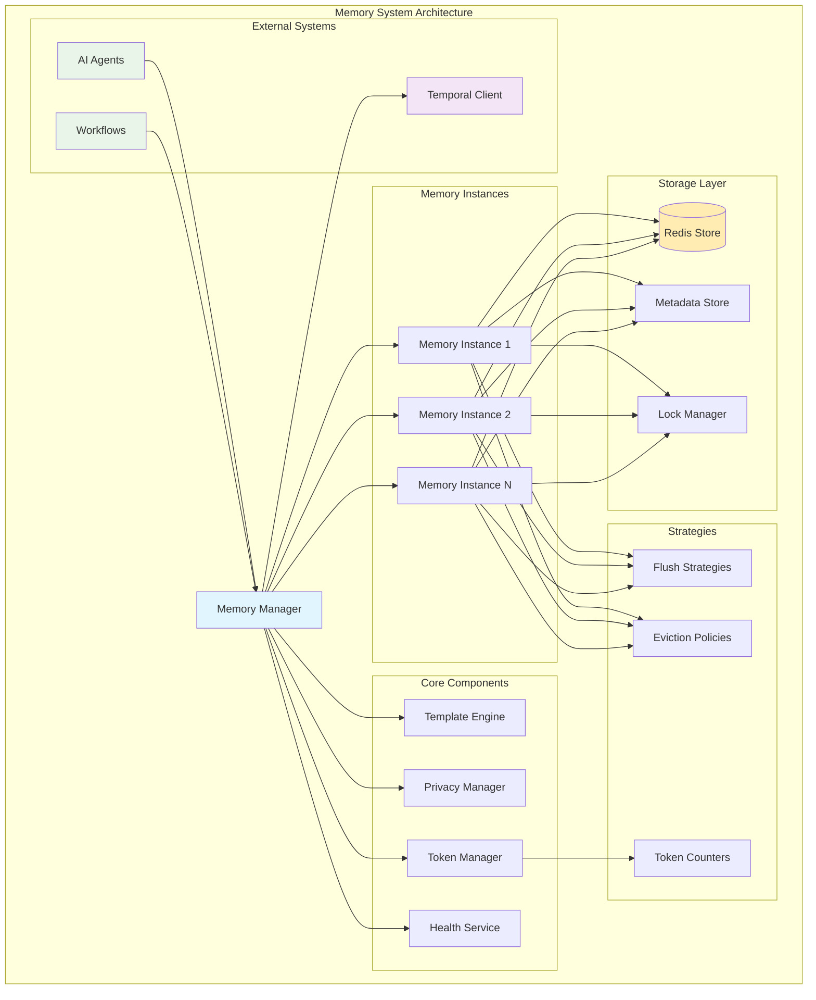

### Memory Manager
The central orchestrator (`engine/memory/manager.go`) that:
- Creates and retrieves memory instances based on resource configurations
- Evaluates key templates using workflow context via template engine
- Manages lifecycle and resource allocation with retry logic
- Coordinates with privacy manager and token management systems
- Integrates with Temporal for distributed flush operations

### Memory Instances
Individual memory containers (`engine/memory/instance/memory_instance.go`) that:
- Store and retrieve messages with full context preservation
- Implement configurable eviction and flushing strategies (FIFO, LRU, Token-aware)
- Provide thread-safe concurrent access patterns via Redis locks
- Support pagination for large conversation histories
- Maintain health metrics and diagnostic information

### Storage Layer
Redis-based persistence (`engine/memory/store/redis.go`) with:
- Atomic operations for consistency via Lua scripts
- TTL management for automatic cleanup (append, clear, flush TTLs)
- Metadata caching for O(1) operations (token counts, message counts)
- Circuit breaker patterns for resilience and fault tolerance

## Memory Types

Compozy supports three distinct memory management strategies, each optimized for different use cases:

<Tabs defaultValue="token_based" className="w-full">
<TabsList className="grid w-full grid-cols-3">
  <TabsTrigger value="token_based">Token-Based</TabsTrigger>
  <TabsTrigger value="message_count">Message Count</TabsTrigger>
  <TabsTrigger value="buffer">Buffer</TabsTrigger>
</TabsList>

<TabsContent value="token_based">
### Token-Based Memory (`token_based`)
Manages memory based on token consumption, ideal for LLM context window optimization:

```yaml
resource: memory
id: conversation_memory
type: token_based
max_tokens: 4000
max_context_ratio: 0.8  # Use 80% of model's context window
model: gpt-4
```

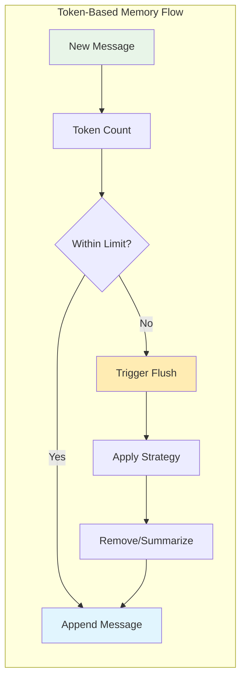

**Use cases:**
- Conversation histories with large models
- Complex multi-turn interactions  
- Token budget optimization
- LLM context window management

**Key Features:**
- Dynamic token counting based on model type
- Context ratio optimization
- Intelligent flush strategies
- Integration with model context windows
</TabsContent>

<TabsContent value="message_count">
### Message Count-Based Memory (`message_count_based`)
Manages memory based on the number of messages:

```yaml
resource: memory
id: simple_chat
type: message_count_based
max_messages: 100
```

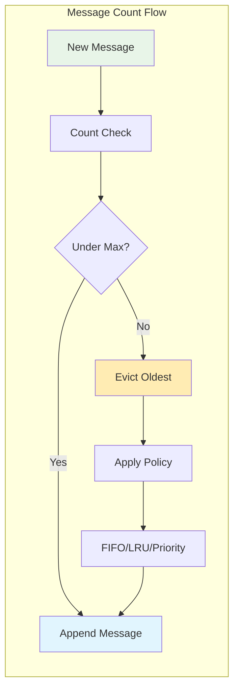

**Use cases:**
- Simple chat applications
- Fixed-size conversation windows
- Predictable memory patterns
- Testing and development

**Key Features:**
- Simple message counting
- Configurable eviction policies
- Predictable memory usage
- Fast operations
</TabsContent>

<TabsContent value="buffer">
### Buffer Memory (`buffer`)
Simple storage without sophisticated eviction, useful for testing:

```yaml
resource: memory
id: debug_memory
type: buffer
max_messages: 50
```

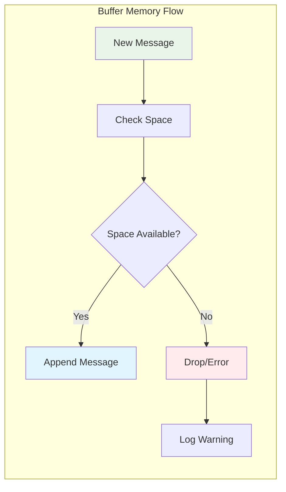

**Use cases:**
- Development and testing
- Temporary storage
- Simple use cases without complex requirements
- Debugging and diagnostics

**Key Features:**
- No automatic eviction
- Simple append-only operation
- Minimal resource overhead
- Testing-friendly
</TabsContent>
</Tabs>

## Key Resolution System

Memory instances are identified using dynamic key templates that support workflow context injection:

### Template Syntax
```yaml
key: "user:{{.workflow.input.user_id}}"
key: "session:{{.session_id}}:conversation"
key: "project:{{.project_id}}:{{.agent_id}}"
```

### Context Variables
Available template variables include:
- `{{.workflow.input.*}}` - Workflow input parameters
- `{{.session_id}}` - Current session identifier
- `{{.project_id}}` - Project context
- `{{.agent_id}}` - Agent identifier
- Custom context from workflow execution

### Key Resolution Process
1. Template evaluation using workflow context
2. Namespace prefixing for multi-tenancy
3. Collision detection and validation
4. Instance creation or retrieval

## Lifecycle Management

Memory instances follow a well-defined lifecycle with automated management:

<Tabs defaultValue="creation" className="w-full">
<TabsList className="grid w-full grid-cols-3">
  <TabsTrigger value="creation">Creation & Initialization</TabsTrigger>
  <TabsTrigger value="ttl">TTL Management</TabsTrigger>
  <TabsTrigger value="cleanup">Cleanup & Health</TabsTrigger>
</TabsList>

<TabsContent value="creation">
### Creation and Initialization Flow

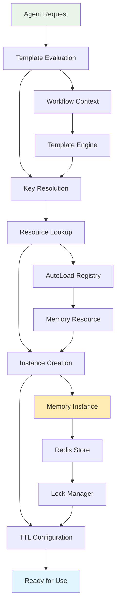

**Initialization Steps:**
1. Agent provides memory reference with key template
2. Template engine evaluates key with workflow context
3. Key resolution creates unique instance identifier
4. Resource lookup retrieves configuration from registry
5. Instance creation initializes storage and strategies
6. TTL configuration sets expiration policies
7. Instance ready for memory operations

**Key Components:**
- **Template Engine**: Evaluates dynamic key templates
- **AutoLoad Registry**: Manages memory resource configurations
- **Redis Store**: Provides persistent storage layer
- **Lock Manager**: Ensures thread-safe operations
</TabsContent>

<TabsContent value="ttl">
### TTL Management Strategy

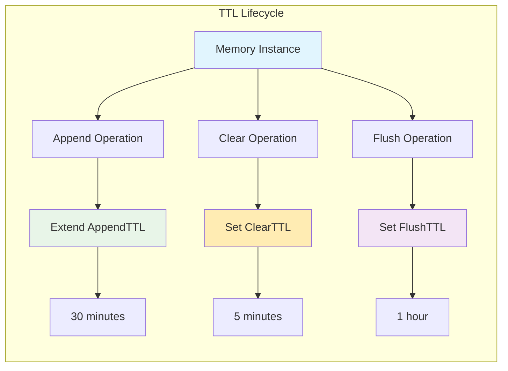

Three distinct TTL behaviors control instance lifecycle:

- **AppendTTL**: Extends TTL on each message append (default: 30m)
- **ClearTTL**: Sets TTL after memory clear (default: 5m)  
- **FlushTTL**: Sets TTL after flush operations (default: 1h)

```yaml
persistence:
  type: redis
  ttl: 24h
append_ttl: "30m"
clear_ttl: "5m"
flush_ttl: "1h"
```

**TTL Behaviors:**
- **Active Memory**: AppendTTL keeps frequently used instances alive
- **Cleared Memory**: ClearTTL provides short grace period for cleanup
- **Flushed Memory**: FlushTTL allows recovery from flush operations
- **Base TTL**: Default 24h for overall instance lifecycle
</TabsContent>

<TabsContent value="cleanup">
### Automatic Cleanup & Health Monitoring

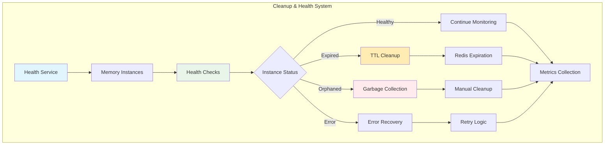

**Cleanup Mechanisms:**
- **TTL-based expiration**: Automatic Redis key expiration
- **Garbage collection**: Cleanup of orphaned metadata
- **Periodic health monitoring**: Proactive instance health checks
- **Error recovery**: Resilient handling of transient failures

**Health Monitoring:**
- Token count tracking and validation
- Message count consistency checks
- Lock state monitoring
- Performance metrics collection
- Circuit breaker status monitoring

**Cleanup Triggers:**
- TTL expiration (automatic)
- Manual cleanup requests
- Health check failures
- Resource pressure detection
- Error recovery procedures
</TabsContent>
</Tabs>

## Thread Safety and Concurrency

The memory system provides robust concurrent access through distributed locking and atomic operations:

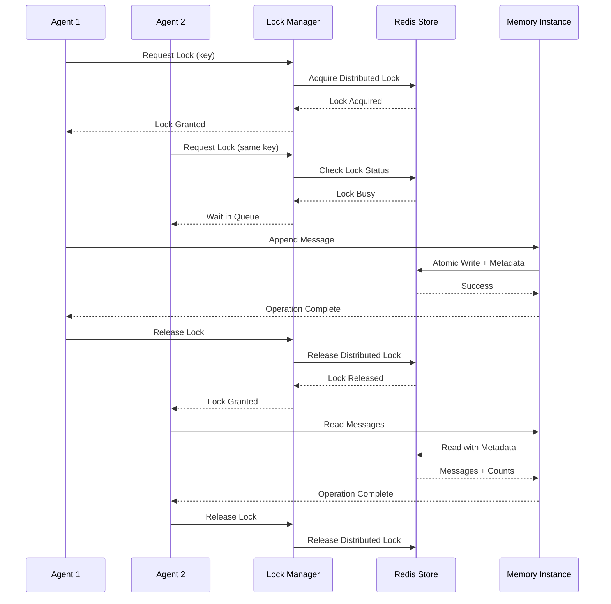

### Distributed Locking
- **Redis-based distributed locks** for atomic operations across instances
- **Configurable lock timeouts** per operation type (append: 30s, clear: 10s, flush: 5m)
- **Automatic lock release** and cleanup to prevent deadlocks
- **Deadlock prevention** mechanisms with timeout and retry logic

### Atomic Operations
The system provides atomic operations that combine message and metadata updates:

```go
// Atomic message append with token count update
AppendMessageWithTokenCount(ctx, key, message, tokenCount)

// Atomic message replacement with metadata sync
ReplaceMessagesWithMetadata(ctx, key, messages, totalTokens)

// Atomic message trimming with metadata consistency
TrimMessagesWithMetadata(ctx, key, keepCount, newTokenCount)
```

### Consistency Guarantees
- **Strong consistency** for individual memory instances via Redis transactions
- **Eventual consistency** for cross-instance operations with retry mechanisms
- **Transactional semantics** for complex operations using Lua scripts
- **Metadata consistency** ensuring token counts and message counts stay in sync

## Performance Characteristics

The memory system is designed for high performance and scalability with comprehensive optimization features:

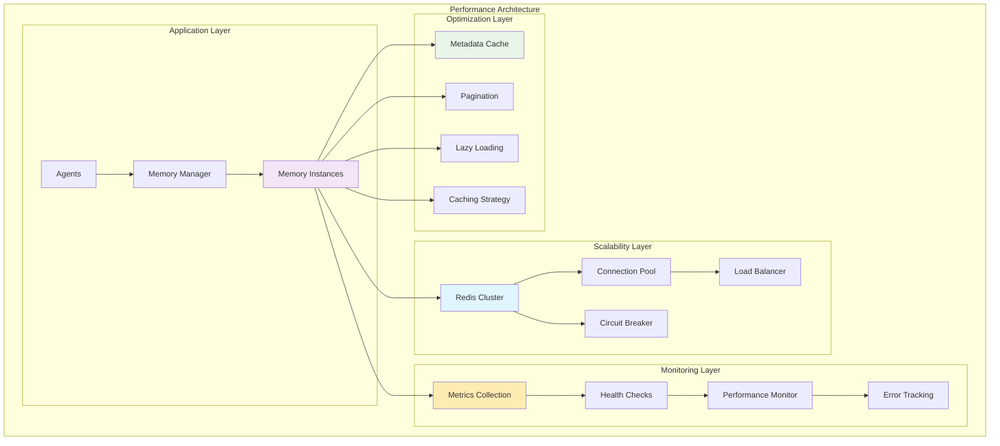

<Tabs defaultValue="scalability" className="w-full">
<TabsList className="grid w-full grid-cols-3">
  <TabsTrigger value="scalability">Scalability</TabsTrigger>
  <TabsTrigger value="optimization">Optimization</TabsTrigger>
  <TabsTrigger value="monitoring">Monitoring</TabsTrigger>
</TabsList>

<TabsContent value="scalability">
### Scalability Features

**Horizontal Scaling:**
- **Redis Clustering**: Automatic data distribution across multiple Redis nodes
- **Independent Instance Management**: Each memory instance can scale independently
- **Connection Pooling**: Efficient connection reuse and management
- **Circuit Breaker Patterns**: Fault tolerance and graceful degradation

**Scaling Patterns:**
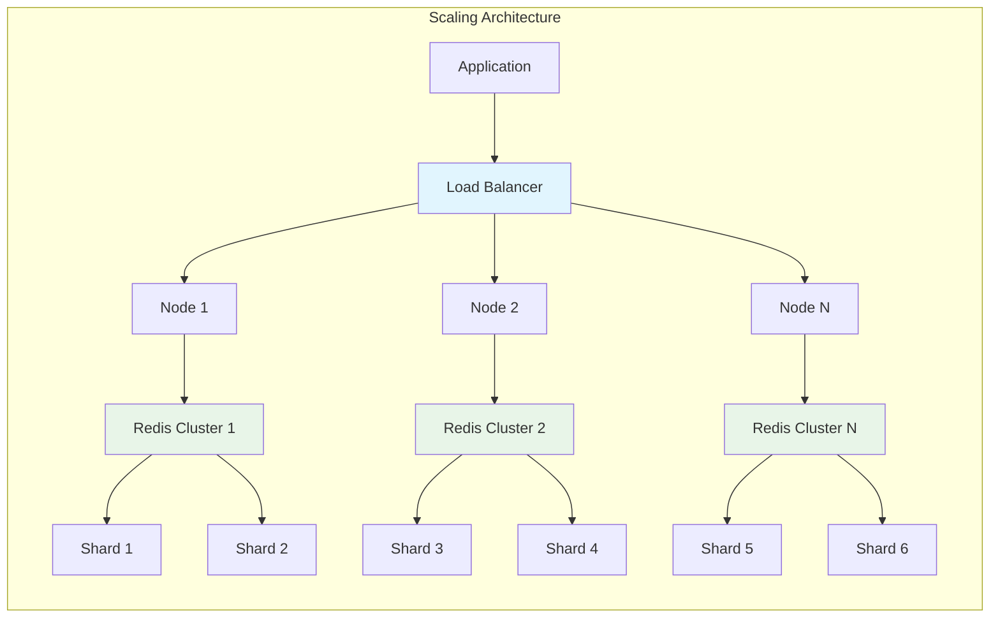

**Performance Metrics:**
- **Throughput**: >10,000 operations/second per node
- **Latency**: <5ms for read operations, <10ms for writes
- **Scalability**: Linear scaling with additional Redis nodes
- **Availability**: 99.9% uptime with proper clustering
</TabsContent>

<TabsContent value="optimization">
### Optimization Features

**Performance Optimizations:**
- **O(1) Metadata Operations**: Fast token and message count lookups
- **Efficient Pagination**: Optimized large history retrieval
- **Lazy Loading**: On-demand message content loading
- **Configurable Caching**: Multi-level caching strategies

**Optimization Strategies:**
```mermaid
graph TB
    subgraph "Optimization Flow"
        REQ[Request] --> CACHE{Cache Hit?}
        CACHE -->|Yes| FAST[Fast Response]
        CACHE -->|No| META{Metadata Only?}
        META -->|Yes| OMETA[O(1) Metadata]
        META -->|No| LAZY{Lazy Load?}
        LAZY -->|Yes| PARTIAL[Partial Load]
        LAZY -->|No| FULL[Full Load]
        
        OMETA --> STORE[Update Cache]
        PARTIAL --> STORE
        FULL --> STORE
        STORE --> RESP[Response]
        FAST --> RESP
    end
    
    style CACHE fill:#e1f5fe
    style OMETA fill:#e8f5e8
    style PARTIAL fill:#ffecb3
    style FULL fill:#f3e5f5
```

**Caching Strategies:**
- **L1 Cache**: In-memory metadata cache (token counts, message counts)
- **L2 Cache**: Redis-based message content cache
- **TTL Management**: Automatic cache expiration and refresh
- **Cache Warming**: Proactive cache population for frequently accessed data
</TabsContent>

<TabsContent value="monitoring">
### Monitoring and Observability

**Comprehensive Metrics:**
- **Memory Usage**: Token counts, message counts, storage utilization
- **Performance Metrics**: Operation latency, throughput, error rates
- **Health Indicators**: Instance health, connection status, circuit breaker state
- **Business Metrics**: Flush frequency, eviction rates, user activity

**Monitoring Dashboard:**
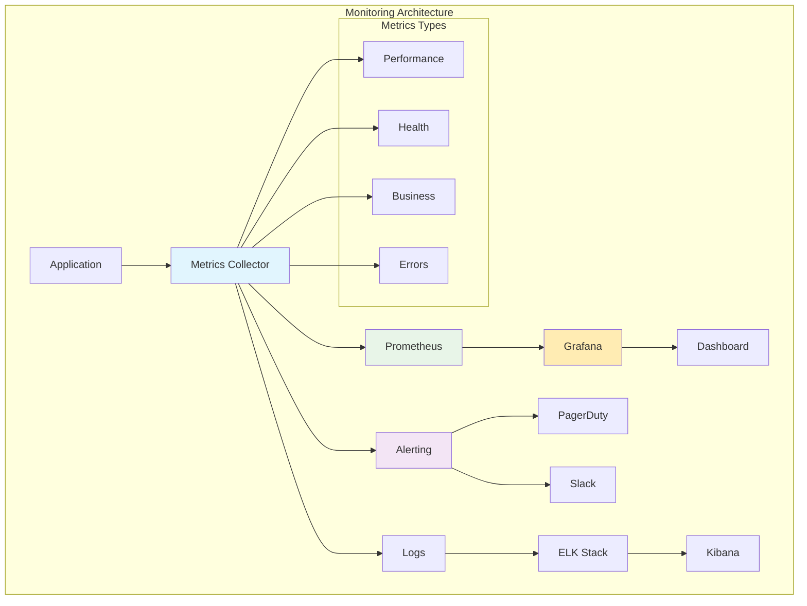

**Key Performance Indicators:**
- **Availability**: 99.9% uptime target
- **Latency**: P95 < 10ms, P99 < 50ms
- **Throughput**: >10,000 ops/sec per instance
- **Error Rate**: <0.1% for all operations
- **Resource Utilization**: <80% memory, <70% CPU
</TabsContent>
</Tabs>

## Integration Points

### Agent Integration
Memory resources are configured at the agent level:

```yaml
agents:
  - id: support_agent
    memory:
      - id: conversation_memory
        key: "support:{{.conversation_id}}"
      - id: user_profile
        key: "user:{{.user_id}}"
```

### Workflow Integration
Memory operations are exposed through tasks and tools:

```yaml
tasks:
  - id: load_history
    type: basic
    $use: tool(memory_tool)
    with:
      operation: "read"
      memory_key: "user:{{.workflow.input.user_id}}"
```

### Tool Integration
TypeScript tools can interact with memory through the runtime:

```typescript
export default async function memoryTool(input: MemoryInput) {
  const { operation, memory_key, message } = input;

  switch (operation) {
    case 'read':
      return await readMemory(memory_key);
    case 'append':
      return await appendMemory(memory_key, message);
  }
}
```

## Best Practices

### Key Design
- Use hierarchical naming: `project:agent:session`
- Include necessary context for uniqueness
- Avoid overly complex templates
- Consider key length and performance implications

### Resource Configuration
- Choose appropriate memory type for use case
- Set realistic token and message limits
- Configure TTLs based on usage patterns
- Enable privacy controls for sensitive data

### Performance Optimization
- Use pagination for large histories
- Implement appropriate flushing strategies
- Monitor token usage and costs
- Configure circuit breakers for resilience

### Error Handling
- Implement retry logic for transient failures
- Handle memory unavailability gracefully
- Provide fallback mechanisms
- Monitor and alert on persistent failures

This foundational understanding of memory concepts and architecture enables effective use of Compozy's memory system for building context-aware AI applications.

## Performance Monitoring & Optimization

Compozy provides comprehensive monitoring and optimization capabilities for memory systems, enabling production-ready performance management:

### Performance Dashboards

<Tabs defaultValue="metrics" className="w-full">
<TabsList className="grid w-full grid-cols-3">
  <TabsTrigger value="metrics">Key Metrics</TabsTrigger>
  <TabsTrigger value="dashboards">Grafana Dashboards</TabsTrigger>
  <TabsTrigger value="alerting">Alerting Rules</TabsTrigger>
</TabsList>

<TabsContent value="metrics">
### Core Performance Metrics

Monitor these essential metrics for memory system health:

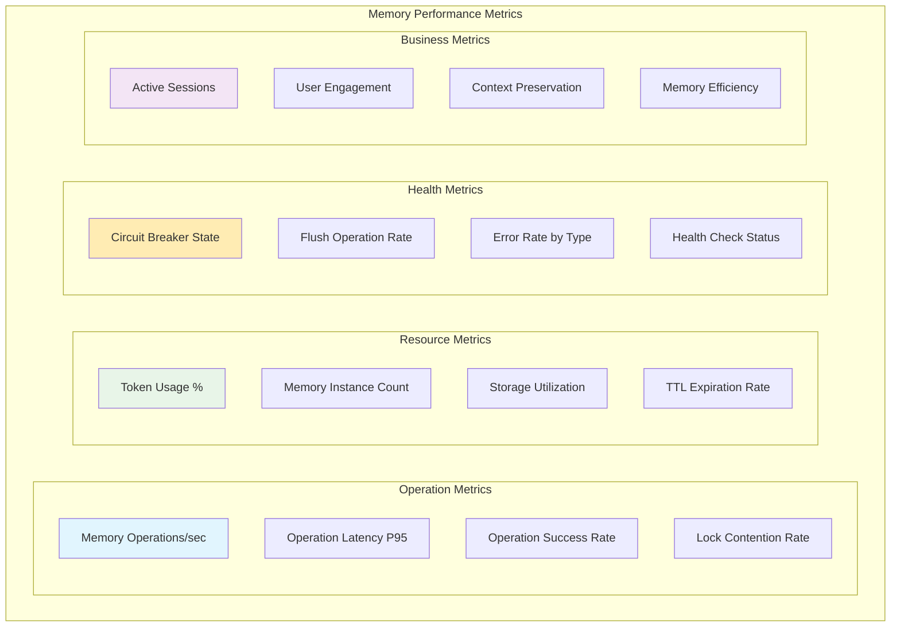

**Key Performance Indicators:**
- **Operation Latency**: P95 < 10ms for read/write operations
- **Throughput**: >10,000 operations/second per instance
- **Error Rate**: <0.1% for all operations
- **Token Efficiency**: >80% of allocated tokens effectively used
- **Memory Hit Rate**: >95% for frequently accessed data

**Monitoring Configuration:**
```yaml
# Prometheus configuration for memory monitoring
- job_name: 'compozy-memory'
  static_configs:
    - targets: ['localhost:8080']
  metrics_path: '/metrics'
  scrape_interval: 15s
  
  relabel_configs:
    - source_labels: [__name__]
      regex: 'compozy_memory_.*'
      action: keep
```
</TabsContent>

<TabsContent value="dashboards">
### Grafana Dashboard Templates

Pre-configured dashboards for comprehensive memory monitoring:

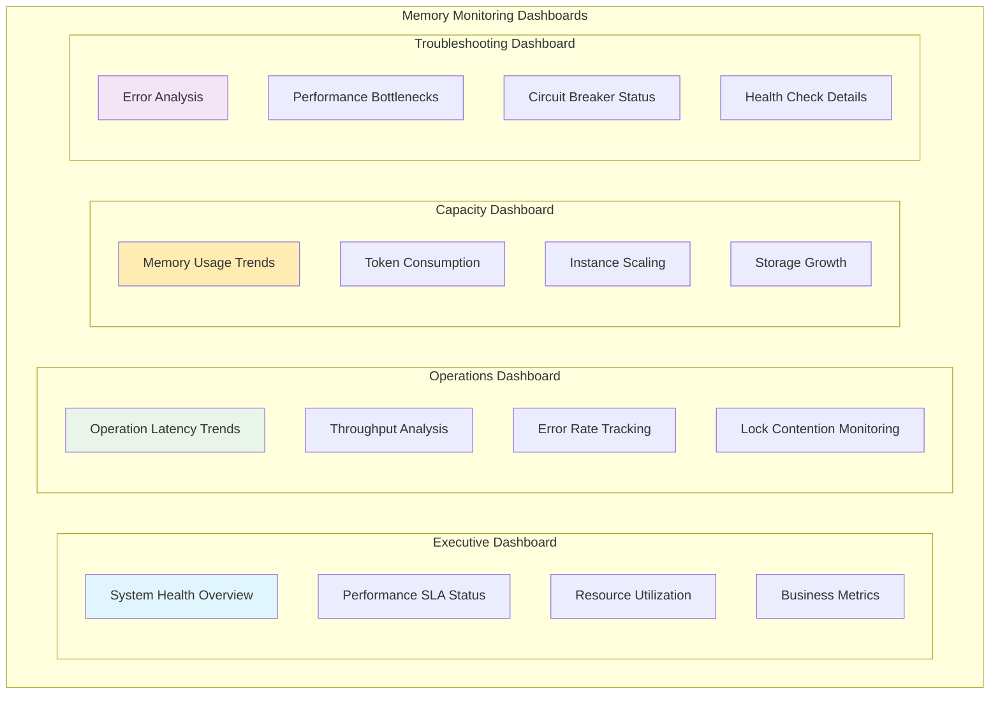

**Dashboard Components:**
- **Real-time Performance**: Live operation metrics with 1-second resolution
- **Historical Analysis**: 30-day trend analysis for capacity planning
- **Alert Correlation**: Integration with alerting rules for root cause analysis
- **Drill-down Capability**: Deep dive from high-level metrics to specific instances

**Sample Dashboard Query:**
```promql
# Memory operation latency by instance
histogram_quantile(0.95,
  rate(compozy_memory_operation_duration_seconds_bucket[5m])
) by (memory_id, operation)
```
</TabsContent>

<TabsContent value="alerting">
### Intelligent Alerting

Production-ready alerting rules with smart thresholds:

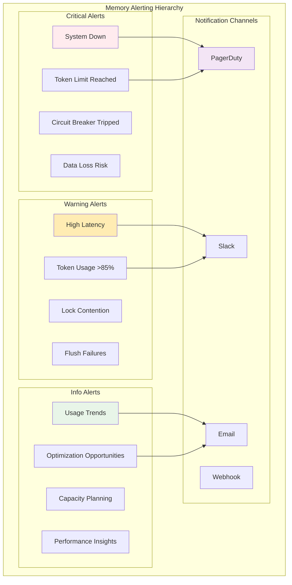

**Alert Categories:**
- **Critical**: Immediate response required, affects system availability
- **Warning**: Performance degradation, requires attention within hours
- **Info**: Trends and optimization opportunities, review within days

**Smart Alert Features:**
- **Adaptive Thresholds**: Auto-adjusting based on historical patterns
- **Alert Grouping**: Related alerts bundled to reduce noise
- **Escalation Policies**: Automatic escalation if not acknowledged
- **Runbook Integration**: Direct links to troubleshooting procedures
</TabsContent>
</Tabs>

### Performance Optimization

<Tabs defaultValue="strategies" className="w-full">
<TabsList className="grid w-full grid-cols-3">
  <TabsTrigger value="strategies">Optimization Strategies</TabsTrigger>
  <TabsTrigger value="tuning">Performance Tuning</TabsTrigger>
  <TabsTrigger value="scaling">Scaling Patterns</TabsTrigger>
</TabsList>

<TabsContent value="strategies">
### Memory Optimization Strategies

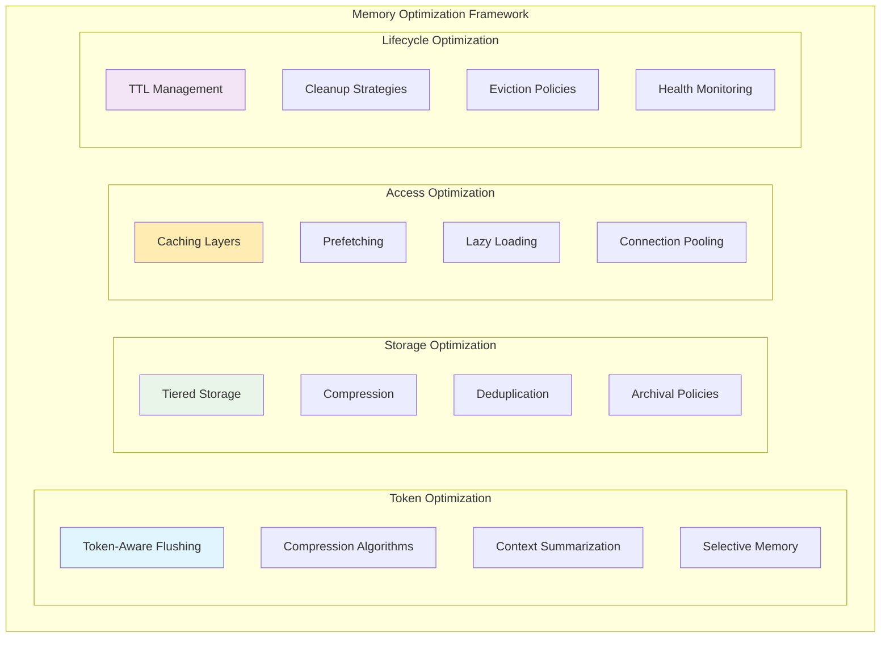

**Optimization Techniques:**

1. **Token Efficiency**:
   - Implement intelligent summarization for long conversations
   - Use token-aware flushing strategies
   - Compress repeated patterns and references

2. **Storage Efficiency**:
   - Implement tiered storage (hot/warm/cold)
   - Use compression for archived data
   - Deduplicate common patterns

3. **Access Efficiency**:
   - Multi-level caching (L1: in-memory, L2: Redis)
   - Predictive prefetching for common patterns
   - Lazy loading for large datasets

4. **Lifecycle Efficiency**:
   - Adaptive TTL based on usage patterns
   - Intelligent cleanup during low-traffic periods
   - Proactive health monitoring and recovery
</TabsContent>

<TabsContent value="tuning">
### Performance Tuning Guide

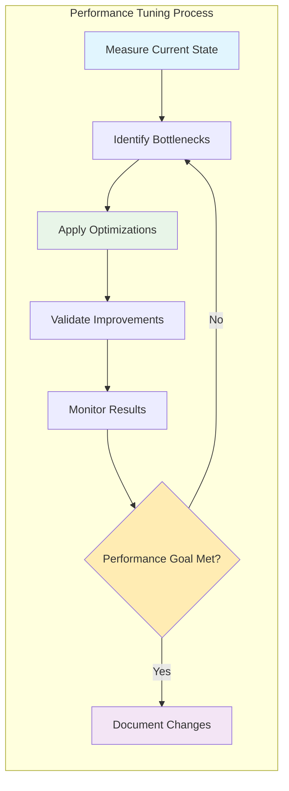

**Tuning Parameters:**

```yaml
# High-performance memory configuration
memory:
  token_based:
    max_tokens: 8000
    max_context_ratio: 0.75
    flush_strategy: "intelligent"
    
  cache_config:
    l1_cache_size: 1000
    l2_cache_ttl: "5m"
    prefetch_enabled: true
    
  performance:
    connection_pool_size: 50
    operation_timeout: "30s"
    batch_size: 100
    
  optimization:
    compression_enabled: true
    deduplication_enabled: true
    async_writes: true
```

**Tuning Recommendations:**
- **High Throughput**: Increase connection pool size, enable async operations
- **Low Latency**: Optimize caching layers, reduce network round trips
- **High Concurrency**: Implement lock-free operations, optimize contention
- **Memory Efficiency**: Enable compression, implement smart eviction
</TabsContent>

<TabsContent value="scaling">
### Horizontal Scaling Patterns

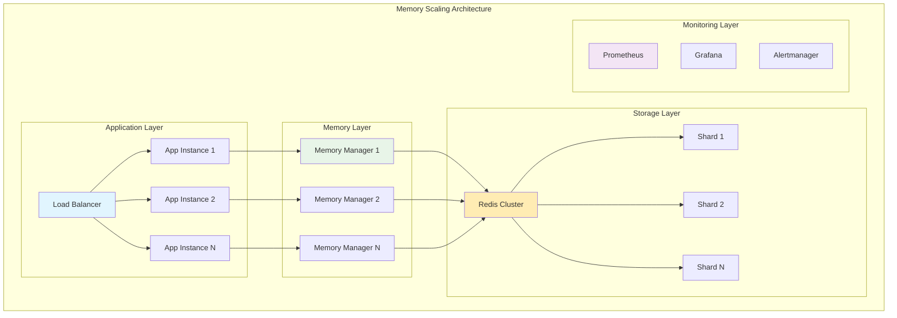

**Scaling Strategies:**

1. **Vertical Scaling**:
   - Increase memory and CPU for individual instances
   - Optimize single-instance performance first
   - Monitor resource utilization patterns

2. **Horizontal Scaling**:
   - Add more application instances
   - Distribute load across multiple memory managers
   - Use Redis clustering for storage scalability

3. **Geographic Scaling**:
   - Multi-region deployments for global applications
   - Region-specific memory instances
   - Cross-region replication for disaster recovery

4. **Auto-scaling**:
   - CPU and memory-based scaling triggers
   - Request rate-based scaling
   - Custom metrics for intelligent scaling
</TabsContent>
</Tabs>

## Integration with Compozy Workflows

<FeatureCardList cols={2}>
  <FeatureCard title="Agent Memory" href="/docs/core/agents/memory">
    Configure persistent memory for your AI agents
  </FeatureCard>
  <FeatureCard title="Memory Tasks" href="/docs/core/tasks/memory-tasks">
    Use specialized memory tasks in your workflows
  </FeatureCard>
  <FeatureCard title="Workflow State" href="/docs/core/tasks/flow-control">
    Manage stateful workflows with memory integration
  </FeatureCard>
  <FeatureCard title="Multi-Agent Patterns" href="/docs/core/agents/multi-agent-patterns">
    Share memory context across multiple agents
  </FeatureCard>
</FeatureCardList>

## Practical Implementation

<FeatureCardList cols={2}>
  <FeatureCard title="Memory Configuration" href="/docs/core/memory/configuration">
    Set up and configure memory resources
  </FeatureCard>
  <FeatureCard title="Memory Operations" href="/docs/core/memory/operations">
    Perform read, write, and management operations
  </FeatureCard>
  <FeatureCard title="Privacy & Security" href="/docs/core/memory/privacy-security">
    Implement secure memory handling practices
  </FeatureCard>
  <FeatureCard title="Troubleshooting" href="/docs/core/memory/troubleshooting">
    Debug and resolve memory-related issues
  </FeatureCard>
</FeatureCardList>

## Getting Started with Memory

### Quick Start Path
1. **[Quick Start Guide](/docs/core/getting-started/quick-start)** - Basic project setup
2. **[Agent Overview](/docs/core/agents/overview)** - Understanding agents
3. **[Memory Configuration](/docs/core/memory/configuration)** - Add memory to your agents
4. **[Integration Patterns](/docs/core/memory/integration-patterns)** - Advanced usage patterns

### Advanced Patterns
- **[Observability](/docs/core/metrics/observability)** - Monitor memory performance
- **[Production Considerations](/docs/core/deployment/scaling)** - Scale memory systems
- **[Examples](/docs/core/examples/basic-examples)** - Real-world memory implementations
