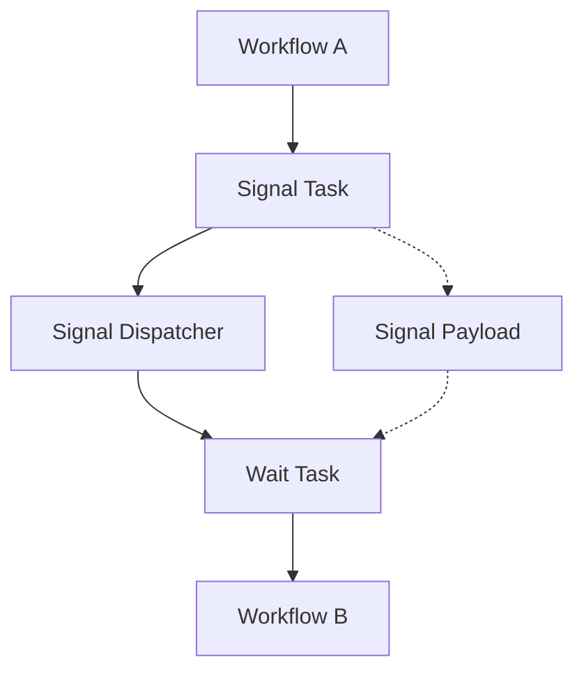

# Signal System Overview

Compozy's signal system provides **event-driven communication** between workflows and tasks, enabling sophisticated coordination patterns and decoupled architectures. Signals allow workflows to communicate asynchronously, coordinate complex processes, and implement reactive patterns.

## Core Concepts

### What are Signals?

Signals are **lightweight messages** that can be sent between workflows to trigger actions, share data, or coordinate execution. They provide a publish-subscribe mechanism that enables:

- **Inter-workflow communication**: Different workflows can coordinate through signals
- **Event-driven patterns**: React to events and state changes across the system
- **Asynchronous coordination**: Workflows can proceed independently while signaling completion
- **Data sharing**: Pass structured data between workflows through signal payloads

### Signal Components

The signal system consists of three main components:

| Component | Purpose | Example |
|-----------|---------|---------|
| **Signal Tasks** | Send signals to the system | User approval, payment completion |
| **Wait Tasks** | Listen for specific signals | Wait for approval, await payment |
| **Signal Dispatcher** | Routes signals to waiting tasks | Internal messaging system |

## How Signals Work



### Signal Flow

1. **Emission**: A signal task sends a signal with an ID and optional payload
2. **Dispatch**: The signal dispatcher routes the signal to waiting tasks
3. **Reception**: Wait tasks with matching signal IDs receive the signal
4. **Processing**: Optional processors can transform signal data
5. **Continuation**: Waiting workflows resume execution

## Basic Example

### Sending a Signal

```yaml
# Workflow A - Send completion signal
- id: notify-completion
  type: signal
  signal:
    id: "task-completed"
    payload:
      status: "success"
      result: "{{ .task.output.result }}"
      timestamp: "{{ now }}"
```

### Waiting for a Signal

```yaml
# Workflow B - Wait for completion
- id: wait-for-completion
  type: wait
  wait_for: "task-completed"
  timeout: 300s
  
  # Optional: Process signal data
  processor:
    type: basic
    agent:
      id: result-processor
      instructions: "Analyze the completion data"
    with:
      signal_data: "{{ .signal.payload }}"
```

## Signal Types and Patterns

### 1. Notification Signals

Simple event notifications without complex data:

```yaml
signal:
  id: "user-registered"
  payload:
    user_id: "{{ .workflow.input.user_id }}"
    timestamp: "{{ now }}"
```

### 2. Data Transfer Signals

Signals carrying rich data payloads:

```yaml
signal:
  id: "order-processed"
  payload:
    order_id: "{{ .workflow.input.order_id }}"
    items: "{{ .task.output.processed_items }}"
    total_amount: "{{ .task.output.total }}"
    customer_data: "{{ .workflow.input.customer }}"
```

### 3. Status Change Signals

Workflow state transition notifications:

```yaml
signal:
  id: "workflow-status-change"
  payload:
    workflow_id: "{{ .workflow.id }}"
    previous_status: "{{ .workflow.previous_status }}"
    current_status: "{{ .workflow.status }}"
    reason: "{{ .task.output.reason }}"
```

## Advanced Signal Features

### Conditional Signal Processing

Wait tasks can include conditions to filter signals:

```yaml
- id: conditional-wait
  type: wait
  wait_for: "order-update"
  condition: 'signal.payload.priority == "high"'
  processor:
    type: basic
    with:
      priority_order: "{{ .signal.payload }}"
```

### Signal Timeouts

Handle scenarios where signals may not arrive:

```yaml
- id: wait-with-timeout
  type: wait
  wait_for: "approval-signal"
  timeout: 60s
  on_timeout: handle-timeout-case
  
  processor:
    type: basic
    with:
      approval_data: "{{ .signal.payload }}"
```

### Multi-Signal Coordination

Coordinate multiple signals for complex workflows:

```yaml
# Wait for multiple conditions
- id: wait-all-approvals
  type: composite
  tasks:
    - id: wait-manager-approval
      type: wait
      wait_for: "manager-approved"
    
    - id: wait-legal-approval
      type: wait
      wait_for: "legal-approved"
```

## Signal Best Practices

### 1. Naming Conventions

Use descriptive, consistent signal names:

```yaml
# ✅ Good
signal:
  id: "payment-completed"
  id: "user-profile-updated"
  id: "document-processed"

# ❌ Avoid
signal:
  id: "done"
  id: "finished"
  id: "signal1"
```

### 2. Payload Structure

Include essential context in signal payloads:

```yaml
# ✅ Comprehensive payload
signal:
  id: "order-shipped"
  payload:
    order_id: "{{ .order.id }}"
    tracking_number: "{{ .shipping.tracking }}"
    estimated_delivery: "{{ .shipping.eta }}"
    customer_email: "{{ .customer.email }}"
    items_count: "{{ .order.items | length }}"
```

### 3. Error Handling

Plan for signal failures and timeouts:

```yaml
- id: robust-wait
  type: wait
  wait_for: "external-service-response"
  timeout: 30s
  
  on_timeout: fallback-task
  on_error: error-handler
  
  processor:
    type: basic
    with:
      response: "{{ .signal.payload }}"
```

## Use Cases

### 1. Approval Workflows

```yaml
# Human approval process
- id: request-approval
  type: signal
  signal:
    id: "approval-requested"
    payload:
      request_type: "budget-increase"
      amount: "{{ .workflow.input.amount }}"
      requestor: "{{ .workflow.input.user }}"

# Later in another workflow
- id: wait-approval
  type: wait
  wait_for: "approval-requested"
  processor:
    type: basic
    agent:
      id: approval-handler
      instructions: "Process approval request"
```

### 2. Service Coordination

```yaml
# Service A completion
- id: service-a-complete
  type: signal
  signal:
    id: "service-a-done"
    payload:
      result: "{{ .task.output }}"

# Service B waiting for A
- id: service-b-start
  type: wait
  wait_for: "service-a-done"
  processor:
    type: basic
    with:
      service_a_result: "{{ .signal.payload.result }}"
```

### 3. Event-Driven Pipelines

```yaml
# Data pipeline trigger
- id: data-ready
  type: signal
  signal:
    id: "new-data-available"
    payload:
      dataset_id: "{{ .workflow.input.dataset }}"
      record_count: "{{ .task.output.count }}"

# Processing pipeline
- id: process-data
  type: wait
  wait_for: "new-data-available"
  condition: 'signal.payload.record_count > 100'
  processor:
    type: basic
    tool:
      id: data-processor
    with:
      dataset: "{{ .signal.payload.dataset_id }}"
```

## Next Steps

- Learn about [Signal Tasks](/docs/core/signals/signal-tasks) for sending signals
- Explore [Wait Tasks](/docs/core/signals/wait-tasks) for receiving signals
- Understand [Signal Triggers](/docs/core/signals/signal-triggers) for workflow initiation
- Review [Advanced Patterns](/docs/core/signals/advanced-patterns) for complex scenarios
