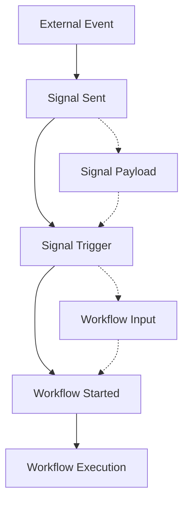

Signal triggers enable **event-driven workflow initiation** in Compozy, allowing workflows to start automatically when specific signals are received. This enables reactive architectures, event-driven automation, and sophisticated workflow orchestration patterns.

## Overview

<FeatureCardList cols={3} size="sm">
  <FeatureCard
    title="Event-Driven"
    description="Workflows start automatically when signals are received"
    icon="Radio"
  />
  <FeatureCard
    title="Reactive Architecture"
    description="Build responsive systems that react to real-time events"
    icon="Zap"
  />
  <FeatureCard
    title="Publish-Subscribe"
    description="Decouple signal publishers from workflow consumers"
    icon="ArrowRightLeft"
  />
</FeatureCardList>

Signal triggers work by listening for specific signals in the system and automatically starting workflows when those signals are received. This creates a publish-subscribe pattern where workflows can react to events from other workflows, external systems, or user actions.



## Basic Signal Trigger

<Steps>
<Step title="Define Trigger Configuration" description="Set up the trigger section with signal type and name">

```yaml
triggers:
  - type: signal
    name: "user-registered"
```

</Step>

<Step title="Configure Input Schema" description="Define the expected input structure">

```yaml
input:
  type: object
  properties:
    user_id:
      type: string
    signal_data:
      type: object
```

</Step>

<Step title="Create Processing Tasks" description="Define tasks that execute when the signal is received">

```yaml
tasks:
  - id: process-registration
    type: basic
    agent:
      id: registration-processor
      instructions: "Process new user registration"
    with:
      user_id: "{{ .workflow.input.user_id }}"
      registration_data: "{{ .workflow.input.signal_data }}"
```

</Step>
</Steps>

<Callout type="info">
**Signal triggers automatically start workflows** when the specified signal is received. The signal payload becomes the workflow input.
</Callout>

### Trigger Configuration Options

<List>
  <ListItem title="type" icon="Target">
    **Required**: Must be `signal` for signal-based triggers
  </ListItem>
  <ListItem title="name" icon="Bell">
    **Required**: Signal name to listen for (e.g., `"user-registered"`)
  </ListItem>
  <ListItem title="condition" icon="Filter">
    **Optional**: Filter condition to selectively trigger workflows
  </ListItem>
  <ListItem title="timeout" icon="Clock">
    **Optional**: Timeout duration for trigger activation
  </ListItem>
</List>

## Signal Trigger Examples

<Tabs items={["User Registration", "Order Processing", "System Alerts"]}>
<Tab>

### User Registration Handler

<FeatureCard
  title="Registration Workflow"
  description="Automatically process new user registrations with validation, profile creation, and notifications"
  icon="Users"
  size="sm"
/>

React to new user registrations:

```yaml
id: user-registration-handler
version: "1.0"
description: "Handle new user registrations"

triggers:
  - type: signal
    name: "user-registered"

input:
  type: object
  properties:
    user_id: { type: string }
    email: { type: string }
    registration_data: { type: object }

tasks:
  - id: validate-registration
    type: basic
    tool:
      id: user-validator
    with:
      user_data: "{{ .workflow.input.registration_data }}"

  - id: create-user-profile
    type: basic
    agent:
      id: profile-creator
      instructions: "Create comprehensive user profile"
    with:
      user_id: "{{ .workflow.input.user_id }}"
      email: "{{ .workflow.input.email }}"
      validated_data: "{{ .tasks.validate-registration.output }}"
    depends_on: [validate-registration]

  - id: send-welcome-email
    type: basic
    tool:
      id: email-sender
    with:
      to: "{{ .workflow.input.email }}"
      template: "welcome"
      user_name: "{{ .workflow.input.registration_data.name }}"
    depends_on: [create-user-profile]

  - id: notify-admin
    type: signal
    signal:
      id: "admin-notification"
      payload:
        event: "user-registered"
        user_id: "{{ .workflow.input.user_id }}"
        timestamp: "{{ now }}"
    depends_on: [send-welcome-email]
```

</Tab>
<Tab>

### Order Processing Pipeline

<FeatureCard
  title="Order Processing"
  description="Automated order validation, payment processing, and fulfillment coordination"
  icon="ShoppingCart"
  size="sm"
/>

Trigger order processing when orders are created:

```yaml
id: order-processing-pipeline
version: "1.0"
description: "Process new orders automatically"

triggers:
  - type: signal
    name: "order-created"
    condition: 'payload.status == "pending"'

input:
  type: object
  properties:
    order_id: { type: string }
    customer_id: { type: string }
    items: { type: array }
    total_amount: { type: number }

tasks:
  - id: validate-order
    type: composite
    strategy: fail_fast
    tasks:
      - id: validate-inventory
        type: basic
        tool:
          id: inventory-checker
        with:
          items: "{{ .workflow.input.items }}"

      - id: validate-payment
        type: basic
        tool:
          id: payment-validator
        with:
          customer_id: "{{ .workflow.input.customer_id }}"
          amount: "{{ .workflow.input.total_amount }}"

      - id: validate-shipping
        type: basic
        tool:
          id: shipping-validator
        with:
          order_id: "{{ .workflow.input.order_id }}"
          items: "{{ .workflow.input.items }}"

  - id: process-payment
    type: basic
    tool:
      id: payment-processor
    with:
      order_id: "{{ .workflow.input.order_id }}"
      amount: "{{ .workflow.input.total_amount }}"
      customer_id: "{{ .workflow.input.customer_id }}"
    depends_on: [validate-order]

  - id: update-inventory
    type: basic
    tool:
      id: inventory-updater
    with:
      items: "{{ .workflow.input.items }}"
      operation: "reserve"
    depends_on: [process-payment]

  - id: trigger-fulfillment
    type: signal
    signal:
      id: "order-ready-for-fulfillment"
      payload:
        order_id: "{{ .workflow.input.order_id }}"
        items: "{{ .workflow.input.items }}"
        customer_id: "{{ .workflow.input.customer_id }}"
        payment_confirmed: "{{ .tasks.process-payment.output.confirmed }}"
    depends_on: [update-inventory]
```

</Tab>
<Tab>

### System Alert Handler

<FeatureCard
  title="Incident Response"
  description="Automated incident detection, assessment, and response coordination"
  icon="AlertTriangle"
  size="sm"
/>

Respond to system alerts and incidents:

```yaml
id: incident-response-handler
version: "1.0"
description: "Automatic incident response system"

triggers:
  - type: signal
    name: "system-alert"
    condition: 'payload.severity in ["critical", "high"]'

input:
  type: object
  properties:
    alert_id: { type: string }
    severity: { type: string }
    service: { type: string }
    message: { type: string }
    metrics: { type: object }

tasks:
  - id: assess-incident
    type: basic
    agent:
      id: incident-analyzer
      model: claude-3-opus-20240307
      instructions: |
        Analyze the incident and determine:
        1. Root cause analysis
        2. Impact assessment
        3. Immediate actions needed
        4. Escalation requirements
    with:
      alert_data: "{{ .workflow.input }}"
      historical_context: "{{ .env.INCIDENT_HISTORY }}"

  - id: immediate-response
    type: parallel
    strategy: best_effort
    tasks:
      - id: auto-scaling
        type: basic
        tool:
          id: infrastructure-scaler
        with:
          service: "{{ .workflow.input.service }}"
          scale_factor: "{{ .tasks.assess-incident.output.scaling_recommendation }}"
        condition: 'tasks.assess-incident.output.requires_scaling'

      - id: restart-services
        type: basic
        tool:
          id: service-restarter
        with:
          services: "{{ .tasks.assess-incident.output.restart_targets }}"
        condition: 'tasks.assess-incident.output.requires_restart'

      - id: notify-on-call
        type: basic
        tool:
          id: pager-duty
        with:
          incident_id: "{{ .workflow.input.alert_id }}"
          severity: "{{ .workflow.input.severity }}"
          message: "{{ .tasks.assess-incident.output.escalation_message }}"
        condition: 'tasks.assess-incident.output.requires_escalation'
    depends_on: [assess-incident]

  - id: create-incident-record
    type: basic
    tool:
      id: incident-tracker
    with:
      alert_id: "{{ .workflow.input.alert_id }}"
      assessment: "{{ .tasks.assess-incident.output }}"
      response_actions: "{{ .tasks.immediate-response.output }}"
      timestamp: "{{ now }}"
    depends_on: [immediate-response]

  - id: monitor-resolution
    type: wait
    wait_for: "incident-resolved"
    timeout: 3600s  # 1 hour
    condition: 'signal.payload.incident_id == workflow.input.alert_id'

    processor:
      type: basic
      with:
        resolution_data: "{{ .signal.payload }}"
    depends_on: [create-incident-record]

  - id: post-incident-analysis
    type: basic
    agent:
      id: incident-analyst
      instructions: "Conduct post-incident analysis and create improvement recommendations"
    with:
      incident_data: "{{ .workflow.input }}"
      response_data: "{{ .tasks.immediate-response.output }}"
      resolution_data: "{{ .tasks.monitor-resolution.output }}"
      timeline: "{{ .workflow.execution_time }}"
    depends_on: [monitor-resolution]
```

</Tab>
</Tabs>

## Conditional Signal Triggers

<FeatureCardList cols={2} size="sm">
  <FeatureCard
    title="Signal Filtering"
    description="Use conditions to selectively trigger workflows based on signal content"
    icon="Filter"
  />
  <FeatureCard
    title="Complex Logic"
    description="Combine multiple conditions with logical operators"
    icon="GitBranch"
  />
</FeatureCardList>

### Filtering Signals

Use conditions to filter which signals trigger workflows:

```yaml
id: priority-order-processor
version: "1.0"
description: "Process high-priority orders only"

triggers:
  - type: signal
    name: "order-created"
    condition: |
      payload.priority == "high" &&
      payload.total_amount > 1000 &&
      payload.customer_tier == "premium"

tasks:
  - id: priority-processing
    type: basic
    agent:
      id: priority-processor
      instructions: "Handle high-priority premium orders"
    with:
      order_data: "{{ .workflow.input }}"
      priority_level: "high"
```

### Complex Filtering

```yaml
id: fraud-detection-trigger
version: "1.0"
description: "Trigger fraud detection for suspicious transactions"

triggers:
  - type: signal
    name: "transaction-created"
    condition: |
      (payload.amount > 10000) ||
      (payload.country != payload.user_country) ||
      (payload.payment_method == "new_card") ||
      (payload.velocity_score > 0.8)

tasks:
  - id: fraud-analysis
    type: basic
    agent:
      id: fraud-analyzer
      model: claude-3-opus-20240307
      instructions: "Analyze transaction for fraud indicators"
    with:
      transaction: "{{ .workflow.input }}"
      risk_factors: "{{ .workflow.trigger.condition_results }}"
```

## Multiple Signal Triggers

### Multi-Trigger Workflows

Workflows can listen to multiple signal types:

```yaml
id: user-activity-processor
version: "1.0"
description: "Process various user activities"

triggers:
  - type: signal
    name: "user-login"
  - type: signal
    name: "user-purchase"
  - type: signal
    name: "user-logout"

input:
  type: object
  properties:
    user_id: { type: string }
    activity_type: { type: string }
    activity_data: { type: object }

tasks:
  - id: route-activity
    type: router
    condition: '{{ .workflow.input.activity_type }}'
    routes:
      user-login:
        - id: process-login
          type: basic
          agent:
            id: login-processor
            instructions: "Process user login activity"
          with:
            login_data: "{{ .workflow.input.activity_data }}"

      user-purchase:
        - id: process-purchase
          type: basic
          agent:
            id: purchase-processor
            instructions: "Process user purchase activity"
          with:
            purchase_data: "{{ .workflow.input.activity_data }}"

      user-logout:
        - id: process-logout
          type: basic
          agent:
            id: logout-processor
            instructions: "Process user logout activity"
          with:
            logout_data: "{{ .workflow.input.activity_data }}"
```

### Environment-Based Triggers

Different triggers for different environments:

```yaml
id: deployment-handler
version: "1.0"
description: "Handle deployments based on environment"

triggers:
  - type: signal
    name: "deployment-{{ .env.ENVIRONMENT }}"
    condition: 'payload.service in env.MONITORED_SERVICES'

tasks:
  - id: environment-specific-deployment
    type: router
    condition: '{{ .env.ENVIRONMENT }}'
    routes:
      development:
        - id: dev-deployment
          type: basic
          tool:
            id: dev-deployer
          with:
            service: "{{ .workflow.input.service }}"
            config: "{{ .workflow.input.dev_config }}"

      staging:
        - id: staging-deployment
          type: composite
          tasks:
            - id: deploy-to-staging
              type: basic
              tool:
                id: staging-deployer
              with:
                service: "{{ .workflow.input.service }}"

            - id: run-integration-tests
              type: basic
              tool:
                id: test-runner
              with:
                test_suite: "integration"
                environment: "staging"
              depends_on: [deploy-to-staging]

      production:
        - id: production-deployment
          type: composite
          tasks:
            - id: pre-deployment-checks
              type: basic
              tool:
                id: deployment-validator
              with:
                service: "{{ .workflow.input.service }}"
                environment: "production"

            - id: blue-green-deployment
              type: basic
              tool:
                id: blue-green-deployer
              with:
                service: "{{ .workflow.input.service }}"
                strategy: "blue-green"
              depends_on: [pre-deployment-checks]

            - id: post-deployment-monitoring
              type: basic
              tool:
                id: deployment-monitor
              with:
                service: "{{ .workflow.input.service }}"
                duration: "300s"
              depends_on: [blue-green-deployment]
```

## Signal Trigger Patterns

### Chain Reactions

Workflows that trigger other workflows:

```yaml
id: order-fulfillment-chain
version: "1.0"
description: "Fulfillment chain triggered by order completion"

triggers:
  - type: signal
    name: "order-completed"

tasks:
  - id: prepare-shipping
    type: basic
    tool:
      id: shipping-preparer
    with:
      order_id: "{{ .workflow.input.order_id }}"
      items: "{{ .workflow.input.items }}"

  - id: trigger-shipping
    type: signal
    signal:
      id: "shipping-requested"
      payload:
        order_id: "{{ .workflow.input.order_id }}"
        shipping_data: "{{ .tasks.prepare-shipping.output }}"
    depends_on: [prepare-shipping]

  - id: trigger-invoice
    type: signal
    signal:
      id: "invoice-requested"
      payload:
        order_id: "{{ .workflow.input.order_id }}"
        customer_id: "{{ .workflow.input.customer_id }}"
        amount: "{{ .workflow.input.total_amount }}"
    depends_on: [prepare-shipping]
```

### Event Aggregation

Aggregate multiple events before triggering:

```yaml
id: daily-report-aggregator
version: "1.0"
description: "Aggregate daily events for reporting"

triggers:
  - type: signal
    name: "daily-event"
    condition: 'payload.date == today()'

tasks:
  - id: collect-events
    type: basic
    tool:
      id: event-aggregator
    with:
      event_data: "{{ .workflow.input }}"
      aggregation_key: "{{ .workflow.input.date }}"

  - id: check-daily-completion
    type: basic
    tool:
      id: completion-checker
    with:
      date: "{{ .workflow.input.date }}"
      current_count: "{{ .tasks.collect-events.output.count }}"
      expected_count: "{{ .env.DAILY_EVENT_TARGET }}"
    depends_on: [collect-events]

  - id: trigger-report
    type: signal
    signal:
      id: "daily-report-ready"
      payload:
        date: "{{ .workflow.input.date }}"
        event_count: "{{ .tasks.collect-events.output.count }}"
        aggregated_data: "{{ .tasks.collect-events.output.summary }}"
    condition: 'tasks.check-daily-completion.output.is_complete'
    depends_on: [check-daily-completion]
```

## Signal Trigger Testing

### Unit Testing

Test individual trigger configurations:

```yaml
id: test-signal-trigger
version: "1.0"
description: "Test signal trigger functionality"

triggers:
  - type: signal
    name: "test-trigger"

tasks:
  - id: verify-trigger
    type: basic
    with:
      trigger_data: "{{ .workflow.input }}"
      triggered_at: "{{ now }}"

  outputs:
    trigger_successful: true
    input_received: "{{ .workflow.input }}"
```

### Integration Testing

Test end-to-end signal flow:

```yaml
id: signal-flow-test
version: "1.0"
description: "Test complete signal flow"

triggers:
  - type: signal
    name: "integration-test-trigger"

tasks:
  - id: process-test-signal
    type: basic
    with:
      test_data: "{{ .workflow.input }}"

  - id: send-response-signal
    type: signal
    signal:
      id: "integration-test-response"
      payload:
        original_data: "{{ .workflow.input }}"
        processed_data: "{{ .tasks.process-test-signal.output }}"
        test_completed: true
    depends_on: [process-test-signal]
```

## Performance Considerations

<FeatureCardList cols={3} size="sm">
  <FeatureCard
    title="Condition Filtering"
    description="Use specific conditions to reduce unnecessary workflow starts"
    icon="Filter"
  />
  <FeatureCard
    title="Payload Optimization"
    description="Include only necessary data in signal payloads"
    icon="Package"
  />
  <FeatureCard
    title="Frequency Monitoring"
    description="Monitor trigger frequency to prevent system overload"
    icon="BarChart3"
  />
</FeatureCardList>

### Trigger Optimization

<List>
  <ListItem title="Use Specific Conditions" icon="Target">
    Filter signals to reduce unnecessary workflow starts and improve performance
  </ListItem>
  <ListItem title="Optimize Signal Payload" icon="Package">
    Include only necessary data to minimize memory usage and processing time
  </ListItem>
  <ListItem title="Monitor Trigger Frequency" icon="Activity">
    Avoid high-frequency triggers that could overwhelm the system
  </ListItem>
</List>

```yaml
# ✅ Optimized trigger
triggers:
  - type: signal
    name: "user-action"
    condition: |
      payload.action == "purchase" &&
      payload.amount > 100 &&
      payload.user_tier == "premium"

# ❌ Inefficient trigger
triggers:
  - type: signal
    name: "user-action"
    # No condition - triggers on every user action
```

### Resource Management

Monitor and limit concurrent workflow executions:

```yaml
id: resource-aware-processor
version: "1.0"
description: "Process with resource awareness"

triggers:
  - type: signal
    name: "processing-request"
    condition: 'payload.priority == "high"'

config:
  max_concurrent_executions: 5
  execution_timeout: 300s

tasks:
  - id: resource-intensive-task
    type: basic
    with:
      request_data: "{{ .workflow.input }}"
      resource_allocation: "high"
```

## Best Practices

<FeatureCardList cols={3} size="sm">
  <FeatureCard
    title="Clear Naming"
    description="Use consistent, descriptive signal names that indicate purpose"
    icon="FileText"
  />
  <FeatureCard
    title="Condition Design"
    description="Write maintainable conditions with clear logic"
    icon="Code"
  />
  <FeatureCard
    title="Error Handling"
    description="Plan for signal processing failures with proper recovery"
    icon="Shield"
  />
</FeatureCardList>

### 1. Signal Naming

<Callout type="info">
Use consistent, descriptive signal names that clearly indicate the event type and context.
</Callout>

Use consistent, descriptive signal names:

```yaml
# ✅ Good signal names
triggers:
  - type: signal
    name: "order-payment-completed"
  - type: signal
    name: "user-profile-updated"
  - type: signal
    name: "system-health-critical"

# ❌ Poor signal names
triggers:
  - type: signal
    name: "event1"
  - type: signal
    name: "done"
  - type: signal
    name: "trigger"
```

### 2. Condition Design

Write clear, maintainable conditions:

```yaml
# ✅ Clear condition
triggers:
  - type: signal
    name: "transaction-created"
    condition: |
      payload.amount > 1000 &&
      payload.risk_score < 0.5 &&
      payload.customer_verified == true

# ❌ Complex, unclear condition
triggers:
  - type: signal
    name: "transaction-created"
    condition: 'payload.a > 1000 && payload.b < 0.5 && payload.c'
```

### 3. Error Handling

Plan for signal processing failures:

```yaml
id: robust-signal-processor
version: "1.0"
description: "Robust signal processing with error handling"

triggers:
  - type: signal
    name: "critical-event"

tasks:
  - id: process-event
    type: basic
    with:
      event_data: "{{ .workflow.input }}"

    on_error: handle-processing-error
    retry:
      max_attempts: 3
      backoff: exponential

  - id: handle-processing-error
    type: basic
    agent:
      id: error-handler
      instructions: "Handle processing errors gracefully"
    with:
      error_data: "{{ .task.error }}"
      original_input: "{{ .workflow.input }}"
```

<ReferenceCardList>
  <ReferenceCard
    title="Signal Tasks"
    description="Learn how to send signals from within workflows to trigger other workflows"
    href="/docs/core/signals/signal-tasks"
    icon="Zap"
  />
  <ReferenceCard
    title="Wait Tasks"
    description="Explore how tasks can wait for specific signals before continuing execution"
    href="/docs/core/signals/wait-tasks"
    icon="Timer"
  />
  <ReferenceCard
    title="Event API"
    description="Discover programmatic access to signals for external integrations"
    href="/docs/core/signals/event-api"
    icon="Code"
  />
  <ReferenceCard
    title="Advanced Patterns"
    description="Study complex signal orchestration patterns and best practices"
    href="/docs/core/signals/advanced-patterns"
    icon="Layers"
  />
  <ReferenceCard
    title="Signal Overview"
    description="Understand the fundamental concepts of Compozy's signal system"
    href="/docs/core/signals/signal-overview"
    icon="BookOpen"
  />
  <ReferenceCard
    title="Workflow Configuration"
    description="Learn more about workflow configuration and trigger setup"
    href="/docs/core/configuration/workflows"
    icon="Settings"
  />
  <ReferenceCard
    title="Basic Tasks"
    description="Master the fundamental building blocks of workflow execution"
    href="/docs/core/tasks/basic-tasks"
    icon="Play"
  />
  <ReferenceCard
    title="Agent Integration"
    description="Discover how to integrate AI agents with signal-triggered workflows"
    href="/docs/core/agents/overview"
    icon="BrainCircuit"
  />
</ReferenceCardList>
