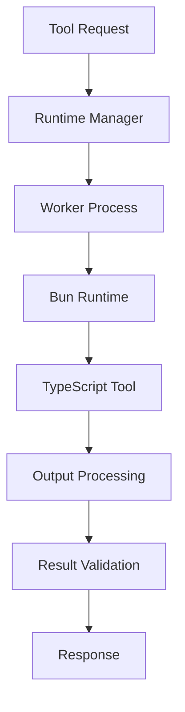

# Runtime Environment

Compozy uses Bun as its JavaScript/TypeScript runtime environment, providing fast, secure, and efficient execution of tools. This guide explains how the runtime works, its security features, and how to configure it.

## Why Bun?

Bun was chosen as the runtime for several key advantages:

- **Performance**: Significantly faster startup times and execution compared to Node.js
- **Built-in TypeScript**: Native TypeScript support without compilation steps
- **Modern APIs**: Support for modern JavaScript/TypeScript features
- **Security**: Better sandboxing and permission controls
- **Bundle Size**: Smaller runtime footprint

<Callout type="info">
While Bun is the primary runtime, Compozy is designed to support multiple runtimes in the future, including Node.js and Deno.
</Callout>

## Runtime Architecture

### Execution Model



### Process Isolation

Each tool execution runs in an isolated Bun process:

```go
// Runtime execution in Go
type BunManager struct {
    config      *Config
    projectRoot string
}

func (bm *BunManager) ExecuteToolWithTimeout(
    ctx context.Context,
    toolID string,
    toolExecID core.ID,
    input *core.Input,
    env core.EnvMap,
    timeout time.Duration,
) (*core.Output, error) {
    // Create isolated process
    cmd := exec.CommandContext(ctx, "bun", "run", workerPath)

    // Set environment variables
    cmd.Env = buildEnvironment(env)

    // Configure I/O
    cmd.Stdin = inputReader
    cmd.Stdout = outputWriter
    cmd.Stderr = errorWriter

    // Execute with timeout
    return executeWithTimeout(cmd, timeout)
}
```

## Worker Template System

### Worker Generation

Compozy generates optimized worker scripts for each tool:

```typescript
// Generated worker template (bun/worker.tpl.ts)
import { ToolExecuteParams, ToolExecuteResult } from './types';

// Dynamic tool import based on configuration
const toolModule = await import('./{{ .ToolPath }}');

// Standardized execution interface
async function executeTool(params: ToolExecuteParams): Promise<ToolExecuteResult> {
  try {
    // Validate tool module structure
    if (typeof toolModule.run !== 'function') {
      throw new Error('Tool must export a "run" function');
    }

    // Execute tool with input
    const result = await toolModule.run(params.input);

    // Ensure result is serializable
    return normalizeOutput(result);

  } catch (error) {
    throw new Error(`Tool execution failed: ${error.message}`);
  }
}

// Main execution loop
async function main() {
  try {
    // Read input from stdin
    const input = await readStdin();
    const params = JSON.parse(input) as ToolExecuteParams;

    // Execute tool
    const result = await executeTool(params);

    // Write result to stdout
    process.stdout.write(JSON.stringify(result));
    process.exit(0);

  } catch (error) {
    process.stderr.write(error.message);
    process.exit(1);
  }
}

main();
```

### Performance Optimizations

The runtime includes several performance optimizations:

```typescript
// Buffer pooling for efficient memory usage
const bufferPool = new Map<number, Buffer[]>();

function getBuffer(size: number): Buffer {
  const pool = bufferPool.get(size) || [];
  return pool.pop() || Buffer.allocUnsafe(size);
}

function returnBuffer(buffer: Buffer): void {
  const size = buffer.length;
  const pool = bufferPool.get(size) || [];
  if (pool.length < 10) { // Limit pool size
    pool.push(buffer);
    bufferPool.set(size, pool);
  }
}

// Output normalization with memory efficiency
function normalizeOutput(output: unknown): ToolExecuteResult {
  // Handle primitive values
  if (typeof output !== 'object' || output === null) {
    return { value: output };
  }

  // Validate output size
  const serialized = JSON.stringify(output);
  if (serialized.length > MAX_OUTPUT_SIZE) {
    throw new Error(`Output too large: ${serialized.length} bytes`);
  }

  return output as ToolExecuteResult;
}
```

## Security Features

### Sandboxing

Tools run in isolated environments with restricted permissions:

```yaml
# Project configuration
runtime:
  permissions:
    - --allow-read=/project/data    # Limited file system access
    - --allow-net=api.example.com   # Restricted network access
    - --allow-env=API_KEY,NODE_ENV  # Specific environment variables
    - --deny-write=/etc             # Explicit denials

  limits:
    memory: "256MB"                 # Memory limit
    timeout: "30s"                  # Execution timeout
    output_size: "10MB"             # Output size limit
```

### Permission System

The runtime enforces granular permissions:

```typescript
// Runtime configuration
interface RuntimeConfig {
  permissions: {
    read?: string[];     // Allowed read paths
    write?: string[];    // Allowed write paths
    net?: string[];      // Allowed network hosts
    env?: string[];      // Allowed environment variables
  };

  limits: {
    memory?: string;     // Memory limit (e.g., "256MB")
    timeout?: string;    // Execution timeout (e.g., "30s")
    outputSize?: string; // Output size limit (e.g., "10MB")
  };
}

// Permission validation
function validatePermissions(config: RuntimeConfig): void {
  const { permissions } = config;

  // Validate file system access
  if (permissions.read) {
    for (const path of permissions.read) {
      if (!isValidPath(path)) {
        throw new Error(`Invalid read path: ${path}`);
      }
    }
  }

  // Validate network access
  if (permissions.net) {
    for (const host of permissions.net) {
      if (!isValidHost(host)) {
        throw new Error(`Invalid network host: ${host}`);
      }
    }
  }
}
```

### Environment Isolation

Each tool execution gets its own environment:

```typescript
// Environment management
interface ToolEnvironment {
  variables: Record<string, string>;
  inherit: boolean;
  secure: boolean;
}

function buildEnvironment(
  toolEnv: core.EnvMap,
  config: RuntimeConfig
): string[] {
  const env: Record<string, string> = {};

  // Add system variables (limited)
  if (config.permissions.env?.includes('PATH')) {
    env.PATH = process.env.PATH || '';
  }

  // Add tool-specific variables
  for (const [key, value] of Object.entries(toolEnv)) {
    if (config.permissions.env?.includes(key)) {
      env[key] = value;
    }
  }

  // Convert to array format
  return Object.entries(env).map(([key, value]) => `${key}=${value}`);
}
```

## Resource Management

### Memory Management

The runtime implements several memory management strategies:

```typescript
// Memory monitoring
class MemoryMonitor {
  private limit: number;
  private interval: NodeJS.Timeout;

  constructor(limitMB: number) {
    this.limit = limitMB * 1024 * 1024; // Convert to bytes
    this.startMonitoring();
  }

  private startMonitoring(): void {
    this.interval = setInterval(() => {
      const usage = process.memoryUsage();

      if (usage.heapUsed > this.limit) {
        console.error(`Memory limit exceeded: ${usage.heapUsed} bytes`);
        process.exit(1);
      }

      // Force garbage collection if available
      if (global.gc) {
        global.gc();
      }
    }, 1000);
  }

  stop(): void {
    if (this.interval) {
      clearInterval(this.interval);
    }
  }
}

// Usage in worker
const monitor = new MemoryMonitor(256); // 256MB limit
process.on('exit', () => monitor.stop());
```

### Timeout Handling

Comprehensive timeout management:

```typescript
// Timeout implementation
class TimeoutManager {
  private timeouts = new Map<string, NodeJS.Timeout>();

  set(id: string, timeout: number, callback: () => void): void {
    // Clear existing timeout
    this.clear(id);

    // Set new timeout
    const timeoutId = setTimeout(() => {
      this.timeouts.delete(id);
      callback();
    }, timeout);

    this.timeouts.set(id, timeoutId);
  }

  clear(id: string): void {
    const timeoutId = this.timeouts.get(id);
    if (timeoutId) {
      clearTimeout(timeoutId);
      this.timeouts.delete(id);
    }
  }

  clearAll(): void {
    for (const [id] of this.timeouts) {
      this.clear(id);
    }
  }
}

// Tool execution with timeout
async function executeWithTimeout<T>(
  promise: Promise<T>,
  timeoutMs: number
): Promise<T> {
  const timeoutManager = new TimeoutManager();

  return new Promise((resolve, reject) => {
    timeoutManager.set('execution', timeoutMs, () => {
      reject(new Error('Tool execution timed out'));
    });

    promise
      .then(result => {
        timeoutManager.clear('execution');
        resolve(result);
      })
      .catch(error => {
        timeoutManager.clear('execution');
        reject(error);
      });
  });
}
```

## Configuration

### Runtime Configuration

Configure the runtime environment in your project:

```yaml
# compozy.yaml
runtime:
  type: "bun"                    # Runtime type
  version: "1.0.0"               # Bun version requirement

  permissions:
    - --allow-read               # File system read access
    - --allow-net                # Network access
    - --allow-env                # Environment variables
    - --allow-sys                # System information

  limits:
    memory: "512MB"              # Memory limit per tool
    timeout: "60s"               # Default timeout
    output_size: "10MB"          # Output size limit

  optimization:
    precompile: true             # Precompile tools
    cache_workers: true          # Cache worker processes
    buffer_pooling: true         # Enable buffer pooling
```

### Tool-Specific Configuration

Override runtime settings per tool:

```yaml
# tools/heavy-processor.yaml
resource: "tool"
id: "heavy-processor"
description: "CPU-intensive data processing tool"
timeout: "5m"                   # Extended timeout

runtime:
  permissions:
    - --allow-read=/data
    - --allow-write=/tmp
    - --allow-net=api.bigdata.com

  limits:
    memory: "1GB"                # Higher memory limit
    timeout: "10m"               # Tool-specific timeout
```

## Debugging and Monitoring

### Debug Mode

Enable debug mode for runtime diagnostics:

```typescript
// Debug configuration
const DEBUG = process.env.COMPOZY_DEBUG === 'true';

function debugLog(message: string, data?: unknown): void {
  if (DEBUG) {
    console.error(`[DEBUG] ${new Date().toISOString()} - ${message}`, data);
  }
}

// Runtime monitoring
class RuntimeMonitor {
  private startTime: number;
  private metrics: Record<string, unknown> = {};

  constructor() {
    this.startTime = performance.now();
  }

  recordMetric(name: string, value: unknown): void {
    this.metrics[name] = value;
    debugLog(`Metric recorded: ${name}`, value);
  }

  getExecutionTime(): number {
    return performance.now() - this.startTime;
  }

  getMetrics(): Record<string, unknown> {
    return {
      ...this.metrics,
      executionTime: this.getExecutionTime(),
      memoryUsage: process.memoryUsage(),
    };
  }
}
```

### Health Checks

Monitor runtime health:

```typescript
// Health monitoring
interface HealthStatus {
  status: 'healthy' | 'degraded' | 'unhealthy';
  uptime: number;
  memory: NodeJS.MemoryUsage;
  activeTools: number;
}

class HealthMonitor {
  private startTime = Date.now();
  private activeTools = 0;

  incrementActiveTools(): void {
    this.activeTools++;
  }

  decrementActiveTools(): void {
    this.activeTools = Math.max(0, this.activeTools - 1);
  }

  getStatus(): HealthStatus {
    const memory = process.memoryUsage();
    const uptime = Date.now() - this.startTime;

    let status: HealthStatus['status'] = 'healthy';

    // Check memory usage
    if (memory.heapUsed > 0.8 * memory.heapTotal) {
      status = 'degraded';
    }

    // Check for memory leaks
    if (memory.heapUsed > 500 * 1024 * 1024) { // 500MB
      status = 'unhealthy';
    }

    return {
      status,
      uptime,
      memory,
      activeTools: this.activeTools,
    };
  }
}
```

## Best Practices

### 1. Resource Management
- Set appropriate memory limits
- Use reasonable timeouts
- Monitor resource usage
- Clean up resources properly

### 2. Security
- Use minimal permissions
- Validate inputs and outputs
- Sanitize file paths
- Limit network access

### 3. Performance
- Enable worker caching
- Use buffer pooling
- Implement proper error handling
- Monitor execution metrics

### 4. Development
- Use debug mode during development
- Test with realistic data sizes
- Monitor memory usage
- Profile execution times

## Troubleshooting

### Common Issues

1. **Tool Not Found**: Ensure tool files exist and are executable
2. **Permission Denied**: Check runtime permissions configuration
3. **Memory Limit Exceeded**: Increase memory limits or optimize tool
4. **Timeout Errors**: Adjust timeout settings or optimize performance
5. **Import Errors**: Verify TypeScript configuration and dependencies

### Debug Commands

```bash
# Check Bun availability
bun --version

# Test tool execution
compozy tool test my-tool --debug

# Monitor runtime performance
compozy debug runtime --watch

# Validate tool configuration
compozy tool validate tools/my-tool.yaml
```

## Next Steps

- [Configuration Schemas](./configuration-schemas) - Define tool interfaces
- [External Integrations](./external-integrations) - Connect to external services
- [Testing & Debugging](./testing-debugging) - Tool development workflow
- [Performance & Security](./performance-security) - Optimization and security
