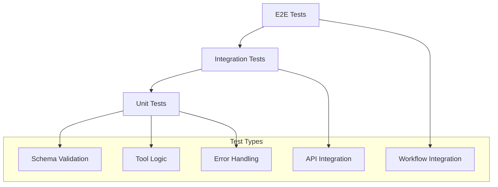

# Testing & Debugging

This guide covers comprehensive testing and debugging strategies for Compozy tools, including unit testing, integration testing, mocking, and debugging techniques.

## Testing Strategy

### Test Pyramid for Tools



### Test Environment Setup

Set up a comprehensive test environment:

```json
{
  "name": "compozy-tools-test",
  "version": "1.0.0",
  "type": "module",
  "scripts": {
    "test": "vitest",
    "test:watch": "vitest --watch",
    "test:coverage": "vitest --coverage",
    "test:integration": "vitest --config vitest.integration.config.ts",
    "test:e2e": "vitest --config vitest.e2e.config.ts"
  },
  "devDependencies": {
    "@types/node": "^20.0.0",
    "vitest": "^1.0.0",
    "@vitest/coverage-v8": "^1.0.0",
    "msw": "^2.0.0",
    "testcontainers": "^10.0.0",
    "tsx": "^4.0.0"
  },
  "dependencies": {
    "zod": "^3.22.0",
    "ajv": "^8.12.0"
  }
}
```

### Test Configuration

```typescript
// vitest.config.ts
import { defineConfig } from 'vitest/config';

export default defineConfig({
  test: {
    globals: true,
    environment: 'node',
    setupFiles: ['./test/setup.ts'],
    coverage: {
      reporter: ['text', 'json', 'html'],
      exclude: [
        'node_modules/',
        'test/',
        '**/*.test.ts',
        '**/*.spec.ts',
      ],
    },
    testTimeout: 30000,
  },
});
```

## Unit Testing

### Testing Tool Logic

```typescript
// tools/data-processor.test.ts
import { describe, it, expect, beforeEach, afterEach } from 'vitest';
import { run } from './data-processor';

describe('Data Processor Tool', () => {
  describe('input validation', () => {
    it('should validate required fields', async () => {
      const input = {
        operation: 'transform',
        // Missing required 'data' field
      };

      await expect(run(input as any)).rejects.toThrow('Data is required');
    });

    it('should validate data types', async () => {
      const input = {
        data: 'invalid-data', // Should be array
        operation: 'transform',
      };

      await expect(run(input as any)).rejects.toThrow('Data must be an array');
    });

    it('should validate operation types', async () => {
      const input = {
        data: [{ id: 1 }],
        operation: 'invalid-operation',
      };

      await expect(run(input as any)).rejects.toThrow('Invalid operation');
    });
  });

  describe('data processing', () => {
    it('should process simple transformation', async () => {
      const input = {
        data: [
          { id: 1, name: 'Alice', age: 30 },
          { id: 2, name: 'Bob', age: 25 },
        ],
        operation: 'transform',
        config: {
          fields: ['name', 'age'],
          format: 'json',
        },
      };

      const result = await run(input);

      expect(result.success).toBe(true);
      expect(result.data).toHaveLength(2);
      expect(result.data[0]).toEqual({ name: 'Alice', age: 30 });
      expect(result.metadata.processed_count).toBe(2);
    });

    it('should handle empty data arrays', async () => {
      const input = {
        data: [],
        operation: 'transform',
        config: { fields: ['name'] },
      };

      const result = await run(input);

      expect(result.success).toBe(true);
      expect(result.data).toHaveLength(0);
      expect(result.metadata.processed_count).toBe(0);
    });

    it('should handle large datasets', async () => {
      const largeData = Array.from({ length: 10000 }, (_, i) => ({
        id: i,
        value: `item-${i}`,
      }));

      const input = {
        data: largeData,
        operation: 'transform',
        config: { fields: ['value'] },
      };

      const result = await run(input);

      expect(result.success).toBe(true);
      expect(result.data).toHaveLength(10000);
      expect(result.metadata.processing_time).toBeLessThan(5000); // 5 seconds
    });
  });

  describe('error handling', () => {
    it('should handle processing errors gracefully', async () => {
      const input = {
        data: [{ invalid: 'data' }],
        operation: 'transform',
        config: {
          fields: ['nonexistent_field'],
          strict: true,
        },
      };

      const result = await run(input);

      expect(result.success).toBe(false);
      expect(result.error).toBeDefined();
      expect(result.error.code).toBe('PROCESSING_ERROR');
      expect(result.error.message).toContain('Field not found');
    });

    it('should handle timeout errors', async () => {
      const input = {
        data: Array.from({ length: 1000000 }, (_, i) => ({ id: i })),
        operation: 'heavy_transform',
        config: { timeout: 100 }, // Very short timeout
      };

      const result = await run(input);

      expect(result.success).toBe(false);
      expect(result.error.code).toBe('TIMEOUT_ERROR');
    });
  });
});
```

### Testing with Mocks

```typescript
// tools/api-client.test.ts
import { describe, it, expect, vi, beforeEach, afterEach } from 'vitest';
import { setupServer } from 'msw/node';
import { http, HttpResponse } from 'msw';
import { run } from './api-client';

const server = setupServer();

describe('API Client Tool', () => {
  beforeEach(() => {
    server.listen();
  });

  afterEach(() => {
    server.resetHandlers();
  });

  it('should make successful GET request', async () => {
    server.use(
      http.get('https://api.example.com/users', () => {
        return HttpResponse.json([
          { id: 1, name: 'Alice' },
          { id: 2, name: 'Bob' },
        ]);
      })
    );

    const input = {
      url: 'https://api.example.com/users',
      method: 'GET',
    };

    const result = await run(input);

    expect(result.success).toBe(true);
    expect(result.data).toHaveLength(2);
    expect(result.status).toBe(200);
  });

  it('should handle HTTP errors', async () => {
    server.use(
      http.get('https://api.example.com/error', () => {
        return new HttpResponse(null, { status: 500 });
      })
    );

    const input = {
      url: 'https://api.example.com/error',
      method: 'GET',
    };

    const result = await run(input);

    expect(result.success).toBe(false);
    expect(result.error.code).toBe('HTTP_ERROR');
    expect(result.error.message).toContain('500');
  });

  it('should handle network errors', async () => {
    server.use(
      http.get('https://api.example.com/network-error', () => {
        return HttpResponse.error();
      })
    );

    const input = {
      url: 'https://api.example.com/network-error',
      method: 'GET',
    };

    const result = await run(input);

    expect(result.success).toBe(false);
    expect(result.error.code).toBe('NETWORK_ERROR');
  });

  it('should handle authentication', async () => {
    server.use(
      http.get('https://api.example.com/secure', ({ request }) => {
        const auth = request.headers.get('Authorization');
        if (!auth || !auth.startsWith('Bearer ')) {
          return new HttpResponse(null, { status: 401 });
        }
        return HttpResponse.json({ message: 'success' });
      })
    );

    const input = {
      url: 'https://api.example.com/secure',
      method: 'GET',
      auth: {
        type: 'bearer',
        token: 'valid-token',
      },
    };

    const result = await run(input);

    expect(result.success).toBe(true);
    expect(result.data.message).toBe('success');
  });
});
```

## Integration Testing

### Database Integration Tests

```typescript
// tools/database-client.integration.test.ts
import { describe, it, expect, beforeAll, afterAll } from 'vitest';
import { GenericContainer, StartedTestContainer } from 'testcontainers';
import { run } from './database-client';

describe('Database Client Integration', () => {
  let postgresContainer: StartedTestContainer;
  let connectionConfig: any;

  beforeAll(async () => {
    // Start PostgreSQL container
    postgresContainer = await new GenericContainer('postgres:15')
      .withEnvironment({
        POSTGRES_DB: 'testdb',
        POSTGRES_USER: 'testuser',
        POSTGRES_PASSWORD: 'testpass',
      })
      .withExposedPorts(5432)
      .start();

    connectionConfig = {
      type: 'postgresql',
      host: postgresContainer.getHost(),
      port: postgresContainer.getMappedPort(5432),
      database: 'testdb',
      username: 'testuser',
      password: 'testpass',
    };

    // Initialize database schema
    await run({
      connection: connectionConfig,
      operation: 'execute',
      query: `
        CREATE TABLE IF NOT EXISTS users (
          id SERIAL PRIMARY KEY,
          name VARCHAR(100) NOT NULL,
          email VARCHAR(100) UNIQUE NOT NULL,
          created_at TIMESTAMP DEFAULT CURRENT_TIMESTAMP
        )
      `,
    });
  });

  afterAll(async () => {
    await postgresContainer.stop();
  });

  it('should execute INSERT queries', async () => {
    const input = {
      connection: connectionConfig,
      operation: 'execute',
      query: 'INSERT INTO users (name, email) VALUES ($1, $2) RETURNING *',
      parameters: ['Alice', 'alice@example.com'],
    };

    const result = await run(input);

    expect(result.success).toBe(true);
    expect(result.data).toHaveLength(1);
    expect(result.data[0].name).toBe('Alice');
    expect(result.data[0].email).toBe('alice@example.com');
    expect(result.metadata.rows_affected).toBe(1);
  });

  it('should execute SELECT queries', async () => {
    // First insert some data
    await run({
      connection: connectionConfig,
      operation: 'execute',
      query: 'INSERT INTO users (name, email) VALUES ($1, $2), ($3, $4)',
      parameters: ['Bob', 'bob@example.com', 'Charlie', 'charlie@example.com'],
    });

    const input = {
      connection: connectionConfig,
      operation: 'query',
      query: 'SELECT * FROM users ORDER BY name',
    };

    const result = await run(input);

    expect(result.success).toBe(true);
    expect(result.data).toHaveLength(3); // Alice + Bob + Charlie
    expect(result.data[0].name).toBe('Alice');
    expect(result.data[1].name).toBe('Bob');
    expect(result.data[2].name).toBe('Charlie');
  });

  it('should handle database errors', async () => {
    const input = {
      connection: connectionConfig,
      operation: 'query',
      query: 'SELECT * FROM nonexistent_table',
    };

    const result = await run(input);

    expect(result.success).toBe(false);
    expect(result.error.code).toBe('DATABASE_ERROR');
    expect(result.error.message).toContain('relation "nonexistent_table" does not exist');
  });

  it('should handle connection errors', async () => {
    const badConfig = {
      ...connectionConfig,
      host: 'invalid-host',
    };

    const input = {
      connection: badConfig,
      operation: 'query',
      query: 'SELECT 1',
    };

    const result = await run(input);

    expect(result.success).toBe(false);
    expect(result.error.code).toBe('CONNECTION_ERROR');
  });
});
```

### End-to-End Workflow Tests

```typescript
// tools/workflow-integration.test.ts
import { describe, it, expect, beforeAll, afterAll } from 'vitest';
import { CompozyClient } from '@compozy/client';

describe('Tool Workflow Integration', () => {
  let client: CompozyClient;

  beforeAll(async () => {
    client = new CompozyClient({
      baseUrl: 'http://localhost:8080',
      projectPath: './test-project',
    });
  });

  it('should execute data processing workflow', async () => {
    const workflowId = await client.workflows.create({
      name: 'data-processing-test',
      tasks: [
        {
          id: 'fetch-data',
          type: 'basic',
          tool: 'api-client',
          input: {
            url: 'https://jsonplaceholder.typicode.com/users',
            method: 'GET',
          },
        },
        {
          id: 'process-data',
          type: 'basic',
          tool: 'data-processor',
          input: {
            data: '{{ .tasks.fetch-data.output.data }}',
            operation: 'transform',
            config: {
              fields: ['id', 'name', 'email'],
              format: 'json',
            },
          },
        },
        {
          id: 'save-results',
          type: 'basic',
          tool: 'file-writer',
          input: {
            path: '/tmp/processed-users.json',
            content: '{{ .tasks.process-data.output.data | toJson }}',
          },
        },
      ],
    });

    const execution = await client.workflows.execute(workflowId);

    expect(execution.status).toBe('completed');
    expect(execution.tasks['fetch-data'].status).toBe('completed');
    expect(execution.tasks['process-data'].status).toBe('completed');
    expect(execution.tasks['save-results'].status).toBe('completed');

    // Verify file was created
    const fileContent = await client.tools.execute('file-reader', {
      path: '/tmp/processed-users.json',
    });

    expect(fileContent.success).toBe(true);
    expect(JSON.parse(fileContent.data.content)).toHaveLength(10);
  });

  it('should handle workflow errors gracefully', async () => {
    const workflowId = await client.workflows.create({
      name: 'error-handling-test',
      tasks: [
        {
          id: 'failing-task',
          type: 'basic',
          tool: 'api-client',
          input: {
            url: 'https://invalid-domain-that-does-not-exist.com/api',
            method: 'GET',
          },
        },
        {
          id: 'recovery-task',
          type: 'basic',
          tool: 'data-processor',
          input: {
            data: [{ error: 'Network error occurred' }],
            operation: 'transform',
            config: { fields: ['error'] },
          },
          on_error: {
            continue: true,
          },
        },
      ],
    });

    const execution = await client.workflows.execute(workflowId);

    expect(execution.status).toBe('failed');
    expect(execution.tasks['failing-task'].status).toBe('failed');
    expect(execution.tasks['failing-task'].error).toBeDefined();
  });
});
```

## Schema Validation Testing

### Schema Test Suite

```typescript
// tools/schema-validation.test.ts
import { describe, it, expect } from 'vitest';
import Ajv from 'ajv';
import addFormats from 'ajv-formats';

const ajv = new Ajv();
addFormats(ajv);

describe('Tool Schema Validation', () => {
  const toolSchema = {
    type: 'object',
    properties: {
      resource: { type: 'string', const: 'tool' },
      id: { type: 'string', pattern: '^[a-z0-9-_]+$' },
      description: { type: 'string', minLength: 1 },
      timeout: { type: 'string', pattern: '^[0-9]+(ms|s|m|h)$' },
      input: { type: 'object' },
      output: { type: 'object' },
      with: { type: 'object' },
      env: { type: 'object' },
    },
    required: ['resource', 'id', 'description'],
    additionalProperties: false,
  };

  const validate = ajv.compile(toolSchema);

  it('should validate correct tool configuration', () => {
    const validConfig = {
      resource: 'tool',
      id: 'test-tool',
      description: 'A test tool',
      timeout: '30s',
      input: {
        type: 'object',
        properties: {
          message: { type: 'string' },
        },
      },
      output: {
        type: 'object',
        properties: {
          result: { type: 'string' },
        },
      },
    };

    const isValid = validate(validConfig);
    expect(isValid).toBe(true);
  });

  it('should reject invalid tool ID', () => {
    const invalidConfig = {
      resource: 'tool',
      id: 'Invalid-Tool-ID!', // Contains invalid characters
      description: 'A test tool',
    };

    const isValid = validate(invalidConfig);
    expect(isValid).toBe(false);
    expect(validate.errors).toContainEqual(
      expect.objectContaining({
        instancePath: '/id',
        keyword: 'pattern',
      })
    );
  });

  it('should reject missing required fields', () => {
    const invalidConfig = {
      resource: 'tool',
      // Missing id and description
    };

    const isValid = validate(invalidConfig);
    expect(isValid).toBe(false);
    expect(validate.errors).toContainEqual(
      expect.objectContaining({
        keyword: 'required',
        params: { missingProperty: 'id' },
      })
    );
  });

  it('should reject invalid timeout format', () => {
    const invalidConfig = {
      resource: 'tool',
      id: 'test-tool',
      description: 'A test tool',
      timeout: 'invalid-timeout',
    };

    const isValid = validate(invalidConfig);
    expect(isValid).toBe(false);
    expect(validate.errors).toContainEqual(
      expect.objectContaining({
        instancePath: '/timeout',
        keyword: 'pattern',
      })
    );
  });
});
```

### Input/Output Schema Testing

```typescript
// tools/data-processor.schema.test.ts
import { describe, it, expect } from 'vitest';
import { validateInput, validateOutput } from './data-processor';

describe('Data Processor Schema Validation', () => {
  describe('input validation', () => {
    it('should validate correct input', () => {
      const validInput = {
        data: [{ id: 1, name: 'test' }],
        operation: 'transform',
        config: {
          fields: ['id', 'name'],
          format: 'json',
        },
      };

      const result = validateInput(validInput);
      expect(result.valid).toBe(true);
    });

    it('should reject invalid data type', () => {
      const invalidInput = {
        data: 'not-an-array',
        operation: 'transform',
        config: { fields: ['id'] },
      };

      const result = validateInput(invalidInput);
      expect(result.valid).toBe(false);
      expect(result.errors).toContain('data must be an array');
    });

    it('should reject invalid operation', () => {
      const invalidInput = {
        data: [],
        operation: 'invalid-operation',
        config: { fields: ['id'] },
      };

      const result = validateInput(invalidInput);
      expect(result.valid).toBe(false);
      expect(result.errors).toContain('operation must be one of: transform, filter, aggregate');
    });
  });

  describe('output validation', () => {
    it('should validate correct output', () => {
      const validOutput = {
        success: true,
        data: [{ id: 1, name: 'test' }],
        metadata: {
          processed_count: 1,
          processing_time: 123.45,
        },
      };

      const result = validateOutput(validOutput);
      expect(result.valid).toBe(true);
    });

    it('should reject missing required fields', () => {
      const invalidOutput = {
        success: true,
        data: [],
        // Missing metadata
      };

      const result = validateOutput(invalidOutput);
      expect(result.valid).toBe(false);
      expect(result.errors).toContain('metadata is required');
    });
  });
});
```

## Performance Testing

### Load Testing

```typescript
// tools/performance.test.ts
import { describe, it, expect } from 'vitest';
import { performance } from 'perf_hooks';
import { run } from './data-processor';

describe('Tool Performance', () => {
  it('should handle large datasets efficiently', async () => {
    const largeDataset = Array.from({ length: 100000 }, (_, i) => ({
      id: i,
      name: `User ${i}`,
      email: `user${i}@example.com`,
      created_at: new Date().toISOString(),
    }));

    const input = {
      data: largeDataset,
      operation: 'transform',
      config: {
        fields: ['id', 'name', 'email'],
        format: 'json',
      },
    };

    const startTime = performance.now();
    const result = await run(input);
    const endTime = performance.now();

    expect(result.success).toBe(true);
    expect(result.data).toHaveLength(100000);
    expect(endTime - startTime).toBeLessThan(5000); // Should complete in under 5 seconds
  });

  it('should handle concurrent executions', async () => {
    const concurrentRuns = 10;
    const input = {
      data: Array.from({ length: 1000 }, (_, i) => ({ id: i })),
      operation: 'transform',
      config: { fields: ['id'] },
    };

    const startTime = performance.now();
    const promises = Array.from({ length: concurrentRuns }, () => run(input));
    const results = await Promise.all(promises);
    const endTime = performance.now();

    expect(results).toHaveLength(concurrentRuns);
    expect(results.every(r => r.success)).toBe(true);
    expect(endTime - startTime).toBeLessThan(10000); // Should complete in under 10 seconds
  });

  it('should not exceed memory limits', async () => {
    const initialMemory = process.memoryUsage().heapUsed;

    const input = {
      data: Array.from({ length: 50000 }, (_, i) => ({
        id: i,
        data: 'x'.repeat(1000), // 1KB of data per item
      })),
      operation: 'transform',
      config: { fields: ['id', 'data'] },
    };

    const result = await run(input);
    const finalMemory = process.memoryUsage().heapUsed;
    const memoryIncrease = finalMemory - initialMemory;

    expect(result.success).toBe(true);
    expect(memoryIncrease).toBeLessThan(100 * 1024 * 1024); // Less than 100MB increase
  });
});
```

## Debugging Tools

### Debug Mode Implementation

```typescript
// tools/debug-helper.ts
interface DebugConfig {
  enabled: boolean;
  level: 'trace' | 'debug' | 'info' | 'warn' | 'error';
  output: 'console' | 'file' | 'memory';
  maxEntries?: number;
}

class DebugLogger {
  private static instance: DebugLogger;
  private config: DebugConfig;
  private logs: Array<{ timestamp: number; level: string; message: string; data?: any }> = [];

  constructor(config: DebugConfig) {
    this.config = config;
  }

  static getInstance(): DebugLogger {
    if (!this.instance) {
      this.instance = new DebugLogger({
        enabled: process.env.COMPOZY_DEBUG === 'true',
        level: (process.env.COMPOZY_DEBUG_LEVEL as any) || 'info',
        output: (process.env.COMPOZY_DEBUG_OUTPUT as any) || 'console',
        maxEntries: parseInt(process.env.COMPOZY_DEBUG_MAX_ENTRIES || '1000'),
      });
    }
    return this.instance;
  }

  trace(message: string, data?: any): void {
    this.log('trace', message, data);
  }

  debug(message: string, data?: any): void {
    this.log('debug', message, data);
  }

  info(message: string, data?: any): void {
    this.log('info', message, data);
  }

  warn(message: string, data?: any): void {
    this.log('warn', message, data);
  }

  error(message: string, data?: any): void {
    this.log('error', message, data);
  }

  private log(level: string, message: string, data?: any): void {
    if (!this.config.enabled) return;

    const levelPriority = {
      trace: 0,
      debug: 1,
      info: 2,
      warn: 3,
      error: 4,
    };

    if (levelPriority[level] < levelPriority[this.config.level]) {
      return;
    }

    const logEntry = {
      timestamp: Date.now(),
      level,
      message,
      data,
    };

    this.logs.push(logEntry);

    // Limit log entries
    if (this.logs.length > (this.config.maxEntries || 1000)) {
      this.logs.shift();
    }

    // Output log
    if (this.config.output === 'console') {
      const timestamp = new Date(logEntry.timestamp).toISOString();
      console.log(`[${timestamp}] [${level.toUpperCase()}] ${message}`, data || '');
    }
  }

  getLogs(): typeof this.logs {
    return [...this.logs];
  }

  clearLogs(): void {
    this.logs = [];
  }

  exportLogs(): string {
    return JSON.stringify(this.logs, null, 2);
  }
}

// Usage in tools
export function createDebugger(toolName: string) {
  const logger = DebugLogger.getInstance();

  return {
    trace: (message: string, data?: any) => logger.trace(`[${toolName}] ${message}`, data),
    debug: (message: string, data?: any) => logger.debug(`[${toolName}] ${message}`, data),
    info: (message: string, data?: any) => logger.info(`[${toolName}] ${message}`, data),
    warn: (message: string, data?: any) => logger.warn(`[${toolName}] ${message}`, data),
    error: (message: string, data?: any) => logger.error(`[${toolName}] ${message}`, data),
  };
}
```

### Tool Execution Tracer

```typescript
// tools/execution-tracer.ts
interface TraceEvent {
  timestamp: number;
  event: string;
  data?: any;
  duration?: number;
}

class ExecutionTracer {
  private traces: Map<string, TraceEvent[]> = new Map();
  private timers: Map<string, number> = new Map();

  startTrace(traceId: string, event: string, data?: any): void {
    if (!this.traces.has(traceId)) {
      this.traces.set(traceId, []);
    }

    const trace = this.traces.get(traceId)!;
    trace.push({
      timestamp: Date.now(),
      event: `${event}_start`,
      data,
    });

    this.timers.set(`${traceId}_${event}`, Date.now());
  }

  endTrace(traceId: string, event: string, data?: any): void {
    const startTime = this.timers.get(`${traceId}_${event}`);
    if (!startTime) return;

    const trace = this.traces.get(traceId);
    if (!trace) return;

    const duration = Date.now() - startTime;
    trace.push({
      timestamp: Date.now(),
      event: `${event}_end`,
      data,
      duration,
    });

    this.timers.delete(`${traceId}_${event}`);
  }

  addEvent(traceId: string, event: string, data?: any): void {
    const trace = this.traces.get(traceId);
    if (!trace) return;

    trace.push({
      timestamp: Date.now(),
      event,
      data,
    });
  }

  getTrace(traceId: string): TraceEvent[] {
    return this.traces.get(traceId) || [];
  }

  exportTrace(traceId: string): string {
    const trace = this.getTrace(traceId);
    return JSON.stringify(trace, null, 2);
  }

  clearTrace(traceId: string): void {
    this.traces.delete(traceId);
  }

  getAllTraces(): Map<string, TraceEvent[]> {
    return new Map(this.traces);
  }
}

// Usage in tools
const tracer = new ExecutionTracer();

export async function traceToolExecution<T>(
  toolName: string,
  operation: string,
  fn: () => Promise<T>
): Promise<T> {
  const traceId = `${toolName}_${Date.now()}`;

  try {
    tracer.startTrace(traceId, operation);
    const result = await fn();
    tracer.endTrace(traceId, operation, { success: true });
    return result;
  } catch (error) {
    tracer.endTrace(traceId, operation, { success: false, error: error.message });
    throw error;
  }
}
```

### Development CLI Tools

```typescript
// tools/dev-cli.ts
import { Command } from 'commander';
import { run as runTool } from './your-tool';

const program = new Command();

program
  .name('tool-dev')
  .description('Development CLI for testing tools')
  .version('1.0.0');

program
  .command('test')
  .description('Test tool with sample input')
  .option('-i, --input <file>', 'Input file path')
  .option('-o, --output <file>', 'Output file path')
  .option('-d, --debug', 'Enable debug mode')
  .action(async (options) => {
    if (options.debug) {
      process.env.COMPOZY_DEBUG = 'true';
      process.env.COMPOZY_DEBUG_LEVEL = 'debug';
    }

    try {
      let input;
      if (options.input) {
        const fs = await import('fs/promises');
        const inputData = await fs.readFile(options.input, 'utf-8');
        input = JSON.parse(inputData);
      } else {
        input = await getSampleInput();
      }

      console.log('Running tool with input:', JSON.stringify(input, null, 2));

      const result = await runTool(input);

      console.log('Tool result:', JSON.stringify(result, null, 2));

      if (options.output) {
        const fs = await import('fs/promises');
        await fs.writeFile(options.output, JSON.stringify(result, null, 2));
        console.log(`Result saved to ${options.output}`);
      }
    } catch (error) {
      console.error('Tool execution failed:', error);
      process.exit(1);
    }
  });

program
  .command('validate')
  .description('Validate tool configuration')
  .option('-c, --config <file>', 'Tool configuration file')
  .action(async (options) => {
    try {
      const fs = await import('fs/promises');
      const configData = await fs.readFile(options.config, 'utf-8');
      const config = JSON.parse(configData);

      const validation = await validateToolConfig(config);

      if (validation.valid) {
        console.log('✅ Tool configuration is valid');
      } else {
        console.log('❌ Tool configuration is invalid:');
        validation.errors.forEach(error => {
          console.log(`  - ${error}`);
        });
        process.exit(1);
      }
    } catch (error) {
      console.error('Validation failed:', error);
      process.exit(1);
    }
  });

program
  .command('benchmark')
  .description('Run performance benchmarks')
  .option('-n, --iterations <number>', 'Number of iterations', '100')
  .option('-c, --concurrency <number>', 'Concurrency level', '1')
  .action(async (options) => {
    const iterations = parseInt(options.iterations);
    const concurrency = parseInt(options.concurrency);

    console.log(`Running benchmark: ${iterations} iterations, concurrency: ${concurrency}`);

    const results = await runBenchmark(iterations, concurrency);

    console.log('Benchmark Results:');
    console.log(`  Average: ${results.average.toFixed(2)}ms`);
    console.log(`  Median: ${results.median.toFixed(2)}ms`);
    console.log(`  Min: ${results.min.toFixed(2)}ms`);
    console.log(`  Max: ${results.max.toFixed(2)}ms`);
    console.log(`  Success Rate: ${(results.successRate * 100).toFixed(2)}%`);
  });

program.parse();
```

## Best Practices

### 1. Test Organization
- Separate unit, integration, and E2E tests
- Use descriptive test names
- Group related tests logically
- Keep tests independent

### 2. Mock Strategy
- Mock external dependencies
- Use realistic test data
- Test both success and failure scenarios
- Verify mock interactions

### 3. Performance Testing
- Test with realistic data volumes
- Monitor memory usage
- Test concurrent execution
- Set performance baselines

### 4. Error Testing
- Test all error conditions
- Verify error messages
- Test error recovery
- Test timeout scenarios

### 5. Schema Validation
- Test valid and invalid schemas
- Test edge cases
- Validate error messages
- Test schema evolution

### 6. Debugging
- Use structured logging
- Implement tracing
- Create debug modes
- Build development tools

## Next Steps

- [Performance & Security](./performance-security) - Optimize and secure your tools
- [Advanced Patterns](./advanced-patterns) - Complex testing and debugging patterns
