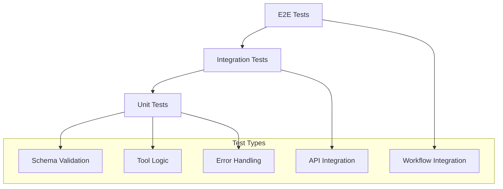

# Testing & Debugging

This guide covers comprehensive testing and debugging strategies for Compozy tools, including unit testing, integration testing, mocking, performance testing, and advanced debugging techniques.

<Callout type="info">
Effective testing and debugging are crucial for reliable tool development. This guide provides battle-tested strategies using modern testing frameworks and debugging tools specifically adapted for Compozy's Bun runtime environment.
</Callout>

## Testing Strategy

### Test Pyramid for Tools

<Mermaid>

</Mermaid>

<Callout type="note">
The test pyramid emphasizes more unit tests at the base, fewer integration tests in the middle, and minimal E2E tests at the top. This approach provides faster feedback, easier maintenance, and better test isolation.
</Callout>

### Test Environment Setup

<Steps>
  <Step>
    ### Create Test Project Structure
    ```
    project/
    ├── test/
    │   ├── setup.ts              # Test setup and configuration
    │   ├── fixtures/             # Test data and fixtures
    │   ├── helpers/              # Test utility functions
    │   └── mocks/                # Mock implementations
    ├── tools/
    │   ├── __tests__/            # Unit tests
    │   ├── __integration__/      # Integration tests
    │   └── __e2e__/             # End-to-end tests
    ├── vitest.config.ts         # Test configuration
    ├── vitest.integration.config.ts
    └── vitest.e2e.config.ts
    ```
  </Step>
  
  <Step>
    ### Configure Testing Dependencies
    Create a comprehensive test environment:
    
    ```json
    {
      "name": "compozy-tools-test",
      "version": "1.0.0",
      "type": "module",
      "scripts": {
        "test": "vitest",
        "test:watch": "vitest --watch",
        "test:coverage": "vitest --coverage",
        "test:integration": "vitest --config vitest.integration.config.ts",
        "test:e2e": "vitest --config vitest.e2e.config.ts"
      },
      "devDependencies": {
        "@types/node": "^20.0.0",
        "vitest": "^1.0.0",
        "@vitest/coverage-v8": "^1.0.0",
        "msw": "^2.0.0",
        "testcontainers": "^10.0.0",
        "tsx": "^4.0.0"
      },
      "dependencies": {
        "zod": "^3.22.0",
        "ajv": "^8.12.0"
      }
    }
    ```
  </Step>
  
  <Step>
    ### Set Up Test Configuration
    ```typescript
    // vitest.config.ts
    import { defineConfig } from 'vitest/config';
    
    export default defineConfig({
      test: {
        globals: true,
        environment: 'node',
        setupFiles: ['./test/setup.ts'],
        coverage: {
          reporter: ['text', 'json', 'html'],
          exclude: [
            'node_modules/',
            'test/',
            '**/*.test.ts',
            '**/*.spec.ts',
          ],
        },
        testTimeout: 30000,
      },
    });
    ```
  </Step>
</Steps>

## Unit Testing

<Callout type="warning">
Unit tests should focus on testing individual tool functions in isolation. Mock external dependencies and use realistic test data to ensure your tools behave correctly under various conditions.
</Callout>

### Testing Tool Logic

Implement comprehensive unit tests for your tool logic:

<Tabs>
  <Tab title="Input Validation Tests">
    ```typescript
    // tools/data-processor.test.ts
    import { describe, it, expect, beforeEach, afterEach } from 'vitest';
    import { run } from './data-processor';
    
    describe('Data Processor Tool', () => {
      describe('input validation', () => {
        it('should validate required fields', async () => {
          const input = {
            operation: 'transform',
            // Missing required 'data' field
          };
    
          await expect(run(input as any)).rejects.toThrow('Data is required');
        });
    
        it('should validate data types', async () => {
          const input = {
            data: 'invalid-data', // Should be array
            operation: 'transform',
          };
    
          await expect(run(input as any)).rejects.toThrow('Data must be an array');
        });
    
        it('should validate operation types', async () => {
          const input = {
            data: [{ id: 1 }],
            operation: 'invalid-operation',
          };
    
          await expect(run(input as any)).rejects.toThrow('Invalid operation');
        });
        
        it('should handle edge cases in validation', async () => {
          const edgeCases = [
            { data: null, operation: 'transform' },
            { data: [], operation: '' },
            { data: [{}], operation: 'transform', config: null },
          ];
          
          for (const input of edgeCases) {
            await expect(run(input as any)).rejects.toThrow();
          }
        });
      });
    });
    ```
  </Tab>
  
  <Tab title="Data Processing Tests">
    ```typescript
    describe('data processing', () => {
      it('should process simple transformation', async () => {
        const input = {
          data: [
            { id: 1, name: 'Alice', age: 30 },
            { id: 2, name: 'Bob', age: 25 },
          ],
          operation: 'transform',
          config: {
            fields: ['name', 'age'],
            format: 'json',
          },
        };
    
        const result = await run(input);
    
        expect(result.success).toBe(true);
        expect(result.data).toHaveLength(2);
        expect(result.data[0]).toEqual({ name: 'Alice', age: 30 });
        expect(result.metadata.processed_count).toBe(2);
      });
    
      it('should handle empty data arrays', async () => {
        const input = {
          data: [],
          operation: 'transform',
          config: { fields: ['name'] },
        };
    
        const result = await run(input);
    
        expect(result.success).toBe(true);
        expect(result.data).toHaveLength(0);
        expect(result.metadata.processed_count).toBe(0);
      });
    
      it('should handle large datasets', async () => {
        const largeData = Array.from({ length: 10000 }, (_, i) => ({
          id: i,
          value: `item-${i}`,
        }));
    
        const input = {
          data: largeData,
          operation: 'transform',
          config: { fields: ['value'] },
        };
    
        const result = await run(input);
    
        expect(result.success).toBe(true);
        expect(result.data).toHaveLength(10000);
        expect(result.metadata.processing_time).toBeLessThan(5000); // 5 seconds
      });
      
      it('should preserve data types during transformation', async () => {
        const input = {
          data: [
            { id: 1, active: true, score: 98.5, created: new Date('2023-01-01') },
            { id: 2, active: false, score: 87.2, created: new Date('2023-01-02') },
          ],
          operation: 'transform',
          config: { fields: ['id', 'active', 'score'] },
        };
    
        const result = await run(input);
    
        expect(result.success).toBe(true);
        expect(typeof result.data[0].id).toBe('number');
        expect(typeof result.data[0].active).toBe('boolean');
        expect(typeof result.data[0].score).toBe('number');
      });
    });
    ```
  </Tab>
  
  <Tab title="Error Handling Tests">
    ```typescript
    describe('error handling', () => {
      it('should handle processing errors gracefully', async () => {
        const input = {
          data: [{ invalid: 'data' }],
          operation: 'transform',
          config: {
            fields: ['nonexistent_field'],
            strict: true,
          },
        };
    
        const result = await run(input);
    
        expect(result.success).toBe(false);
        expect(result.error).toBeDefined();
        expect(result.error.code).toBe('PROCESSING_ERROR');
        expect(result.error.message).toContain('Field not found');
      });
    
      it('should handle timeout errors', async () => {
        const input = {
          data: Array.from({ length: 1000000 }, (_, i) => ({ id: i })),
          operation: 'heavy_transform',
          config: { timeout: 100 }, // Very short timeout
        };
    
        const result = await run(input);
    
        expect(result.success).toBe(false);
        expect(result.error.code).toBe('TIMEOUT_ERROR');
      });
      
      it('should handle malformed data gracefully', async () => {
        const input = {
          data: [null, undefined, '', 0, false, {}],
          operation: 'transform',
          config: { fields: ['name'], strict: false },
        };
    
        const result = await run(input);
    
        expect(result.success).toBe(true);
        expect(result.data).toHaveLength(6);
        expect(result.metadata.warnings).toBeGreaterThan(0);
      });
    });
    ```
  </Tab>
</Tabs>

### Testing with Mocks

<Callout type="info">
Mock Service Worker (MSW) provides an excellent way to mock HTTP requests in tests. It intercepts network requests at the network level, providing realistic testing scenarios without hitting real APIs.
</Callout>

Implement comprehensive mocking strategies for external dependencies:

<Tabs>
  <Tab title="HTTP API Mocking">
    ```typescript
    // tools/api-client.test.ts
    import { describe, it, expect, vi, beforeEach, afterEach } from 'vitest';
    import { setupServer } from 'msw/node';
    import { http, HttpResponse } from 'msw';
    import { run } from './api-client';
    
    const server = setupServer();
    
    describe('API Client Tool', () => {
      beforeEach(() => {
        server.listen({ onUnhandledRequest: 'error' });
      });
    
      afterEach(() => {
        server.resetHandlers();
      });
    
      it('should make successful GET request', async () => {
        server.use(
          http.get('https://api.example.com/users', () => {
            return HttpResponse.json([
              { id: 1, name: 'Alice' },
              { id: 2, name: 'Bob' },
            ]);
          })
        );
    
        const input = {
          url: 'https://api.example.com/users',
          method: 'GET',
        };
    
        const result = await run(input);
    
        expect(result.success).toBe(true);
        expect(result.data).toHaveLength(2);
        expect(result.status).toBe(200);
      });
    
      it('should handle HTTP errors', async () => {
        server.use(
          http.get('https://api.example.com/error', () => {
            return new HttpResponse(null, { status: 500 });
          })
        );
    
        const input = {
          url: 'https://api.example.com/error',
          method: 'GET',
        };
    
        const result = await run(input);
    
        expect(result.success).toBe(false);
        expect(result.error.code).toBe('HTTP_ERROR');
        expect(result.error.message).toContain('500');
      });
    
      it('should handle network errors', async () => {
        server.use(
          http.get('https://api.example.com/network-error', () => {
            return HttpResponse.error();
          })
        );
    
        const input = {
          url: 'https://api.example.com/network-error',
          method: 'GET',
        };
    
        const result = await run(input);
    
        expect(result.success).toBe(false);
        expect(result.error.code).toBe('NETWORK_ERROR');
      });
    
      it('should handle authentication', async () => {
        server.use(
          http.get('https://api.example.com/secure', ({ request }) => {
            const auth = request.headers.get('Authorization');
            if (!auth || !auth.startsWith('Bearer ')) {
              return new HttpResponse(null, { status: 401 });
            }
            return HttpResponse.json({ message: 'success' });
          })
        );
    
        const input = {
          url: 'https://api.example.com/secure',
          method: 'GET',
          auth: {
            type: 'bearer',
            token: 'valid-token',
          },
        };
    
        const result = await run(input);
    
        expect(result.success).toBe(true);
        expect(result.data.message).toBe('success');
      });
    });
    ```
  </Tab>
  
  <Tab title="Function Mocking">
    ```typescript
    // tools/file-system.test.ts
    import { describe, it, expect, vi, beforeEach, afterEach } from 'vitest';
    import { promises as fs } from 'fs';
    import { run } from './file-system';
    
    // Mock the fs module
    vi.mock('fs', () => ({
      promises: {
        readFile: vi.fn(),
        writeFile: vi.fn(),
        access: vi.fn(),
        stat: vi.fn(),
      },
    }));
    
    describe('File System Tool', () => {
      beforeEach(() => {
        vi.clearAllMocks();
      });
    
      it('should read file successfully', async () => {
        const mockContent = 'Hello, World!';
        (fs.readFile as any).mockResolvedValueOnce(mockContent);
        (fs.stat as any).mockResolvedValueOnce({ size: 13, mtime: new Date() });
    
        const input = {
          operation: 'read',
          path: '/test/file.txt',
        };
    
        const result = await run(input);
    
        expect(result.success).toBe(true);
        expect(result.data.content).toBe(mockContent);
        expect(fs.readFile).toHaveBeenCalledWith('/test/file.txt', 'utf-8');
      });
    
      it('should handle file not found error', async () => {
        const error = new Error('ENOENT: no such file or directory');
        (error as any).code = 'ENOENT';
        (fs.readFile as any).mockRejectedValueOnce(error);
    
        const input = {
          operation: 'read',
          path: '/nonexistent/file.txt',
        };
    
        const result = await run(input);
    
        expect(result.success).toBe(false);
        expect(result.error.code).toBe('FILE_NOT_FOUND');
      });
    
      it('should handle permission errors', async () => {
        const error = new Error('EACCES: permission denied');
        (error as any).code = 'EACCES';
        (fs.readFile as any).mockRejectedValueOnce(error);
    
        const input = {
          operation: 'read',
          path: '/restricted/file.txt',
        };
    
        const result = await run(input);
    
        expect(result.success).toBe(false);
        expect(result.error.code).toBe('PERMISSION_DENIED');
      });
    });
    ```
  </Tab>
  
  <Tab title="Database Mocking">
    ```typescript
    // tools/database.test.ts
    import { describe, it, expect, vi, beforeEach } from 'vitest';
    import { run } from './database';
    
    // Mock database client
    const mockClient = {
      query: vi.fn(),
      connect: vi.fn(),
      end: vi.fn(),
    };
    
    vi.mock('pg', () => ({
      Client: vi.fn(() => mockClient),
    }));
    
    describe('Database Tool', () => {
      beforeEach(() => {
        vi.clearAllMocks();
        mockClient.connect.mockResolvedValue(undefined);
        mockClient.end.mockResolvedValue(undefined);
      });
    
      it('should execute SELECT query successfully', async () => {
        const mockRows = [
          { id: 1, name: 'Alice' },
          { id: 2, name: 'Bob' },
        ];
        mockClient.query.mockResolvedValueOnce({ rows: mockRows });
    
        const input = {
          operation: 'query',
          sql: 'SELECT * FROM users',
          connection: {
            host: 'localhost',
            database: 'test',
            user: 'testuser',
            password: 'testpass',
          },
        };
    
        const result = await run(input);
    
        expect(result.success).toBe(true);
        expect(result.data).toHaveLength(2);
        expect(mockClient.query).toHaveBeenCalledWith('SELECT * FROM users', []);
      });
    
      it('should handle SQL errors', async () => {
        const sqlError = new Error('syntax error at or near "SELECTT"');
        mockClient.query.mockRejectedValueOnce(sqlError);
    
        const input = {
          operation: 'query',
          sql: 'SELECTT * FROM users',
          connection: {
            host: 'localhost',
            database: 'test',
            user: 'testuser',
            password: 'testpass',
          },
        };
    
        const result = await run(input);
    
        expect(result.success).toBe(false);
        expect(result.error.code).toBe('SQL_ERROR');
        expect(result.error.message).toContain('syntax error');
      });
    });
    ```
  </Tab>
</Tabs>

## Integration Testing

<Callout type="note">
Integration tests verify that your tools work correctly with real external systems. Use Docker containers for consistent, isolated testing environments that don't depend on external services.
</Callout>

### Database Integration Tests

Test database interactions with real database instances:

<Tabs>
  <Tab title="Container Setup">
    ```typescript
    // tools/database-client.integration.test.ts
    import { describe, it, expect, beforeAll, afterAll } from 'vitest';
    import { GenericContainer, StartedTestContainer } from 'testcontainers';
    import { run } from './database-client';
    
    describe('Database Client Integration', () => {
      let postgresContainer: StartedTestContainer;
      let connectionConfig: any;
    
      beforeAll(async () => {
        // Start PostgreSQL container
        postgresContainer = await new GenericContainer('postgres:15')
          .withEnvironment({
            POSTGRES_DB: 'testdb',
            POSTGRES_USER: 'testuser',
            POSTGRES_PASSWORD: 'testpass',
          })
          .withExposedPorts(5432)
          .withWaitStrategy({
            type: 'log',
            message: 'database system is ready to accept connections',
          })
          .start();
    
        connectionConfig = {
          type: 'postgresql',
          host: postgresContainer.getHost(),
          port: postgresContainer.getMappedPort(5432),
          database: 'testdb',
          username: 'testuser',
          password: 'testpass',
        };
    
        // Initialize database schema
        await run({
          connection: connectionConfig,
          operation: 'execute',
          query: `
            CREATE TABLE IF NOT EXISTS users (
              id SERIAL PRIMARY KEY,
              name VARCHAR(100) NOT NULL,
              email VARCHAR(100) UNIQUE NOT NULL,
              created_at TIMESTAMP DEFAULT CURRENT_TIMESTAMP
            )
          `,
        });
      });
    
      afterAll(async () => {
        await postgresContainer.stop();
      });
    });
    ```
  </Tab>
  
  <Tab title="CRUD Operations">
    ```typescript
    it('should execute INSERT queries', async () => {
      const input = {
        connection: connectionConfig,
        operation: 'execute',
        query: 'INSERT INTO users (name, email) VALUES ($1, $2) RETURNING *',
        parameters: ['Alice', 'alice@example.com'],
      };
    
      const result = await run(input);
    
      expect(result.success).toBe(true);
      expect(result.data).toHaveLength(1);
      expect(result.data[0].name).toBe('Alice');
      expect(result.data[0].email).toBe('alice@example.com');
      expect(result.metadata.rows_affected).toBe(1);
    });
    
    it('should execute SELECT queries', async () => {
      // First insert some data
      await run({
        connection: connectionConfig,
        operation: 'execute',
        query: 'INSERT INTO users (name, email) VALUES ($1, $2), ($3, $4)',
        parameters: ['Bob', 'bob@example.com', 'Charlie', 'charlie@example.com'],
      });
    
      const input = {
        connection: connectionConfig,
        operation: 'query',
        query: 'SELECT * FROM users ORDER BY name',
      };
    
      const result = await run(input);
    
      expect(result.success).toBe(true);
      expect(result.data).toHaveLength(3); // Alice + Bob + Charlie
      expect(result.data[0].name).toBe('Alice');
      expect(result.data[1].name).toBe('Bob');
      expect(result.data[2].name).toBe('Charlie');
    });
    
    it('should handle transactions', async () => {
      const input = {
        connection: connectionConfig,
        operation: 'transaction',
        queries: [
          {
            sql: 'INSERT INTO users (name, email) VALUES ($1, $2)',
            parameters: ['David', 'david@example.com'],
          },
          {
            sql: 'UPDATE users SET name = $1 WHERE email = $2',
            parameters: ['Dave', 'david@example.com'],
          },
        ],
      };
    
      const result = await run(input);
    
      expect(result.success).toBe(true);
      expect(result.metadata.transaction_completed).toBe(true);
    });
    ```
  </Tab>
  
  <Tab title="Error Handling">
    ```typescript
    it('should handle database errors', async () => {
      const input = {
        connection: connectionConfig,
        operation: 'query',
        query: 'SELECT * FROM nonexistent_table',
      };
    
      const result = await run(input);
    
      expect(result.success).toBe(false);
      expect(result.error.code).toBe('DATABASE_ERROR');
      expect(result.error.message).toContain('relation "nonexistent_table" does not exist');
    });
    
    it('should handle connection errors', async () => {
      const badConfig = {
        ...connectionConfig,
        host: 'invalid-host',
      };
    
      const input = {
        connection: badConfig,
        operation: 'query',
        query: 'SELECT 1',
      };
    
      const result = await run(input);
    
      expect(result.success).toBe(false);
      expect(result.error.code).toBe('CONNECTION_ERROR');
    });
    
    it('should handle constraint violations', async () => {
      // First insert a user
      await run({
        connection: connectionConfig,
        operation: 'execute',
        query: 'INSERT INTO users (name, email) VALUES ($1, $2)',
        parameters: ['Test User', 'test@example.com'],
      });
    
      // Try to insert duplicate email
      const input = {
        connection: connectionConfig,
        operation: 'execute',
        query: 'INSERT INTO users (name, email) VALUES ($1, $2)',
        parameters: ['Another User', 'test@example.com'],
      };
    
      const result = await run(input);
    
      expect(result.success).toBe(false);
      expect(result.error.code).toBe('CONSTRAINT_VIOLATION');
      expect(result.error.message).toContain('duplicate key value');
    });
    ```
  </Tab>
</Tabs>

### End-to-End Workflow Tests

```typescript
// tools/workflow-integration.test.ts
import { describe, it, expect, beforeAll, afterAll } from 'vitest';
import { CompozyClient } from '@compozy/client';

describe('Tool Workflow Integration', () => {
  let client: CompozyClient;

  beforeAll(async () => {
    client = new CompozyClient({
      baseUrl: 'http://localhost:5001',
      projectPath: './test-project',
    });
  });

  it('should execute data processing workflow', async () => {
    const workflowId = await client.workflows.create({
      name: 'data-processing-test',
      tasks: [
        {
          id: 'fetch-data',
          type: 'basic',
          tool: 'api-client',
          input: {
            url: 'https://jsonplaceholder.typicode.com/users',
            method: 'GET',
          },
        },
        {
          id: 'process-data',
          type: 'basic',
          tool: 'data-processor',
          input: {
            data: '{{ .tasks.fetch-data.output.data }}',
            operation: 'transform',
            config: {
              fields: ['id', 'name', 'email'],
              format: 'json',
            },
          },
        },
        {
          id: 'save-results',
          type: 'basic',
          tool: 'file-writer',
          input: {
            path: '/tmp/processed-users.json',
            content: '{{ .tasks.process-data.output.data | toJson }}',
          },
        },
      ],
    });

    const execution = await client.workflows.execute(workflowId);

    expect(execution.status).toBe('completed');
    expect(execution.tasks['fetch-data'].status).toBe('completed');
    expect(execution.tasks['process-data'].status).toBe('completed');
    expect(execution.tasks['save-results'].status).toBe('completed');

    // Verify file was created
    const fileContent = await client.tools.execute('file-reader', {
      path: '/tmp/processed-users.json',
    });

    expect(fileContent.success).toBe(true);
    expect(JSON.parse(fileContent.data.content)).toHaveLength(10);
  });

  it('should handle workflow errors gracefully', async () => {
    const workflowId = await client.workflows.create({
      name: 'error-handling-test',
      tasks: [
        {
          id: 'failing-task',
          type: 'basic',
          tool: 'api-client',
          input: {
            url: 'https://invalid-domain-that-does-not-exist.com/api',
            method: 'GET',
          },
        },
        {
          id: 'recovery-task',
          type: 'basic',
          tool: 'data-processor',
          input: {
            data: [{ error: 'Network error occurred' }],
            operation: 'transform',
            config: { fields: ['error'] },
          },
          on_error: {
            continue: true,
          },
        },
      ],
    });

    const execution = await client.workflows.execute(workflowId);

    expect(execution.status).toBe('failed');
    expect(execution.tasks['failing-task'].status).toBe('failed');
    expect(execution.tasks['failing-task'].error).toBeDefined();
  });
});
```

## Schema Validation Testing

### Schema Test Suite

```typescript
// tools/schema-validation.test.ts
import { describe, it, expect } from 'vitest';
import Ajv from 'ajv';
import addFormats from 'ajv-formats';

const ajv = new Ajv();
addFormats(ajv);

describe('Tool Schema Validation', () => {
  const toolSchema = {
    type: 'object',
    properties: {
      resource: { type: 'string', const: 'tool' },
      id: { type: 'string', pattern: '^[a-z0-9-_]+$' },
      description: { type: 'string', minLength: 1 },
      timeout: { type: 'string', pattern: '^[0-9]+(ms|s|m|h)$' },
      input: { type: 'object' },
      output: { type: 'object' },
      with: { type: 'object' },
      env: { type: 'object' },
    },
    required: ['resource', 'id', 'description'],
    additionalProperties: false,
  };

  const validate = ajv.compile(toolSchema);

  it('should validate correct tool configuration', () => {
    const validConfig = {
      resource: 'tool',
      id: 'test-tool',
      description: 'A test tool',
      timeout: '30s',
      input: {
        type: 'object',
        properties: {
          message: { type: 'string' },
        },
      },
      output: {
        type: 'object',
        properties: {
          result: { type: 'string' },
        },
      },
    };

    const isValid = validate(validConfig);
    expect(isValid).toBe(true);
  });

  it('should reject invalid tool ID', () => {
    const invalidConfig = {
      resource: 'tool',
      id: 'Invalid-Tool-ID!', // Contains invalid characters
      description: 'A test tool',
    };

    const isValid = validate(invalidConfig);
    expect(isValid).toBe(false);
    expect(validate.errors).toContainEqual(
      expect.objectContaining({
        instancePath: '/id',
        keyword: 'pattern',
      })
    );
  });

  it('should reject missing required fields', () => {
    const invalidConfig = {
      resource: 'tool',
      // Missing id and description
    };

    const isValid = validate(invalidConfig);
    expect(isValid).toBe(false);
    expect(validate.errors).toContainEqual(
      expect.objectContaining({
        keyword: 'required',
        params: { missingProperty: 'id' },
      })
    );
  });

  it('should reject invalid timeout format', () => {
    const invalidConfig = {
      resource: 'tool',
      id: 'test-tool',
      description: 'A test tool',
      timeout: 'invalid-timeout',
    };

    const isValid = validate(invalidConfig);
    expect(isValid).toBe(false);
    expect(validate.errors).toContainEqual(
      expect.objectContaining({
        instancePath: '/timeout',
        keyword: 'pattern',
      })
    );
  });
});
```

### Input/Output Schema Testing

```typescript
// tools/data-processor.schema.test.ts
import { describe, it, expect } from 'vitest';
import { validateInput, validateOutput } from './data-processor';

describe('Data Processor Schema Validation', () => {
  describe('input validation', () => {
    it('should validate correct input', () => {
      const validInput = {
        data: [{ id: 1, name: 'test' }],
        operation: 'transform',
        config: {
          fields: ['id', 'name'],
          format: 'json',
        },
      };

      const result = validateInput(validInput);
      expect(result.valid).toBe(true);
    });

    it('should reject invalid data type', () => {
      const invalidInput = {
        data: 'not-an-array',
        operation: 'transform',
        config: { fields: ['id'] },
      };

      const result = validateInput(invalidInput);
      expect(result.valid).toBe(false);
      expect(result.errors).toContain('data must be an array');
    });

    it('should reject invalid operation', () => {
      const invalidInput = {
        data: [],
        operation: 'invalid-operation',
        config: { fields: ['id'] },
      };

      const result = validateInput(invalidInput);
      expect(result.valid).toBe(false);
      expect(result.errors).toContain('operation must be one of: transform, filter, aggregate');
    });
  });

  describe('output validation', () => {
    it('should validate correct output', () => {
      const validOutput = {
        success: true,
        data: [{ id: 1, name: 'test' }],
        metadata: {
          processed_count: 1,
          processing_time: 123.45,
        },
      };

      const result = validateOutput(validOutput);
      expect(result.valid).toBe(true);
    });

    it('should reject missing required fields', () => {
      const invalidOutput = {
        success: true,
        data: [],
        // Missing metadata
      };

      const result = validateOutput(invalidOutput);
      expect(result.valid).toBe(false);
      expect(result.errors).toContain('metadata is required');
    });
  });
});
```

## Performance Testing

### Load Testing

```typescript
// tools/performance.test.ts
import { describe, it, expect } from 'vitest';
import { performance } from 'perf_hooks';
import { run } from './data-processor';

describe('Tool Performance', () => {
  it('should handle large datasets efficiently', async () => {
    const largeDataset = Array.from({ length: 100000 }, (_, i) => ({
      id: i,
      name: `User ${i}`,
      email: `user${i}@example.com`,
      created_at: new Date().toISOString(),
    }));

    const input = {
      data: largeDataset,
      operation: 'transform',
      config: {
        fields: ['id', 'name', 'email'],
        format: 'json',
      },
    };

    const startTime = performance.now();
    const result = await run(input);
    const endTime = performance.now();

    expect(result.success).toBe(true);
    expect(result.data).toHaveLength(100000);
    expect(endTime - startTime).toBeLessThan(5000); // Should complete in under 5 seconds
  });

  it('should handle concurrent executions', async () => {
    const concurrentRuns = 10;
    const input = {
      data: Array.from({ length: 1000 }, (_, i) => ({ id: i })),
      operation: 'transform',
      config: { fields: ['id'] },
    };

    const startTime = performance.now();
    const promises = Array.from({ length: concurrentRuns }, () => run(input));
    const results = await Promise.all(promises);
    const endTime = performance.now();

    expect(results).toHaveLength(concurrentRuns);
    expect(results.every(r => r.success)).toBe(true);
    expect(endTime - startTime).toBeLessThan(10000); // Should complete in under 10 seconds
  });

  it('should not exceed memory limits', async () => {
    const initialMemory = process.memoryUsage().heapUsed;

    const input = {
      data: Array.from({ length: 50000 }, (_, i) => ({
        id: i,
        data: 'x'.repeat(1000), // 1KB of data per item
      })),
      operation: 'transform',
      config: { fields: ['id', 'data'] },
    };

    const result = await run(input);
    const finalMemory = process.memoryUsage().heapUsed;
    const memoryIncrease = finalMemory - initialMemory;

    expect(result.success).toBe(true);
    expect(memoryIncrease).toBeLessThan(100 * 1024 * 1024); // Less than 100MB increase
  });
});
```

## Debugging Tools

### Debug Mode Implementation

```typescript
// tools/debug-helper.ts
interface DebugConfig {
  enabled: boolean;
  level: 'trace' | 'debug' | 'info' | 'warn' | 'error';
  output: 'console' | 'file' | 'memory';
  maxEntries?: number;
}

class DebugLogger {
  private static instance: DebugLogger;
  private config: DebugConfig;
  private logs: Array<{ timestamp: number; level: string; message: string; data?: any }> = [];

  constructor(config: DebugConfig) {
    this.config = config;
  }

  static getInstance(): DebugLogger {
    if (!this.instance) {
      this.instance = new DebugLogger({
        enabled: process.env.COMPOZY_DEBUG === 'true',
        level: (process.env.COMPOZY_DEBUG_LEVEL as any) || 'info',
        output: (process.env.COMPOZY_DEBUG_OUTPUT as any) || 'console',
        maxEntries: parseInt(process.env.COMPOZY_DEBUG_MAX_ENTRIES || '1000'),
      });
    }
    return this.instance;
  }

  trace(message: string, data?: any): void {
    this.log('trace', message, data);
  }

  debug(message: string, data?: any): void {
    this.log('debug', message, data);
  }

  info(message: string, data?: any): void {
    this.log('info', message, data);
  }

  warn(message: string, data?: any): void {
    this.log('warn', message, data);
  }

  error(message: string, data?: any): void {
    this.log('error', message, data);
  }

  private log(level: string, message: string, data?: any): void {
    if (!this.config.enabled) return;

    const levelPriority = {
      trace: 0,
      debug: 1,
      info: 2,
      warn: 3,
      error: 4,
    };

    if (levelPriority[level] < levelPriority[this.config.level]) {
      return;
    }

    const logEntry = {
      timestamp: Date.now(),
      level,
      message,
      data,
    };

    this.logs.push(logEntry);

    // Limit log entries
    if (this.logs.length > (this.config.maxEntries || 1000)) {
      this.logs.shift();
    }

    // Output log
    if (this.config.output === 'console') {
      const timestamp = new Date(logEntry.timestamp).toISOString();
      console.log(`[${timestamp}] [${level.toUpperCase()}] ${message}`, data || '');
    }
  }

  getLogs(): typeof this.logs {
    return [...this.logs];
  }

  clearLogs(): void {
    this.logs = [];
  }

  exportLogs(): string {
    return JSON.stringify(this.logs, null, 2);
  }
}

// Usage in tools
export function createDebugger(toolName: string) {
  const logger = DebugLogger.getInstance();

  return {
    trace: (message: string, data?: any) => logger.trace(`[${toolName}] ${message}`, data),
    debug: (message: string, data?: any) => logger.debug(`[${toolName}] ${message}`, data),
    info: (message: string, data?: any) => logger.info(`[${toolName}] ${message}`, data),
    warn: (message: string, data?: any) => logger.warn(`[${toolName}] ${message}`, data),
    error: (message: string, data?: any) => logger.error(`[${toolName}] ${message}`, data),
  };
}
```

### Tool Execution Tracer

```typescript
// tools/execution-tracer.ts
interface TraceEvent {
  timestamp: number;
  event: string;
  data?: any;
  duration?: number;
}

class ExecutionTracer {
  private traces: Map<string, TraceEvent[]> = new Map();
  private timers: Map<string, number> = new Map();

  startTrace(traceId: string, event: string, data?: any): void {
    if (!this.traces.has(traceId)) {
      this.traces.set(traceId, []);
    }

    const trace = this.traces.get(traceId)!;
    trace.push({
      timestamp: Date.now(),
      event: `${event}_start`,
      data,
    });

    this.timers.set(`${traceId}_${event}`, Date.now());
  }

  endTrace(traceId: string, event: string, data?: any): void {
    const startTime = this.timers.get(`${traceId}_${event}`);
    if (!startTime) return;

    const trace = this.traces.get(traceId);
    if (!trace) return;

    const duration = Date.now() - startTime;
    trace.push({
      timestamp: Date.now(),
      event: `${event}_end`,
      data,
      duration,
    });

    this.timers.delete(`${traceId}_${event}`);
  }

  addEvent(traceId: string, event: string, data?: any): void {
    const trace = this.traces.get(traceId);
    if (!trace) return;

    trace.push({
      timestamp: Date.now(),
      event,
      data,
    });
  }

  getTrace(traceId: string): TraceEvent[] {
    return this.traces.get(traceId) || [];
  }

  exportTrace(traceId: string): string {
    const trace = this.getTrace(traceId);
    return JSON.stringify(trace, null, 2);
  }

  clearTrace(traceId: string): void {
    this.traces.delete(traceId);
  }

  getAllTraces(): Map<string, TraceEvent[]> {
    return new Map(this.traces);
  }
}

// Usage in tools
const tracer = new ExecutionTracer();

export async function traceToolExecution<T>(
  toolName: string,
  operation: string,
  fn: () => Promise<T>
): Promise<T> {
  const traceId = `${toolName}_${Date.now()}`;

  try {
    tracer.startTrace(traceId, operation);
    const result = await fn();
    tracer.endTrace(traceId, operation, { success: true });
    return result;
  } catch (error) {
    tracer.endTrace(traceId, operation, { success: false, error: error.message });
    throw error;
  }
}
```

### Development CLI Tools

```typescript
// tools/dev-cli.ts
import { Command } from 'commander';
import { run as runTool } from './your-tool';

const program = new Command();

program
  .name('tool-dev')
  .description('Development CLI for testing tools')
  .version('1.0.0');

program
  .command('test')
  .description('Test tool with sample input')
  .option('-i, --input <file>', 'Input file path')
  .option('-o, --output <file>', 'Output file path')
  .option('-d, --debug', 'Enable debug mode')
  .action(async (options) => {
    if (options.debug) {
      process.env.COMPOZY_DEBUG = 'true';
      process.env.COMPOZY_DEBUG_LEVEL = 'debug';
    }

    try {
      let input;
      if (options.input) {
        const fs = await import('fs/promises');
        const inputData = await fs.readFile(options.input, 'utf-8');
        input = JSON.parse(inputData);
      } else {
        input = await getSampleInput();
      }

      console.log('Running tool with input:', JSON.stringify(input, null, 2));

      const result = await runTool(input);

      console.log('Tool result:', JSON.stringify(result, null, 2));

      if (options.output) {
        const fs = await import('fs/promises');
        await fs.writeFile(options.output, JSON.stringify(result, null, 2));
        console.log(`Result saved to ${options.output}`);
      }
    } catch (error) {
      console.error('Tool execution failed:', error);
      process.exit(1);
    }
  });

program
  .command('validate')
  .description('Validate tool configuration')
  .option('-c, --config <file>', 'Tool configuration file')
  .action(async (options) => {
    try {
      const fs = await import('fs/promises');
      const configData = await fs.readFile(options.config, 'utf-8');
      const config = JSON.parse(configData);

      const validation = await validateToolConfig(config);

      if (validation.valid) {
        console.log('✅ Tool configuration is valid');
      } else {
        console.log('❌ Tool configuration is invalid:');
        validation.errors.forEach(error => {
          console.log(`  - ${error}`);
        });
        process.exit(1);
      }
    } catch (error) {
      console.error('Validation failed:', error);
      process.exit(1);
    }
  });

program
  .command('benchmark')
  .description('Run performance benchmarks')
  .option('-n, --iterations <number>', 'Number of iterations', '100')
  .option('-c, --concurrency <number>', 'Concurrency level', '1')
  .action(async (options) => {
    const iterations = parseInt(options.iterations);
    const concurrency = parseInt(options.concurrency);

    console.log(`Running benchmark: ${iterations} iterations, concurrency: ${concurrency}`);

    const results = await runBenchmark(iterations, concurrency);

    console.log('Benchmark Results:');
    console.log(`  Average: ${results.average.toFixed(2)}ms`);
    console.log(`  Median: ${results.median.toFixed(2)}ms`);
    console.log(`  Min: ${results.min.toFixed(2)}ms`);
    console.log(`  Max: ${results.max.toFixed(2)}ms`);
    console.log(`  Success Rate: ${(results.successRate * 100).toFixed(2)}%`);
  });

program.parse();
```

## Best Practices

### 1. Test Organization
- Separate unit, integration, and E2E tests
- Use descriptive test names
- Group related tests logically
- Keep tests independent

### 2. Mock Strategy
- Mock external dependencies
- Use realistic test data
- Test both success and failure scenarios
- Verify mock interactions

### 3. Performance Testing
- Test with realistic data volumes
- Monitor memory usage
- Test concurrent execution
- Set performance baselines

### 4. Error Testing
- Test all error conditions
- Verify error messages
- Test error recovery
- Test timeout scenarios

### 5. Schema Validation
- Test valid and invalid schemas
- Test edge cases
- Validate error messages
- Test schema evolution

### 6. Debugging
- Use structured logging
- Implement tracing
- Create debug modes
- Build development tools

## Reference Cards

<ReferenceCard 
  title="Compozy Testing Architecture"
  description="Understanding the testing layers and strategies"
  items={[
    "Unit Tests: Focus on individual tool functions with mock dependencies",
    "Integration Tests: Test with real external systems using Docker containers",
    "E2E Tests: Test complete workflows with Compozy client",
    "Schema Tests: Validate JSON schema compliance for inputs/outputs",
    "Performance Tests: Load testing and memory usage monitoring"
  ]}
/>

<ReferenceCard 
  title="Bun Runtime Testing Patterns"
  description="Testing tools in Compozy's Bun execution environment"
  items={[
    "Environment Variable Testing: Mock process.env for tool configuration",
    "Timeout Testing: Verify tool execution respects configured timeouts",
    "Security Testing: Validate input sanitization and path traversal prevention",
    "Worker Testing: Test tool execution through BunManager interface",
    "Error Handling: Test structured error responses and runtime exceptions"
  ]}
/>

<ReferenceCard 
  title="Testing Tools & Frameworks"
  description="Essential testing tools for Compozy development"
  items={[
    "Vitest: Fast unit testing framework with native TypeScript support",
    "MSW: Mock Service Worker for HTTP API testing",
    "Testcontainers: Docker-based integration testing",
    "AJV: JSON Schema validation testing",
    "Commander.js: CLI tools for development testing"
  ]}
/>

## Advanced Debugging Techniques

<Callout type="info">
Advanced debugging techniques help you trace complex issues across the entire tool execution pipeline, from input validation through Bun runtime execution to output processing.
</Callout>

### Runtime Debugging

<Tabs>
  <Tab title="Bun Runtime Debugging">
    ```typescript
    // tools/runtime-debug.ts
    interface RuntimeDebugInfo {
      bunVersion: string;
      permissions: string[];
      workingDirectory: string;
      environmentVariables: Record<string, string>;
      executionContext: {
        toolId: string;
        toolExecId: string;
        timeout: number;
        startTime: number;
      };
    }
    
    export async function debugRuntime(): Promise<RuntimeDebugInfo> {
      const debug = {
        bunVersion: await getBunVersion(),
        permissions: getBunPermissions(),
        workingDirectory: process.cwd(),
        environmentVariables: getFilteredEnvVars(),
        executionContext: {
          toolId: process.env.COMPOZY_TOOL_ID || 'unknown',
          toolExecId: process.env.COMPOZY_TOOL_EXEC_ID || 'unknown',
          timeout: parseInt(process.env.COMPOZY_TIMEOUT || '30000'),
          startTime: Date.now(),
        }
      };
      
      console.log('🔍 Runtime Debug Info:', JSON.stringify(debug, null, 2));
      return debug;
    }
    
    async function getBunVersion(): Promise<string> {
      try {
        const { stdout } = await import('child_process').then(cp => 
          new Promise<{ stdout: string }>((resolve, reject) => {
            cp.exec('bun --version', (error, stdout) => {
              if (error) reject(error);
              else resolve({ stdout: stdout.trim() });
            });
          })
        );
        return stdout;
      } catch {
        return 'unknown';
      }
    }
    
    function getBunPermissions(): string[] {
      return process.argv.filter(arg => arg.startsWith('--allow-'));
    }
    
    function getFilteredEnvVars(): Record<string, string> {
      const filtered: Record<string, string> = {};
      for (const [key, value] of Object.entries(process.env)) {
        if (key.startsWith('COMPOZY_') || key.match(/^[A-Z_]+$/)) {
          filtered[key] = value || '';
        }
      }
      return filtered;
    }
    ```
  </Tab>
  
  <Tab title="Memory Profiling">
    ```typescript
    // tools/memory-profiler.ts
    interface MemorySnapshot {
      timestamp: number;
      heapUsed: number;
      heapTotal: number;
      external: number;
      rss: number;
      arrayBuffers: number;
    }
    
    class MemoryProfiler {
      private snapshots: MemorySnapshot[] = [];
      private interval: NodeJS.Timeout | null = null;
      
      startProfiling(intervalMs: number = 100): void {
        this.interval = setInterval(() => {
          this.takeSnapshot();
        }, intervalMs);
      }
      
      stopProfiling(): void {
        if (this.interval) {
          clearInterval(this.interval);
          this.interval = null;
        }
      }
      
      takeSnapshot(): MemorySnapshot {
        const usage = process.memoryUsage();
        const snapshot: MemorySnapshot = {
          timestamp: Date.now(),
          heapUsed: usage.heapUsed,
          heapTotal: usage.heapTotal,
          external: usage.external,
          rss: usage.rss,
          arrayBuffers: usage.arrayBuffers,
        };
        
        this.snapshots.push(snapshot);
        return snapshot;
      }
      
      getProfile(): {
        snapshots: MemorySnapshot[];
        analysis: {
          peakHeapUsed: number;
          averageHeapUsed: number;
          heapGrowth: number;
          totalDuration: number;
        };
      } {
        if (this.snapshots.length === 0) {
          throw new Error('No memory snapshots available');
        }
        
        const first = this.snapshots[0];
        const last = this.snapshots[this.snapshots.length - 1];
        
        return {
          snapshots: this.snapshots,
          analysis: {
            peakHeapUsed: Math.max(...this.snapshots.map(s => s.heapUsed)),
            averageHeapUsed: this.snapshots.reduce((sum, s) => sum + s.heapUsed, 0) / this.snapshots.length,
            heapGrowth: last.heapUsed - first.heapUsed,
            totalDuration: last.timestamp - first.timestamp,
          }
        };
      }
      
      exportProfile(): string {
        const profile = this.getProfile();
        return JSON.stringify(profile, null, 2);
      }
    }
    
    // Usage in tools
    export async function profileToolExecution<T>(
      toolName: string,
      fn: () => Promise<T>
    ): Promise<{ result: T; memoryProfile: any }> {
      const profiler = new MemoryProfiler();
      
      try {
        profiler.startProfiling(50); // Sample every 50ms
        const result = await fn();
        profiler.stopProfiling();
        
        const profile = profiler.getProfile();
        console.log(`📊 Memory Profile for ${toolName}:`, profile.analysis);
        
        return { result, memoryProfile: profile };
      } catch (error) {
        profiler.stopProfiling();
        throw error;
      }
    }
    ```
  </Tab>
  
  <Tab title="Error Tracing">
    ```typescript
    // tools/error-tracer.ts
    interface ErrorTrace {
      timestamp: number;
      error: {
        name: string;
        message: string;
        stack?: string;
        code?: string;
        details?: any;
      };
      context: {
        toolId: string;
        operation: string;
        input?: any;
        environment?: Record<string, string>;
      };
      runtime: {
        memoryUsage: NodeJS.MemoryUsage;
        uptime: number;
        nodeVersion: string;
        platform: string;
      };
    }
    
    class ErrorTracer {
      private static traces: ErrorTrace[] = [];
      
      static captureError(
        error: Error,
        context: {
          toolId: string;
          operation: string;
          input?: any;
          environment?: Record<string, string>;
        }
      ): ErrorTrace {
        const trace: ErrorTrace = {
          timestamp: Date.now(),
          error: {
            name: error.name,
            message: error.message,
            stack: error.stack,
            code: (error as any).code,
            details: (error as any).details,
          },
          context,
          runtime: {
            memoryUsage: process.memoryUsage(),
            uptime: process.uptime(),
            nodeVersion: process.version,
            platform: process.platform,
          },
        };
        
        this.traces.push(trace);
        console.error('🚨 Error Trace:', JSON.stringify(trace, null, 2));
        
        return trace;
      }
      
      static getTraces(): ErrorTrace[] {
        return [...this.traces];
      }
      
      static clearTraces(): void {
        this.traces = [];
      }
      
      static exportTraces(): string {
        return JSON.stringify(this.traces, null, 2);
      }
    }
    
    // Usage in tools
    export async function traceErrors<T>(
      toolId: string,
      operation: string,
      fn: () => Promise<T>,
      input?: any
    ): Promise<T> {
      try {
        return await fn();
      } catch (error) {
        ErrorTracer.captureError(error as Error, {
          toolId,
          operation,
          input: input ? JSON.stringify(input) : undefined,
          environment: process.env,
        });
        throw error;
      }
    }
    ```
  </Tab>
</Tabs>

## Production Testing Strategies

<Callout type="warning">
Production testing requires careful planning to avoid disrupting live systems. Use feature flags, canary deployments, and comprehensive monitoring to test tools safely in production environments.
</Callout>

### Feature Flag Testing

```typescript
// tools/feature-flag-testing.ts
interface FeatureFlag {
  name: string;
  enabled: boolean;
  rolloutPercentage: number;
  conditions?: {
    environment?: string[];
    userSegments?: string[];
    toolVersions?: string[];
  };
}

class FeatureFlagManager {
  private flags: Map<string, FeatureFlag> = new Map();
  
  constructor(flags: FeatureFlag[]) {
    flags.forEach(flag => this.flags.set(flag.name, flag));
  }
  
  isEnabled(flagName: string, context?: {
    environment?: string;
    userSegment?: string;
    toolVersion?: string;
    userId?: string;
  }): boolean {
    const flag = this.flags.get(flagName);
    if (!flag) return false;
    
    // Check conditions
    if (flag.conditions) {
      if (flag.conditions.environment && context?.environment) {
        if (!flag.conditions.environment.includes(context.environment)) {
          return false;
        }
      }
      
      if (flag.conditions.userSegments && context?.userSegment) {
        if (!flag.conditions.userSegments.includes(context.userSegment)) {
          return false;
        }
      }
      
      if (flag.conditions.toolVersions && context?.toolVersion) {
        if (!flag.conditions.toolVersions.includes(context.toolVersion)) {
          return false;
        }
      }
    }
    
    // Check rollout percentage
    if (flag.rolloutPercentage < 100 && context?.userId) {
      const hash = this.hashUserId(context.userId);
      const percentage = hash % 100;
      return percentage < flag.rolloutPercentage;
    }
    
    return flag.enabled;
  }
  
  private hashUserId(userId: string): number {
    let hash = 0;
    for (let i = 0; i < userId.length; i++) {
      const char = userId.charCodeAt(i);
      hash = ((hash << 5) - hash) + char;
      hash = hash & hash; // Convert to 32-bit integer
    }
    return Math.abs(hash);
  }
}

// Usage in tools
export async function runWithFeatureFlags<T>(
  toolName: string,
  operation: () => Promise<T>,
  fallbackOperation?: () => Promise<T>
): Promise<T> {
  const flagManager = new FeatureFlagManager([
    {
      name: `${toolName}_enhanced_processing`,
      enabled: true,
      rolloutPercentage: 25,
      conditions: {
        environment: ['staging', 'production'],
      },
    },
  ]);
  
  const context = {
    environment: process.env.NODE_ENV || 'development',
    userId: process.env.COMPOZY_USER_ID || 'anonymous',
    toolVersion: process.env.COMPOZY_TOOL_VERSION || '1.0.0',
  };
  
  const useEnhancedProcessing = flagManager.isEnabled(
    `${toolName}_enhanced_processing`,
    context
  );
  
  if (useEnhancedProcessing) {
    console.log(`🚀 Using enhanced processing for ${toolName}`);
    return await operation();
  } else if (fallbackOperation) {
    console.log(`📦 Using fallback processing for ${toolName}`);
    return await fallbackOperation();
  } else {
    return await operation();
  }
}
```

### Canary Testing

```typescript
// tools/canary-testing.ts
interface CanaryConfig {
  enabled: boolean;
  percentage: number;
  duration: number; // in milliseconds
  metrics: {
    errorThreshold: number;
    latencyThreshold: number;
    successRateThreshold: number;
  };
}

class CanaryManager {
  private config: CanaryConfig;
  private metrics: {
    requests: number;
    errors: number;
    totalLatency: number;
    successes: number;
  } = {
    requests: 0,
    errors: 0,
    totalLatency: 0,
    successes: 0,
  };
  
  constructor(config: CanaryConfig) {
    this.config = config;
  }
  
  shouldUseCanary(): boolean {
    if (!this.config.enabled) return false;
    
    const random = Math.random() * 100;
    return random < this.config.percentage;
  }
  
  async recordMetrics<T>(
    operation: () => Promise<T>,
    isCanary: boolean
  ): Promise<T> {
    const startTime = Date.now();
    this.metrics.requests++;
    
    try {
      const result = await operation();
      this.metrics.successes++;
      this.metrics.totalLatency += Date.now() - startTime;
      
      if (isCanary) {
        this.checkCanaryHealth();
      }
      
      return result;
    } catch (error) {
      this.metrics.errors++;
      this.metrics.totalLatency += Date.now() - startTime;
      
      if (isCanary) {
        this.checkCanaryHealth();
      }
      
      throw error;
    }
  }
  
  private checkCanaryHealth(): void {
    const errorRate = this.metrics.errors / this.metrics.requests;
    const averageLatency = this.metrics.totalLatency / this.metrics.requests;
    const successRate = this.metrics.successes / this.metrics.requests;
    
    if (errorRate > this.config.metrics.errorThreshold) {
      console.warn('🚨 Canary error rate exceeded threshold:', errorRate);
    }
    
    if (averageLatency > this.config.metrics.latencyThreshold) {
      console.warn('🚨 Canary latency exceeded threshold:', averageLatency);
    }
    
    if (successRate < this.config.metrics.successRateThreshold) {
      console.warn('🚨 Canary success rate below threshold:', successRate);
    }
  }
  
  getMetrics() {
    return {
      ...this.metrics,
      errorRate: this.metrics.errors / this.metrics.requests,
      averageLatency: this.metrics.totalLatency / this.metrics.requests,
      successRate: this.metrics.successes / this.metrics.requests,
    };
  }
}
```

## Next Steps

<ReferenceCard 
  title="Related Documentation"
  description="Continue your tool development journey"
  items={[
    "[TypeScript Development](./typescript-development) - Learn TypeScript patterns for Compozy tools",
    "[Runtime Environment](./runtime-environment) - Understand Bun execution environment",
    "[Configuration Schemas](./configuration-schemas) - Define tool interfaces and validation",
    "[Performance & Security](./performance-security) - Optimize and secure your tools",
    "[Advanced Patterns](./advanced-patterns) - Complex tool development patterns"
  ]}
/>
