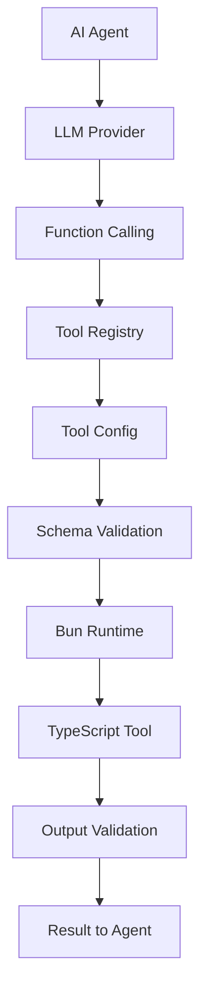

The Compozy tools system enables AI agents to extend their capabilities beyond text generation by executing TypeScript/JavaScript code, calling external APIs, and integrating with various services. Tools provide a standardized, schema-validated interface for agents to perform deterministic operations.

## What Are Tools?

Tools are executable components that:

- **Extend agent capabilities** with custom logic and external integrations
- **Execute in isolated environments** using Bun runtime for security
- **Validate inputs and outputs** using JSON Schema
- **Integrate seamlessly** with LLM function calling
- **Support timeouts and error handling** for reliability

<Callout>
Tools bridge the gap between AI reasoning and real-world actions, enabling agents to read files, process data, call APIs, and perform complex operations.
</Callout>

## Architecture Overview



## Key Features

### Schema-First Design
Tools define their interfaces using JSON Schema, ensuring type safety and providing clear documentation for agents.

```yaml
input:
  type: object
  properties:
    url:
      type: string
      format: uri
      description: "URL to fetch data from"
    headers:
      type: object
      description: "HTTP headers to include"
  required: [url]

output:
  type: object
  properties:
    status:
      type: integer
    data:
      type: object
    headers:
      type: object
```

### Secure Execution Environment
Tools run in isolated Bun processes with:
- **Configurable permissions** (network, file system, environment)
- **Memory and timeout limits** to prevent resource exhaustion
- **Environment variable isolation** for secure credential management
- **Output size limits** to prevent memory attacks

### LLM Integration
Tools automatically generate function definitions for AI agents:

```typescript
// Tool configuration generates LLM function definition
{
  "type": "function",
  "function": {
    "name": "fetch_data",
    "description": "Fetch data from a URL",
    "parameters": {
      // JSON Schema from tool input
    }
  }
}
```

## Tool Types

### 1. Data Processing Tools
Handle file operations, data transformation, and content processing.

**Examples:**
- File readers/writers
- CSV/JSON processors
- Text analyzers
- Image processors

### 2. API Integration Tools
Connect to external services and APIs.

**Examples:**
- HTTP clients
- Database connectors
- Cloud service integrations
- Social media APIs

### 3. System Tools
Interact with the operating system and external utilities.

**Examples:**
- Command line utilities
- Process managers
- System monitors
- Package managers

### 4. AI/ML Tools
Specialized tools for AI and machine learning operations.

**Examples:**
- Model inference
- Data preprocessing
- Feature extraction
- Result analysis

## Basic Tool Structure

Every tool follows this standard structure:

```yaml
# Tool identification
resource: "tool"
id: "unique-tool-name"
description: "What this tool does"

# Execution configuration
timeout: "30s"

# Schema definitions
input:
  type: object
  properties:
    # Input parameters
  required: []

output:
  type: object
  properties:
    # Output structure

# Default parameters
with:
  default_param: "value"

# Environment variables
env:
  API_KEY: "{{ .env.SECRET_KEY }}"
```

## TypeScript Tool Implementation

Tools are implemented as TypeScript modules with a standardized interface:

```typescript
// tool-script.ts
interface Input {
  url: string;
  options?: {
    method?: string;
    headers?: Record<string, string>;
  };
}

interface Output {
  status: number;
  data: unknown;
  headers: Record<string, string>;
}

export async function run(input: Input): Promise<Output> {
  const { url, options = {} } = input;

  try {
    const response = await fetch(url, {
      method: options.method || 'GET',
      headers: options.headers || {},
    });

    const data = await response.json();

    return {
      status: response.status,
      data,
      headers: Object.fromEntries(response.headers.entries()),
    };
  } catch (error) {
    throw new Error(`Failed to fetch data: ${error.message}`);
  }
}
```

## Tool Lifecycle

1. **Definition**: Tool configured in YAML with schema validation
2. **Registration**: Loaded into agent configuration or autoload system
3. **Validation**: Configuration and schemas validated at startup
4. **Execution**: Agent calls tool through LLM function calling
5. **Processing**: Input validated, tool executed in Bun runtime
6. **Response**: Output validated and returned to agent

## Error Handling

Tools include comprehensive error handling:

```typescript
// Structured error responses
interface ToolError {
  code: string;
  message: string;
  details?: unknown;
}

// Timeout handling
export async function run(input: Input): Promise<Output> {
  const controller = new AbortController();
  const timeoutId = setTimeout(() => controller.abort(), 30000);

  try {
    const result = await processData(input, controller.signal);
    clearTimeout(timeoutId);
    return result;
  } catch (error) {
    clearTimeout(timeoutId);
    if (error.name === 'AbortError') {
      throw new Error('Tool execution timed out');
    }
    throw error;
  }
}
```

## Performance Considerations

### Memory Management
- Tools limited to 10MB output size
- Buffer pooling for efficient memory usage
- Automatic garbage collection in Bun runtime

### Execution Optimization
- Pre-compiled worker templates
- Connection pooling for HTTP tools
- Caching for repeated operations

### Security Measures
- Sandboxed execution environment
- Configurable permissions per tool
- Input/output validation
- Resource limits and timeouts

## Integration with Workflows

Tools integrate seamlessly with Compozy workflows:

```yaml
# workflow.yaml
tasks:
  - id: fetch_data
    type: basic
    $use: tool(local::tools.#(id=="http_client"))
    with:
      url: "https://api.example.com/data"
      headers:
        Authorization: "Bearer {{ .env.API_TOKEN }}"
    outputs:
      data: "{{ .output.data }}"
      status: "{{ .output.status }}"
```

## Related Documentation

### 🔗 Cross-References
- **[Core Concepts: Tools](/docs/core/getting-started/core-concepts#4-tools)** - Tools in workflow context
- **[Agent Tools](/docs/core/agents/tools)** - How agents use tools
- **[Task Integration](/docs/core/tasks/basic-tasks)** - Tools in task execution
- **[MCP Integration](/docs/core/mcp/mcp-overview)** - External tool protocols

### 🔧 Tool-Related Topics
- **Tool Development** ↔ **[TypeScript Development](/docs/core/tools/typescript-development)** ↔ **[Runtime Environment](/docs/core/tools/runtime-environment)**
- **Tool Configuration** ↔ **[Configuration Schemas](/docs/core/tools/configuration-schemas)** ↔ **[YAML Templates](/docs/core/yaml-templates/overview)**
- **External Integration** ↔ **[MCP Servers](/docs/core/mcp/mcp-overview)** ↔ **[Agent Capabilities](/docs/core/agents/tools)**

## Next Steps

<FeatureCardList cols={2}>
  <FeatureCard title="TypeScript Development" href="/docs/core/tools/typescript-development">
    Build custom tools with TypeScript/JavaScript
  </FeatureCard>
  <FeatureCard title="Runtime Environment" href="/docs/core/tools/runtime-environment">
    Understand Bun execution and security model
  </FeatureCard>
  <FeatureCard title="Configuration Schemas" href="/docs/core/tools/configuration-schemas">
    Define robust tool interfaces with JSON Schema
  </FeatureCard>
  <FeatureCard title="Testing & Debugging" href="/docs/core/tools/testing-debugging">
    Best practices for tool development workflow
  </FeatureCard>
</FeatureCardList>

### 📚 Learning Paths
- **Tool Development**: [Overview](/docs/core/tools/tools-overview) → [TypeScript Development](/docs/core/tools/typescript-development) → [Testing](/docs/core/tools/testing-debugging)
- **Integration**: [External Integrations](/docs/core/tools/external-integrations) → [MCP Overview](/docs/core/mcp/mcp-overview) → [Agent Tools](/docs/core/agents/tools)
- **Advanced**: [Performance & Security](/docs/core/tools/performance-security) → [Advanced Patterns](/docs/core/tools/advanced-patterns)
