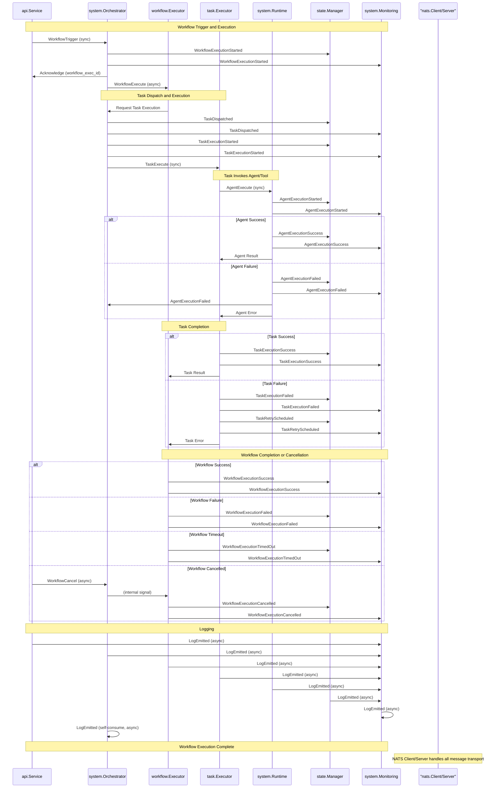

# Component Interactions

This document provides a visual representation of how components in the Compozy Workflow Engine interact through NATS events, including **Commands**, **State Events**, and **Log Events**. The sequence diagram below illustrates a typical workflow execution, from triggering a workflow to executing tasks and agents/tools, with state persistence, monitoring, and task dispatch notifications.

## Sequence Diagram

The following Mermaid sequence diagram shows the interactions among components, focusing on a scenario where a workflow is triggered, a task is executed, an agent or tool is invoked, and the system handles success or failure outcomes. The `nats.Client` and `nats.Server` facilitate communication but are not shown as active participants in the sequence for simplicity, as they handle the underlying message transport.

