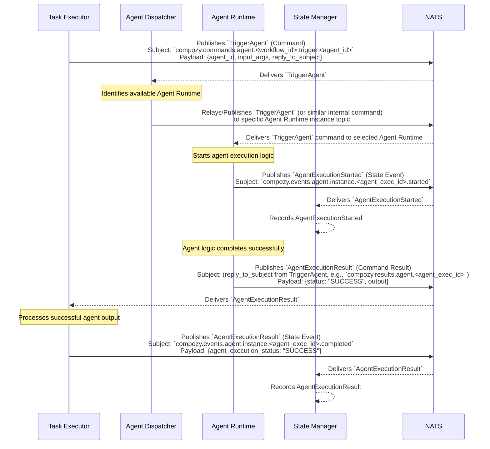

# Flow: Successful Agent Execution (by Task Executor)

This diagram shows the sequence of events when a `task.Executor` successfully invokes an agent. The `agent.Dispatcher` routes the request to an available `agent.Runtime`, which executes the agent logic and returns a successful result.

This flow involves:
1.  The `Task Executor` sending a `TriggerAgent` command.
2.  The `Agent Dispatcher` receiving the command and forwarding it to an available `Agent Runtime`.
3.  The `Agent Runtime` acknowledging the start of execution by emitting `AgentExecutionStarted`.
4.  The `Agent Runtime` successfully executing the agent logic and returning the `AgentExecutionResult` with a "SUCCESS" status and output.
5.  The `Task Executor`, after processing the result, emitting `AgentExecutionResult`.
6.  The `State Manager` consumes the state events for tracking. 
