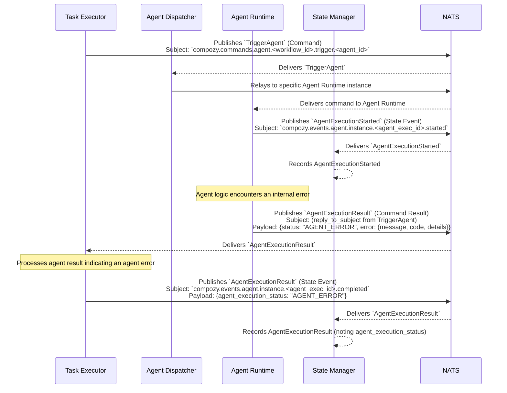

# Flow: Agent Execution with Agent-Side Error (by Task Executor)

This diagram shows the sequence of events when a `task.Executor` invokes an agent, and the `agent.Runtime` executes the agent logic, but the agent's own logic encounters an error.

This flow involves:
1.  The `Task Executor` sending a `TriggerAgent` command.
2.  The `Agent Dispatcher` forwarding it to an `Agent Runtime`.
3.  The `Agent Runtime` emitting `AgentExecutionStarted`.
4.  The `Agent Runtime`'s internal agent logic failing, leading it to return an `AgentExecutionResult` with an "AGENT_ERROR" status and error details.
5.  The `Task Executor` receiving this error result and emitting `AgentExecutionResult`, reflecting the `agent_execution_status` as "AGENT_ERROR". The execution itself (request-reply) completed, but the agent's work did not succeed.
6.  The `State Manager` consumes the state events for tracking. 
