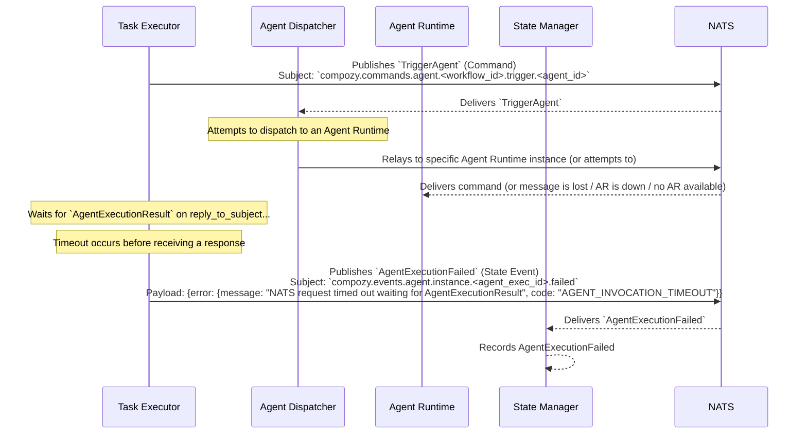

# Flow: Agent Execution Failure (e.g., Timeout by Task Executor)

This diagram shows the sequence of events when a `task.Executor` invokes an agent, but the execution fails, for example, due to a NATS timeout waiting for the `AgentExecutionResult`.

This flow involves:
1.  The `Task Executor` sending a `TriggerAgent` command.
2.  The `Agent Dispatcher` attempts to forward it.
3.  The `Task Executor` does not receive an `AgentExecutionResult` within its configured timeout period. This could be due to the `Agent Runtime` being down, network issues, or the `Agent Dispatcher` failing to find a runtime.
4.  The `Task Executor` then emits `AgentExecutionFailed`.
5.  The `State Manager` consumes the `AgentExecutionFailed` event.

*Note: An `AgentExecutionStarted` might or might not have been emitted by an `Agent Runtime` depending on where the failure occurred. This diagram focuses on the timeout from the `Task Executor`'s perspective.* 
