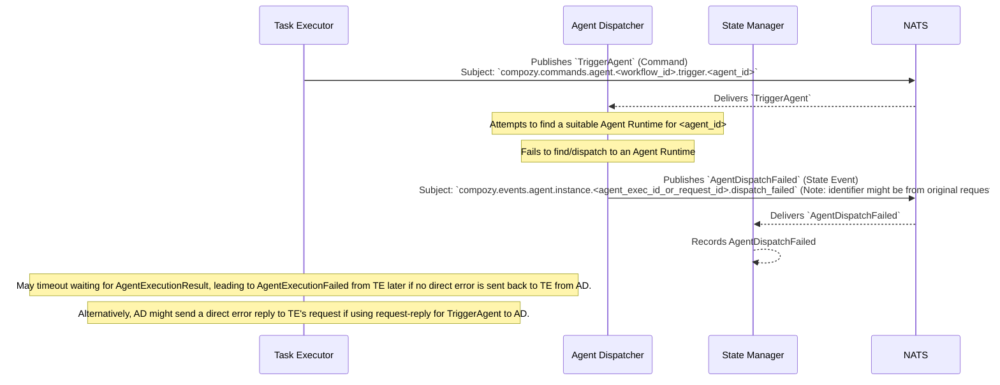

# Flow: Agent Dispatch Failure

This diagram shows the sequence of events when the `agent.Dispatcher` fails to dispatch a `TriggerAgent` command to an `agent.Runtime`. This might happen if no compatible runtime is registered or available.

This flow involves:
1.  The `Task Executor` sending a `TriggerAgent` command, targeting a specific agent ID.
2.  The `Agent Dispatcher` receives the command.
3.  The `Agent Dispatcher` is unable to find a registered and available `Agent Runtime` capable of handling the specified agent ID, or fails in its attempt to communicate with a selected runtime.
4.  The `Agent Dispatcher` emits an `AgentDispatchFailed` event.
5.  The `State Manager` consumes this event.
6.  The original `Task Executor` might subsequently time out and emit an `AgentExecutionFailed` if the `TriggerAgent` command to the `Agent Dispatcher` was a fire-and-forget to the dispatcher, and it was expecting a result on a `reply_to_subject`. If `TriggerAgent` to `AD` is synchronous, `AD` could return an error directly to `TE`.

*Clarification: The exact mechanism for how the `Task Executor` becomes aware of the dispatch failure (e.g., direct error reply from Dispatcher vs. timeout) depends on the NATS communication pattern between `TE` and `AD` for the `TriggerAgent` command.* 
