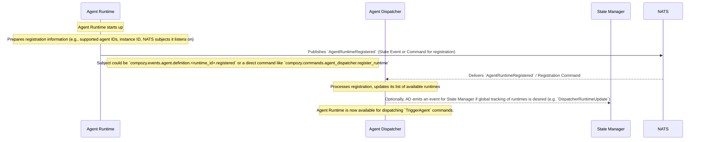

# Flow: Agent Runtime Registration

This diagram illustrates an `agent.Runtime` instance starting up and registering itself with the `agent.Dispatcher`, making itself available to execute agent logic.

This flow involves:
1.  An `Agent Runtime` instance starting up.
2.  The `Agent Runtime` sending an `AgentRuntimeRegistered` event (or a direct registration command) to the `Agent Dispatcher`.
    *   This message contains information about the runtime, such as its unique ID, the agent definitions it can handle, and the NATS subjects it listens on for direct commands.
3.  The `Agent Dispatcher` receives this information and updates its internal registry of available runtimes.
4.  Optionally, the `Agent Dispatcher` might emit an event consumable by the `State Manager` or other interested components if detailed tracking of runtime availability is required at a system level.

**Deregistration (`AgentRuntimeDeregistered`)** would follow a similar pattern, where the `Agent Runtime` (on graceful shutdown) or the `Agent Dispatcher` (if it detects a defunct runtime) would emit an `AgentRuntimeDeregistered` event. 
