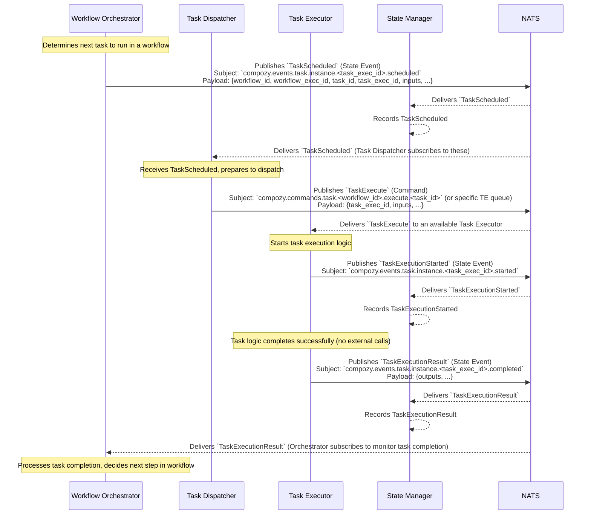

# Flow: Successful Task Execution (No Callout)

This diagram illustrates a task being scheduled, dispatched, and executed successfully by a `task.Executor` without making any external calls to agents or tools.

This flow involves:
1.  The `Workflow Orchestrator` (or a similar component) determines a task needs to run and emits `TaskScheduled`.
2.  The `Task Dispatcher` picks up `TaskScheduled` and issues an `TaskExecute` command to an available `Task Executor`.
3.  The `Task Executor` receives the command and emits `TaskExecutionStarted`.
4.  The `Task Executor` successfully completes the task's logic without calling any external services (Agents or Tools).
5.  The `Task Executor` emits `TaskExecutionResult` with the task's output.
6.  The `State Manager` consumes all state events for tracking.
7.  The `Workflow Orchestrator` also consumes `TaskExecutionResult` to advance the workflow.

*Note: The `TaskExecute` command between Dispatcher and Executor might be an internal mechanism rather than a globally broadcast NATS message, potentially targeting a specific queue for a group of executors.* The `TaskExecutionResult` or `TaskFailureResult` pattern common in some task systems is represented here by the direct emission of `TaskExecutionResult` or `TaskExecutionFailed` by the `Task Executor` for the `State Manager` and `Workflow Orchestrator`. 
