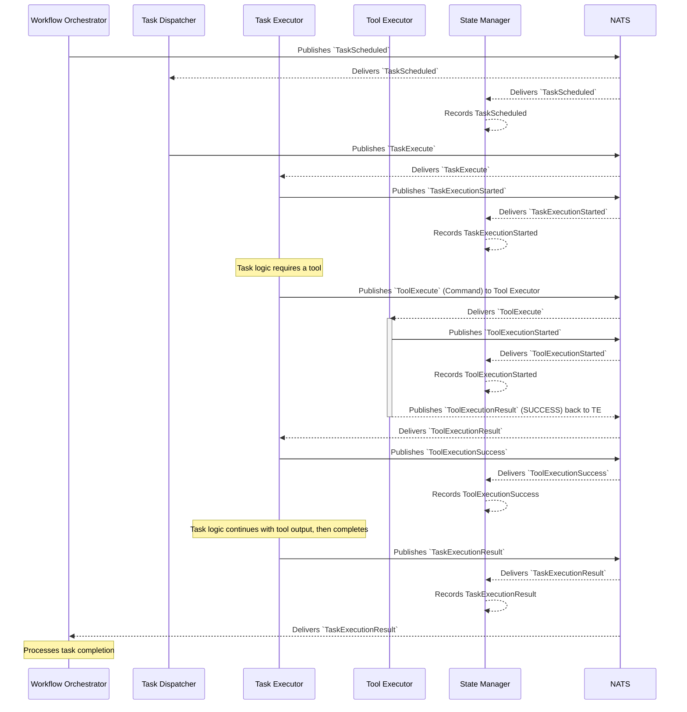

# Flow: Successful Task Execution with Tool Call

This diagram illustrates a task that, as part of its execution, successfully calls a tool.

This flow extends the basic task execution by adding a tool call:
1.  Initial steps: `TaskScheduled`, `TaskExecute`, `TaskExecutionStarted` (as in the no-callout flow).
2.  The `Task Executor` determines it needs to call a tool.
3.  **Tool Call Sub-flow (simplified here, see `tool/01_successful_execution.md` for full detail):**
    *   `TE` sends `ToolExecute` to `ToolExecutor`.
    *   `ToolExecutor` emits `ToolExecutionStarted`.
    *   `ToolExecutor` returns `ToolExecutionResult` (success) to `TE`.
    *   `TE` emits `ToolExecutionSuccess`.
4.  The `Task Executor` uses the tool's output and completes its main logic.
5.  The `Task Executor` emits `TaskExecutionResult`.
6.  The `State Manager` and `Workflow Orchestrator` consume events as usual. 
