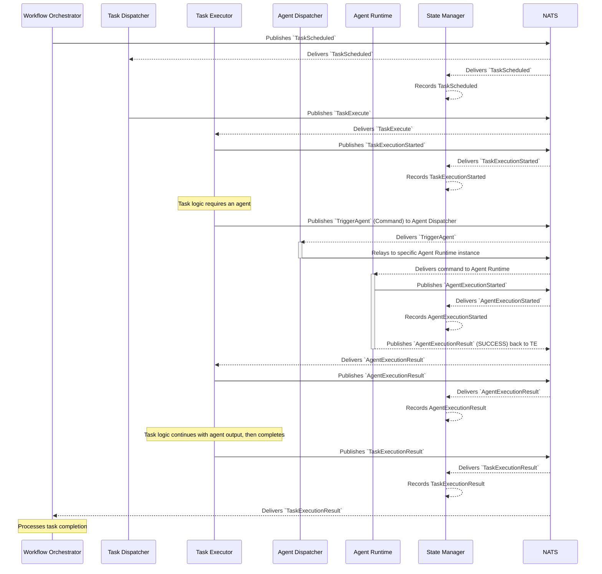

# Flow: Successful Task Execution with Agent Call

This diagram illustrates a task that, as part of its execution, successfully calls an agent.

This flow extends the basic task execution by adding an agent call:
1.  Initial steps: `TaskScheduled`, `TaskExecute`, `TaskExecutionStarted`.
2.  The `Task Executor` determines it needs to call an agent.
3.  **Agent Call Sub-flow (simplified, see `agent/01_successful_execution.md` for full detail):**
    *   `TE` sends `TriggerAgent` to `AgentDispatcher`.
    *   `AgentDispatcher` relays to `AgentRuntime`.
    *   `AgentRuntime` emits `AgentExecutionStarted`.
    *   `AgentRuntime` returns `AgentExecutionResult` (success) to `TE`.
    *   `TE` emits `AgentExecutionResult`.
4.  The `Task Executor` uses the agent's output and completes its main logic.
5.  The `Task Executor` emits `TaskExecutionResult`.
6.  The `State Manager` and `Workflow Orchestrator` consume events. 
