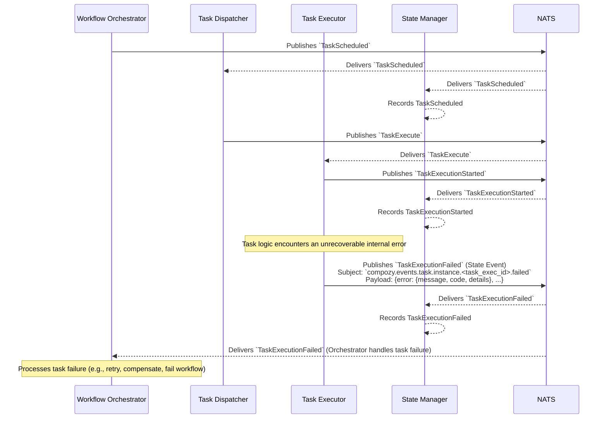

# Flow: Task Execution Failure (Internal Error)

This diagram shows a task failing due to an error within the `task.Executor`'s own logic, not related to any external calls.

This flow shows:
1.  Standard task scheduling and start: `TaskScheduled`, `TaskExecute`, `TaskExecutionStarted`.
2.  The `Task Executor` encounters an internal error during its execution.
3.  The `Task Executor` emits `TaskExecutionFailed` with error details.
4.  The `State Manager` records the failure.
5.  The `Workflow Orchestrator` consumes `TaskExecutionFailed` to take appropriate action (e.g., trigger a retry if configured, execute a compensation path, or mark the workflow as failed). 
