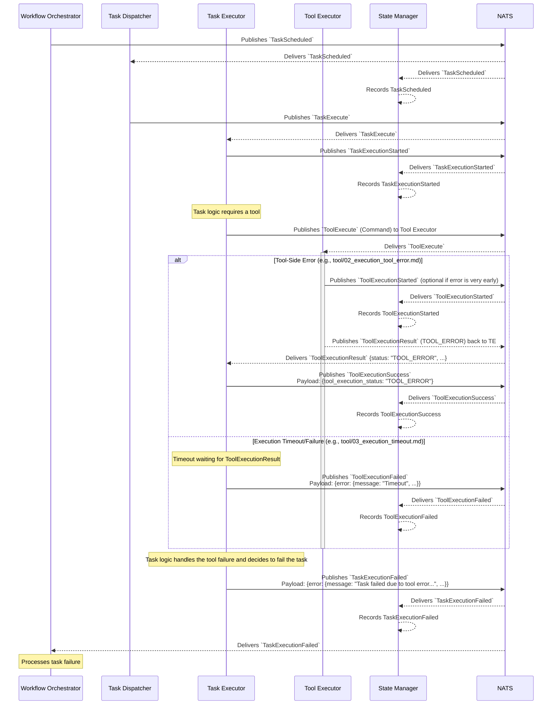

# Flow: Task Execution Failure (Due to Tool Failure)

This diagram illustrates a task failing because a tool it invoked either returned an error or the execution itself failed (e.g., timeout).

This flow shows:
1.  Standard task scheduling and start.
2.  The `Task Executor` attempts to call a tool.
3.  **Tool Call Fails (Two common scenarios shown):**
    *   **Tool-Side Error:** The `ToolExecutor` starts, encounters an error, and returns `ToolExecutionResult` with a `TOOL_ERROR` status. The `TaskExecutor` then emits `ToolExecutionSuccess` (reflecting the tool error).
    *   **Execution Timeout/Failure:** The `TaskExecutor` sends `ToolExecute` but times out or encounters a NATS communication issue, leading to `ToolExecutionFailed`.
4.  The `Task Executor`'s logic determines that the tool failure is critical, and thus the task itself must fail.
5.  The `Task Executor` emits `TaskExecutionFailed`.
6.  `State Manager` and `Workflow Orchestrator` process the task failure. 
