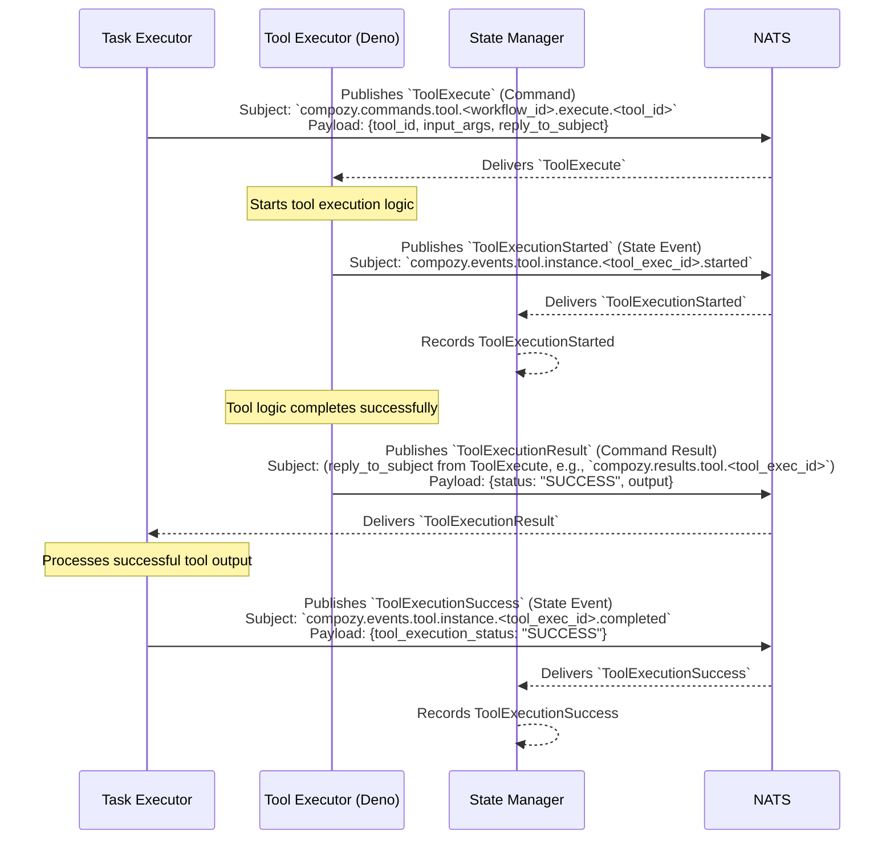

# Flow: Successful Tool Execution (by Task Executor)

This diagram shows the sequence of events when a `task.Executor` successfully invokes a tool, and the `tool.Executor` (e.g., Deno runtime) successfully executes it.

This flow involves:
1.  The `Task Executor` sending an `ToolExecute` command.
2.  The `Tool Executor` acknowledging the start of execution by emitting `ToolExecutionStarted`.
3.  The `Tool Executor` returning the `ToolExecutionResult` with a "SUCCESS" status and output.
4.  The `Task Executor`, after processing the result, emitting `ToolExecutionSuccess`.
5.  The `State Manager` consumes the state events for tracking. 
