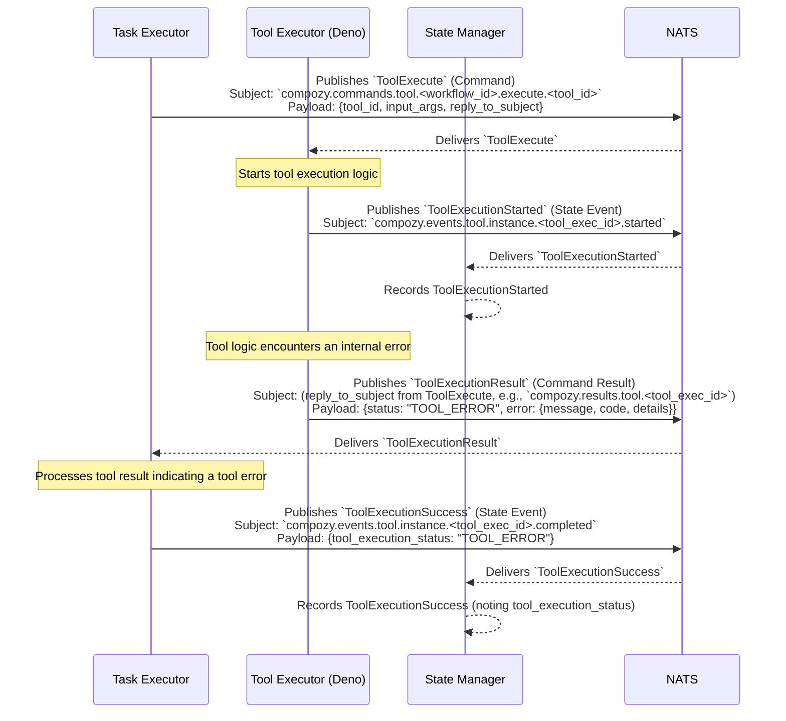

# Flow: Tool Execution with Tool-Side Error (by Task Executor)

This diagram shows the sequence of events when a `task.Executor` invokes a tool, but the `tool.Executor` (e.g., Deno runtime) encounters an error during the tool's own execution.

This flow involves:
1.  The `Task Executor` sending an `ToolExecute` command.
2.  The `Tool Executor` emitting `ToolExecutionStarted`.
3.  The `Tool Executor`'s internal logic failing, leading it to return a `ToolExecutionResult` with a "TOOL_ERROR" status and error details.
4.  The `Task Executor` receiving this error result and still emitting `ToolExecutionSuccess`, but reflecting the `tool_execution_status` as "TOOL_ERROR". The execution itself (the request-reply part) completed, but the tool's work did not succeed.
5.  The `State Manager` consumes the state events for tracking. 
