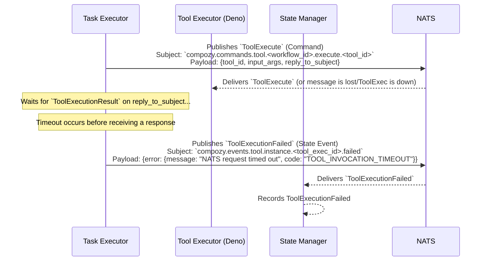

# Flow: Tool Execution Failure (e.g., Timeout by Task Executor)

This diagram shows the sequence of events when a `task.Executor` invokes a tool, but the execution fails, for example, due to a NATS timeout waiting for the `ToolExecutionResult` from the `tool.Executor`.

This flow involves:
1.  The `Task Executor` sending an `ToolExecute` command.
2.  The `Tool Executor` potentially receives the command (and might even start processing via `ToolExecutionStarted`, though not shown here for simplicity of the timeout scenario from TE's perspective), or it might be down/unreachable.
3.  The `Task Executor` does not receive a `ToolExecutionResult` on the specified `reply_to_subject` within its configured timeout period.
4.  The `Task Executor` then emits `ToolExecutionFailed` to indicate that the attempt to invoke the tool and get a result has failed.
5.  The `State Manager` consumes the `ToolExecutionFailed` event for tracking.

*Note: If the `ToolExecutor` had emitted `ToolExecutionStarted` before the timeout, the `State Manager` would have recorded that as well. This diagram focuses on the timeout from the `Task Executor`'s perspective.* 
