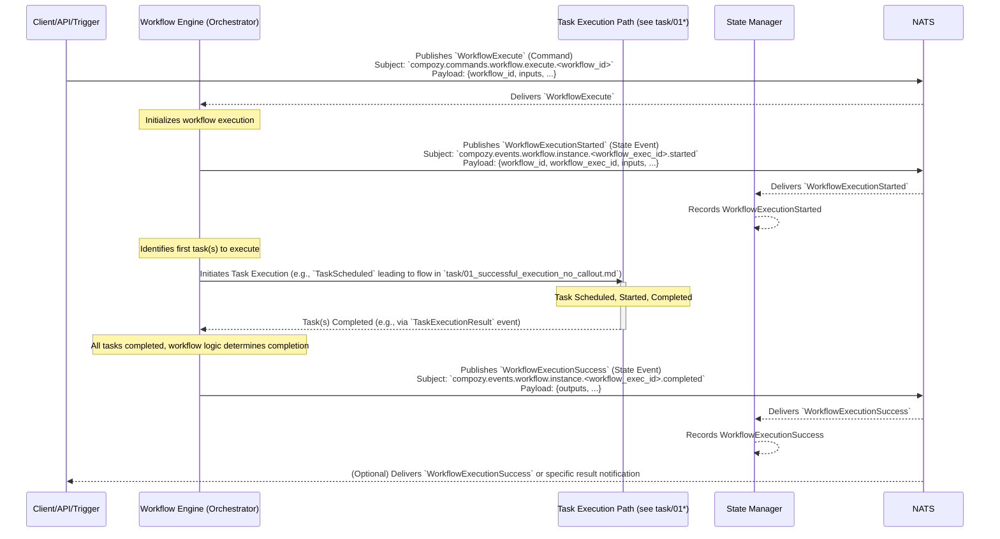

# Flow: Successful Workflow Execution (Simple E2E)

This diagram illustrates the end-to-end successful execution of a simple workflow, for example, one that contains a single task which completes successfully without external calls.

This flow involves:
1.  A `Client` (or an API call, or an external trigger) initiates a workflow by sending an `WorkflowExecute` command.
2.  The `Workflow Engine` (specifically its orchestrator component) receives the command.
3.  The `WFEngine` emits `WorkflowExecutionStarted`.
4.  The `WFEngine` orchestrates the execution of the workflow's tasks. In this simple case, it involves a single task execution that completes successfully (this part is abstracted and detailed in task flow diagrams like `../task/01_successful_execution_no_callout.md`).
5.  Upon successful completion of all necessary tasks and fulfillment of workflow logic, the `WFEngine` emits `WorkflowExecutionSuccess`.
6.  The `State Manager` records all relevant state events.
7.  Optionally, the `Client` might be notified of the workflow completion, either by subscribing to `WorkflowExecutionSuccess` or through a dedicated result message. 
