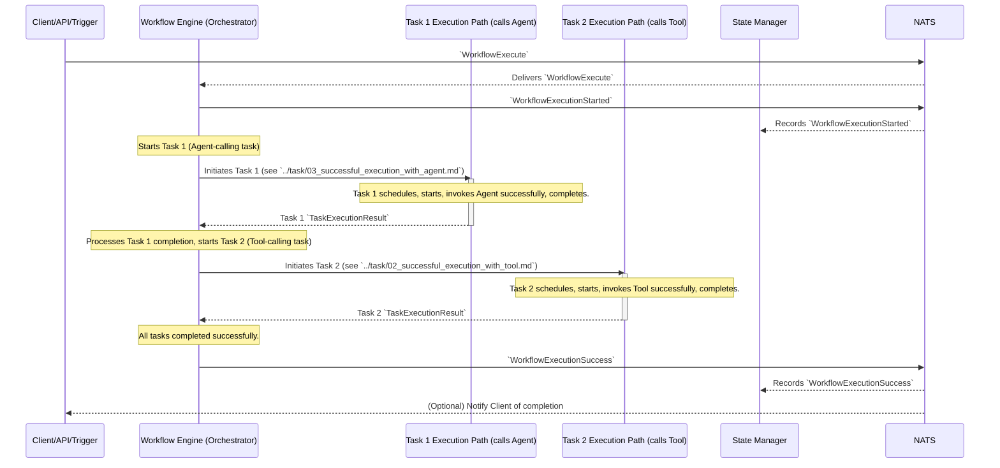

# Flow: Successful Workflow Execution (Complex E2E)

This diagram illustrates a more complex workflow with multiple tasks, including one that calls an agent and another that calls a tool. All operations are successful.

This flow involves:
1.  `Client` sends `WorkflowExecute`.
2.  `Workflow Engine` (WFEngine) emits `WorkflowExecutionStarted`.
3.  **Task 1 Execution (Agent Call):**
    *   `WFEngine` initiates Task 1.
    *   Task 1 executes, successfully calling an agent (details in `../task/03_successful_execution_with_agent.md`).
    *   Task 1 emits `TaskExecutionResult`, consumed by `WFEngine`.
4.  **Task 2 Execution (Tool Call):**
    *   `WFEngine` initiates Task 2 based on workflow logic (e.g., after Task 1 completion).
    *   Task 2 executes, successfully calling a tool (details in `../task/02_successful_execution_with_tool.md`).
    *   Task 2 emits `TaskExecutionResult`, consumed by `WFEngine`.
5.  `WFEngine`, determining all steps are complete, emits `WorkflowExecutionSuccess`.
6.  `State Manager` records all state changes throughout. 
