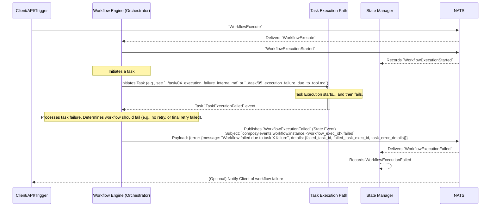

# Flow: Workflow Execution Failure (Due to Task Failure)

This diagram shows a workflow failing because one of its constituent tasks fails.

This flow involves:
1.  Standard workflow initiation: `WorkflowExecute`, `WorkflowExecutionStarted`.
2.  The `Workflow Engine` (WFEngine) initiates a task.
3.  **Task Failure:** The task execution path results in a `TaskExecutionFailed` event being sent to the `WFEngine`. (The reason for the task failure could be internal, or due to a failed tool/agent call, as detailed in various task failure flows like `../task/04_execution_failure_internal.md`, `../task/05_execution_failure_due_to_tool.md`, or `../task/06_execution_failure_due_to_agent.md`).
4.  The `WFEngine` processes the `TaskExecutionFailed` event. Based on the workflow definition and error handling policies (e.g., no retries left for the task, or the failure is critical), it decides to fail the entire workflow.
5.  The `WFEngine` emits `WorkflowExecutionFailed`, including details about the source of the failure.
6.  The `State Manager` records the workflow failure.
7.  Optionally, the `Client` is notified. 
