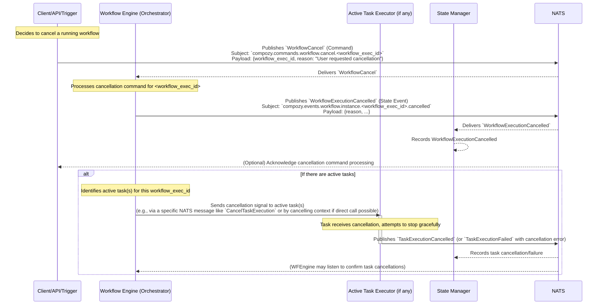

# Flow: Workflow Cancellation

This diagram illustrates how a running workflow execution is cancelled upon receiving a `WorkflowCancel` command.

This flow involves:
1.  A `Client` (or another system component) issues a `WorkflowCancel` command targeting a specific `workflow_exec_id`.
2.  The `Workflow Engine` (WFEngine) receives this command.
3.  The `WFEngine` immediately emits `WorkflowExecutionCancelled` to mark the workflow intent as cancelled. This is important for state tracking, even if cleanup of active tasks takes time.
4.  The `State Manager` records this state.
5.  **Task Cancellation (if applicable):**
    *   The `WFEngine` identifies any currently active tasks belonging to the cancelled workflow execution.
    *   It sends a cancellation instruction to these active tasks (e.g., via a specific NATS command like `CancelTaskExecution` or by other means like cancelling a propagated `context.Context`).
    *   The active tasks, upon receiving the cancellation signal, should attempt to stop gracefully and emit their final state (e.g., `TaskExecutionCancelled` or `TaskExecutionFailed` if cleanup fails).
6.  The `WFEngine` might monitor the result of these task cancellations but the workflow itself is already marked as cancelled. 
