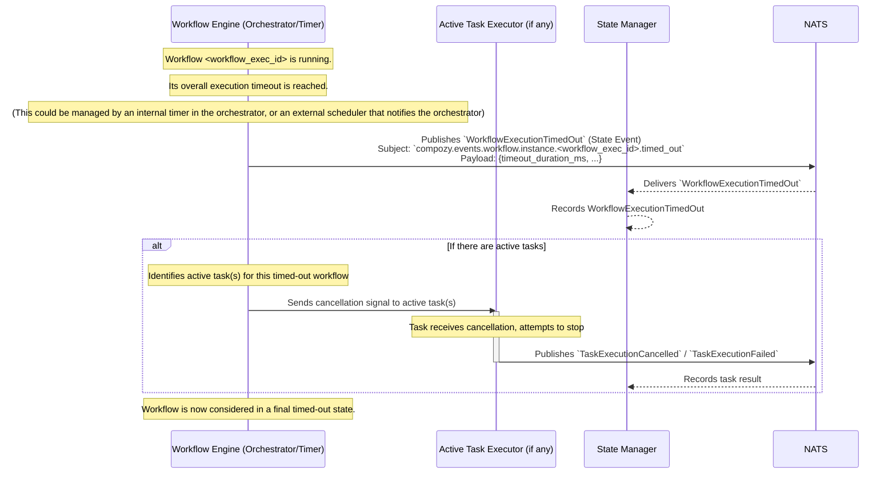

# Flow: Workflow Timeout

This diagram illustrates a workflow execution timing out based on its defined overall timeout period.

This flow involves:
1.  A workflow execution is in progress.
2.  The `Workflow Engine` (or an associated timing mechanism) determines that the workflow's maximum allowed execution time has been exceeded.
3.  The `WFEngine` emits `WorkflowExecutionTimedOut`.
4.  The `State Manager` records this terminal state.
5.  **Task Cleanup (if applicable):** Similar to cancellation, the `WFEngine` should attempt to signal any active tasks of this workflow to terminate, as the workflow itself is no longer considered active. 
