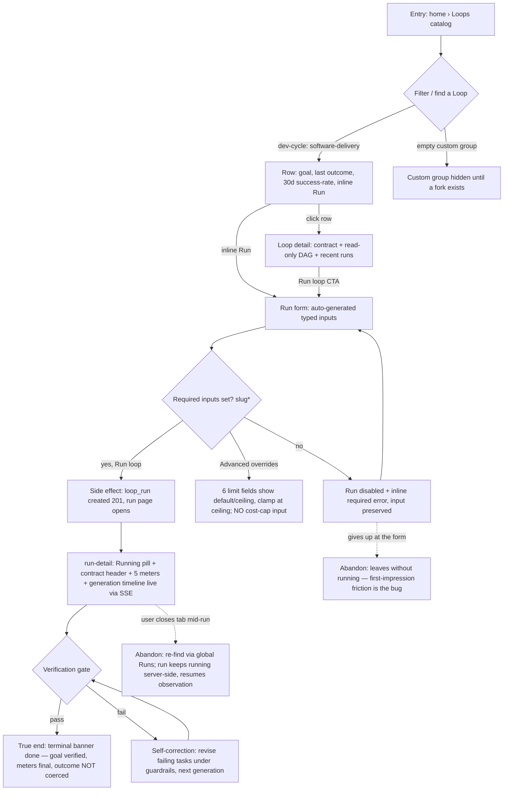

# J-01 — Arrive and use: run a default dev-cycle Loop to a verified finish

The hero path (PRD F11 layer 1, use-cases §2). A user arrives at the Loops catalog, launches a default-enrolled `dev-cycle` Loop with a couple of inputs, and watches it drive already-authored tasks to a verified terminal outcome — no authoring, no graph assembly. If this is one step harder than Compozy today, the design failed.



```yaml
journey:
  id: J-01
  name: "Run a default dev-cycle Loop to a verified finish (arrive-and-use)"
  value_statement: "A user runs software-delivery with a few inputs and it drives their tasks to a truthful, verified terminal outcome without babysitting."
  personas: [Lea, Bruno]
  entry_points:
    - url: "web /loops (loops-catalog)"
      origin: in-app-nav
    - url: "web /loops/:name (loop-detail) › Run loop"
      origin: in-app-nav
    - url: "CLI: agh loop run --name software-delivery --input slug=my-feature"
      origin: direct
  actions:
    - step: 1
      verb: "Browse the catalog and find software-delivery"
      expected_observable: "Grouped list (dev-cycle/Custom), row shows goal, last-outcome pill, 30d success-rate, inline Run"
    - step: 2
      verb: "Open the run form and fill the declared inputs"
      expected_observable: "Form auto-generated from the declared input schema (type badges, required *); Run disabled until slug set"
    - step: 3
      verb: "(optional) Open Advanced overrides"
      expected_observable: "6 numeric fields each show per-loop default / daemon ceiling and clamp at ceiling; NO Cost cap (USD) input; canonical defaults render (iteration cap 50, unbounded as ∞)"
    - step: 4
      verb: "Run the Loop"
      expected_observable: "loop_run created (201); run page opens with live Running pill, contract header, 5 meters, generation timeline"
    - step: 5
      verb: "Watch it self-correct and finish"
      expected_observable: "Failing tasks revise under guardrails; a terminal banner shows the single truthful outcome (done)"
  goal:
    observable: "Terminal banner reads done with the goal verified; Attempts/Tokens/Wall/Cost/Breadth meters show final usage"
    side_effects: [loop_run-created, task_runs-executed, generation-timeline-events-streamed]
  true_end_state: "Reload the run page: the run is still done (not optimistic UI), the outcome is not coerced from exhausted/stalled, and it appears in both the Loop's recent runs and the global Runs list."
  exit:
    natural: "User lands on the terminal run page; can open the merged result / recent-runs history."
  abandonment:
    - at_step: 2
      how: "New user can't tell what to type or what the primary action is; leaves."
      resume: "No run created; the friction itself is the finding (arrive-and-use must be ≤ Compozy)."
    - at_step: 4
      how: "Closes the browser tab while the run is still running."
      resume: "Run continues server-side; user re-finds it via global Runs (runs.html) and resumes observing — state and meters intact."
  crosses: [catalog-projection, run-form-schema, coordinator/task_runs, SSE-stream, global-runs-index]

design_reference:
  screens:
    - "docs/design/opendesign/loops-catalog.html (LOOPS-DESIGN-SPEC §4.1)"
    - "docs/design/opendesign/loop-run-form.html (LOOPS-DESIGN-SPEC §4.3)"
    - "docs/design/opendesign/run-detail.html (LOOPS-DESIGN-SPEC §4.4)"
  truthful_ui_checks:
    - "No Cost cap (USD) input on the run form; Cost is a display-only derived meter (ADR-017 §3)."
    - "Canonical stop-limit defaults render (iteration_cap 50, not the design HTML's 10; unbounded shown as ∞) — §9.5.1."
    - "Terminal banner is truthful: a done shown here must be a genuine verified done, never a coerced exhausted/stalled (ADR-013 inv5)."
    - "Running pulse only while live; gated by reduced-motion."
    - "loops-refac (2026-07-08): software-delivery's load_tasks resolves via the ext__dev_cycle__import_tasks action node (not source/file-import), and its run-agent sessions are now policy-gated (sandbox/permission/subset-only allowed_tools) — the run reaches the same verified done, but LP-003/LP-046 verify the new session posture (CH-026)."

e2e_backbone:
  runtime:
    - "E2E-runtime-1: Should run software-delivery to a verified terminal outcome unattended (PRD success metric)."
    - "E2E-runtime-7: budget never kills a progressing run; no-progress → stalled; ceiling → exhausted (guardrail side of self-correction)."
  web:
    - "E2E-web-1: Catalog filter + success-rate + last-outcome pill + launch run inline → run form."
    - "E2E-web-2: Run form auto-generates typed inputs, Run gated until required, override default/ceiling + clamp, NO Cost cap input, start a run on Run."
    - "E2E-web-3: Run page contract header (goal + DoD + verification rows + terminal chips + live Running pill, no pulse under reduced-motion)."
    - "E2E-web-4: Run page meters (Attempts/Tokens/Wall/Cost(derived)/Breadth, warn-tint near ceiling only, cost display-only, no cap control)."
    - "E2E-web-5: Run page timeline (collapsible generations + node spine, carried-forward tags, gate verdict + routing)."
  component:
    - "Web-unit-3 (right control per input type + block submit until required); Web-unit-4 (clamp + overrides-set badge); Web-unit-6 (meter warn-tint, no cost cap control)."
  followups:
    - "AB-001 — real-daemon Playwright for the run page needs a loop e2e seed harness that drives rich-frame SSE emission. Web-lane covers behavior at vitest/component + agh-ui-screenshot until then."
```
