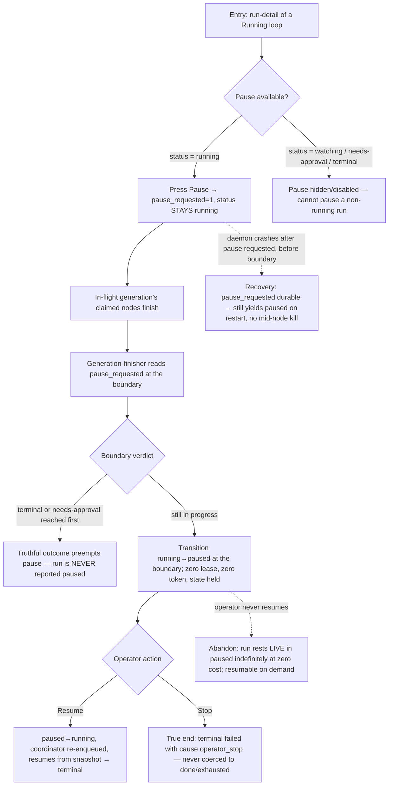

# J-04 — Operator pause / resume / stop a running Loop

The operator control journey (ADR-017 §9.3, PRD "Observing"). An operator suspends a running Loop at a generation boundary (`paused` — a live, resumable state distinct from the system-initiated `needs-approval`), resumes it later, or stops it outright. Pause is **intent-decoupled from status**: it never flips to `paused` while a node is still executing.



```yaml
journey:
  id: J-04
  name: "Pause, resume, and stop a running Loop as an operator"
  value_statement: "An operator can safely suspend a running Loop at a generation boundary and resume or stop it, with the status always telling the truth."
  personas: [Bruno]
  entry_points:
    - url: "web /loops/:name/runs/:id (run-detail) Pause / Resume / Stop controls"
      origin: in-app-nav
    - url: "CLI: agh loop pause|resume|stop <run>"
      origin: direct
    - url: "native tool: agh__loop_pause / agh__loop_resume / agh__loop_stop"
      origin: in-app-nav
  actions:
    - step: 1
      verb: "Press Pause on a running run"
      expected_observable: "pause_requested set; status STAYS running while a node executes; Pause is only offered from running"
    - step: 2
      verb: "Wait for the generation boundary"
      expected_observable: "Claimed nodes finish; at the boundary the run transitions running→paused (or a terminal/needs-approval verdict preempts the pause)"
    - step: 3
      verb: "Resume (or Stop)"
      expected_observable: "Resume → paused→running, resumes from the snapshot to a terminal; Stop → terminal failed(operator_stop)"
  goal:
    observable: "A paused run resumes to a truthful terminal, OR a stopped run is failed(operator_stop) — never coerced to done"
    side_effects: [pause_requested-column, coordinator-yield, status-change-events]
  true_end_state: "After resume, the run reaches its genuine terminal outcome from where it paused (no lost/duplicated node work); after stop, the run is failed with cause operator_stop and stays that way on reload."
  exit:
    natural: "Operator lands on a resumed terminal run or a stopped (failed) run."
  abandonment:
    - at_step: 2
      how: "Operator pauses and never resumes."
      resume: "Run rests LIVE in paused at zero cost; the durable loop_run row holds full state and resumes on demand."
    - at_step: 1
      how: "Daemon crashes after pause is requested but before the boundary."
      resume: "pause_requested is durable — recovery still yields paused at the next boundary, never a mid-node kill."
  crosses: [run-detail-controls, loop.Service.Pause/Resume/Stop, generation-finisher-tx, crash-recovery]

design_reference:
  screens:
    - "docs/design/opendesign/run-detail.html (LOOPS-DESIGN-SPEC §4.4 — Pause + Stop run controls; ADR-017 §9.3)"
  truthful_ui_checks:
    - "Status stays running while a node executes; it flips to paused ONLY at the generation boundary (ADR-013 inv5: running = a node is executing)."
    - "Pause is hidden/disabled outside running (watching / needs-approval / terminal cannot be paused) — N-003."
    - "Stop yields terminal failed(operator_stop), never coerced to done/exhausted/stalled."
    - "A terminal / needs-approval verdict at the boundary preempts a pending pause — the run is never reported paused when it actually finished."

e2e_backbone:
  runtime:
    - "E2E-runtime-6: pause a running loop at a generation boundary, hold state, resume to terminal (ADR-017)."
  web:
    - "E2E-web-8: pause to paused at a generation boundary, resume, and stop, with SSE live updates."
  integration:
    - "Integration-6: yield running→paused at a boundary with no orphaned nodes; resume to terminal; a terminal/needs-approval boundary verdict preempts the pause (never reported paused)."
    - "Integration-30: pause_requested durable across a crash before the boundary; idempotent Pause / Resume clears intent (race resolves deterministically)."
  unit:
    - "Unit-16: permit running⇄paused, reject illegal (e.g. done→paused); Unit-2 pause preemption; Unit-36 Stop→failed(operator_stop)."
  component:
    - "Web-unit-2 (apply status_changed running→paused / paused→running to the run store via use-loop-stream)."
  followups:
    - "AB-001 — real-daemon pause/resume in Playwright depends on the loop e2e seed harness + rich-frame SSE emission."
```
